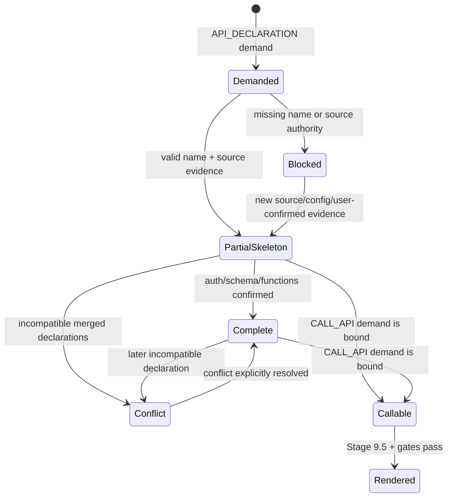
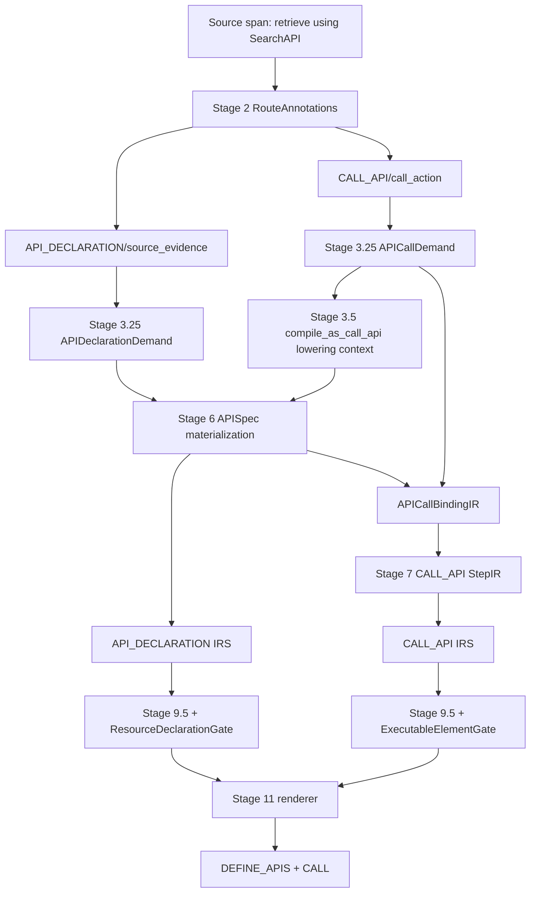

# NL2SPL API 定义与调用完整物化链路设计（含 API_DECLARATION IRS）

状态：设计提案，待架构审计与批准  
语言：中文  
适用范围：Stage 2、Stage 3.25、Stage 3.5、Stage 4/5、Stage 6、Stage 7、Stage 9.5、Stage 10/11、IRS、Gate、诊断、Provenance、Snapshot、SPL Editing  
语法依据：`docs/spl_grammar.txt`

---

## 1. 结论与设计目标

当前 NL2SPL 已有 `APISpec`、`CALL_API StepIR`、部分校验和渲染代码，但缺少从自然语言 API 意图到 API 声明、再到 API 调用的统一物化生命周期。尤其是：

```text
compile_as_call_api
```

目前只是 worker boundary 的非 worker 分类结果，不会自动生成 `APISpec`、`api_call` handoff 或 `CALL_API StepIR`。

本设计补齐以下完整链路：

```text
源文本中的 API/工具/连接器证据
  -> Stage 2 双角色 RouteAnnotation
  -> Stage 3.25 API_DECLARATION / CALL_API ConstructDemand
  -> Stage 3.5 非 worker lowering 决策（可选增强证据）
  -> Stage 6 APISpec + API 需求绑定物化
  -> API_DECLARATION IRS 检查
  -> Stage 7 声明感知的 CALL_API StepIR 物化
  -> CALL_API IRS + Stage 9.5 + Gate
  -> Stage 11 输出 [DEFINE_APIS:] 与 [CALL ...]
  -> Feedback / Provenance / Snapshot 可审计
```

最终必须保证：

1. `API_DECLARATION` 是独立的 IRS construct。
2. API 声明和 API 调用是两个不同构造、两套独立 slots。
3. `compile_as_call_api` 必须有明确消费者，但不能单独成为 API 声明的来源事实。
4. 没有声明成功的 API 不得生成可渲染 `CALL_API`。
5. 已判定为 API 调用的动作不得静默退化为 `GENERAL_COMMAND`。
6. 不生成虚假 OpenAPI schema、函数、认证信息或参数。
7. 部分 API 骨架可以渲染，但未知信息必须进入 IRS，并阻止 completion。

---

## 2. SPL Grammar 约束

### 2.1 API 声明语法

Grammar 定义：

```text
APIS := "[DEFINE_APIS:]" {API_DECLARATION} "[END_APIS]"

API_DECLARATION :=
    ["\"" STATIC_DESCRIPTION "\""]
    API_NAME
    "<" AUTHENTICATION ">"
    ["RETRY" <number>]
    ["LOG" <api-exceptions>]
    OPENAPI_SCHEMA
    API_IN_SPL

AUTHENTICATION := <none> | <apikey> | <oauth>
OPENAPI_SCHEMA := STRUCTURED_TEXT
API_IN_SPL := "{" FUNCTIONS "}"
FUNCTIONS := "functions:" "[" {FUNCTION} "]"
```

由此得到以下强制结论：

- `API_NAME` 是声明语法必需项。
- `AUTHENTICATION` 是声明语法必需项。
- `OPENAPI_SCHEMA` 节点是声明语法必需项。
- `API_IN_SPL` 及其 `functions` 容器是声明语法必需项。
- `RETRY`、`LOG` 是可选项。
- description 是可选项。
- 部分声明不能简单省略 schema/functions 语法节点；必须渲染合法空骨架，并在结构化 IR 中保留“未知”状态。

### 2.2 API 调用语法

Grammar 定义：

```text
CALL_API :=
    "[CALL" API_NAME {"," API_NAME}
    ["WITH" ARGUMENT_LIST {"," ARGUMENT_LIST}]
    ["RESPONSE" COMMAND_RESULTS ["SET" | "APPEND"]]
    "]"
```

因此：

- 最小合法调用是 `[CALL api_name]`。
- `WITH` 不是所有调用都必需。
- `RESPONSE` 不是所有调用都必需。
- 如果源需求明确要求输入参数或响应落盘，则对应 bindings 成为语义完成条件；不能把它误写成 grammar 的无条件要求。

### 2.3 Construct 划分

本设计采用：

| Grammar 对象 | IRS construct | 原因 |
| --- | --- | --- |
| `API_DECLARATION` | 新增 `API_DECLARATION` | 有稳定实例、独立 slots、可独立缺失和部分渲染 |
| `CALL_API` | 复用并增强现有 `CALL_API` | 已是可执行 SPL construct |
| `APIS` / `[DEFINE_APIS:]` | 不新增 IRS | 只是声明容器，无独立信息 slots；由 renderer 根据可渲染声明集合生成 |
| `api_candidate` / `integration_hint` | 不新增 IRS | 只是源证据和 route annotation |
| `compile_as_call_api` | 不新增 IRS | 是 planner/lowering 决策，不是 SPL construct |

这满足 IRS 的 construct-centered 边界，避免把 route label 或 planner record 注册成 IRS。

---

## 3. 当前实现审计与缺口

### 3.1 已存在能力

当前代码已经具备：

- `ResourceRegistryIR.apis: list[APISpec]`。
- Stage 6 可以把 LLM 返回的 `apis` 解析为 `APISpec`。
- Stage 6 可以把 `resource_kind="api"` 的 contract materialize 为 `APISpec`。
- Stage 7 可以从 `mode="api_call"` 的 `WorkerHandoffIR` 生成 `CALL_API StepIR`。
- `CALL_API` ConstructIRS 已存在。
- Stage 9.5 可以校验 `CALL_API.integration_ref` 是否存在于 declared APIs。
- Stage 11 可以输出 `[DEFINE_APIS:]` 和 `[CALL ...]`。

### 3.2 当前断点

当前链路存在以下断点：

1. Stage 2 的 `api_candidate/integration_hint` contract 仍指向 `API_CALL/target`，没有分别表达声明证据和调用动作。
2. `ConstructPlanner` 当前主要物化 `EXCEPTION_FLOW` demand，没有 API 声明/调用 demand。
3. Stage 3.5c 仅物化 `extract_child_worker`；`compile_as_call_api` 被放入 `rejected_candidates`。
4. Stage 6 没有消费 `ConstructPlan` 或 `compile_as_call_api` decision。
5. Stage 7 没有接收 `ResourceRegistryIR.apis` 或 API demand binding，因此不能可靠地做声明感知调用物化。
6. Stage 7 的 handoff step 生成逻辑明确只消费 `WorkerHandoffIR`，不消费 decisions。
7. `APISpec` 缺少 OpenAPI schema、retry、log、来源、状态和稳定内部 identity。
8. `APIFunction` 缺少 grammar 所需的 URL、controlled-input、完整 parameter/return model。
9. renderer 当前会在 `integration_ref` 缺失时 fallback 为 `Api`；这属于不可审计的语义发明，必须删除。
10. 目前没有 `API_DECLARATION` IRS 和资源声明 render gate。
11. `WORKER_PROMOTION` checker 会为所有 worker candidates 创建 promotion instance，导致 `compile_as_call_api` 被错误检查为 child-worker promotion 缺口。

---

## 4. 核心架构决策

### 4.1 声明与调用必须分离

```text
API definition evidence
  -> API_DECLARATION demand
  -> APISpec

Executable API action evidence
  -> CALL_API demand
  -> StepIR(command_type="CALL_API")
```

“提到了一个 API”不等于“执行一次 API 调用”；“执行外部检索”也不能在没有声明绑定时直接变成 `[CALL ...]`。

### 4.2 ConstructPlan 是需求真源

Stage 3.25 的 `ConstructPlan` 记录源要求的 `API_DECLARATION` 和 `CALL_API` 实例需求。它是 planner IR，不是 IRS construct 本身。

IRS 检查：

- demand 是否已被 APISpec/StepIR 满足；
- 已物化实例的 slots 是否完整。

IRS 不负责：

- 从文本中识别 API；
- 生成 API name；
- 创建 APISpec；
- 创建 StepIR；
- 修复缺失字段。

### 4.3 `compile_as_call_api` 是 lowering hint，不是来源事实

Stage 3.5 的该决策表示：

```text
这个 candidate 不应成为 child worker；其可执行边界更适合 CALL_API。
```

它可以：

- 补强 CALL_API demand；
- 提供 worker owner、candidate ID 和输入/输出候选；
- 参与 Stage 6/7 的一对一绑定。

它不能：

- 在没有 integration/API 源证据时凭空生成 APISpec；
- 自动生成 API schema、函数或认证；
- 继续进入 `WORKER_PROMOTION` IRS。

### 4.4 Direct CALL_API 与 handoff-backed CALL_API 都合法

两条路径均保留：

```text
路径 A：普通 worker 内部 API 调用
CALL_API demand + APISpec
  -> direct CALL_API StepIR（handoff_id=None）

路径 B：已有明确 api_call handoff contract
WorkerHandoffIR(mode="api_call") + APISpec
  -> handoff-backed CALL_API StepIR
```

不得为了生成 CALL_API 而强制创建 handoff。Handoff 只在跨边界绑定和 failure/ordering contract 确实存在时使用。

### 4.5 API 声明是 agent-global，调用是 worker-scoped

`[DEFINE_APIS:]` 位于 agent prompt 全局声明区，因此 canonical `APISpec` 必须进入 global resource registry。

不同 worker 对同一 API 的使用记录在：

```text
APISpec.used_by_worker_ids
APICallBindingIR.owner_worker_id
StepIR 所在 worker scope
```

worker-local extraction 可以产生声明候选，但必须经 Stage 6 全局 merge/conflict resolution 后才能成为 canonical APISpec。

---

## 5. Stage 2：RouteAnnotation 设计

### 5.1 同一 span 允许双 annotation

示例：

```text
Retrieve approved sources using SearchAPI.
```

应产生：

```json
[
  {
    "annotation_id": "ann_s16_api_decl_00",
    "span_id": "s16",
    "field": "integrations",
    "semantic_role": "api_candidate",
    "route_family": "integration_candidate",
    "construct_target": "API_DECLARATION",
    "slot_target": "source_evidence",
    "executable": false,
    "metadata": {
      "api_group_id": "api_group_s16_00",
      "explicit_api_name": "SearchAPI",
      "integration_specificity": "explicit_name"
    }
  },
  {
    "annotation_id": "ann_s16_api_call_00",
    "span_id": "s16",
    "field": "behavior",
    "semantic_role": "process_step",
    "route_family": "flow_relevant",
    "construct_target": "CALL_API",
    "slot_target": "call_action",
    "executable": true,
    "metadata": {
      "api_group_id": "api_group_s16_00"
    }
  }
]
```

`api_group_id` 是结构化 pairing key，不是 construct identity。

### 5.2 未显式命名的 integration hint

示例：

```text
Retrieve them using approved source recipes.
```

允许生成 `integration_hint`，但必须满足：

- 文本明确要求使用外部工具、连接器、服务、数据库、批准的 source recipe 或其他具体 integration mechanism；
- 不是普通的“搜索、查找、收集”动词；
- 不是政策性偏好，如“Prefer tool evidence”；
- annotation metadata 标记 `integration_specificity="concrete_unnamed_mechanism"`；
- 后续 inferred name 必须确定性生成并显式标记。

`api_candidate` 继续保留给显式命名 API/工具/服务；`integration_hint` 承载具体但未命名的 integration evidence。不新增仅用于诊断的 route role。

### 5.3 Route validator 规则

必须更新 annotation role contract：

```text
api_candidate:
  construct_target = API_DECLARATION
  slot_target = source_evidence
  executable = false

integration_hint:
  construct_target = API_DECLARATION
  slot_target = source_evidence
  executable = false

process_step（API action 副本）:
  construct_target = CALL_API
  slot_target = call_action
  executable = true
```

Validator 必须拒绝：

- 仅包含抽象业务域词的 API annotation；
- 仅包含 policy 的 executable CALL_API annotation；
- 缺少源 span 的 annotation；
- `API_DECLARATION` annotation 被标记 executable；
- `CALL_API/call_action` annotation 被标记 non-executable。

---

## 6. Stage 3.25：API Construct Demand

### 6.1 新增 planner IR

```python
@dataclass
class APIDeclarationDemand(ConstructDemand):
    construct_type: str = "API_DECLARATION"
    declaration_annotation_ids: list[str] = field(default_factory=list)
    explicit_name_candidates: list[str] = field(default_factory=list)
    inferred_name_allowed: bool = False
    api_group_id: str | None = None
    owner_scope: str = "agent_global"


@dataclass
class APICallDemand(ConstructDemand):
    construct_type: str = "CALL_API"
    call_annotation_ids: list[str] = field(default_factory=list)
    declaration_demand_id: str | None = None
    api_group_id: str | None = None
    action_text: str | None = None
    owner_worker_id: str | None = None
    placement_status: str = "unknown"
    worker_candidate_id: str | None = None
```

这些类型属于 planner IR，不能注册成新的 IRS construct type。其 `construct_type` 指向真实的 `API_DECLARATION` / `CALL_API`。

### 6.2 稳定 identity

需求 identity 不依赖 API name，因为 name 本身可能缺失：

```text
api_decl_demand_<stable_digest>
api_call_demand_<stable_digest>
```

digest 输入必须是稳定结构化证据：

```text
construct_type
sorted(source_span_ids)
sorted(annotation_ids)
api_group_id
```

不得使用列表遍历序号作为唯一 identity。

### 6.3 声明与调用 pairing

Pairing 优先级：

1. 相同 `api_group_id`。
2. 调用 annotation 中的显式 declaration demand reference。
3. 同一 span 上唯一 declaration + 唯一 call annotation。
4. 同一 source packet 内一对一且无歧义的 declaration/call。
5. Stage 3.5 `compile_as_call_api` candidate 与唯一 declaration demand 的 span overlap。

不允许：

- 通过模糊字符串相似度自动绑定多个 API；
- 通过 feedback message 解析绑定；
- 多声明、多调用时静默选择第一个。

歧义时保留两个 demand，设置 `pairing_status="ambiguous"`，由 IRS/diagnostic 投影，不物化 CALL_API。

### 6.4 span ownership

`APIDeclarationDemand` 是 non-executable，不占用 behavior command。

`APICallDemand` 拥有对应 API action，但不能把整个 span 的其他动作一并吞掉。Stage 7 去重必须按 `demand_id/annotation_id`，不能只按 `span_id`。这样同一 span 中的：

```text
Retrieve via API. Maintain provenance.
```

可以分别物化成 `CALL_API` 和 `GENERAL_COMMAND`，而不会重复生成 retrieval command。

---

## 7. Stage 3.5：Worker Boundary 与 API Lowering Bridge

### 7.1 决策语义

当 candidate 是单一 API/tool call，而不是独立 worker 时：

```text
decision = compile_as_call_api
boundary_kind = call_api
```

该 decision 应进入：

```text
WorkerPlanIR.lowering_decisions
```

或保留在 `decisions` 中但通过 typed accessor：

```python
worker_plan.get_call_api_lowering_decisions()
```

不得继续把它称为 `rejected_candidates`。它不是失败，而是 lower 到另一种 SPL construct。

### 7.2 Stage 6/7 消费规则

```text
compile_as_call_api + matching API_DECLARATION demand
  -> Stage 6 尝试物化 APISpec

compile_as_call_api + matching CALL_API demand + renderable APISpec
  -> Stage 7 物化 direct CALL_API 或已声明的 api_call handoff step

compile_as_call_api + 无 API_DECLARATION demand
  -> unresolved declaration diagnostic
  -> 不生成 APISpec
  -> 不 fallback GENERAL_COMMAND
```

### 7.3 WORKER_PROMOTION IRS 修正

`WorkerDelegationIRSChecker` 只应为以下 candidate 创建 `WORKER_PROMOTION` instance：

- `decision == "extract_child_worker"`；
- 或 `decision == "needs_repair_or_warning"` 且目标仍明确是 child worker promotion。

必须跳过：

- `compile_as_call_api`；
- `compile_as_constraint`；
- `compile_as_exception_flow`；
- `compile_as_alternative_flow`；
- `keep_in_main_worker`。

因此 API lowering 缺口不再错误投影为 `promotion_invocation_point`。

---

## 8. Stage 6：API Declaration Materializer

### 8.1 输入与输出

Stage 6 新输入：

```text
spans
routes
ConstructPlan(API_DECLARATION/CALL_API demands)
WorkerPlanIR(call_api lowering decisions)
CanonicalCompileInput / adapter hard facts
ResourceContractDemandView(resource_kind=api)
worker flow/block ownership
```

Stage 6 新输出：

```python
@dataclass
class APICallBindingIR:
    call_demand_id: str
    declaration_demand_id: str | None
    api_id: str | None
    api_name: str | None
    owner_worker_id: str | None
    status: Literal["bound", "unresolved", "ambiguous", "blocked"]
    reason: str | None = None


@dataclass
class APIMaterializationPlanIR:
    declarations: list[APISpec]
    call_bindings: list[APICallBindingIR]
    unresolved_declaration_demand_ids: list[str]
    diagnostics: list[CompileDiagnostic]
```

`APIMaterializationPlanIR` 是 Stage 6 planner/materialization result，不是 IRS construct。

### 8.2 APISpec 完整模型

建议扩展为：

```python
@dataclass
class APISpec:
    api_id: str
    api_name: str
    auth: Literal["none", "apikey", "oauth"] = "none"
    description: str = ""
    retry_count: int | None = None
    log_exceptions: list[str] = field(default_factory=list)
    openapi_schema: dict[str, Any] = field(default_factory=dict)
    functions: list[APIFunction] = field(default_factory=list)

    source_span_ids: list[str] = field(default_factory=list)
    source_annotation_ids: list[str] = field(default_factory=list)
    declaration_demand_ids: list[str] = field(default_factory=list)
    used_by_worker_ids: list[str] = field(default_factory=list)
    origin: Literal[
        "source_backed",
        "adapter_hard_fact",
        "configured_resource",
        "user_confirmed_repair",
    ] = "source_backed"

    declaration_status: Literal[
        "partial_skeleton",
        "complete",
    ] = "partial_skeleton"
    name_status: Literal[
        "explicit_source_name",
        "normalized_explicit_name",
        "inferred_from_source",
        "user_confirmed",
    ] = "explicit_source_name"
    auth_status: Literal[
        "source_backed",
        "configured",
        "compiler_default_none",
    ] = "compiler_default_none"
    schema_status: Literal[
        "known_present",
        "known_empty",
        "unknown_placeholder",
    ] = "unknown_placeholder"
    functions_status: Literal[
        "known_present",
        "known_empty",
        "unknown_placeholder",
    ] = "unknown_placeholder"
    partial_reasons: list[str] = field(default_factory=list)
```

约束：

- 只有 name 和来源证据达到最小门槛时才创建 `APISpec`。
- unresolved demand 不用空字符串 APISpec 表示；它只存在于 ConstructPlan/IRS report 中。
- `api_id` 是内部稳定 identity；`api_name` 是 grammar slot，两者不能混用。

### 8.3 APIFunction grammar 对齐

当前 `APIFunction(name, description, parameters, return_type)` 不足以表达 grammar。建议改为：

```python
@dataclass
class APIParameterSpec:
    name: str
    data_type: str
    required: bool
    description: str = ""


@dataclass
class APIReturnSpec:
    data_type: str
    controlled_output: bool
    description: str = ""


@dataclass
class APIFunction:
    function_id: str
    name: str
    url: str
    description: str = ""
    parameters: list[APIParameterSpec] = field(default_factory=list)
    controlled_input: bool = False
    return_spec: APIReturnSpec | None = None
    source_span_ids: list[str] = field(default_factory=list)
```

函数只有在 URL、parameters container、return 均满足 grammar 时才标记完整。LLM 不得补造 URL 或 function signature。

### 8.4 API name 生成规则

显式 API name：

1. 若满足 SPL `<word>` 规则，保留原名。
2. 若包含非法字符，生成确定性 normalized name，保留 original name 和 `name_status="normalized_explicit_name"`。
3. 不允许 renderer 临时修正 name。

未显式命名：

```text
Retrieve approved sources using approved source recipes.
  -> api_retrieve_approved_sources
```

仅当 `APIDeclarationDemand.inferred_name_allowed=True` 时允许。算法要求：

1. Unicode NFKC normalize。
2. lower-case。
3. 从 source-backed action/integration phrase 生成 ASCII snake_case。
4. 加 `api_` 前缀。
5. 空 slug 使用稳定 source-text digest。
6. 冲突 suffix 使用稳定 digest，不能使用“当前列表中的第几个”。
7. 记录 `name_status="inferred_from_source"` 和全部来源。

### 8.5 物化算法

```text
for each API_DECLARATION demand:
    collect structured source evidence
    resolve explicit name candidates
    if no explicit name and inferred_name_allowed:
        generate deterministic inferred name
    if no valid name or no authoritative evidence:
        leave demand unresolved
        continue

    materialize APISpec skeleton
    apply only source-backed/configured auth, retry, log, schema, functions
    validate every typed field
    merge into global API registry

for each CALL_API demand:
    resolve declaration_demand_id
    resolve APISpec by api_id
    create APICallBindingIR
```

LLM 输出只能作为 typed candidate plan；在进入 APISpec 前必须完成：

- demand reference 校验；
- source evidence 校验；
- enum/type 校验；
- API name 校验；
- schema JSON/structured text 校验；
- function grammar 校验；
- conflict 校验。

没有 demand/source authority 的 LLM API 必须丢弃并记录诊断。

### 8.6 merge 与冲突

同名声明：

- contract 兼容：merge provenance、functions、worker usage。
- auth/schema/function signature 冲突：保留冲突记录，投影 `semantic_conflict`，不得任意选一边。
- 一个 explicit name 与一个 inferred name 指向相同 demand：explicit name 胜出，inferred name 作为 audit alias，不渲染两个声明。

同一 API 的 declaration order 必须按稳定 `api_id/api_name` 排序，保证 snapshot 和 SPL 可复现。

---

## 9. 新 ConstructIRS：API_DECLARATION

### 9.1 Admission

`API_DECLARATION` 满足 IRS admission：

1. 直接对应 SPL grammar construct。
2. 有稳定 `api_id/declaration_demand_id`。
3. 有多个独立 slots。
4. 可从 ConstructPlan demand 和 `ResourceRegistryIR.apis` 提取实例。
5. 缺口不能自然归属于 `CALL_API`，因为 API 可以只声明而不调用。

### 9.2 Registry 定义

```python
ConstructIRS(
    construct_type="API_DECLARATION",
    existence_policy="source_signal_required",
    source_signals=[
        "api_candidate",
        "integration_hint",
        "configured_api",
        "api_resource_contract",
    ],
    no_demand_behavior="do_not_generate",
    partial_rendering_allowed=True,
    slots=[...],
)
```

`compile_as_call_api` 不列为独立 source signal；它只能通过已有 demand 参与 lowering。

### 9.3 Construct identity 与 path

Demanded but unresolved：

```text
construct_id = api_declaration:<declaration_demand_id>
construct_path = ("construct_plan", "api_declarations", declaration_demand_id)
materialized = false
source_demanded = true
```

Materialized：

```text
construct_id = api_declaration:<api_id>
construct_path = ("resources", "apis", api_id)
materialized = true
source_demanded = true | configured
```

APISpec 必须保存 declaration demand ID，便于 stage-local 与 post-normalize report 去重和 authority promotion。

### 9.4 Slot 契约

| Slot | Syntax required | Partial required | Complete required | Renderable without | Structured evidence | 缺失诊断 |
| --- | ---: | ---: | ---: | ---: | --- | --- |
| `api_name` | 是 | 是 | 是 | 否 | `APISpec.api_name` + valid name status | `type_or_contract_ambiguity` |
| `source_evidence` | 否（物化策略必需） | 是 | 是 | 否 | source spans、adapter hard fact、configured resource、user-confirmed repair | `type_or_contract_ambiguity` |
| `authentication` | 是 | 否 | 是 | 是 | explicit/config auth；否则 compiler default `<none>` placeholder | `type_or_contract_ambiguity` |
| `openapi_schema` | 是 | 否 | 是 | 是 | schema known-present/confirmed-known-empty | `type_or_contract_ambiguity` |
| `functions` | 是 | 否 | 是 | 是 | typed functions known-present/confirmed-known-empty | `type_or_contract_ambiguity` |

说明：

- description、retry、log 是 grammar 可选项，不作为 completion blocker。
- `compiler_default_none`、`unknown_placeholder` 允许生成语法骨架，但 slot 仍是 missing/assumed，必须阻止 completion。
- `{}` 和 `{"functions":[]}` 在 SPL 中是语法骨架；不能把它们自动解释为“来源明确声明为空”。

### 9.5 Satisfaction 状态

可完成声明：

```text
api_name = satisfied
source_evidence = satisfied
authentication = satisfied
openapi_schema = satisfied or confirmed-known-empty
functions = satisfied or confirmed-known-empty
completeness = complete
renderable = true
frontier_status = leaf
```

可渲染部分骨架：

```text
api_name = satisfied
source_evidence = satisfied
authentication/schema/functions 中至少一个 unknown placeholder
completeness = partial
renderable = true
frontier_status = cutline_partial
cutline_reason = incomplete_api_declaration_contract
```

不可渲染：

```text
api_name missing/invalid
or source_evidence missing
completeness = partial or missing
renderable = false
frontier_status = cutline_blocked
cutline_reason = missing_api_identity_or_evidence
```

### 9.6 Checker

新增：

```text
APIDeclarationIRSChecker
supported_stages = ("stage6", "post_normalize")
```

`extract_instances()` 只读取：

- `ConstructPlan` 的 `APIDeclarationDemand`；
- `ResourceRegistryIR.apis`；
- `APIMaterializationPlanIR` binding/provenance；
- structured adapter/config evidence。

禁止：

- 解析 raw NL；
- 调用 LLM；
- 创建或修改 APISpec；
- 自动填充 auth/schema/functions；
- 直接创建 `CompileDiagnostic`。

`check_instance()` 输出 `ConstructSatisfactionReport`，由 `DiagnosticProjector` 投影诊断。

### 9.7 Related edges

```text
span:s16
  --derived_from-->
api_declaration:<api_id>

api_declaration:<api_id>
  --materializes-->
api_decl_demand:<demand_id>

step:<step_id>
  --invokes-->
api_declaration:<api_id>
```

这些 edge 用于去重、issue grouping、provenance 和 feedback 展示。

---

## 10. Stage 6 IRS 执行与资源声明 Gate

### 10.1 Stage-local IRS

Stage 6 完成后新增：

```python
irs_ctx_6 = IRSCheckContext(
    stage_name="stage6",
    spans=tuple(resolved_spans),
    routes=resolved_routes,
    resources=resources,
    worker_plan=worker_plan,
    metadata={
        "construct_plan": construct_plan,
        "api_materialization_plan": api_materialization_plan,
    },
)
```

结果写入：

```text
intermediate["construct_satisfaction"]["stage6"]
intermediate["stage_local_diagnostics"]["stage6"]
```

### 10.2 ResourceDeclarationGate

当前 `ExecutableElementGate` 只负责 step。新增独立：

```text
ResourceDeclarationGate
```

职责：

- 消费 post-normalize `API_DECLARATION` satisfaction reports；
- 只允许 `renderable=true` 的 APISpec 进入 Stage 11；
- 对 blocked declaration 生成/保留 gate diagnostic；
- 不修改 APISpec 内容；
- 不推断缺失 slot。

Renderer 不应自行判断来源充分性，也不应生成 fallback API。

---

## 11. Stage 7：Declared-API-Aware CALL_API 物化

### 11.1 新输入

Stage 7 必须接收：

```text
ResourceRegistryIR.apis
APIMaterializationPlanIR.call_bindings
ConstructPlan.CALL_API demands
WorkerPlanIR.call_api lowering decisions
```

不能只向 LLM 提供 API 名称文本；必须提供稳定 IDs 和 binding status。

### 11.2 确定性物化规则

```text
CALL_API demand
AND bound APICallBindingIR
AND referenced API_DECLARATION is renderable
AND owner worker/block placement exists
  => materialize CALL_API StepIR
```

最小 StepIR：

```python
StepIR(
    step_id="st_call_api_<stable_digest>",
    text="Retrieve approved sources using approved source recipes.",
    source_span_ids=["s16"],
    command_type="CALL_API",
    inputs=[],
    outputs=[],
    integration_ref="api_retrieve_approved_sources",
    handoff_id=None,
    metadata={
        "origin": "source_backed",
        "construct_demand_ids": ["api_call_demand_..."],
        "api_id": "api_...",
        "declaration_demand_id": "api_decl_demand_...",
    },
)
```

### 11.3 bindings

- 源要求明确参数时，inputs 必须来自 SymbolTable 和 contract binding。
- 源要求响应写入输出时，outputs 必须绑定已声明/可声明变量。
- 没有参数或 response demand 时，`inputs=[]`、`outputs=[]` 合法。
- LLM 不得提供未出现在 `SelectableRefSet/SymbolTable` 的变量。

### 11.4 防止 GENERAL_COMMAND fallback

对于已有 `CALL_API demand` 的 action：

- Stage 7 deterministic materializer 是该 demand 的唯一 command-family owner。
- LLM 返回的同 demand `GENERAL_COMMAND` 必须删除并记录 normalization warning。
- 去重按 `construct_demand_ids`，不能按整个 `span_id`。
- 如果 API declaration/binding unresolved，则该 demand 保持未物化并产生诊断；不得生成普通命令掩盖缺口。
- 同一 span 上不属于该 demand 的其他动作仍可生成 `GENERAL_COMMAND`。

### 11.5 direct 与 handoff-backed 校验

Direct call：

```text
handoff_id is None
integration_ref resolves to global APISpec
source evidence valid
```

Handoff-backed call：

```text
handoff.mode == "api_call"
handoff.api_ref == step.integration_ref
handoff bindings == step inputs/outputs
handoff materialization_status is executable
```

---

## 12. CALL_API IRS 增强

保留 `CALL_API` construct，并将其 slots 明确为：

| Slot | Required | Renderable without | Satisfaction |
| --- | ---: | ---: | --- |
| `api_name` | 是 | 否 | `integration_ref` 非空且是合法 API_NAME |
| `declared_api_ref` | 是 | 否 | `integration_ref` resolve 到 renderable `APISpec.api_name` |
| `call_action` | 是 | 否 | 有 executable call demand + source/user-confirmed evidence |
| `request_bindings` | 条件必需 | 是 | 只有 source demand 明确要求参数时才 required |
| `response_binding` | 条件必需 | 是 | 只有 source/required-output demand 明确要求响应时才 required |

现有 `integration_evidence` 不应仅因为 `integration_ref` 是非空字符串就满足；应由 `declared_api_ref + declaration provenance` 提供。

Stage-local Stage 7 checker 可以检查 StepIR 结构和 demand evidence；post-normalize checker 是 declared API resolution 的最终 construct-level authority。

---

## 13. Stage 9.5、Gate、ProducerIndex

### 13.1 Stage 9.5

必须校验：

1. 所有 canonical APISpec 的 `api_id/api_name` 唯一。
2. API name 满足 grammar。
3. auth enum 合法。
4. schema/functions 结构可序列化并满足 grammar shape。
5. 每个 CALL_API 的 `integration_ref` resolve 到 canonical APISpec。
6. direct CALL_API 不要求 handoff。
7. handoff-backed CALL_API 必须与 handoff target/bindings 一致。
8. CALL_API 的 worker/block ownership 合法。
9. 一个 call demand 最多物化一个 primary StepIR。
10. 不存在同 demand 的 GENERAL_COMMAND fallback。

Normalizer 只做验证、规范化和稳定排序，不补造 API 语义。

### 13.2 ExecutableElementGate

Direct CALL_API 可渲染条件：

```text
origin is source_backed or user_confirmed_repair
integration_ref non-empty
integration_ref resolves to ResourceDeclarationGate 允许的 APISpec
call_action structural slots satisfied
```

Handoff-backed CALL_API 额外校验完整 handoff。

必须删除 renderer 中：

```python
api_name = step.integration_ref or "Api"
```

缺少 name 必须在 Gate 前被阻止，而不是渲染为 `Api`。

### 13.3 ProducerIndex

当 CALL_API 有 outputs 时，只有以下条件全部成立才算 renderable producer：

- CALL_API 通过 Gate；
- referenced APISpec 可渲染；
- output refs 存在于 SymbolTable；
- handoff-backed call 的 output binding 合法。

无 outputs 的最小 CALL_API 不产生 producer 记录，这是合法状态。

---

## 14. Stage 11：Grammar-Conformant Renderer

### 14.1 API declaration

完整声明按 grammar 输出：

```spl
[DEFINE_APIS:]
    "Search approved sources." SearchAPI <oauth> RETRY 3 LOG timeout,rate_limit
    {"openapi":"3.0.0", ...}
    {"functions":[...]}
[END_APIS]
```

部分骨架：

```spl
[DEFINE_APIS:]
    "Retrieve approved sources using approved source recipes." api_retrieve_approved_sources <none>
    {}
    {"functions":[]}
[END_APIS]
```

部分骨架必须同时满足：

- `api_name` 和来源证据已满足；
- `auth_status/schema_status/functions_status` 随 snapshot 保存；
- feedback 明确提示 `<none>`/`{}`/empty functions 是 compiler default/unknown placeholder；
- pipeline completion 为 partial。

只有至少一个 APISpec 通过 `ResourceDeclarationGate` 时才输出 `[DEFINE_APIS:]` 容器。

### 14.2 CALL_API

最小调用：

```spl
COMMAND-1 [CALL api_retrieve_approved_sources]
```

有输入：

```spl
COMMAND-1 [CALL SearchAPI WITH <REF>query</REF>]
```

有响应：

```spl
COMMAND-1 [CALL SearchAPI WITH <REF>query</REF> RESPONSE source_evidence_set: List [text] SET]
```

Renderer 只格式化已通过 authority checks 的 IR，不做：

- API name inference；
- auth default decision；
- schema/function generation；
- undeclared API fallback；
- StepIR command type 改写。

---

## 15. 诊断、Issue Grouping 与 Feedback

### 15.1 API_DECLARATION 诊断

示例：

```text
Target: api_declaration:api_<id>
Kind: type_or_contract_ambiguity
Slot: openapi_schema
Blocks rendering: false
Blocks completion: true
Message: API declaration is renderable as a partial skeleton but its OpenAPI schema is unknown.
```

缺少 name/source evidence：

```text
Blocks rendering: true
Blocks completion: true
```

### 15.2 CALL_API 诊断

Undeclared ref：

```text
Target: step:<step_id> or api_call_demand:<id>
Slot: declared_api_ref
Blocks rendering: true
Blocks completion: true
```

Source 要求 response 但 binding 缺失：

```text
Slot: response_binding
Blocks rendering: false or true according to required output contract
Blocks completion: true
```

### 15.3 Grouping

同一 API demand 的问题按以下方式分组：

```text
API_DECLARATION slot diagnostic = primary
CALL_API.declared_api_ref diagnostic = alias
Stage 3.5 compile_as_call_api decision = context
route annotations / source spans = evidence context
```

Feedback renderer 只展示已有 reports/diagnostics，不重新推断 API 是否存在。

### 15.4 不再出现的误导诊断

`compile_as_call_api` candidate 不再产生：

```text
WORKER_PROMOTION.promotion_invocation_point missing
```

真正缺口必须归属于：

- `API_DECLARATION.api_name/source_evidence/...`；或
- `CALL_API.declared_api_ref/call_action/...`。

---

## 16. Provenance 与 Snapshot

### 16.1 TraceRecords

至少记录：

```text
source span -> APIDeclarationDemand
APIDeclarationDemand -> APISpec
WorkerBoundaryDecision(compile_as_call_api) -> APICallDemand context
APICallDemand -> APICallBindingIR
APICallBindingIR -> CALL_API StepIR
CALL_API StepIR -> APISpec
```

`relation` 必须区分：

- `direct`：显式 API name/contract；
- `normalized`：显式 name 仅做 grammar-safe normalization；
- `inferred`：确定性 inferred API name；
- `user_confirmed_repair`：用户确认后的修复证据。

### 16.2 Serializer

必须升级并向后兼容：

- `APISpecSerializer`；
- `APIFunctionSerializer`；
- 新 parameter/return serializer；
- `ConstructPlan` API demands；
- `APIMaterializationPlanIR`；
- Snapshot artifact registry。

旧 snapshot 缺少字段时：

```text
api_id = deterministic legacy ID
source_span_ids = []
name_status = explicit_source_name（仅表示已有字符串，不证明来源）
auth_status = configured or legacy_unknown
schema_status = unknown_placeholder
functions_status = known_present if functions non-empty else unknown_placeholder
declaration_status = partial_skeleton
```

旧数据不能因默认值而被错误升级为 complete。

---

## 17. SPL Editing Repair Contract

### 17.1 User-actionability

以下 slots 从产品角度可由用户补充：

- `API_DECLARATION.api_name`；
- `authentication`；
- `openapi_schema`；
- `functions`；
- `CALL_API.request_bindings/response_binding`。

但“理论上可补充”不等于当前 runtime 已有可暴露修复能力。

### 17.2 初始实现策略

本设计的初始实现要求：

```python
repair_affordances=()
```

原因：当前没有经架构批准并完整注册的 API declaration construct-level repair strategy、Stage 6 repair slice、preview/apply 和 Lane B verification chain。

因此 API declaration 诊断初始应为：

```text
repairability = review_only
```

不得复用仅修改 StepIR 的 `SpecifyAPIIntegration` 来冒充 API declaration closure 修复。

### 17.3 后续策略的最低闭包（未批准，不注册）

未来若批准：

```text
strategy_id = api_declaration.complete_contract.v1
```

最低 construct closure 至少包含：

```text
API_DECLARATION/APISpec            -> Stage 6 repair slice
可选 CALL_API binding              -> Stage 7 repair slice
可选 variable/resource bindings    -> Stage 6/7 slices
normalized registry and call graph -> Stage 9.5
rendered declaration/call          -> Stage 11 verification
```

需要：

- TargetResolver：解析 `DiagnosticIRSRef -> api_id/declaration_demand_id`；
- structured context：现有 APISpec、source spans、allowed auth、API names、symbols、call demands；
- SelectableRefPolicy：API target、input refs、output refs；
- preview：展示完整 `[DEFINE_APIS:]` 和受影响 `[CALL ...]`；
- user confirmation 后生成 `RepairEvidencePacket(user_confirmed_repair)`；
- verification lane：Lane B，因为会修改 resource registry、step plan 和 normalized cross-reference。

上述 runtime 缺任一项时，不得在 UI 中显示为可修复。

---

## 18. 安全与反幻觉约束

实现必须遵守：

1. 不从普通 retrieval verb 自动推断 API。
2. 不把 policy-only tool mention 变成可执行调用。
3. 不把 API key/token/secret value 写入 SPL；auth 只记录 grammar auth type。
4. 不生成未被来源/config/user confirmation 支持的 URL。
5. 不生成虚假 OpenAPI schema。
6. 不生成虚假 function/parameter/return contract。
7. 不允许 LLM 输出绕过 demand ID 和来源校验。
8. 不允许 renderer、normalizer、IRS checker 修补缺失语义。
9. 不允许 `compile_as_call_api` 单独充当 API declaration source evidence。
10. 不允许未知 API 被 fallback 为 `Api` 或 `GENERAL_COMMAND`。

---

## 19. 完整状态机



关键规则：

- `Blocked` API 不得绑定成可渲染 CALL_API。
- `PartialSkeleton` 可以被调用和渲染，但 compilation completion 保持 partial。
- `Conflict` 不得通过任意选边进入 rendered。

---

## 20. 端到端参考流程



---

## 21. 实施阶段与代码落点

### Phase A：Bug-locking 与 grammar tests

- 固化当前 demo 的失败行为。
- 增加 grammar exact-output tests。
- 增加无 fallback tests。

### Phase B：Route contract 与 ConstructPlan

- 修正 annotation role contract 的 construct/slot targets。
- 支持同 span declaration + call 双 annotation。
- 新增 `APIDeclarationDemand/APICallDemand`。
- 增加 pairing/ambiguity tests。

### Phase C：IR 与 serializer

- 扩展 APISpec/APIFunction。
- 新增 parameter/return/API materialization plan IR。
- 完成旧 snapshot backward compatibility。

### Phase D：API_DECLARATION IRS

- registry entry；
- Stage 6/post-normalize checker；
- projector/report storage；
- frontier/cutline/edges tests；
- `repair_affordances=()` contract test。

### Phase E：Stage 6 materializer

- 消费 ConstructPlan 和 Stage 3.5 lowering decisions；
- name resolver；
- merge/conflict resolver；
- APICallBindingIR；
- stage-local IRS invocation。

### Phase F：Stage 7 declared-API-aware extraction

- orchestrator 传入 APIs 和 materialization plan；
- deterministic CALL_API materializer；
- demand-level GENERAL_COMMAND dedupe；
- direct/handoff-backed 双路径。

### Phase G：Stage 9.5、Gate、ProducerIndex

- declaration/call cross-reference；
- ResourceDeclarationGate；
- ExecutableElementGate declared API 校验；
- producer semantics。

### Phase H：Renderer、feedback、provenance

- grammar-complete API model 渲染；
- 删除 `Api` fallback；
- grouped diagnostics；
- inferred/partial status 可见；
- trace graph。

### Phase I：E2E 与 migration

- demo 输入生成 partial API skeleton + CALL_API；
- snapshot roundtrip；
- legacy path removal；
- docs 和 examples 更新。

---

## 22. 测试矩阵

| 场景 | API 声明 | CALL_API | Render | Completion |
| --- | --- | --- | --- | --- |
| 显式 API name + action + 完整 contract | complete | 生成 | 是 | complete |
| 显式 API name + action，无 schema/functions | partial skeleton | 生成 | 是 | partial |
| 具体未命名 integration + action | inferred partial skeleton | 生成 | 是 | partial |
| 仅声明 API，无 action | complete/partial | 不生成 | 声明可渲染 | 依声明状态 |
| 仅 policy “prefer tool evidence” | 不生成 | 不生成 | 无 API | 不受影响 |
| 普通 “collect information” | 不生成 | 不生成 | 无 API | 不受影响 |
| compile_as_call_api，无 declaration demand | 不生成 | 不生成 | 否 | blocked/partial + precise diagnostic |
| CALL_API 指向 undeclared API | 无 | 阻止 | 否 | blocked |
| API name invalid、可确定性 normalize | normalized declaration | 生成 | 是 | warning/partial |
| 多 API pairing 歧义 | candidates only | 不生成 | 否 | blocked/partial |
| 同名兼容声明 | merge | 调用共享声明 | 是 | 依 merge 后状态 |
| 同名冲突声明 | conflict | 阻止受影响调用 | 否 | blocked |
| 无参数、无响应的最小 CALL_API | 声明存在 | 生成 | 是 | complete/partial 依声明 |
| source 明确要求 response 但无 output binding | 声明存在 | partial/unrenderable 依 requiredness | 按 contract | incomplete |
| 同 span API retrieval + provenance action | 一个 CALL_API 声明/调用 | provenance 保留 GENERAL_COMMAND | 是 | 无重复 retrieval |
| 老 snapshot APISpec | legacy partial | 按 declared ref 检查 | 可配置迁移 | 不自动 complete |

---

## 23. 验收标准

### 23.1 Grammar

- 输出严格满足 `API_DECLARATION` 和 `CALL_API` grammar。
- APIFunction 的 URL、parameters、return、controlled flags 均可表达。
- 最小 `[CALL api_name]` 合法。

### 23.2 Materialization

- 每个 `[DEFINE_APIS:]` 声明都能追溯到 demand/config/user-confirmed evidence。
- 每个 `[CALL api_name]` 都 resolve 到唯一、可渲染 APISpec。
- 每个 `compile_as_call_api` 都有 Stage 6/7 消费结果或精确 unresolved diagnostic。
- 不存在同 demand 的 `GENERAL_COMMAND` fallback。

### 23.3 IRS

- registry 中存在 `API_DECLARATION`。
- demanded/materialized instance extraction 均有测试。
- 每个 slot 的 requiredness、renderability、diagnostic 均有 contract test。
- stage-local 与 post-normalize report 能去重并保留 authority。
- API declaration diagnostics 带 `irs_ref`、frontier、cutline、source spans 和 edges。

### 23.4 Authority

- Stage 2 只路由证据。
- ConstructPlan 只记录需求和 pairing。
- Stage 6 是 API declaration materialization authority。
- IRS 只检查 slots。
- Stage 7 是 CALL_API StepIR authority。
- Stage 9.5 校验 cross-reference。
- Gates 决定可渲染集合。
- Renderer 只格式化。

### 23.5 Auditability

- inferred name、compiler default auth、placeholder schema/functions 全部可见。
- 任何 LLM candidate 都能追溯到 demand 和 source evidence。
- snapshot roundtrip 不丢失状态和 provenance。
- feedback 不解析 raw text 或重新执行 IRS。

---

## 24. 必须禁止的实现捷径

1. 在 renderer 中看到普通命令文本后临时改成 `[CALL ...]`。
2. 让 Stage 7 自己从 raw NL 发明 APISpec。
3. 将 `compile_as_call_api` 直接视为完整 API 声明。
4. 用 `api_name = "Api"` 兜底。
5. API declaration unresolved 时退回 `GENERAL_COMMAND`。
6. 为了消除诊断而伪造 `{}`、functions 或 auth 的“已满足”状态。
7. 把 `api_candidate`、`integration_hint` 或 decision 注册为 IRS construct。
8. 让 IRS checker 修改 APISpec/StepIR。
9. 仅靠相同 span ID 处理多动作去重。
10. 在没有完整 strategy/stage-slice/preview/verification 时暴露 SPL Editing 修复。

---

## 25. 对 demo 的预期结果

对于：

```text
Retrieve them using approved source recipes.
Maintain provenance for externally sourced facts.
```

Stage 2 应产生：

- `integration_hint -> API_DECLARATION.source_evidence`；
- `process_step -> CALL_API.call_action`；
- 独立 provenance process action。

Stage 6 应产生：

```text
APISpec.api_name = api_retrieve_approved_sources
name_status = inferred_from_source
declaration_status = partial_skeleton
schema_status = unknown_placeholder
functions_status = unknown_placeholder
```

Stage 7 应产生：

```text
CALL_API: Retrieve approved sources
GENERAL_COMMAND: Maintain provenance
```

最终 SPL：

```spl
[DEFINE_APIS:]
    "Retrieve approved sources using approved source recipes." api_retrieve_approved_sources <none>
    {}
    {"functions":[]}
[END_APIS]

COMMAND-n [CALL api_retrieve_approved_sources WITH <REF>available_connectors_or_source_repositories</REF> RESPONSE <REF>source_evidence_set</REF> SET]
COMMAND-n+1 [COMMAND Maintain provenance for externally sourced facts based on <REF>source_evidence_set</REF> RESULT <REF>source_evidence_set</REF> SET]
```

同时 feedback 必须显示 API declaration 是 inferred partial skeleton，阻止 completion 但不阻止 rendering；不再出现该 candidate 的 `WORKER_PROMOTION.promotion_invocation_point` 诊断。

