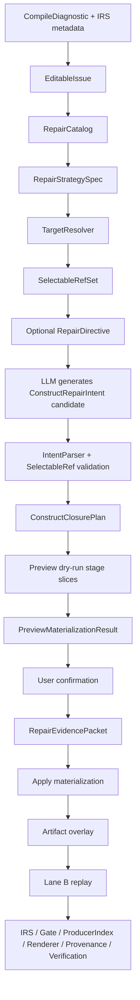

# SPL Editing Construct-Level Repair Strategy 与 Repair-Mode Stage Slice 设计

日期：2026-06-26  
状态：Draft for R12+ architecture design  
适用范围：SPL Editing repair strategy、IRS repair affordance、LLM repair context、construct repair intent、stage-authorized materialization、repair-mode stage slice、verification

---

## 1. 背景

R0-R11 的 construct repair materialization 重构已经解决了一类底层安全问题：

```text
LLM payload 不能直接写 IR；
PatchApplier 不能 direct mutate IR；
refs 必须来自 SelectableRefSet；
IR 只能由 declared materializer 生成；
materialized artifact 必须携带 evidence / selected refs / authority metadata；
Verification 必须检查 evidence、refs、authority 和 replay 结果。
```

这些改动是必要前置层，但它们还没有完全解决更高一层的问题：

```text
materializer 不应只执行一个预设的具体修复动作；
repair strategy 应表达“缺失 SPL Construct closure 的补齐方向”；
具体 BLOCK、COMMAND、HANDOFF、WORKER 如何生成，应交给 repair-mode stage slice。
```

以 `missing_handler` 为例，当前实现已经避免了 handler / applier 直接写 IR，但 `Stage7ExceptionHandlerStepMaterializer` 仍然固定生成：

```text
SEQUENTIAL BlockIR
+ GENERAL_COMMAND StepIR
```

这可以作为没有用户建议时的最小默认策略，但不应成为 `EXCEPTION_FLOW.handler_action` 的完整 repair strategy。更准确的语义应该是：

```text
EXCEPTION_FLOW.handler_action 缺失
-> repair strategy = CompleteExceptionHandlerAction
-> missing construct closure = handler BLOCK + executable/action COMMAND
-> Stage5ExceptionHandlerBlockRepairSlice
-> Stage7ExceptionHandlerCommandRepairSlice
-> Lane B replay + authority verification
```

本文档定义 R12+ 的语义升级：在 R0-R11 的安全底座之上，引入 construct-level repair strategy 和 repair-mode stage slice。

---

## 2. 核心判断

### 2.1 R0-R11 没有被推翻

R0-R11 的目标是把修复路径从：

```text
LLM payload
-> PatchApplier direct IR mutation
-> verification
```

重构为：

```text
LLM output ConstructRepairIntent
-> user confirmation
-> RepairEvidencePacket
-> SelectableRefSet resolution
-> MaterializationPlan
-> stage-authorized materializer
-> artifact overlay
-> IRS / Gate / ProducerIndex / Renderer / Provenance / Verification
```

这个目标仍然成立。R12+ 不是否定 R0-R11，而是继续回答一个更高层的问题：

```text
declared materializer 是否应该独自决定 construct shape？
```

答案是：不应该。materializer 应该逐步退化为 stage-slice orchestration，而不是承载完整 construct generation policy。

### 2.2 当前 patch type 过于动作化

当前 patch type 仍然偏向具体动作：

```text
AddExceptionHandlerStep
InsertProducerStep
CreateWorkerHandoffContract
ConvertDelegationIntentToMainFlowStep
```

这些名字会诱导实现把 repair 固定为一种动作：

```text
missing_handler 永远加一个 step；
missing_output_producer 永远插一个 producer step；
worker promotion 永远 create handoff contract。
```

更合理的抽象是 construct-level repair strategy：

```text
CompleteExceptionHandlerAction
MaterializeRequiredOutputProducer
CompleteWorkerHandoffContract
MaterializeInvocationPoint
CompleteApiActionContract
```

这些 strategy 不直接声明最终 IR 字段，而是声明：

```text
缺失哪个 construct slot；
需要补齐哪些 SPL Construct；
需要哪些 repair-mode stage slices；
默认 minimal policy 是什么；
用户 directive 如何影响 generation；
需要哪些 selected refs、snapshot artifacts 和 verification lane。
```

---

## 3. 设计目标

### 3.1 主要目标

1. 将 SPL Editing repair 从 patch-action 语义升级为 construct-completion 语义。
2. 让 IRS / RepairCatalog 声明可修复方向，而不是具体 IR 生成动作。
3. 让用户建议进入结构化 `RepairDirective`，而不是被 prompt 直接翻译为 `StepIR` 字段。
4. 让 BLOCK、COMMAND、HANDOFF、WORKER 等 construct shape 由对应 repair-mode stage slice 生成。
5. 保留 R0-R11 的安全边界：SelectableRefSet、EvidencePacket、MaterializationPlan、DependencyClosure、Verification 都仍然强制生效。
6. 在没有用户建议时，允许系统走 minimal default policy，生成最简单、最保守的 SPL Construct。

### 3.2 非目标

本文档不要求立即复用 full compile run 的原始 Stage executor。现有 pipeline stages 多数消费 `SpanIR`、`FieldRouteIR`、`compile_hints`、`WorkerFlowPlanIR` 等 full-run artifacts。repair 场景中的用户建议不是原始需求全文，因此不应伪造 `SpanIR` 或 `compile_hint` 来“骗过”原始 Stage。

本文档要求的是：

```text
提取对应 stage 的 construct materialization policy，
并定义 repair-mode stage input contract，
形成可局部执行的 repair-mode stage slice。
```

---

## 4. 架构总览

### 4.1 Target Flow



### 4.2 关键分层

```text
IRS:
  声明缺失 slot 和 repair affordance。
  不生成 construct，不调用 LLM，不执行 repair。

RepairStrategySpec:
  声明 construct-level repair 方向、missing construct closure、stage slices。

RepairDirective:
  表达用户建议或 system default policy 的修复偏好。

ConstructRepairIntent:
  表达一次被选择的具体修复目标和 selected refs。

Repair-mode Stage Slice:
  根据 stage policy 生成对应层级的 SPL construct artifact。

MaterializationPlan / Verification:
  继续提供 R0-R11 的安全约束和验收机制。
```

---

## 5. 新增核心概念

### 5.1 RepairStrategySpec

`RepairStrategySpec` 是 R12+ 的核心对象。它替代“patch type 即 repair strategy”的旧语义。

概念字段：

```text
strategy_id
target_construct_type
target_slot_name
diagnostic_kind
missing_construct_closure
default_policy_id
directive_policy_id
stage_slice_chain
selectable_ref_policy_id
required_context_facts
verification_lane
supported_patch_types
```

示例：

```text
strategy_id: exception_flow.complete_handler_action.v1
target_construct_type: EXCEPTION_FLOW
target_slot_name: handler_action
diagnostic_kind: missing_handler
missing_construct_closure:
  - BLOCK
  - COMMAND
default_policy_id: exception_handler.minimal_block.v1
directive_policy_id: exception_handler.directive_driven_block.v1
stage_slice_chain:
  - stage5.exception_handler_block_repair.v1
  - stage7.exception_handler_command_repair.v1
verification_lane: B
```

`RepairStrategySpec` 不声明 LLM prompt 文案，也不直接创建 patch payload。它是 repair affordance 与 stage-slice materialization 之间的语义桥。

### 5.2 RepairDirective

`RepairDirective` represents the business intent for the repair. It can come from the user or from a system default policy.

Conceptual fields:

```text
directive_id
source: user | system_default
target_construct_type
target_slot_name
requested_behavior
selected_ref_hints
constraints
confidence
```

`RepairDirective` must not carry evidence authority. It is provisional in preview phase.
Confirmed evidence exists only after user confirmation creates a `RepairEvidencePacket`.
If a directive needs to point at confirmed evidence later, use:

```text
evidence_status: provisional | confirmed_by_packet
evidence_packet_id: str | None
```

Rules:

```text
1. User advice enters RepairDirective, never StepIR or BlockIR directly.
2. If the user provides no advice, the system creates a source=system_default minimal directive.
3. RepairDirective may influence stage-slice generation, but cannot bypass SelectableRefSet or verification.
4. requested_behavior is a preference, not final SPL authority.
5. selected_ref_hints are hints only; they are not materialization authority.
6. Materialization may consume only ConstructRepairIntent.selected_ref_ids that were validated against SelectableRefSet.
```

### 5.3 ConstructClosurePlan

`ConstructClosurePlan` describes which SPL constructs must be ensured, bound, or materialized to complete the missing slot.

Conceptual fields:

```text
closure_plan_id
strategy_id
materialization_plan_id
target_construct_ref
closure_nodes
stage_slice_chain
write_layers
dependency_closure
default_or_directive_driven
```

`closure_nodes` must express the action for each construct, not just the construct name:

```text
ConstructClosureNode:
  role
  construct_type
  action: ensure | bind_existing | materialize
  required: true | false
  stage_slice_id
  output_ref_role
```

Example:

```text
missing_handler:
  closure_nodes:
    - role: handler_block
      construct_type: BLOCK
      action: ensure
      required: true
      stage_slice_id: stage5.exception_handler_block_repair.v1

    - role: handler_action
      construct_type: COMMAND
      action: materialize
      required: true
      stage_slice_id: stage7.exception_handler_command_repair.v1
  stage_slice_chain:
    - Stage5ExceptionHandlerBlockRepairSlice
    - Stage7ExceptionHandlerCommandRepairSlice
```

`ensure` means reuse or create is allowed. `bind_existing` means bind an existing construct. `materialize` means a new construct must be produced.

`ConstructClosurePlan` and the R0-R11 `MaterializationPlan` must not become parallel truth sources. The intended relationship is:

```text
RepairStrategySpec:
  Static strategy definition from registry/catalog.

ConstructClosurePlan:
  Instance-level closure plan derived from strategy + target + directive + refset.

MaterializationPlan:
  Executable materialization/audit plan that invokes stage slices, creates MaterializationResult, and writes overlay/audit metadata.
```

They must reference each other:

```text
ConstructClosurePlan.materialization_plan_id
MaterializationPlan.construct_closure_plan_id
```

Verification must audit the consistency between the closure plan and the executable materialization plan.

### 5.4 RepairModeStageInput

Do not fabricate full-pipeline `SpanIR` or `compile_hint` inputs. Repair-mode stage slices need their own input contract:

```text
ArtifactSnapshot
TargetResolverResult
SelectableRefSet
RepairDirective
ConstructRepairIntent
RepairEvidencePacket
MaterializationDependencyClosure
StagePolicy
RepairIdAllocator
```

All issue facts and target facts must come from authoritative structured state:

```text
1. target construct facts come from TargetResolverResult or ArtifactSnapshot.
2. exception condition text comes from the exception flow artifact, source-backed construct metadata, or TargetResolverResult.
3. selected refs come from SelectableRefSet.
4. user advice comes from RepairDirective.
5. diagnostic.message / UI display text can be fallback display or Advanced Details only; it must not be a primary materialization fact.
```

This input contract must clearly state:

```text
1. which facts come from the original snapshot;
2. which facts come from user confirmation;
3. which refs may be consumed;
4. which artifact layers may be written;
5. which construct ids are allocated by allocator;
6. which stage policy decides construct shape.
```

### 5.5 RepairModeStageSlice

`RepairModeStageSlice` is the local repair-mode version of a full pipeline stage. It should reuse the construct policy owned by that stage, not the full executor input contract.

Conceptual interface:

```text
slice_id
stage_authority
input_contract
output_artifacts
write_layers
policy_id
execute(input) -> StageSliceResult
```

Constraints:

```text
1. Stage slice may construct IR only when it is the declared authority.
2. Stage slice must consume RepairDirective / SelectableRefSet / EvidencePacket.
3. Stage slice must not regex-parse diagnostic.message for primary facts.
4. Stage slice must not accept LLM raw variable names.
5. Stage slice output must flow into MaterializationResult and be verified.
```

A stage slice may call LLM only as a stage-authorized constrained generator:

```text
Allowed:
  LLM outputs a slice-local typed plan.

Forbidden:
  LLM outputs BlockIR / StepIR / WorkerHandoffIR.
  LLM outputs raw inputs / outputs.
  LLM invents variable / worker / connector / handoff refs.
```

Examples:

```text
Stage5ExceptionHandlerBlockRepairSlice:
  LLM may output BlockShapePlan:
    block_type = SEQUENTIAL | IF
    rationale
    child_action_slots

Stage7ExceptionHandlerCommandRepairSlice:
  LLM may output CommandIntentPlan:
    command_family = REQUEST_INPUT | DISPLAY_MESSAGE | GENERAL_COMMAND
    user_facing_text
    selected_ref_ids
```

The typed plan must still be validated by slice policy. Final IR is created by the slice materializer from typed plan + resolved refs.

`StageSliceResult` must be structured:

```text
slice_id
stage_authority
policy_id
changed_artifact_refs
generated_construct_refs
consumed_selected_ref_ids
consumed_directive_id
allocated_ids
warnings
trace
```

---

## 6. missing_handler 作为第一个实践案例

### 6.1 当前行为

当前实现大致是：

```text
missing_handler
-> AddExceptionHandlerStep
-> Stage7ExceptionHandlerStepMaterializer
-> BlockIR(block_type=SEQUENTIAL)
-> StepIR(command_type=GENERAL_COMMAND)
-> Lane B replay
```

这个路径已经比 direct applier mutation 安全，但它仍然把 `missing_handler` 固定成一种具体动作。

### 6.2 目标行为

目标链路：

```text
EXCEPTION_FLOW.handler_action missing
-> RepairStrategySpec: CompleteExceptionHandlerAction
-> optional RepairDirective
-> ConstructClosurePlan: handler BLOCK + COMMAND
-> Stage5ExceptionHandlerBlockRepairSlice
-> Stage7ExceptionHandlerCommandRepairSlice
-> WorkerBlockPlanIR + WorkerStepPlanIR overlay
-> Lane B replay
```

### 6.3 没有用户建议时

系统走 minimal default policy：

```text
RepairDirective:
  source = system_default
  requested_behavior = None
  policy = minimal_handler_block

Stage5ExceptionHandlerBlockRepairSlice:
  generate one SEQUENTIAL handler block

Stage7ExceptionHandlerCommandRepairSlice:
  generate one minimal executable/action command
```

此时当前 `SEQUENTIAL_BLOCK + GENERAL_COMMAND` 行为可以保留，但它的身份变为：

```text
default minimal policy 的输出
```

而不是：

```text
missing_handler 的永久固定修复策略
```

### 6.4 有用户建议时

用户建议进入 `RepairDirective`：

```text
RepairDirective:
  source = user
  requested_behavior = "如果 source access 不足，请请求授权或让用户提供替代来源。"
  selected_ref_ids = (...)
```

Stage slice 根据 directive 生成 construct：

```text
Stage5:
  根据 directive 决定 handler block shape。
  例如仍然是 SEQUENTIAL，或在未来支持更复杂的 control block。

Stage7:
  根据 directive 和 SelectableRefSet 生成 COMMAND / REQUEST_INPUT / DISPLAY_MESSAGE。
  具体 command kind 由 Stage7 command policy 裁决。
```

关键点：

```text
用户建议决定意图和偏好；
stage slice 决定合法 construct shape；
SelectableRefSet 决定可引用事实；
verification 决定结果是否 accepted。
```

### 6.5 missing_handler 的 stage slice 分工

#### Stage5ExceptionHandlerBlockRepairSlice

输入：

```text
target exception flow
exception condition text
parent worker context
existing WorkerFlowPlanIR
existing WorkerBlockPlanIR
RepairDirective
SelectableRefSet
block id allocator
```

输出：

```text
WorkerBlockPlanIR overlay
handler block ref
block materialization trace
```

职责：

```text
1. 决定 handler block shape。
2. 没有用户建议时生成 minimal SEQUENTIAL_BLOCK。
3. 有用户建议时按 directive 生成合适的 block skeleton。
4. 不生成 StepIR。
5. 不决定 raw variable refs。
```

#### Stage7ExceptionHandlerCommandRepairSlice

输入：

```text
handler block ref
RepairDirective
SelectableRefSet
WorkerStepPlanIR
step id allocator
Stage7 command policy
```

输出：

```text
WorkerStepPlanIR overlay
COMMAND / REQUEST_INPUT / DISPLAY_MESSAGE
```

职责：

```text
1. 在 Stage5 产出的 handler block 内生成 command。
2. 从 SelectableRefSet 解析 inputs / outputs。
3. 根据 directive 选择 command family，但最终由 Stage7 policy 裁决。
4. 写入 evidence_packet_id、materialization_authority、consumed_selected_ref_ids。
```

---

## 7. 扩展到所有 issue 的通用模式

### 7.1 missing_output_producer

当前语义：

```text
REQUIRED_OUTPUT.producer missing
-> InsertProducerStep
```

目标语义：

```text
REQUIRED_OUTPUT.producer missing
-> MaterializeRequiredOutputProducer
-> missing construct closure:
     producer COMMAND
     optional placement BLOCK
-> Stage5 placement/block repair slice when needed
-> Stage7 producer command repair slice
```

无用户建议：

```text
生成一个最小 producer COMMAND；
只使用 selected refs 或允许 no-input low-context producer；
不得发明 project_data。
```

有用户建议：

```text
用户建议进入 RepairDirective；
Stage7 producer command policy 决定 command text、inputs、outputs；
如果建议暗示多步处理，Stage5 可生成 placement block。
```

### 7.2 worker delegation / handoff

当前语义：

```text
WORKER_PROMOTION slots missing
-> CreateWorkerHandoffContract / Convert...
```

目标语义：

```text
WORKER_PROMOTION / WORKER_HANDOFF / INVOKE_WORKER slots missing
-> CompleteWorkerDelegationClosure
-> missing construct closure:
     WorkerHandoffIR
     INVOKE_WORKER command
     input/output bindings
     optional child worker skeleton
     optional placement block
-> Stage3.5 worker boundary repair slice
-> Stage5 placement/block repair slice
-> Stage7 invoke command repair slice
```

约束：

```text
1. LLM 不直接生成 WorkerHandoffIR。
2. LLM 不直接生成 INVOKE_WORKER StepIR。
3. input/output bindings 必须来自 SelectableRefSet。
4. target worker 必须来自 worker ref。
5. invocation point 必须来自 workflow/step/block selectable ref。
```

### 7.3 CALL_API / external action contract

目标语义：

```text
CALL_API.api_target / call_action missing
-> CompleteApiActionContract
-> missing construct closure:
     API target binding
     action command contract
     input/output binding
-> Stage6 resource/API context repair slice
-> Stage7 API command repair slice
```

约束：

```text
1. 用户确认不能绕过 API target / connector declaration。
2. LLM 不能发明 connector ref。
3. selected refs 必须覆盖 required API inputs。
4. verification 必须走 Gate + IRS + renderer。
```

---

## 8. 与 IRS / RepairAffordance 的关系

IRS 仍然只回答：

```text
这个 construct instance 的 required slots 是否满足？
```

IRS 可以通过 `repair_affordances` 声明：

```text
这个 missing slot 是否可修；
可用的 repair strategy id；
目标 construct closure；
需要哪些 stage slices；
默认 verification lane。
```

IRS 不得：

```text
生成 RepairDirective；
调用 LLM；
执行 stage slice；
生成 StepIR / BlockIR / WorkerHandoffIR；
根据用户建议决定 command text。
```

推荐的 affordance 扩展方向：

```text
RepairAffordanceSpec:
  affordance_id
  repair_strategy_id
  supported_patch_types
  default_patch_type
  handler_id
  target_resolver_id
  selectable_ref_policy_id
  default_verification_lane
```

`supported_patch_types` 可在过渡期保留，但长期应降级为执行载体，不再承担 repair strategy 语义。

Transition rule:

```text
1. If repair_strategy_id is present, UI / prompt / catalog selection must use strategy_id as the semantic source.
2. supported_patch_types may only select a legacy execution adapter.
3. No new R12+ strategy may introduce a patch type whose name encodes construct shape as final policy.
```

---

## 9. Prompt / LLM Context 的变化

LLM Prompt 不应该问：

```text
请生成 DISPLAY_MESSAGE / REQUEST_INPUT / GENERAL_COMMAND。
```

而应该问：

```text
请根据 selected strategy 和可选用户建议，生成 construct repair intent。
```

Prompt 应包含：

```text
1. issue facts；
2. target construct；
3. selected RepairStrategySpec；
4. missing construct closure；
5. optional RepairDirective；
6. SelectableRefSet；
7. allowed intent schema；
8. safety rules。
```

Prompt 不应包含：

```text
1. demo answer；
2. hardcoded specific command choice；
3. previous suggestion bodies as default retry context；
4. raw diagnostic metadata as user-facing facts；
5. final StepIR-like fields。
```

---

## 10. UI / CLI Confirmation Semantics

The user should not confirm backend strategy, construct closure, stage slice, or verification lane by default. The user confirms the previewed repair result.

Default confirmation question:

```text
Does this previewed repair result match my intent?
```

Default confirmation page:

```text
Apply this repair?

Issue:
  Exception has no handler: insufficient source access

Proposed fix:
  Add an exception handler that asks the user to provide source access
  or choose alternative sources.

Preview:
  [EXCEPTION_FLOW: insufficient source access]
    [SEQUENTIAL_BLOCK]
      COMMAND-X [COMMAND Ask the user to provide source access or specify alternative sources]
    [END_SEQUENTIAL_BLOCK]
  [END_EXCEPTION_FLOW]

Expected effect:
  - This exception flow will no longer be empty.
  - The repaired SPL will be re-verified before it is accepted.

Confirm apply? y/N
```

If the user provided advice, the default confirmation page should show how the preview reflects that advice:

```text
Your request:
  Ask for source access or alternative sources.

Proposed repair:
  The exception handler will ask the user to provide access or choose another source.
```

If the user did not provide advice, the page should show only the generated minimal repair result and expected effect. It should not expose internal names such as `system_default` or `minimal_handler_block`.

Preview must be generated before confirmation, but preview must not become an accepted overlay. The confirmation page shows dry-run materialization output.

```text
Preview phase:
  ProvisionalRepairDirective
  + ConstructRepairIntentCandidate
  + SelectableRefSet
  + ConstructClosurePlan
  -> dry-run StageSlice preview
  -> PreviewMaterializationResult
  -> user confirmation

Apply phase:
  user confirmation
  -> RepairEvidencePacket
  -> re-run or promote verified stage slice result
  -> MaterializationResult
  -> overlay
  -> Lane B verification
```

`PreviewMaterializationResult` must carry audit identity:

```text
preview_id
base_snapshot_id
intent_hash
directive_hash
closure_plan_hash
selected_refset_id
slice_typed_plan_hashes
preview_construct_hashes
llm_generation_config_hash
rendered_preview
```

Apply must check:

```text
1. base_snapshot_id is unchanged.
2. intent_hash is unchanged.
3. directive_hash is unchanged.
4. closure_plan_hash is unchanged.
5. selected_refset_id is unchanged or has been re-resolved equivalently.
6. slice_typed_plan_hashes are unchanged if preview generated typed plans.
7. preview_construct_hashes are unchanged or regenerated to the same value.
8. llm_generation_config_hash is unchanged when apply re-runs constrained generation.
```

If any check fails, the preview is stale and must be regenerated before apply.

If preview dry-run invokes stage-slice constrained LLM generation, apply must either:

```text
1. promote the exact validated typed plans referenced by preview_id, if base snapshot and hashes are unchanged; or
2. re-run generation with deterministic seed/config and require the new typed plans to match preview hashes.
```

If neither can be guaranteed, apply must fail as stale preview.

Backend audit fields remain required, but they belong in Advanced Details / developer mode / audit log:

```text
Advanced details:
  target construct: EXCEPTION_FLOW.handler_action
  repair strategy: CompleteExceptionHandlerAction
  construct closure: handler BLOCK + handler COMMAND
  selected refs: ...
  materialization plan: stage5 + stage7 repair slices
  verification lane: B
  diagnostic id: ...
```

Summary:

```text
The user confirms the previewed repair result.
The backend records strategy / target construct / selected refs / materialization plan / lane.
Advanced Details expose internal fields only when requested.
```

## 11. Verification Requirements

R0-R11 verification still applies. R12+ adds stage-slice audit requirements.

Verification must check:

```text
1. materialized constructs come from declared stage slices.
2. changed artifact materialization_authority matches the stage slice chain.
3. consumed_selected_ref_ids come from confirmed intent.
4. RepairDirective is recorded in evidence / provenance lineage.
5. generated BLOCK / COMMAND / HANDOFF / WORKER satisfy dependency closure.
6. ConstructClosurePlan and MaterializationPlan are consistent.
7. preview_id / intent_hash / directive_hash / closure_plan_hash are not stale.
8. target diagnostic is resolved after Lane B replay.
9. no new blocking diagnostics are introduced.
10. rendered output contains no undefined <REF>.
```

Important boundary:

```text
Verification is acceptance, not generation.
If many patch-specific verifiers are needed to compensate for unstable stage-slice output, fix the stage-slice policy instead.
```

## 12. 迁移路线

### R12 RepairStrategySpec Foundation

目标：

```text
引入 RepairStrategySpec、RepairDirective、ConstructClosurePlan、RepairModeStageSlice contract。
```

验收：

```text
1. RepairCatalogEntry 可以携带 repair_strategy_id。
2. patch type 不再被视为唯一 strategy source。
3. presentation 可以显示 strategy，而不是只显示 patch action。
4. 没有 strategy 的 editable issue 不进入默认 Fix with AI。
```

### R12.5 Preview / Apply Lifecycle Contract

Goal:

```text
Define dry-run preview and confirmed apply lifecycle so the user sees the same repair result that will be applied.
```

Acceptance:

```text
1. System can dry-run PreviewMaterializationResult without saving accepted overlay.
2. Preview result carries preview_id / intent_hash / directive_hash / closure_plan_hash / selected_refset_id.
3. Preview result carries slice_typed_plan_hashes / preview_construct_hashes / llm_generation_config_hash when generation is used.
4. RepairEvidencePacket is created only after user confirmation.
5. Apply must verify that preview is not stale.
6. Apply result must match preview strategy / closure / selected refs.
```

### R13 missing_handler Stage Slice Migration

目标：

```text
把 AddExceptionHandlerStep 从 single Stage7 materializer 升级为 Stage5 + Stage7 repair slice chain。
```

验收：

```text
1. Stage5ExceptionHandlerBlockRepairSlice 负责 handler block。
2. Stage7ExceptionHandlerCommandRepairSlice 负责 handler command。
3. 当前 SEQUENTIAL_BLOCK + GENERAL_COMMAND 成为 minimal default policy。
4. 用户 directive 可以影响 handler block / command generation。
5. condition text must come from structured target facts, not diagnostic.message regex.
6. If the target exception flow already has a handler block, Stage5 must ensure or bind the existing block and must not create a duplicate handler block.
7. If the target exception flow has no handler block, Stage5 materializes one and records allocated block id + authority.
8. Lane B accepted.
```

### R14 missing_output_producer Strategy Migration

目标：

```text
把 InsertProducerStep 升级为 MaterializeRequiredOutputProducer strategy。
```

验收：

```text
1. producer command 仍由 Stage7 producer command slice 生成。
2. 如果用户 directive 需要 block placement，则引入 Stage5 placement/block slice。
3. project_data 类 hallucinated ref 仍然在 intent parse / materialization 前失败。
```

### R15 worker delegation Closure Migration

目标：

```text
把 worker delegation 从 handoff action patch 升级为 CompleteWorkerDelegationClosure。
```

验收：

```text
1. handoff contract、invoke command、bindings、placement 作为 closure 被统一规划。
2. 各部分分别由 Stage3.5 / Stage5 / Stage7 repair slices materialize。
3. Lane B replay 后无 handoff / invoke mismatch。
```

### R16 Legacy Strategy Cleanup

目标：

```text
清理 patch-action-as-strategy 的旧路径。
```

验收：

```text
1. 默认 UI 展示 strategy，而不是 patch type。
2. handler prompt 不再要求 LLM 选择 concrete command type。
3. materializer 不再独自承载完整 construct shape policy。
4. 所有默认修复策略均可追溯到 RepairStrategySpec。
```

---

## 13. 禁止事项

R12+ 之后明确禁止：

```text
1. 为了复用原始 Stage executor 而伪造 SpanIR / compile_hint。
2. 让 LLM 直接输出 StepIR / BlockIR / WorkerHandoffIR 字段。
3. 把用户建议直接拼成 final SPL 或 StepIR.text。
4. 在 materializer 中硬编码所有 construct shape，并把它称为 stage policy。
5. 让 patch type 继续承担 repair strategy 语义。
6. 让 IRS 执行 repair 或决定 command text。
7. 用 user_confirmed_repair 掩盖 undefined refs。
8. 让 Stage 9.5 承担语义修复。
9. 让 UI / CLI 根据 raw diagnostic metadata 推断修复方式。
```

---

## 14. 最终判断

R0-R11 建立了 SPL Editing 的安全 materialization 底座；R12+ 要建立 construct-level repair strategy 和 repair-mode stage slice。

最终目标不是：

```text
missing_handler -> AddExceptionHandlerStep -> fixed COMMAND
```

而是：

```text
missing_handler
-> EXCEPTION_FLOW.handler_action 缺失
-> CompleteExceptionHandlerAction
-> handler BLOCK + COMMAND closure
-> repair-mode Stage5 + Stage7 slices
-> overlay
-> Lane B replay
```

同样，其他 issue 也应遵循同一模式：

```text
diagnostic missing slot
-> construct-level repair strategy
-> optional user directive
-> construct closure plan
-> stage-slice materialization
-> authority verification
```

这样才能保证 SPL Editing 修复的是 SPL Construct requirement，而不是让 handler、prompt 或 materializer 固定生成某个具体答案。
