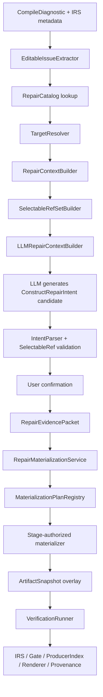

# SPL Editing Construct Repair Materialization 系统性重构方案

日期：2026-06-25  
状态：Draft for implementation planning  
适用范围：SPL Editing repair suggestion、typed patch、artifact snapshot overlay、IRS repair affordance、LLM repair context、verification、demo CLI

---

## 1. 背景与目标

当前 SPL Editing 已经具备以下基础能力：

```text
ArtifactSnapshot
-> EditableIssue
-> RepairCatalog
-> IssueRepairHandler
-> RepairSuggestion
-> user confirmation
-> PatchApplier
-> overlay snapshot
-> verification
```

但当前代码中仍存在一个架构级问题：部分 patch applier 直接构造或修改 stage-level IR。例如：

```text
InsertProducerStepApplier
  -> 直接 new StepIR

AddExceptionHandlerStepApplier
  -> 直接 new StepIR / BlockIR

CreateWorkerHandoffContractApplier
  -> 直接 new WorkerHandoffIR / INVOKE_WORKER StepIR
```

这导致 LLM suggestion payload 中的字段可能绕过 NL2SPL Pipeline 中负责 materialize SPL Construct 的阶段权威。典型表现是 `missing_output_producer` 的 suggestion 中出现未声明变量，例如 `project_data`，随后被 applier 直接写入 `StepIR.inputs`，最终可能渲染为非法 `<REF>project_data</REF>`。

本方案目标是把 SPL Editing repair 从：

```text
LLM payload -> PatchApplier direct IR mutation -> verification
```

重构为：

```text
LLM output ConstructRepairIntent
-> user confirmation
-> RepairEvidencePacket
-> SelectableRefSet resolution
-> stage-authorized materialization plan
-> artifact overlay
-> IRS / Gate / ProducerIndex / Renderer / Provenance / Verification
```

一句话目标：

```text
SPL Editing 修复的对象是 SPL Construct 的缺失 slot，不是任意 IR object；
LLM 只能提出 construct-scoped repair intent 和选择已有 refs；
具体 IR 必须由声明的 stage materialization authority 生成。
```

---

## 2. 当前代码事实

本节只描述当前代码已经存在的结构和风险，作为重构依据。

### 2.1 IRS repair affordance 只声明 handler/catalog 路由

文件：`src/nl2spl/compiler/construct_registry.py`

当前 `RepairAffordanceSpec` 已声明：

```text
affordance_id
supported_patch_types
default_patch_type
handler_id
context_id
target_resolver_id
default_verification_lane
editable_artifacts
patch_type_metadata
```

但缺少 repair materialization 所需的核心声明：

```text
materialization_plan_id
selectable_ref_policy_id
required_context_facts
intent_schema_id
stage_authority
```

这意味着 RepairCatalog 能找到 handler 和 patch type，但不能声明“这个修复应由哪个 stage slice materialize”。

### 2.2 RepairPatch 仍允许任意 payload

文件：`src/nl2spl/compiler/spl_editing/core/model.py`

当前 `RepairPatch.payload: Any`，虽然注释中说明 payload 应该 typed，但运行时仍允许 handler 把任意 dict 传给 applier。

风险：

```text
LLM 输出字段
-> handler 简单转成 payload
-> applier 直接读取 payload
-> payload 字段成为 IR 字段
```

这使 `inputs`、`outputs`、`command_type`、`step_id`、`handoff_id` 等本应由 stage authority 决定或校验的字段，可能来自 LLM。

### 2.3 missing_output_producer handler 仍生成 IR-like payload

文件：`src/nl2spl/compiler/spl_editing/handlers/missing_output_producer/handler.py`

当前 handler 对 `InsertProducerStep` 的 payload 包含：

```text
worker_id
output_name
producer_text
command_type
inputs
outputs
```

这些字段已经接近 `StepIR` 结构。尤其是 `inputs` 和 `outputs`，当前来源可以是 LLM payload，而不是经 SelectableRefSet 解析后的结构化 refs。

这就是 `project_data` 这类未声明变量进入 StepIR 的直接原因。

### 2.4 InsertProducerStepApplier 直接构造 StepIR

文件：`src/nl2spl/compiler/spl_editing/patches/insert_producer_step/applier.py`

当前 applier 行为：

```text
payload["inputs"] -> StepIR.inputs
payload["outputs"] -> StepIR.outputs
payload["command_type"] -> StepIR.command_type
payload["producer_text"] -> StepIR.text
new StepIR(...)
append to WorkerStepPlanIR
```

问题：

```text
1. applier 成为 COMMAND / REQUEST_INPUT construct materializer。
2. LLM 可以间接决定 StepIR.inputs。
3. 未声明变量无法在 materialization 前被拒绝。
4. Stage 7 / Stage 9.5 的 construct 生成边界被绕过。
```

### 2.5 missing_handler 和 worker delegation 也有同类风险

文件示例：

```text
src/nl2spl/compiler/spl_editing/patches/add_exception_handler_step/applier.py
src/nl2spl/compiler/spl_editing/patches/create_worker_handoff_contract/applier.py
```

当前风险模式类似：

```text
AddExceptionHandlerStepApplier
  -> 直接构造 exception handler StepIR / BlockIR

CreateWorkerHandoffContractApplier
  -> 直接构造 WorkerHandoffIR
  -> 可能直接构造 INVOKE_WORKER StepIR
```

这些都应迁移为 construct repair intent + materialization plan。

### 2.6 RequiredOutputContextBuilder 还没有 SelectableRefSet

当前 `RequiredOutputContextBuilder` 主要收集：

```text
related_steps
related_outputs
worker_scope
metadata
```

它没有产出一等对象 `SelectableRefSet`。因此 LLM prompt 只能看到文本化的变量/步骤信息，无法被强制要求“只能选择 ref_id”。

---

## 3. 核心设计原则

### 3.1 IRS 只声明，不执行

IRS / SlotSpec / RepairAffordanceSpec 只能声明：

```text
这个 slot 可以通过哪些 repair affordance 修复
这些 repair affordance 支持哪些 patch type
需要哪个 materialization plan
需要哪些 selectable ref policy
需要哪些上下文事实
需要哪些 verification lane
```

IRS 不得：

```text
调用 LLM
生成 ConstructRepairIntent
生成 StepIR / WorkerHandoffIR
执行 materialization
修改 artifact snapshot
```

### 3.2 LLM 只能生成 repair intent，不能生成 IR

LLM 输出应表达：

```text
用户想补哪个 construct slot
修复意图是什么
选择了哪些已存在 selectable refs
是否需要创建某类 construct
用户可理解的 explanation / preview
```

LLM 输出不得包含最终 IR 权威字段：

```text
StepIR.step_id
StepIR.inputs raw names
StepIR.outputs raw names
StepIR.command_type as final authority
WorkerHandoffIR.handoff_id
WorkerHandoffIR.input_bindings raw variable names
WorkerHandoffIR.output_bindings raw variable names
```

这些字段必须由 materializer 根据 stage policy 和 resolved refs 生成。

### 3.3 SelectableRefSet 是一等核心对象

修复时可供 LLM 选择的变量、步骤、输出、worker、handoff、source span 等必须先被后端结构化为：

```text
SelectableRefSet
```

LLM prompt 中展示的是稳定 `ref_id` 和用户可读 label。LLM 输出只能引用 `ref_id`，不能输出裸变量名。

如果 LLM 输出 `project_data` 但它不在 `SelectableRefSet` 中，则应在 intent parse 阶段失败，不能进入 materialization。

### 3.4 MaterializationPlan 是 stage authority 的入口

每个 repair affordance 应声明 `materialization_plan_id`。该 plan 定义：

```text
需要哪些 snapshot artifacts
需要哪些 selected refs
由哪个 materializer 执行
产出哪些 artifact overlay
需要哪个 replay lane 验证
```

PatchApplier 不再直接 new IR，而是提交 intent 到 materialization service。

### 3.5 Verification 是验收，不是生成

Verification 应检查：

```text
target diagnostic 是否 resolved
是否产生新 blocking diagnostics
changed refs 是否有 user_confirmed_repair evidence
selected refs 是否都被正确解析和消费
生成 artifact 是否来自 declared materialization authority
是否存在 undefined refs
provenance 是否记录 repair lineage
```

Verification 不应补齐 IR，也不应在事后替代 stage materializer。

---

## 4. 目标架构

### 4.1 总体流程



### 4.2 新增核心对象

#### 4.2.1 SelectableRef

表示一个可供 repair intent 选择的已知结构化引用。

概念字段：

```text
ref_id
ref_kind
ref_role
canonical_name
display_label
worker_id
source_artifact
construct_path
type_hint
scope
provenance
selectable_for
confidence
```

`ref_kind` 初始建议：

```text
variable
worker_input
step_output
required_output
existing_step
exception_flow
worker
handoff
source_span
resource
```

`ref_role` 必须独立于 `ref_kind`。`ref_kind` 说明 ref 是什么，`ref_role` 说明它在当前 repair 中能做什么。

`ref_role` 初始建议：

```text
target_output
selectable_input
placement_anchor
binding_source
binding_target
target_worker
target_exception_flow
source_evidence
```

例如 `required_output:assumptions_log` 的 `ref_kind` 可以是 `required_output`，但在 `InsertProducerStep` 场景中它的 `ref_role` 必须是 `target_output`，不能被当作 `selectable_input`。

#### 4.2.2 SelectableRefSet

表示某个 issue repair 场景中可选 refs 的完整集合。

概念字段：

```text
set_id
issue_id
snapshot_id
worker_scope
refs
policy_id
quality
missing_required_ref_kinds
```

#### 4.2.3 ConstructRepairIntent

LLM suggestion 的核心结构化输出。

概念字段：

```text
intent_id
issue_id
patch_type
affordance_id
target_construct_type
target_construct_id
target_slot_name
target_ref_id
selected_ref_ids
intent_summary
repair_goal
materialization_plan_id
constraints
```

注意：`ConstructRepairIntent` 不包含最终 IR object。

#### 4.2.4 RepairEvidencePacket

用户确认后形成的证据包。

概念字段：

```text
evidence_packet_id
evidence_kind = user_confirmed_repair
confirmed_intent_id
repair_patch_id
related_diagnostic_id
user_text
confirmed_selected_ref_ids
confirmed_at
```

#### 4.2.5 MaterializationPlan

定义 repair intent 如何交给 stage-authorized materializer。

概念字段：

```text
materialization_plan_id
patch_type
target_construct_type
target_slot_name
stage_authority
required_snapshot_artifacts
required_selectable_ref_kinds
dependency_closure
editable_artifacts
output_artifacts
writes_to
normalizer_required
stage10_rebuild_required
verification_lane
materializer_id
```

#### 4.2.6 MaterializationDependencyClosure

定义 materializer 开始执行前必须具备的完整依赖闭包。它不能只是 artifact 名称列表，而必须表达 artifact、scope、ref role、ID allocator 和写入层约束。

概念字段：

```text
required_artifacts
required_ref_roles
required_scope
required_id_allocators
required_write_layer
normalizer_boundary
stage10_rebuild_boundary
```

推荐子结构：

```text
ArtifactRequirement:
  artifact_name
  required_fields
  worker_scope_required
  empty_allowed

SelectableRefRoleRequirement:
  ref_role
  min_count
  max_count
  allowed_ref_kinds

IdAllocatorRequirement:
  id_kind
  allocator_id
  collision_scope

WorkerScopeRequirement:
  worker_id_required
  cross_worker_allowed
```

如果 dependency closure 中任一 required artifact、scope、ref role 或 allocator 缺失，repair option 必须 fail-fast 为 unavailable，不能降级为 prompt text guessing。

#### 4.2.7 RepairIdAllocator

所有 materialized construct id 必须由 stage-authorized allocator 分配。

概念接口：

```text
allocate_step_id(worker_id, materialization_plan_id, repair_intent_id, existing_step_ids, placement_anchor)
allocate_block_id(worker_id, materialization_plan_id, repair_intent_id, existing_block_ids)
allocate_handoff_id(materialization_plan_id, repair_intent_id, existing_handoff_ids)
```

要求：

```text
1. 不碰撞 existing ids。
2. 同一 overlay replay 下稳定。
3. 与 repair_intent_id / evidence_packet_id 可追踪。
4. 不依赖 overlay_version 作为唯一语义来源。
5. 不重排 unrelated constructs。
```

#### 4.2.8 MaterializationResult

materializer 的结构化输出。

概念字段：

```text
patched_snapshot
overlay_event
changed_refs
changed_step_ids
changed_handoff_ids
evidence_refs
consumed_selected_ref_ids
materialization_trace
```

---

## 5. 推荐模块结构

新增模块建议放在 SPL Editing 后端内部，而不是 compiler artifact snapshot 模块中。

```text
src/nl2spl/compiler/spl_editing/selectable_refs/
  __init__.py
  model.py
  policy.py
  builder.py
  resolver.py
  audit.py
  errors.py

src/nl2spl/compiler/spl_editing/intent/
  __init__.py
  model.py
  parser.py
  validator.py
  evidence.py
  errors.py

src/nl2spl/compiler/spl_editing/materialization/
  __init__.py
  model.py
  registry.py
  service.py
  dependency_closure.py
  id_allocator.py
  stage_slice_executor.py
  errors.py
  stage7/
    __init__.py
    producer_step.py
    exception_handler_step.py
  worker_handoff/
    __init__.py
    handoff_contract.py

src/nl2spl/compiler/spl_editing/verification/
  selected_ref_verifier.py
  materialization_authority_verifier.py
```

需要修改的现有模块：

```text
src/nl2spl/compiler/construct_registry.py
src/nl2spl/compiler/spl_editing/core/catalog.py
src/nl2spl/compiler/spl_editing/core/model.py
src/nl2spl/compiler/spl_editing/core/service.py
src/nl2spl/compiler/spl_editing/context/required_output_context.py
src/nl2spl/compiler/spl_editing/handlers/missing_output_producer/
src/nl2spl/compiler/spl_editing/patches/insert_producer_step/
src/nl2spl/compiler/spl_editing/verification/runner.py
```

---

## 6. MVP 首个实践：missing_output_producer / InsertProducerStep

### 6.1 为什么先选这个

`missing_output_producer` 是当前暴露 `project_data` 问题最直接的路径。它适合作为第一阶段实践，因为：

```text
1. 目标明确：为 required output 增加 producer。
2. 影响面小于 worker delegation。
3. 能直接验证 SelectableRefSet 是否阻止 hallucinated variable。
4. 当前 InsertProducerStepApplier 的 direct StepIR mutation 风险清晰。
```

### 6.2 当前错误路径

```text
LLM:
  payload.inputs = ["project_data"]

MissingOutputProducerHandler:
  payload["inputs"] = tuple(llm_payload.get("inputs", ()))

InsertProducerStepApplier:
  StepIR(inputs=payload["inputs"])

Renderer:
  <REF>project_data</REF>
```

### 6.3 目标路径

```text
RequiredOutputContextBuilder
  -> SelectableRefSet(
       refs=[
         variable:missing_required_fields,
         step_output:source_evidence_set,
         worker_input:user_request,
         ...
       ]
     )

LLM output:
  ConstructRepairIntent(
    patch_type="InsertProducerStep",
    target_ref_id="required_output:assumptions_log",
    selected_ref_ids=[
      "step_output:worker_main:missing_required_fields",
      "step_output:worker_main:source_evidence_set"
    ],
    repair_goal="Create an assumptions log from available requirement and evidence context."
  )

IntentParser:
  resolves selected_ref_ids against SelectableRefSet
  rejects any unknown ref_id

Stage7ProducerRepairMaterializer:
  creates StepIR using resolved refs only
  writes metadata.materialization_authority
  writes metadata.user_confirmed_repair evidence

Verification:
  confirms assumptions_log has producer
  confirms no undefined refs
```

### 6.4 MVP SelectableRefPolicy

Policy id:

```text
required_output.producer.selectable_refs.v1
```

Allowed ref kinds:

```text
worker_input
step_output
variable
source_span
resource
```

Initial rules:

```text
1. Ref 必须属于 target worker scope，除非 policy 显式允许 cross-worker。
2. Ref 必须来自 snapshot structured artifacts，不能来自 diagnostic.message regex。
3. target required output 本身必须作为 required_output ref 出现在 refset。
4. LLM 只能输出 ref_id，不允许输出 raw variable name。
5. 如果 selected_ref_ids 为空，materializer 可以生成无 input 的 producer step，但必须记录 low-context repair warning。
6. 如果 selected_ref_ids 包含未知 ref_id，intent parse 失败，不能进入 apply。
7. `target_output` ref 不得作为 `selectable_input` 使用。
8. `selected_input_ref_ids` 只能引用 `ref_role=selectable_input` 且 kind 在 policy allowlist 中的 refs。
```

### 6.5 MVP Intent schema

`InsertProducerStep` 的 intent payload 应该类似：

```text
target_output_ref_id: str
selected_input_ref_ids: tuple[str, ...]
producer_goal: str
placement_hint_ref_id: str | None
notes_for_user: str | None
```

禁止字段：

```text
inputs
outputs
command_type
step_id
flow_ref
block_ref
```

这些字段由 materializer 决定。

### 6.6 Stage7ProducerRepairMaterializer 职责

职责：

```text
1. 读取 resolved target output ref。
2. 读取 resolved selected input refs。
3. 按 stage7 producer step policy 生成 StepIR。
4. 通过 RepairIdAllocator 分配稳定 step_id。
5. 只使用 resolved refs 生成 StepIR.inputs。
6. 强制 StepIR.outputs 包含 target output。
7. 写入 materialization_authority、evidence_packet_id、consumed_selected_ref_ids。
8. 返回 MaterializationResult。
```

不得：

```text
1. 接受 LLM raw input names。
2. 接受 LLM raw output names。
3. 从 diagnostic.message 解析 output name。
4. 直接信任 user_text 作为变量名。
```

---

## 7. missing_handler 迁移目标

当前 `AddExceptionHandlerStepApplier` 直接构造 handler StepIR。迁移后：

```text
LLM output:
  ConstructRepairIntent(
    patch_type="AddExceptionHandlerStep",
    target_ref_id="exception_flow:exc_adapter_03",
    selected_ref_ids=(...),
    repair_goal="Ask the user for the missing timeframe."
  )

ExceptionHandlerStepMaterializer:
  validates exception_flow ref
  decides allowed handler command type under policy
  generates handler StepIR / BlockIR
  updates worker_step_plan / worker_block_plan
```

关键原则：

```text
1. LLM 可以表达 handler 意图。
2. LLM 不直接决定最终 StepIR.inputs / outputs。
3. Exception flow id 必须来自 SelectableRefSet 或 TargetResolver。
4. Handler placement 必须由 materializer 根据 flow/block artifacts 计算。
```

---

## 8. worker delegation 迁移目标

worker delegation 是后续高风险阶段，不建议作为第一 MVP。

目标路径：

```text
WORKER_PROMOTION / WORKER_HANDOFF issue
-> ConstructRepairIntent
-> WorkerHandoffMaterializationPlan
-> Stage3.5 worker boundary artifacts
-> Stage4/5 flow/block placement artifacts
-> Stage7 invoke step artifact
-> Stage9.5 normalization
-> Lane B verification
```

关键原则：

```text
1. LLM 不直接生成 WorkerHandoffIR。
2. LLM 不直接生成 INVOKE_WORKER StepIR。
3. input/output bindings 必须来自 SelectableRefSet。
4. target child worker 必须来自 worker ref。
5. invocation point 必须来自 selectable workflow/step/block ref。
```

---

## 9. 与现有 user_confirmed_repair 机制的关系

已有 `user_confirmed_repair` 机制仍然有效，但语义需要收紧：

```text
user_confirmed_repair 证明这个 repair intent 已被用户确认。
它不证明 LLM 生成的 raw IR 字段合法。
```

重构后：

```text
RepairEvidencePacket
-> Materializer consumes evidence
-> generated artifact metadata records evidence
-> GenericEvidenceVerifier checks changed refs evidence
-> Provenance records repair lineage
```

也就是说，`user_confirmed_repair` 从“允许某个无 source span step renderable”升级为“materialized repair artifact 的 lineage evidence”。

---

## 10. 分阶段实施计划

### R0 Contract Freeze / Current Gap Lock

目标：锁定当前 direct IR mutation 风险，防止重构中问题被掩盖。

产物：

```text
tests/unit/compiler/spl_editing/refactor/test_current_direct_ir_mutation_gaps.py
```

测试应覆盖：

```text
1. InsertProducerStepApplier 当前会从 payload.inputs 写入 StepIR.inputs。
2. MissingOutputProducerHandler 当前 payload 可携带 LLM inputs。
3. project_data 不在 selectable refs 时，目标行为应是 reject。
4. AddExceptionHandlerStepApplier 当前直接 new StepIR。
5. CreateWorkerHandoffContractApplier 当前直接 new WorkerHandoffIR / INVOKE_WORKER StepIR。
```

验收：

```text
这些测试先作为 characterization 或 expected-failure plan tests 存在；
R5/R8 后转为正式 passing tests。
```

### R1 SelectableRef Foundation

目标：建立一等 `SelectableRefSet` 模型和 required output producer policy。

新增模块：

```text
src/nl2spl/compiler/spl_editing/selectable_refs/
```

核心对象：

```text
SelectableRef
SelectableRefSet
SelectableRefPolicy
ResolvedSelectableRef
SelectableRefResolutionResult
```

验收：

```text
1. 能从 ArtifactSnapshot + RequiredOutputContext 构建 refset。
2. ref_id 稳定且不依赖展示 label。
3. unknown ref_id 解析失败。
4. refset 不从 diagnostic.message 解析业务事实。
5. refset 可序列化到 LLM context，但不暴露 raw internal object。
```

### R2 ConstructRepairIntent and EvidencePacket

目标：定义 LLM suggestion 的 construct-scoped 输出模型。

新增模块：

```text
src/nl2spl/compiler/spl_editing/intent/
```

核心对象：

```text
ConstructRepairIntent
ConstructRepairIntentPayload
RepairEvidencePacket
IntentParseResult
IntentValidationResult
```

验收：

```text
1. InsertProducerStep intent schema 不允许 inputs/outputs/command_type。
2. selected_ref_ids 必须全部存在于 SelectableRefSet。
3. target_ref_id 必须匹配当前 issue target。
4. intent 不允许携带 raw variable name。
5. user confirmation 后生成 RepairEvidencePacket。
```

### R3 RepairAffordanceSpec and RepairCatalog Metadata Extension

目标：把 materialization metadata 纳入 IRS affordance declaration 和 RepairCatalog。

修改：

```text
src/nl2spl/compiler/construct_registry.py
src/nl2spl/compiler/spl_editing/core/catalog.py
```

新增字段建议：

```text
materialization_plan_id: str | None
selectable_ref_policy_id: str | None
intent_schema_id: str | None
required_context_facts: tuple[str, ...]
stage_authority: str | None
```

验收：

```text
1. required_output.insert_or_bind_producer 声明 materialization_plan_id。
2. exception_flow.add_handler_step 声明 materialization_plan_id。
3. worker_promotion.resolve_contract 声明后续 plan id，但可标记 post-MVP。
4. RepairCatalogEntry 完整携带这些字段。
5. IRS 仍不 import SPL Editing runtime materializer。
```

### R4 MaterializationPlan Registry and Service

目标：建立 materialization plan 的统一入口。

新增模块：

```text
src/nl2spl/compiler/spl_editing/materialization/
```

核心对象：

```text
MaterializationPlan
MaterializationInput
MaterializationResult
MaterializationPlanRegistry
RepairMaterializationService
```

验收：

```text
1. service 根据 materialization_plan_id 查找 materializer。
2. materializer 输入必须是 ConstructRepairIntent + resolved refs + RepairEvidencePacket + ArtifactSnapshot。
3. materializer 输出 PatchApplyResult-compatible result。
4. registry 禁止重复 plan id。
5. unknown plan id fail-fast。
```

### R5 Stage7ProducerRepairMaterializer

目标：替代 `InsertProducerStepApplier` 中 direct StepIR construction。

新增：

```text
src/nl2spl/compiler/spl_editing/materialization/stage7/producer_step.py
```

修改：

```text
src/nl2spl/compiler/spl_editing/patches/insert_producer_step/applier.py
src/nl2spl/compiler/spl_editing/handlers/missing_output_producer/handler.py
```

目标行为：

```text
1. handler 生成 ConstructRepairIntent。
2. applier 不再读取 payload.inputs / payload.outputs。
3. materializer 从 selected refs 生成 StepIR.inputs。
4. materializer 强制 StepIR.outputs = target required output。
5. materializer 写入 materialization_authority metadata。
```

验收：

```text
1. LLM 输出 project_data 但 refset 中不存在 -> suggestion parse 或 apply 前失败。
2. generated StepIR.inputs 只能来自 resolved selected refs。
3. generated StepIR.outputs 必须包含 target output。
4. no direct use of llm_payload["inputs"] in InsertProducerStep path。
5. E2E required output producer 修复成功。
```

### R6 Service Integration and Legacy Bridge

目标：让 `SPLEditingService.apply_suggestion()` 走 materialization service。

修改：

```text
src/nl2spl/compiler/spl_editing/core/service.py
```

迁移策略：

```text
1. 新路径：patch.payload 为 ConstructRepairIntent。
2. 根据 catalog entry materialization_plan_id 调用 RepairMaterializationService。
3. 旧路径只允许 explicit legacy bridge，并标注 remove after R9。
4. 默认生产路径不得回退 direct applier mutation。
```

验收：

```text
1. missing_output_producer 默认走 materialization service。
2. missing_handler 可暂走 legacy，但必须有明确 TODO 和测试隔离。
3. 没有 materialization_plan_id 的 editable issue 不能进入 Fix with AI，除非显式 legacy allowlist。
```

### R7 Verification and Audit Hardening

目标：补齐 selected refs 和 materialization authority 验证。

新增：

```text
src/nl2spl/compiler/spl_editing/verification/selected_ref_verifier.py
src/nl2spl/compiler/spl_editing/verification/materialization_authority_verifier.py
```

验证项：

```text
1. consumed_selected_ref_ids 都来自 confirmed intent。
2. changed StepIR.inputs 都能回溯到 selected refs。
3. changed StepIR.outputs 包含 target required output。
4. changed artifacts metadata.materialization_authority 匹配 plan。
5. changed refs 仍通过 GenericEvidenceVerifier。
6. undefined refs 被拒绝。
```

验收：

```text
1. project_data hallucination cannot be accepted。
2. 手工篡改 generated StepIR.inputs 为 unknown ref -> verification rejected。
3. 手工移除 materialization_authority -> verification rejected。
```

### R8 Real E2E for missing_output_producer

目标：真实验证第一个 MVP 闭环。

场景：

```text
Run demo snapshot
Select Required output has no producer: assumptions_log
Select InsertProducerStep
LLM suggestion tries to use project_data
System rejects before overlay accepted
```

另一个成功场景：

```text
LLM suggestion selects valid refs:
  missing_required_fields
  source_evidence_set
Apply
Verify
Rendered SPL contains valid refs only
No project_data
ProducerIndex sees assumptions_log producer
```

验收：

```text
1. 失败场景无 overlay accepted。
2. 成功场景 overlay accepted。
3. updated SPL 不包含 undefined <REF>。
4. verification accepted。
```

### R9 Migrate missing_handler

目标：把 exception handler 修复迁移到同一架构。

新增：

```text
src/nl2spl/compiler/spl_editing/materialization/stage7/exception_handler_step.py
```

验收：

```text
1. AddExceptionHandlerStepApplier 不再直接 new StepIR。
2. LLM 输出 handler intent，不输出 final inputs/outputs。
3. exception_flow target 必须来自 TargetResolver / SelectableRefSet。
4. REQUEST_INPUT handler 的 output ref 必须由 materializer 分配或从 selected refs 派生。
```

### R10 Migrate worker delegation

目标：把 worker promotion / handoff 修复迁移到 stage-authorized materialization。

范围：

```text
CreateWorkerHandoffContract
ConvertDelegationIntentToMainFlowStep
ConvertDelegationIntentToRequestInput
```

验收：

```text
1. 不再由 applier 直接 new WorkerHandoffIR。
2. 不再由 applier 直接 new INVOKE_WORKER StepIR。
3. handoff input/output bindings 全部来自 selected refs。
4. invocation point 来自 workflow selectable ref。
5. Lane B verification 成功。
```

### R11 Legacy Direct Mutation Removal

目标：删除或封死 direct IR mutation 路径。

审计命令目标：

```text
rg "StepIR\\(" src/nl2spl/compiler/spl_editing/patches
rg "WorkerHandoffIR\\(" src/nl2spl/compiler/spl_editing/patches
rg "payload\\.get\\(\"inputs\"" src/nl2spl/compiler/spl_editing
rg "payload\\.get\\(\"outputs\"" src/nl2spl/compiler/spl_editing
```

验收：

```text
1. patch appliers 不直接 new final stage IR。
2. 所有 IR construction 均位于 materialization modules。
3. legacy bridge 删除。
4. 全量测试通过。
```

---

## 11. 验收标准总表

最终完成后必须满足：

```text
1. 所有 SPL Editing repair 默认以 ConstructRepairIntent 为中心。
2. LLM 不输出最终 IR authority fields。
3. 所有 variable / worker / handoff / step refs 均来自 SelectableRefSet。
4. unknown ref 在 intent parse 或 materialization 前失败。
5. PatchApplier 不直接构造 StepIR / WorkerHandoffIR / WorkerIR。
6. 每个 repair affordance 都声明 materialization_plan_id 或明确 non-editable。
7. materializer 输出 changed_refs / evidence_refs / consumed_selected_ref_ids。
8. Verification 检查 evidence、selected refs、materialization authority、undefined refs。
9. missing_output_producer、missing_handler、worker delegation 均遵循同一模式。
10. demo 中不再出现 project_data 这类 hallucinated ref 被 accepted 的情况。
11. MaterializationPlan 必须声明 writes_to、normalizer_required、stage10_rebuild_required。
12. MaterializationDependencyClosure 缺任一 artifact、scope、allocator 或 selectable ref role 时 fail-fast，repair option 不可用。
13. SelectableRef 必须区分 ref_kind 与 ref_role，target_output 不得被当作 selected input。
14. StepId / HandoffId / BlockId 必须由 stage-authorized allocator 分配，不能由 LLM、handler 或 overlay_version 字符串拼接。
15. User confirmation view 必须展示 target construct、selected refs、repair intent summary、materialization plan 和 verification lane。
16. Materialization module 中允许构造 IR，但必须写入 materialization_authority、evidence_packet_id、consumed_selected_ref_ids，并被 verifier 审计。
```

---

## 12. 风险与难点

### 12.1 Stage slice 不是现成 API

当前 pipeline stages 多数是面向 full compile run 设计的，repair-mode stage slice 需要重新定义输入契约。MVP 不应一开始追求“完整重跑 Stage 7”，而应先实现 stage-owned repair materializer，并逐步对齐 Stage 7 的 construct policy。

### 12.2 Snapshot artifacts 可能缺必要上下文

SelectableRefSet 需要：

```text
symbol_table
worker_step_plan
worker_plan
resources
stage10_input
source spans
```

如果 snapshot 缺少这些 artifact，相关 repair option 应不可用，而不是降级为 raw text guessing。

### 12.3 Lane A / Lane B 边界需要收敛

如果 materializer 写入 pre-normalize artifact，理论上应走 Lane B。当前某些 patch 可能以 Lane A 验证为主。迁移期间必须明确每个 materialization plan 的 verification lane，不允许 handler 自己决定。

### 12.4 Prompt 和 UI 需要同步迁移

LLM prompt 需要展示 selectable refs，而不是变量名自由文本。CLI/UI 也需要显示用户正在确认哪些 refs 被选中，否则用户确认语义不完整。

### 12.5 不能用 verifier 补所有洞

Verifier 是验收层，不是 stage materializer。若发现需要大量 patch-specific verifier 来补 direct mutation 缺口，应回到 materialization plan 修正。

---

## 13. 禁止事项

重构过程中明确禁止：

```text
1. 为了快速修复，在 handler 中继续让 LLM 输出 inputs / outputs。
2. 在 applier 中继续 new StepIR，只是多加几个 validator。
3. 从 diagnostic.message regex 提取 primary display/materialization facts。
4. 把 SelectableRefSet 降级为 prompt 文本片段。
5. 让 UI/CLI 解释 raw variable name 或 raw diagnostic metadata。
6. 用 user_confirmed_repair 掩盖 undefined refs。
7. 用 fallback serializer / fallback materializer 吞掉 unknown plan。
8. 在 IRS checker 中执行 repair 或 materialization。
9. 以“只是移动到 materialization 目录”为名保留无 dependency closure、无 selected refs、无 authority metadata 的 direct IR construction。

注意：本方案不是全局禁止 `StepIR(` 或 `WorkerHandoffIR(`。真正的 stage-authorized materializer 可以构造 IR，但必须由 `MaterializationPlan` 声明为 authority，并消费 `ConstructRepairIntent`、`RepairEvidencePacket`、resolved `SelectableRefSet`、`MaterializationDependencyClosure` 和 stage policy。
```

---

## 14. 推荐实施顺序

```text
R0  Contract Freeze / Current Gap Lock
R1  SelectableRef Foundation
R2  ConstructRepairIntent and EvidencePacket
R3  RepairAffordanceSpec and RepairCatalog Metadata Extension
R4  MaterializationPlan Registry and Service
R5  Stage7ProducerRepairMaterializer
R6  Service Integration and Legacy Bridge
R7  Verification and Audit Hardening
R8  Real E2E for missing_output_producer
R9  Migrate missing_handler
R10 Migrate worker delegation
R11 Legacy Direct Mutation Removal
```

建议不要从 worker delegation 开始。第一条主线应是：

```text
missing_output_producer
-> InsertProducerStep
-> reject project_data
-> valid selected refs accepted
```

这条路径能最快证明新架构是否真的解决核心问题。

---

## 15. 最终判断

当前问题不是单个 prompt 质量问题，也不是 `user_confirmed_repair` 是否生效的问题，而是 repair 路径绕过了 construct materialization authority。

正确的系统性重构方向是：

```text
RepairCatalog 声明可修复能力；
SelectableRefSet 限定 LLM 可引用事实；
ConstructRepairIntent 表达用户确认的修复意图；
MaterializationPlan 将 intent 交给 stage-authorized materializer；
Verification 验收 evidence、refs、authority 和 rendered result。
```

这样才能保证未来任意 SPL Construct issue 的修复都不会退化为“LLM payload 直接写 IR”。
