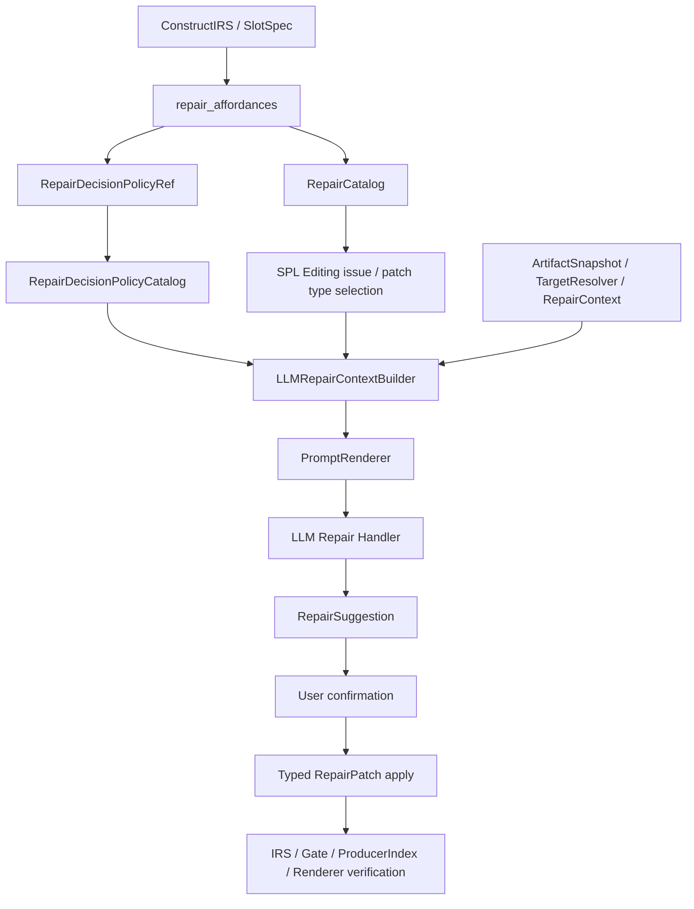

# SPL Editing Repair Decision Policy 架构设计

日期：2026-06-16  
状态：Draft design  
适用范围：NL2SPL IRS / RepairCatalog / SPL Editing LLM suggestion generation

---

## 0. 核心结论

SPL Editing 中 “LLM 应该生成什么样的 repair suggestion” 不能只靠 handler prompt 临时决定，也不能靠 demo-specific few-shot 引导。更稳定的设计是：

```text
IRS Construct / SlotSpec
  声明 missing slot 的合法修复策略空间与决策约束

RepairCatalog
  从 SlotSpec.repair_affordances 派生 runtime repair capability truth

LLM Repair Context
  收集当前 issue / target / snapshot / workflow / source facts
  并把 repair decision policy 投影成 prompt context

LLM Repair Handler
  基于 selected patch type + policy + context 生成一个最合适的 typed suggestion

Verifier
  通过 typed patch / user confirmation / compiler replay 验证修复
```

也就是说：

```text
IRS 不写 prompt，不调用 LLM，不生成 patch。
IRS 应声明这个 slot 缺失时允许哪些修复策略、何时适用、需要哪些上下文事实、哪些行为禁止。
```

这层结构化声明称为：

```text
Repair Decision Policy
```

它是 `repair_affordances` 的扩展语义，不是第二套 RepairCatalog，也不是 prompt 模板。

---

## 1. 背景问题

当前 `missing_handler` prompt 暴露了两个设计问题。

第一，prompt 中出现了高度贴合 demo case 的 few-shot：

```text
Example if condition is "Missing timeframe":
  REQUEST_INPUT: "Ask the user to provide the missing timeframe"
```

这会让 E2E 看起来更好，但本质上是把答案写进 prompt。它无法证明 LLM Context 层真的提供了足够事实，也会降低未来泛化能力。

第二，当前 “生成 3 条 suggestions” 更像 brainstorming，而 repair 场景通常不是 brainstorming。用户已经选中了 issue 和 patch type 后，后端需要的是：

```text
一个最符合上下文、最小、可验证、可应用的 repair suggestion
```

如果为了凑多样性生成 3 条，后续建议往往会为了不同而不同，甚至引入无根据默认值、错误上下文或不合语境的 action。

真正缺失的是一套稳定的、高层的、construct-slot-scoped repair decision policy：

```text
给定这个 missing slot，
哪些修复策略是合法的？
什么上下文下应优先选哪种策略？
LLM 需要哪些事实才能做出选择？
哪些输出是禁止的？
```

---

## 2. 设计目标

### 2.1 目标

1. 让 repair suggestion 的决策准则来自 construct / slot 语义，而不是 handler prompt 硬编码。
2. 让 `repair_affordances` 不只声明 patch type，还能声明修复策略空间和上下文需求。
3. 让 LLM 默认生成一个 best suggestion，而不是固定生成多条。
4. 让 PromptRenderer 渲染的是结构化 policy + 结构化 context，而不是 demo-specific examples。
5. 让新增 issue / patch type 时遵循统一范式：

```text
ConstructIRS SlotSpec
-> RepairAffordanceSpec
-> RepairDecisionPolicy
-> RepairCatalog
-> LLMRepairContext
-> typed RepairSuggestion
```

### 2.2 非目标

本设计不允许：

```text
1. IRS 调用 LLM。
2. IRS 生成 repair patch。
3. IRS 根据自然语言猜测具体 handler_text。
4. Prompt 直接包含 demo answer。
5. Presentation template 或 LLM prompt 声明 patch capability。
6. LLM suggestion 绕过 typed patch / user confirmation / compiler verification。
```

---

## 3. 总体架构



关键边界：

```text
RepairCatalog = repair capability truth source
RepairDecisionPolicyCatalog = repair selection guidance source
PromptRenderer = policy + context renderer
LLM = suggestion generator, not authority
Verifier = acceptance authority
```

---

## 4. Repair Decision Policy 的定位

Repair Decision Policy 不是 prompt。

它是一份结构化、可版本化、可测试的策略声明，用于回答：

```text
在某个 construct slot 缺失时，
如果用户选择了某个 patch type，
LLM 应如何根据上下文生成最合适的 suggestion？
```

它应包含：

```text
policy_id
version
owner construct type
owner slot name
diagnostic kind
affordance id
supported patch types
strategy families
selection rules
required context facts
optional context facts
forbidden assumptions
payload guidance
alternative generation policy
```

它不应包含：

```text
完整 prompt 文案
few-shot answer
handler class name
callable
LLM provider config
runtime capability decision
verification result
```

---

## 5. 与 IRS Construct / SlotSpec 的关系

### 5.1 SlotSpec 仍然拥有 slot 语义

IRS 的核心职责不变：

```text
Construct instance
-> slot satisfaction
-> ConstructSatisfactionReport
-> CompileDiagnostic
```

SlotSpec 仍负责定义：

```text
slot 是否 required
slot 由哪些 structured evidence 满足
missing 时投射什么 diagnostic kind
missing 是否有 repair affordance
```

### 5.2 RepairAffordanceSpec 增加 policy 引用

建议把 repair decision policy 作为 `RepairAffordanceSpec` 的声明式字段，而不是散落在 handler prompt 中。

概念结构：

```python
RepairAffordanceSpec(
    affordance_id="exception_flow.add_handler_step",
    supported_patch_types=("AddExceptionHandlerStep",),
    default_patch_type="AddExceptionHandlerStep",
    handler_id="missing_handler",
    context_id="exception_flow.handler_action",
    target_resolver_id="exception_flow_target",
    verification_lanes=("lane_a",),
    decision_policy_id="exception_flow.handler_action.missing_handler.v1",
    required_context_facts=(
        "exception_condition_text",
        "local_workflow",
        "selected_patch_type",
    ),
    optional_context_facts=(
        "source_excerpt",
        "available_variables",
        "nearby_steps",
        "user_instruction",
    ),
)
```

这让 RepairCatalog 能继续作为 capability truth source，同时让 LLM Context 知道应加载哪套 decision policy。

---

## 6. Policy 分层

Repair Decision Policy 应分三层组合，而不是每个 patch type 重写全部规则。

### 6.1 Global Repair Policy

所有 repair suggestion 共用：

```text
1. Prefer the smallest repair that resolves the selected issue.
2. Do not invent facts not present in structured context.
3. Prefer existing variables and construct identities when available.
4. Respect selected patch type.
5. Output typed patch payload only.
6. If required context is missing, produce low-confidence conservative output or block generation according to readiness.
7. Never patch rendered SPL text directly.
8. Never bypass user confirmation.
```

### 6.2 Issue-Family Policy

按 issue family 定义，例如：

```text
missing_handler
missing_output_producer
worker_delegation_contract_gap
```

Issue-family policy 负责说明：

```text
这个问题代表什么业务缺口
哪些策略家族适用
哪些上下文事实最关键
什么情况下应保守
```

### 6.3 Patch-Type Policy

按 patch type 补充 payload 层约束，例如：

```text
AddExceptionHandlerStep:
  choose one handler command type
  REQUEST_INPUT requires outputs
  DISPLAY_MESSAGE has no outputs
  handler_text must not include SPL keywords
```

Patch-type policy 不声明 patch type 是否可用；可用性只来自 RepairCatalog / PatchRegistry。

---

## 7. Policy Catalog

新增概念：

```text
RepairDecisionPolicyCatalog
```

职责：

```text
1. 根据 decision_policy_id 返回 policy。
2. 提供 global / family / patch-type policy composition。
3. 不访问 ArtifactSnapshot。
4. 不访问 LLM。
5. 不决定 patch type availability。
```

查找路径：

```text
RepairCatalogEntry
  -> decision_policy_id
  -> RepairDecisionPolicyCatalog.get(policy_id)
  -> composed policy facts
  -> LLMRepairContext.policy_facts
```

---

## 8. LLM Context 中的 Policy Facts

LLMRepairContext 应包含一组独立的 policy facts，而不是让 prompt handler 自己拼规则。

概念结构：

```python
RepairDecisionPolicyFacts(
    policy_id: str,
    policy_version: str,
    issue_family: str,
    strategy_families: tuple[StrategyFamily, ...],
    selection_rules: tuple[str, ...],
    forbidden_assumptions: tuple[str, ...],
    required_context_facts: tuple[str, ...],
    optional_context_facts: tuple[str, ...],
    selected_patch_type_rules: tuple[str, ...],
    alternative_policy: AlternativeGenerationPolicy,
)
```

PromptRenderer 固定渲染：

```text
## Repair Decision Policy
Goal:
Selection rules:
Forbidden assumptions:
Selected patch type rules:
Generation mode:
```

Prompt handler 不应再维护一份独立的 rules list。

---

## 9. Suggestion 数量策略

默认策略应从 “生成 N 条” 改为：

```text
generate_best
```

也就是：

```text
用户选择 issue
-> 用户选择 patch type
-> LLM 根据 policy + context 生成 1 个 best suggestion
-> 后端验证 schema / patch
-> 用户 confirm apply
```

只有在以下情况才生成 alternatives：

```text
1. 用户明确要求多个方案。
2. policy 声明该 slot 存在多个等价 strategy family。
3. UI 进入 compare alternatives mode。
```

Alternatives 也不应只是“不同文本”，而应有不同 rationale：

```text
Alternative A: request missing information
Alternative B: notify unrecoverable condition
Alternative C: deterministic fallback if explicitly supported
```

如果没有多个合法 rationale，就不应为了凑数生成多条。

---

## 10. Prompt 组成

按本设计，LLM prompt 应由以下部分组成：

```text
1. System boundary
   - role
   - typed patch only
   - no SPL text patching
   - no invented facts

2. Task
   - selected issue
   - selected patch type
   - generation mode: generate_best / generate_alternatives

3. Issue facts
   - what was detected
   - missing items
   - suggested_resolution as informational only

4. Target facts
   - construct type
   - slot name
   - human-readable target summary

5. Source / workflow facts
   - source excerpt
   - nearby steps
   - available variables

6. Repair decision policy
   - strategy families
   - selection rules
   - forbidden assumptions
   - selected patch type rules

7. Affordance-specific extension facts
   - e.g. exception condition text

8. JSON output schema
```

Prompt 不应包含 demo-specific few-shot answer。

---

## 11. Missing Handler 作为第一个实践案例

### 11.1 Construct / Slot

```text
Construct: EXCEPTION_FLOW
Slot: handler_action
Diagnostic kind: missing_handler
Affordance: exception_flow.add_handler_step
Supported patch type: AddExceptionHandlerStep
Decision policy id: exception_flow.handler_action.missing_handler.v1
```

### 11.2 语义

`EXCEPTION_FLOW.handler_action` 缺失表示：

```text
Compiler 已经 materialize 了一个 exception flow condition，
但没有任何 renderable action 说明触发该 exception 时应做什么。
```

用户可确认的修复应该为该 exception flow 增加一个 handler step。

### 11.3 Required Context Facts

```text
exception_condition_text
selected_patch_type
construct_type
slot_name
```

### 11.4 Optional Context Facts

```text
source_excerpt
nearby_steps
available_variables
parent_worker_purpose
user_instruction
previous_rejected_suggestions
```

### 11.5 Strategy Families

```text
ask_user_for_missing_input
deterministic_fallback_action
notify_unrecoverable_condition
```

### 11.6 Selection Rules

```text
1. If the exception condition indicates missing user-provided or business-required information,
   prefer REQUEST_INPUT.

2. If REQUEST_INPUT is selected, choose an output variable that corresponds to the missing information.
   Prefer an existing variable from available_variables when one clearly matches.

3. Use GENERAL_COMMAND only when context explicitly provides a deterministic fallback action or policy.
   Do not invent default values.

4. Use DISPLAY_MESSAGE when the exception cannot be recovered safely and the handler should only notify.

5. The handler must directly address exception_condition_text.

6. The handler must be minimal: one handler step unless policy or selected patch type explicitly allows more.

7. Do not include SPL keywords in handler_text. The renderer owns SPL syntax.
```

### 11.7 Patch-Type Rules: AddExceptionHandlerStep

```text
Patch type: AddExceptionHandlerStep

Payload:
  handler_text
  command_type
  inputs
  outputs

Rules:
  REQUEST_INPUT:
    - inputs must be empty
    - outputs must contain at least one variable
    - handler_text should ask for the missing information

  GENERAL_COMMAND:
    - may use inputs and outputs
    - must describe a deterministic action backed by context

  DISPLAY_MESSAGE:
    - inputs must be empty
    - outputs must be empty
    - handler_text should notify the user of the condition
```

### 11.8 Example Policy Rendering

For condition:

```text
Missing timeframe
```

and available variable:

```text
timeframe
```

the prompt should not contain:

```text
Example if condition is "Missing timeframe":
  REQUEST_INPUT: "Ask the user to provide the missing timeframe"
```

Instead it should contain:

```text
## Repair Decision Policy
Strategy families:
- ask_user_for_missing_input
- deterministic_fallback_action
- notify_unrecoverable_condition

Selection rules:
- If the exception condition indicates missing user-provided or business-required information, prefer REQUEST_INPUT.
- Prefer an existing variable from Available variables when it clearly matches the missing information.
- Do not invent default values.

Selected patch type rules:
- REQUEST_INPUT must have no inputs and at least one output.
- DISPLAY_MESSAGE must have no inputs and no outputs.
- handler_text must be plain natural-language content, not SPL syntax.
```

Then LLM can infer:

```json
{
  "patch_type": "AddExceptionHandlerStep",
  "title": "Ask for the missing timeframe",
  "explanation": "Adds a handler that asks the user to provide the timeframe required by the exception condition.",
  "payload": {
    "handler_text": "Ask the user to provide the missing timeframe.",
    "command_type": "REQUEST_INPUT",
    "inputs": [],
    "outputs": ["timeframe"]
  }
}
```

The answer is now derived from policy + context, not from a demo answer embedded in prompt.

---

## 12. Anti-Patterns

### 12.1 Prompt answer library

Bad:

```text
Example if condition is "Missing timeframe": ask user for timeframe.
```

Reason:

```text
This teaches the exact demo answer instead of encoding general repair policy.
```

### 12.2 Handler-owned repair strategy

Bad:

```text
missing_handler/prompt.py decides when REQUEST_INPUT vs DISPLAY_MESSAGE is appropriate.
```

Reason:

```text
Strategy belongs to construct-slot-scoped repair policy.
Handler should render and validate, not own semantic strategy.
```

### 12.3 Multi-suggestion by default

Bad:

```text
Always generate 3 suggestions.
```

Reason:

```text
Repair is not brainstorming.
Default should be one best suggestion.
```

### 12.4 Policy declares capability

Bad:

```text
Decision policy says AddExceptionHandlerStep is available.
```

Reason:

```text
RepairCatalog / PatchRegistry own availability.
Policy only guides selection within already available capability.
```

---

## 13. Migration Direction

Suggested migration sequence:

```text
1. Define RepairDecisionPolicy schema and catalog.
2. Extend RepairAffordanceSpec with decision_policy_id and context fact declarations.
3. Add missing_handler policy:
   exception_flow.handler_action.missing_handler.v1
4. Add LLMRepairContext.policy_facts.
5. Update PromptRenderer to render policy facts.
6. Remove demo-specific few-shot from missing_handler prompt.
7. Change default suggestion mode from generate_many to generate_best.
8. Keep alternatives mode explicit and user-triggered.
9. Add tests proving Missing timeframe is solved from policy + context, not prompt examples.
```

---

## 14. Acceptance Criteria

This architecture is considered valid when:

```text
1. No handler prompt contains demo-specific answers.
2. RepairCatalog remains the only repair capability truth source.
3. RepairDecisionPolicy only provides selection guidance, not availability.
4. LLMRepairContext contains policy_facts from decision_policy_id.
5. missing_handler can generate a correct AddExceptionHandlerStep using:
   exception_condition_text + available_variables + policy rules.
6. Default generation returns one best suggestion.
7. Multiple suggestions are generated only in explicit alternatives mode.
8. Typed patch validation and compiler verification remain mandatory.
```

---

## 15. Final Summary

Repair decision policy should become part of the IRS repair affordance contract, but only as structured, declarative metadata.

```text
IRS owns the slot semantics and legal repair strategy space.
RepairCatalog owns capability.
LLM Context owns runtime facts.
PromptRenderer owns rendering.
LLM owns suggestion generation.
Verifier owns acceptance.
```

`missing_handler` is the first practice case:

```text
EXCEPTION_FLOW.handler_action
-> missing_handler
-> exception_flow.add_handler_step
-> AddExceptionHandlerStep
-> exception_flow.handler_action.missing_handler.v1
```

This removes prompt overfitting while giving the LLM enough general, reusable guidance to produce the most appropriate repair suggestion for the current SPL issue.
