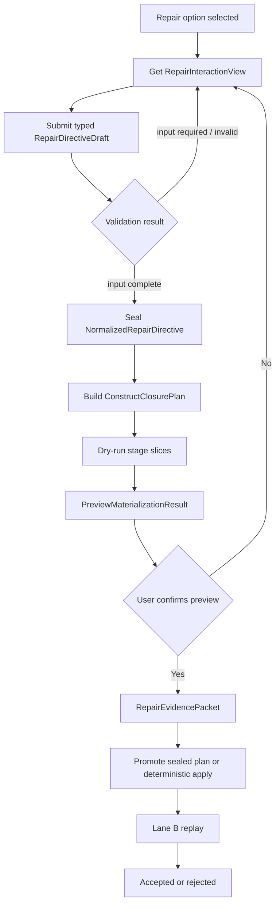

# SPL Editing Worker Delegation Repair Interaction 与 Construct Closure 详细设计

日期：2026-07-01  
状态：设计基线（Proposed）  
适用范围：`WORKER_PROMOTION`、SPL Editing Presentation、Repair Strategy、Repair Directive、Worker Closure Materialization、CLI/UI  
前置设计：R0-R11 Materialization、R12+ Construct-level Repair Strategy、Preview/Apply Lifecycle

关联文档：

- [`spl_editing_construct_level_repair_strategy_and_stage_slice_design.md`](spl_editing_construct_level_repair_strategy_and_stage_slice_design.md)
- [`../problem/worker_delegation_repair_interaction_contract_gap.md`](../problem/worker_delegation_repair_interaction_contract_gap.md)
- [`../problem/spl_editing_issue_presentation_fact_projection_gap.md`](../problem/spl_editing_issue_presentation_fact_projection_gap.md)

---

## 1. 设计结论

当前 `WORKER_PROMOTION` repair flow 不能继续把以下三件事混在同一层：

```text
repair strategy option selection
authoring-time required input collection
runtime REQUEST_INPUT generation
```

正式架构必须增加：

```text
RepairStrategyOptionSpec
+ backend-owned Repair Interaction Contract
+ capability availability / input readiness 正交状态
+ RepairDirectiveDraft validation and normalization
+ new fact admission
+ construct closure planning
+ Lane B preview/apply/replay
```

`WORKER_PROMOTION` 对普通用户只提供两个结果选项：

```text
1. Define this work as a child worker
2. Keep this work in the main workflow
```

`ConvertDelegationIntentToRequestInput` 不再由
`worker_promotion.resolve_contract` 暴露，但不从系统全局删除。它只能由真实语义为“最终
workflow 运行时需要业务输入”的 IRS slot 使用。

两个 Worker Delegation 选项都写入 pre-normalize worker-scoped artifacts，因此都必须使用
Lane B。Lane A 不能用于当前实现。

---

## 2. 当前实现偏差

### 2.1 Issue subject 缺失

当前默认标题固定为：

```text
Worker delegation is underspecified
```

Presentation 没有投影当前 delegation candidate 的结构化 subject，用户不知道问题对应什么
任务，也不知道是否已经存在 concrete child worker。

当前 demo 的 source-backed intent 是：

```text
Optional delegated subtasks such as source gathering or template matching may be
used if bounded and the returned evidence is normalized into approved evidence
carriers.
```

该文本已经表达 delegation intent，但具体 task boundary、child worker contract、invocation
和 result handoff 尚不完整。

### 2.2 Patch metadata 承担了用户选项语义

当前 `RepairAffordanceSpec.patch_type_metadata` 直接提供三个用户选项的 label、description
和 lane。这使 transitional patch adapter 重新成为用户语义来源，与 R12+ 的
`repair_strategy_id` authority 冲突。

### 2.3 `Ask user for missing information` 语义错误

该选项实际生成最终 SPL 的 `REQUEST_INPUT`，让未来 runtime user 提供业务值。它不能补齐
编译期 child worker contract，也不能代表当前 authoring user 的澄清交互。

### 2.4 Main-flow option 的 Lane A 配置错误

当前 `ConvertDelegationIntentToMainFlowStep` 修改 pre-normalize `WorkerStepPlanIR`，必须经过
Stage 9.5 normalization、Stage 10 assembly 和 Stage 11 rendering，因此必须使用 Lane B。

### 2.5 Capability 与真实前置条件不一致

当前 `CreateWorkerHandoffContract` materializer 要求 child worker 已存在；handler 在没有
`derived_child_worker_id` 时也不会生成该 suggestion。但 Presentation 仍可能把该 option
显示为 available。

这说明：

```text
presentation availability
!= runtime executable capability
```

正式设计必须消除该假阳性。

---

## 3. 目标

本设计必须达到：

1. 用户在 issue list/detail 中能看到 source-backed delegated responsibility。
2. 用户选择的是 construct-level strategy option，不是 patch type。
3. 每个 option 的输入模式由后端声明，CLI/UI 不做语义推断。
4. capability availability 与 input readiness 独立建模。
5. 必填输入缺失时阻止 suggestion 和 preview，不让 LLM补造。
6. 已有变量/construct 只能通过 `SelectableRefSet` stable refs 选择。
7. 新 child output 等新事实通过独立 admission contract 创建。
8. `additional_instruction` 只能表达偏好，不能成为结构化事实来源。
9. Define-child-worker 生成完整 child worker closure，不只是 handoff。
10. Keep-main-flow 根据 task identity concreteness 动态决定是否需要结构化输入。
11. preview 与 apply 使用同一个 sealed normalized directive 和 closure plan。
12. 两条路径都执行 Lane B compiler-authority verification。

---

## 4. 非目标

本设计不负责：

1. 全局删除 `ConvertDelegationIntentToRequestInput`。
2. 把所有 issue family 一次性迁移到 interaction contract。
3. 让前端理解 IRS、patch type、stage slice 或 verification lane。
4. 允许用户通过自由文本直接编写 SPL、IR 或变量 binding。
5. 伪造 SpanIR、FieldRouteIR 或 compile hints 来重跑完整 Pipeline stage。
6. 让 IRS 执行 repair、调用 LLM、创建 directive 或 materialize construct。
7. 将所有 source-backed delegation intent 自动变成 child worker。

---

## 5. Authority 模型

| 关注点 | 唯一 authority |
|---|---|
| Slot 是否缺失 | ConstructIRS / IRS checker |
| Slot 是否允许用户修复 | `RepairAffordanceSpec` |
| Repair 的 construct-level 语义 | `RepairStrategySpec` |
| 用户可选结果 | `RepairStrategyOptionSpec` |
| Option 当前是否可执行 | RepairCatalog + runtime capability resolver |
| Option 如何收集输入 | Repair Interaction Contract |
| 当前输入是否完整合法 | Directive validator / normalizer |
| 已有 ref 是否可消费 | `SelectableRefSet` + ref resolver |
| 新事实是否可进入编译状态 | New Fact Admission Service |
| 需要生成哪些 constructs | `ConstructClosurePlan` |
| 由哪些 stage slices 写入 | `MaterializationPlan` |
| Verification lane | Materialization write layers / verification plan |
| Preview 是否与 apply 一致 | Preview seal + hash validation |
| 最终是否 accepted | Compiler-authority verification |

### 5.1 硬边界

```text
Interaction contract MUST NOT declare repair capability.
RepairCatalog MUST NOT define form fields.
Patch type MUST NOT define user-visible strategy semantics.
User input MUST NOT choose verification lane.
Additional instruction MUST NOT satisfy structured fields.
LLM MUST NOT create refs, symbols, IR, strategy options, or evidence authority.
```

---

## 6. 核心状态轴

### 6.1 Capability availability

`RepairOptionAvailability` 回答：后端是否具备执行该 option 的能力。

沿用现有细粒度 unavailable reason，例如：

```text
available
unavailable_snapshot_capability
unavailable_missing_handler
unavailable_missing_target_resolver
unavailable_missing_context_builder
unavailable_unsupported_patch_type
review_only
```

不得为了 interaction contract 再建立一个粗粒度、冲突的 availability enum。

### 6.2 Input readiness

`RepairInputReadiness` 回答：当前 option 的 authoring input 是否完整。

```python
RepairInputReadiness = Literal[
    "not_required",
    "input_required",
    "input_complete",
    "input_invalid",
    "not_evaluated",
]
```

`not_evaluated` 只用于 option capability 当前不可用、因此输入完整性尚未评价的场景。它
不能用于掩盖缺字段、非法 ref 或 contract mismatch；这些情况必须分别返回
`input_required` 或 `input_invalid`。

### 6.3 正交不变式

```text
can_fix = exists(option.availability == available)
```

不是：

```text
can_fix = exists(option.available and input_complete)
```

合法组合包括：

```text
available + input_required
available + input_complete
available + not_required
unavailable_* + not_evaluated
```

输入未完成不能让 option 从界面消失；用户必须能够进入输入流程。

---

## 7. Issue Subject Projection

### 7.1 目的

Issue list 必须先回答“哪个任务或 construct 有问题”，不能只显示 category-level copy。

新增统一 DTO：

```python
@dataclass(frozen=True)
class IssueSubjectView:
    subject_kind: Literal[
        "construct",
        "delegated_task_candidate",
        "worker",
        "output",
        "exception_condition",
        "api",
        "unknown",
    ]
    display_name: str | None
    summary: str | None
    specificity: Literal["concrete", "candidate", "ambiguous", "unknown"]
    source_excerpt: str | None
    source_ref_ids: tuple[str, ...]
    internal_ref: str | None = None
```

`internal_ref` 默认不进入普通 UI，仅供 Advanced Details 和 audit 使用。

### 7.2 Worker Delegation facts 来源优先级

```text
1. Existing CHILD_WORKER / WorkerPlanIR identity and purpose
2. Structured worker candidate task summary
3. TargetResolverResult + source-backed candidate facts
4. Source span excerpt as display context
5. Generic degraded subject
```

禁止从以下来源提取 primary subject：

```text
CompileDiagnostic.message
feedback_report.md
AI issue explanation
rendered SPL text
compiler id string prettification
```

### 7.3 当前案例

当前 `worker_promotion:del_s31` 应投影为 candidate，而不是 concrete worker：

```text
subject_kind = delegated_task_candidate
specificity = ambiguous
summary = source gathering or template matching
source_ref_ids = (s31,)
```

默认展示示例：

```text
Potential child-worker responsibility is incomplete:
source gathering or template matching

The intent to delegate is present, but the task boundary, inputs, outputs,
invocation timing, and result handoff are incomplete.
```

不得展示 `del_s31`。

---

## 8. Repair Strategy 与 Option 模型

### 8.1 RepairStrategySpec 扩展

当前 `RepairStrategySpec.supported_patch_types` 是 strategy 级 transitional adapter 列表。
正式模型增加 option 列表：

```python
@dataclass(frozen=True)
class RepairStrategySpec:
    strategy_id: str
    target_construct_type: str
    target_slot_name: str
    diagnostic_kind: str
    missing_construct_closure: tuple[str, ...]
    options: tuple[RepairStrategyOptionSpec, ...]
    default_policy_id: str
    directive_policy_id: str
    stage_slice_chain: tuple[str, ...]
    verification_lane: Literal["B"]
    selectable_ref_policy_id: str | None
    required_context_facts: tuple[str, ...]
```

### 8.2 RepairStrategyOptionSpec

```python
@dataclass(frozen=True)
class RepairStrategyOptionSpec:
    option_id: str
    strategy_id: str
    label_key: str
    description_key: str
    interaction_contract_id: str
    execution_patch_types: tuple[str, ...]
    closure_policy_id: str
    user_facing: bool = True
```

规则：

1. `option_id` 在同一 strategy 内唯一且稳定。
2. 用户语义来自 option spec，不来自 patch metadata。
3. `execution_patch_types` 只是 legacy adapter linkage。
4. Option spec 不注册 handler/applier/verifier，也不决定 runtime availability。
5. Verification lane 不接受 option/user override；它由 strategy 和 materialization write
   layers 约束，当前统一为 Lane B。

### 8.3 Worker Delegation options

```python
RepairStrategyOptionSpec(
    option_id="define_child_worker",
    strategy_id="worker_delegation.complete_closure.v2",
    label_key="worker_delegation.define_child_worker.label",
    description_key="worker_delegation.define_child_worker.description",
    interaction_contract_id="worker_delegation.define_child_worker.v1",
    execution_patch_types=("DefineChildWorkerClosure",),
    closure_policy_id="worker_delegation.define_child_worker_closure.v1",
)

RepairStrategyOptionSpec(
    option_id="keep_in_main_flow",
    strategy_id="worker_delegation.complete_closure.v2",
    label_key="worker_delegation.keep_in_main_flow.label",
    description_key="worker_delegation.keep_in_main_flow.description",
    interaction_contract_id="worker_delegation.keep_in_main_flow.v1",
    execution_patch_types=("ConvertDelegationIntentToMainFlowStep",),
    closure_policy_id="worker_delegation.main_flow_closure.v1",
)
```

`CreateWorkerHandoffContract` 继续作为“existing child worker，仅补 handoff”场景的内部 adapter；
它不能代表 `define_child_worker` 的完整语义。

---

## 9. Presentation DTO

### 9.1 RepairOptionView

```python
@dataclass(frozen=True)
class RepairOptionView:
    option_id: str
    strategy_id: str
    label: str
    description: str
    availability: RepairOptionAvailability
    interaction_summary: str | None
    unavailable_reason: str | None = None
    patch_types: tuple[str, ...] = ()       # Advanced/transition only
    verification_lane: str = ""            # Display/audit only
```

`display_id` 或数组 index 只用于当前屏幕展示，不是 API identity。

### 9.2 RepairInteractionView

```python
@dataclass(frozen=True)
class RepairInteractionView:
    option_id: str
    strategy_id: str
    contract_id: str
    contract_version: str
    interaction_kind: Literal[
        "none",
        "natural_language",
        "structured",
        "structured_with_notes",
    ]
    fields: tuple[RepairInputFieldView, ...]
    schemas: tuple[RepairInputSchemaView, ...]
    additional_instruction: RepairInputFieldView | None
    input_readiness: RepairInputReadiness
    validation_errors: tuple[RepairInputValidationError, ...] = ()
    revision_token: str = ""
```

### 9.3 RepairInputFieldView

```python
@dataclass(frozen=True)
class RepairInputFieldView:
    field_id: str
    label: str
    description: str | None
    input_type: Literal[
        "short_text",
        "long_text",
        "single_choice",
        "multi_choice",
        "reference_select",
        "new_fact_list",
        "structured_object",
    ]
    required: bool
    options: tuple[RepairInputOptionView, ...] = ()
    ref_role: str | None = None
    object_schema_id: str | None = None
    fact_schema_id: str | None = None
    empty_policy: Literal[
        "not_allowed",
        "explicit_none_allowed",
        "not_applicable_allowed",
    ] = "not_allowed"
```

复合值 schema 随 interaction DTO 一起返回：

```python
@dataclass(frozen=True)
class RepairInputSchemaView:
    schema_id: str
    schema_kind: Literal["structured_object", "new_fact"]
    fields: tuple[RepairInputFieldView, ...]
```

Schema 必须是有限、无环、版本化的 presentation contract。每个 `object_schema_id` 或
`fact_schema_id` 必须在同一个 `RepairInteractionView.schemas` 中恰好解析一次；前端不得从
schema id 猜字段，也不需要 import 后端 Python 类型。

Presentation DTO 不携带 raw runtime service object，也不决定 capability。

Schema linkage 规则：

```text
structured_object:
  object_schema_id 必填；fact_schema_id 必须为空。

new_fact_list:
  fact_schema_id 必填；object_schema_id 必须为空。

其他 input_type:
  object_schema_id / fact_schema_id 必须为空。
```

例如：

```text
returned_results:
  input_type = new_fact_list
  fact_schema_id = worker_delegation.new_child_output.v1

result_usage:
  input_type = structured_object
  object_schema_id = worker_delegation.result_usage.v1
```

CLI/UI 根据 schema id 获取后端声明的字段结构，不需要 import Python domain types，也不能
把复合对象降级为任意 JSON 字典后直接传给 materialization。

---

## 10. Interaction Contract 的静态定义与动态实例化

### 10.1 静态 contract

静态 contract 描述字段语义和约束：

```python
@dataclass(frozen=True)
class RepairInteractionContractSpec:
    contract_id: str
    contract_version: str
    interaction_kind: str
    field_specs: tuple[RepairInputFieldSpec, ...]
    additional_instruction_policy: str
    provider_id: str
    normalizer_id: str
```

它不能声明：

```text
supported patch types
handler/applier/verifier
verification lane
stage authority
option availability
```

### 10.2 动态 provider

动态 provider 消费：

```text
RepairStrategyOptionSpec
IssueSubjectView
TargetResolverResult
ArtifactSnapshot
RepairContext
SelectableRefSet
current RepairDirectiveDraft (optional)
```

输出 `RepairInteractionView`。

动态 provider 可以：

```text
预填 source-backed responsibility
列出合法 input refs
列出 candidate task boundaries
根据 subject concreteness 决定 required fields
计算 input readiness
返回字段级 validation errors
```

动态 provider 不可以：

```text
新增 repair option
把 unavailable option 变成 available
选择 patch type
生成 IR
分配 evidence authority
```

---

## 11. Worker Delegation Interaction Contract

### 11.1 `define_child_worker`

默认：

```text
interaction_kind = structured_with_notes
input_readiness = input_required
```

字段：

| Field | Type | Required | Authority |
|---|---|---:|---|
| `delegated_responsibility` | long_text / single_choice / multi_choice | yes | source-backed prefill + user confirmation |
| `input_refs` | reference_select (multi) | conditional | SelectableRefSet |
| `input_empty_semantics` | single_choice | conditional | user-confirmed business fact |
| `returned_results` | new_fact_list | yes unless explicit side-effect-only | new fact admission |
| `invocation_timing` | single_choice | yes | stage policy options |
| `placement_ref` | reference_select | conditional | SelectableRefSet |
| `result_usage` | structured_object | required when results exist | selected refs + admitted outputs |
| `additional_instruction` | long_text | no | preference only |

`delegated_responsibility` 的具体 input type 由动态 provider 决定：单一 concrete candidate
可使用预填 `long_text`；多个互斥候选使用 `single_choice`；允许组合的多个 source-backed
candidate 使用 `multi_choice`。Normalizer 最终必须产出统一的 typed responsibility 对象。

### 11.2 Empty semantics

不得使用一个通用 `known_empty` 覆盖所有字段。

```text
input_refs:
  explicit_none 可在 child worker 不依赖 parent state 时允许。

returned_results:
  默认至少一个；只有用户明确选择 side_effect_only，且 strategy policy 允许时可为空。

result_usage:
  有 returned results 时必须存在；side_effect_only 时为 not_applicable。
```

### 11.3 `keep_in_main_flow`

其 interaction 必须动态实例化：

```text
if subject.specificity == concrete:
    interaction_kind = natural_language
    input_readiness = not_required
else:
    interaction_kind = structured_with_notes
    input_readiness = input_required
```

当前例子至少需要：

```text
task_selection:
  - source gathering
  - template matching
  - both
  - define another source-backed boundary
```

只有选择并验证 task boundary 后，才允许生成 main-flow preview。

---

## 12. RepairDirectiveDraft 与 Wire Contract

### 12.1 API wire request

HTTP/CLI adapter 可以接收 JSON-compatible mapping：

```python
@dataclass(frozen=True)
class SubmitRepairDirectiveDraftRequest:
    run_id: str
    issue_id: str
    strategy_id: str
    option_id: str
    contract_id: str
    contract_version: str
    revision_token: str
    field_values: Mapping[str, JsonValue]
    selected_ref_ids: Mapping[str, tuple[str, ...]]
    new_fact_declarations: tuple[JsonObject, ...]
    additional_instruction: str | None
```

该对象只存在于 transport boundary。

### 12.2 Domain draft

Transport parsing 后必须立即转换为 typed domain objects：

```python
@dataclass(frozen=True)
class WorkerDelegationDirectiveDraft:
    draft_id: str
    issue_id: str
    strategy_id: str
    option_id: str
    contract_id: str
    contract_version: str
    base_revision: RevisionToken
    delegated_responsibility: DelegatedResponsibilityDraft | None
    selected_input_ref_ids: tuple[str, ...]
    input_empty_semantics: str | None
    returned_results: tuple[NewOutputDeclarationDraft, ...]
    invocation_timing: InvocationTimingDraft | None
    placement_ref_id: str | None
    result_usage: tuple[ResultUsageDraft, ...]
    additional_instruction: str | None
```

通用 `dict[str, Any]` 不得进入 normalizer、closure planner 或 materializer。

---

## 13. New Fact Admission

### 13.1 为什么需要 admission

`SelectableRefSet` 只能选择已有 refs。新 child output、用户新定义的 responsibility 或新的
business result 不存在于 snapshot，不能伪装成 selectable ref。

### 13.2 新 output draft

```python
@dataclass(frozen=True)
class NewOutputDeclarationDraft:
    local_id: str
    display_name: str
    semantic_description: str
    data_type_hint: str | None = None
```

### 13.3 Admitted output

```python
@dataclass(frozen=True)
class AdmittedOutputDeclaration:
    output_id: str
    canonical_name: str
    display_name: str
    semantic_description: str
    data_type: str | None
    evidence_ref: str
```

### 13.4 Admission Service 职责

```text
name normalization
reserved-name rejection
symbol conflict check
scope validation
data type admissibility
stable ID allocation
output contract demand creation
provisional evidence linkage
preview/apply identity stability
```

Preview 阶段分配 deterministic provisional ID；apply 只能 promote 同一 admitted fact，不能
重新生成不同 ID。

### 13.5 限制

MVP 只允许声明 child output。若 child 需要一个 parent scope 中不存在的新输入变量，应阻止
generation，并由未来独立的 input/resource admission contract 处理。

MVP 的 `result_usage` 进一步收紧为：

```text
1. 绑定到已有 parent scope ref；或
2. 将 admitted child output 绑定到 materializer 创建的 parent-local temporary result。
```

MVP 不允许在同一次 Worker Delegation repair 中新增 parent required output。该行为会引入
额外的 output admission、ProducerIndex、required-output IRS 和 renderer contract，必须由
独立设计扩展。Parent-local temporary result 不是 required output，必须具备受控 scope、稳定
ID、evidence linkage，并且只能服务于本次 handoff result binding。

---

## 14. Directive Validation 与 Normalization

### 14.1 Validation 顺序

```text
1. resolve run / issue / strategy / option
2. verify revision token
3. verify option availability == available
4. verify contract id/version matches option spec
5. parse typed draft
6. validate required fields
7. validate selected refs and ref roles
8. validate empty semantics
9. admit new facts
10. validate result usage against admitted outputs
11. validate additional instruction boundary
12. produce NormalizedRepairDirective
```

### 14.2 Normalized directive

```python
@dataclass(frozen=True)
class NormalizedWorkerDelegationDirective:
    directive_id: str
    strategy_id: str
    option_id: str
    target_ref: str
    base_revision: RevisionToken
    delegated_responsibility: str
    selected_input_refs: tuple[ResolvedSelectableRef, ...]
    admitted_outputs: tuple[AdmittedOutputDeclaration, ...]
    invocation_timing: NormalizedInvocationTiming
    placement_ref: ResolvedSelectableRef | None
    result_usage: tuple[NormalizedResultUsage, ...]
    additional_instruction: str | None
    input_contract_hash: str
    verification_lane: Literal["B"]
```

`verification_lane` 是后端从 strategy/materialization write layers 派生的只读审计字段。Draft
和用户输入中不存在 lane 字段。

### 14.3 失败结果

```python
@dataclass(frozen=True)
class RepairDirectiveValidationResult:
    input_readiness: RepairInputReadiness
    normalized_directive_id: str | None
    errors: tuple[RepairInputValidationError, ...]
```

典型错误码：

```text
stale_revision
unknown_option_id
option_unavailable
interaction_contract_mismatch
interaction_contract_version_mismatch
required_field_missing
invalid_ref_id
invalid_ref_role
new_fact_conflict
invalid_empty_semantics
missing_result_usage
instruction_conflicts_with_structured_input
```

---

## 15. Additional Instruction 权限

### 15.1 硬规则

```text
additional_instruction MUST NOT:
- satisfy required structured fields;
- add or replace selected refs;
- declare new symbols;
- change strategy or option;
- select execution patch type;
- override invocation placement;
- alter admitted output identity;
- weaken stage authority or verification requirements.
```

### 15.2 冲突处理

以下层级只表示 authority，不表示可以静默覆盖：

```text
structured fields
> admitted facts
> additional instruction
```

任何可检测冲突都返回 `input_invalid`。对于无法在文本层可靠判定的语义冲突，stage-owned
LLM 仍只能生成 typed plan；typed plan 若与 normalized directive 不一致，plan validator 必须
拒绝，不能自行选择一方。

---

## 16. Construct Closure

### 16.1 DefineChildWorkerClosure

该 option 需要新的 construct-level closure，不能由
`CreateWorkerHandoffContract` 单独承担。

```text
ensure/materialize CHILD_WORKER identity and purpose
materialize child input/output contract
materialize worker-scoped FLOW
ensure/materialize worker-scoped BLOCK
materialize child COMMAND closure
materialize WORKER_HANDOFF
ensure invocation placement BLOCK in parent
materialize/bind INVOKE_WORKER
bind parent result usage
normalize worker graph and bindings
assemble/render child and parent workers
```

建议 stage-slice chain：

```text
Stage 3.5 DefineChildWorkerBoundaryRepairSlice
Stage 4 ChildWorkerFlowRepairSlice
Stage 5 ChildWorkerBlockRepairSlice
Stage 7 ChildWorkerCommandRepairSlice
Stage 3.5 WorkerHandoffContractRepairSlice
Stage 5 ParentInvocationPlacementRepairSlice (when needed)
Stage 7 WorkerInvokeCommandRepairSlice
Stage 9.5 normalizer replay
Stage 10 assembly replay
Stage 11 rendering replay
```

Stage 9.5/10/11 是 replay authority，不是 strategy generator。

### 16.1.1 MVP 最小 Child Command Policy

`DefineChildWorkerClosure` 的 MVP 必须冻结为最小、可审计的 child command policy：

```text
1. Child worker 至少生成一个 user-confirmed repair command。
2. Command action_text 必须来自 normalized delegated_responsibility。
3. Command outputs 必须覆盖全部 admitted child outputs。
4. 只有 side_effect_only 被 strategy policy 明确允许并由用户确认时，outputs 才可为空。
5. LLM 不得额外拆出多个未被 directive/typed plan 覆盖的 commands。
6. 若一个 command 无法表达已确认责任，generation 必须失败；MVP 不自动扩写多步骤流程。
```

该默认策略是 MVP materialization policy，不是永久 construct-level strategy 定义。未来允许
多 command/block 之前，必须新增 typed plan schema、preview 展示和逐项 verification。

### 16.2 KeepInMainFlowClosure

```text
resolve source-backed task boundary
ensure/bind main-flow placement BLOCK
materialize main-flow COMMAND closure
mark promotion candidate resolved as main-flow work
normalize worker-scoped step/block plan
assemble/render MainWorker
```

建议 stage-slice chain：

```text
Stage 5 MainFlowPlacementRepairSlice (conditional)
Stage 7 DelegationResolutionCommandRepairSlice
Stage 9.5 normalizer replay
Stage 10 assembly replay
Stage 11 rendering replay
```

该路径同样是 Lane B。

### 16.3 Stage slice LLM 边界

Stage slice 可以调用 LLM 生成 slice-local typed plan，例如：

```text
ChildWorkerFlowPlan
BlockShapePlan
CommandIntentPlan
```

LLM 不得输出：

```text
WorkerIR
WorkerHandoffIR
BlockIR
StepIR
raw variable names
unadmitted outputs
verification lane
```

---

## 17. Preview、Confirmation 与 Apply

### 17.1 生命周期



### 17.2 Preview seal

Preview 至少记录：

```text
preview_id
base_snapshot_id / overlay_version
strategy_id / option_id
interaction_contract_hash
normalized_directive_hash
admitted_fact_hashes
construct_closure_plan_hash
slice_typed_plan_hashes
preview_construct_hash
LLM generation config hash (when applicable)
```

### 17.3 Apply 一致性

Apply 必须：

```text
promote preview 已验证的 typed plans；
或在确定性配置下重建并要求 hashes 完全一致。
```

否则返回 stale preview，不得 apply。

### 17.4 用户确认视图

普通用户只确认结果：

```text
Child worker responsibility
Inputs it receives
Results it returns
When it runs
How the main workflow uses the result
Rendered SPL preview
```

以下内容只进入 Advanced Details/audit：

```text
strategy_id
option_id
stage slices
closure plan id
verification lane
selected ref IDs
evidence packet id
```

---

## 18. Service API

### 18.1 获取 interaction

```python
get_repair_interaction(
    run_id: str,
    issue_id: str,
    option_id: str,
    revision_token: str,
) -> RepairInteractionView
```

要求：

```text
option_id 是稳定 identity；
display index 不得进入 service API；
后端重新核验 option availability；
返回动态字段/options/readiness；
不创建 session 或 suggestion。
```

### 18.2 提交 draft

```python
submit_repair_directive_draft(
    request: SubmitRepairDirectiveDraftRequest,
) -> RepairDirectiveValidationResult
```

### 18.3 生成 preview

```python
preview_repair_directive(
    run_id: str,
    issue_id: str,
    option_id: str,
    normalized_directive_id: str,
    revision_token: str,
) -> PreviewMaterializationResult
```

### 18.4 Apply

```python
apply_preview_result(
    preview_id: str,
    confirmation: UserConfirmation,
) -> VerificationResult
```

旧的 `generate_suggestions_for_option(..., option_index, user_instruction)` 只能在迁移期作为
adapter；新 Worker Delegation 路径不得继续使用 index + free text 作为 authority。

---

## 19. CLI/UI 行为

### 19.1 Issue list

```text
[1] Potential child-worker responsibility is incomplete:
    source gathering or template matching
    Missing: task boundary, input contract, output contract,
             invocation point, result handoff
```

### 19.2 Option list

```text
[1] Define this work as a child worker
    Provide the task boundary, information it receives, results it returns,
    when it runs, and how the main workflow uses the result.

[2] Keep this work in the main workflow
    Complete the selected task directly in the main workflow.
```

### 19.3 Dynamic input

CLI/UI 只遍历 `RepairInputFieldView`：

```text
short_text / long_text -> text input
single_choice          -> menu/radio
multi_choice           -> multi-select
reference_select       -> backend-provided ref choices
new_fact_list          -> repeated structured rows
```

禁止：

```text
if issue.kind == type_or_contract_ambiguity
if patch_type == CreateWorkerHandoffContract
if construct_type == WORKER_PROMOTION
```

### 19.4 AI explanation

AI explanation 只能消费：

```text
IssueSubjectView
missing slot labels
RepairOptionView
RepairInteractionView.interaction_summary
```

不得重新判断 target identity、option availability 或 required fields。

---

## 20. Verification Contract

### 20.1 通用验证

```text
revision and preview hashes match
strategy/option/contract linkage matches
all consumed refs belong to confirmed SelectableRefSet
all new facts are admitted and evidence-linked
all changed artifacts carry user_confirmed_repair evidence
materialization authority matches declared stage slices
no undefined refs or symbol conflicts
no new blocking diagnostics
target diagnostic group resolved
provenance trace is not assumed
```

### 20.2 Define child worker

```text
child worker identity is unique
child purpose matches normalized directive
child input contract matches selected refs/empty semantics
child output contract matches admitted outputs
child flow/block/command closure is renderable
handoff parent/child identities match
input/output bindings are complete and directionally valid
INVOKE_WORKER exists in parent at verified placement
parent result bindings match admitted outputs/result usage
Gate retains child and invocation
IRS marks relevant slots satisfied
Renderer includes child worker and invocation
```

### 20.3 Keep in main flow

```text
selected task boundary is source-backed or user-confirmed
main-flow command is in the parent WorkerStepPlanIR
no orphan handoff or invocation is introduced
promotion candidate is resolved as main-flow work
Gate retains command
IRS target group is resolved
Renderer shows command in MainWorker
```

### 20.4 禁止的 accepted 结果

```text
REQUEST_INPUT used to mask worker contract gaps
empty child worker
child worker with invented refs
handoff without invoke step
invoke step without valid handoff
result output without parent usage/binding
preview/apply drift
Lane A acceptance for these two options
```

---

## 21. 模块组织建议

```text
src/nl2spl/compiler/spl_editing/
  strategy/
    model.py                         # RepairStrategyOptionSpec
    registry.py
    defaults.py

  interaction/
    model.py                         # domain interaction contracts
    registry.py                      # contract lookup only
    providers/
      worker_delegation.py           # dynamic field/options/readiness
    validation/
      worker_delegation.py
    normalization/
      worker_delegation.py
    errors.py

  admission/
    model.py
    output_declaration.py
    registry.py

  presentation/
    model/
      subject.py
      interaction.py
    resolvers/
      issue_subject.py
      repair_interaction.py

  closure/
    worker_delegation.py

  stage_slices/
    stage3_5/
      define_child_worker.py
      worker_handoff_contract.py
    stage4/
      child_worker_flow.py
    stage5/
      child_worker_block.py
      parent_invocation_placement.py
    stage7/
      child_worker_command.py
      worker_invoke.py
      delegation_resolution.py
```

`interaction/registry.py` 只能解析 contract/provider/normalizer，不得注册 repair option 或 patch
capability。

---

## 22. 兼容迁移

### 22.1 Strategy v2

新增：

```text
worker_delegation.complete_closure.v2
```

在 v2 runtime 完整注册前，不得把 `define_child_worker` 标记为 available。

### 22.1.1 Capability Exposure Gate（P0）

Option exposure 必须先于完整迁移修复，作为 implementation 的 P0 guardrail：

```text
if DefineChildWorkerClosure planner/materializer/verifier 未完整注册:
    define_child_worker.availability != available

if child worker 不存在且只有 CreateWorkerHandoffContract adapter:
    define_child_worker.availability != available

if keep-main-flow 的 Lane B runtime 完整注册:
    keep_in_main_flow 可以独立 available

can_fix = exists(option.availability == available)
```

Input readiness 不得掩盖 capability 缺失。Capability 不可用时 interaction readiness 为
`not_evaluated`；不得返回一个可填写但永远无法 preview/apply 的表单。

### 22.2 IRS affordance

`WORKER_PROMOTION` 四个 promotion slots 继续共享：

```text
affordance_id = worker_promotion.resolve_contract
```

但调整为：

```text
repair_strategy_id = worker_delegation.complete_closure.v2
supported_patch_types:
  - DefineChildWorkerClosure      # transitional adapter
  - ConvertDelegationIntentToMainFlowStep
```

移除：

```text
ConvertDelegationIntentToRequestInput
```

### 22.3 Patch metadata

迁移后 `patch_type_metadata` 不再提供 user-visible option label/description，只保留 legacy
adapter/audit 所需信息。Presentation 从 strategy option spec 生成 options。

### 22.4 旧 API

```text
option index -> display only
user_instruction -> additional_instruction adapter only
```

旧 API 对 Worker Delegation 发出 deprecation warning，最终移除。

### 22.5 Existing child worker 情况

若 snapshot 已有 concrete child worker，只缺 handoff：

```text
define_child_worker option
-> dynamic closure planner 选择 ensure/bind_existing CHILD_WORKER
-> 可复用 CreateWorkerHandoffContract adapter
```

用户仍看到同一个 strategy option，不看到内部 adapter 差异。

---

## 23. 测试策略

### 23.1 Contract tests

```text
option_id uniqueness
strategy-option linkage
interaction contract resolution
input contract cannot declare capability/lane
patch metadata cannot override option label/interaction
```

### 23.2 Presentation tests

```text
candidate subject appears in title/detail
compiler id hidden by default
exactly two worker delegation options
option availability independent from input readiness
AI explanation consumes subject facts
```

### 23.3 Dynamic interaction tests

```text
ambiguous subject -> structured task selection
concrete subject -> optional natural-language for keep-main
define-child -> structured_with_notes
missing fields -> input_required
invalid refs -> input_invalid
complete fields -> input_complete
unavailable capability -> not_evaluated
structured_object requires object_schema_id
new_fact_list requires fact_schema_id
```

### 23.4 Admission tests

```text
new output canonicalization
reserved/conflicting name rejection
stable preview/apply IDs
unsupported data type rejection
evidence/provenance linkage
```

### 23.5 Negative tests

```text
arbitrary ref ID rejected
additional instruction cannot satisfy required field
additional instruction cannot declare symbol
stale revision rejected
contract version mismatch rejected
unavailable option cannot accept draft
unavailable define-child cannot return an actionable interaction form
REQUEST_INPUT patch not selectable for WORKER_PROMOTION
Lane A rejected
new parent required output declaration rejected in MVP
child command outside delegated responsibility rejected
extra unsourced child commands rejected
```

### 23.6 E2E

至少覆盖：

```text
1. Ambiguous delegation -> define child worker -> structured input -> preview
   -> confirm -> Lane B accepted -> rendered child + handoff + invoke.

2. Existing child worker, missing handoff -> define child worker option
   -> bind existing child -> Lane B accepted without duplicate child.

3. Ambiguous delegation -> keep in main flow -> task selection -> preview
   -> confirm -> Lane B accepted -> command rendered in MainWorker.

4. Concrete delegation -> keep in main flow without required input
   -> minimal preview -> Lane B accepted.

5. Missing required structured input -> no suggestion, no preview, no overlay.

6. Invalid/new ref hallucination -> validation fails before materialization.
```

---

## 24. 验收标准

实现完成必须同时满足：

```text
1. Worker delegation issue 展示 source-backed task/candidate subject。
2. 默认视图不暴露 del_s31 等 compiler id。
3. WORKER_PROMOTION 只展示 define_child_worker / keep_in_main_flow。
4. ConvertDelegationIntentToRequestInput 不再由该 affordance 暴露。
5. Options 来自 RepairStrategyOptionSpec，不来自 patch metadata。
6. API 使用稳定 option_id，不使用 option index 作为 identity。
7. Interaction contract 由后端动态实例化。
8. Capability availability 与 input readiness 正交。
9. can_fix invariant 保持不变。
10. Define-child required fields 不完整时 generation/preview 被阻止。
11. Keep-main 对 ambiguous task 要求结构化 task selection。
12. Existing refs 全部来自 SelectableRefSet。
13. New outputs 全部经过 typed admission。
14. Additional instruction 不补事实、不改 refs、不改 strategy/lane。
15. Define-child 生成完整 child worker closure，而非仅 handoff。
16. Existing child worker 被复用，不重复创建。
17. 两条路径都使用 Lane B。
18. Preview 与 apply hashes/typed plans 一致。
19. Apply 结果具有 user-confirmed evidence 和 provenance。
20. Gate/IRS/normalizer/assembler/renderer 全链路验证通过。
21. CLI/UI 不包含 issue-kind 或 patch-type 表单分支。
22. LLM 不生成 IR、raw refs、新 symbol 或 capability decisions。
23. Negative tests 和真实 demo E2E 全部通过。
24. Capability 不可用时 input readiness 为 not_evaluated。
25. structured_object/new_fact_list 分别携带有效 object/fact schema id。
26. MVP result usage 只绑定已有 parent ref 或 parent-local temporary result。
27. MVP 不在 Worker Delegation repair 中新增 parent required output。
28. Child worker 至少包含一个 responsibility-backed command。
29. Child command outputs 覆盖 admitted outputs，且不生成额外 unsourced commands。
30. DefineChildWorkerClosure runtime 未闭合时 option 不得显示为 available。
```

---

## 25. 仍需在实施计划冻结的细节

以下问题不改变架构方向，但实施前必须冻结：

1. `DefineChildWorkerClosure` transitional patch adapter 的最终名称。
2. Stage 4/5/7 repair slice 的最小 typed plan schema。
3. Child worker `side_effect_only` 的准入条件。
4. Invocation timing 的 MVP choice set。
5. Parent-local temporary result 的具体 scope/ID contract。
6. Preview provisional IDs 的确定性算法。
7. Strategy v1 到 v2 的兼容期限和旧 API 移除时间。

这些细节应在对应 implementation plan 的 contract-freeze 阶段完成，不应由实现者临时决定。
