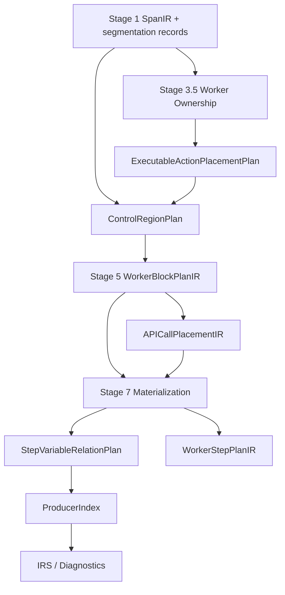

# Stage 4/5/7 Action Placement、Control Region 与 IO Relation 重构设计

## 1. 状态

```text
Status: draft for review
Scope: NL2SPL Pipeline Stage 3.5 / 4 / 5 / 7 / ProducerIndex
Primary fixture: examples/input/internal_comms.txt
Related problem note:
  docs/problem/stage4_stage5_stage7_control_placement_and_output_binding_gap_zh.md
Related design inputs:
  docs/design/stage7_action_level_step_extraction_design_zh.md
  docs/design/stage3_5_api_worker_promotion_boundary_solution_design_zh.md
  docs/design/stage1_llm_guided_source_constrained_span_slicing_design_zh.md
```

## 2. 背景与问题定义

`internal_comms` 的 reusable process 包含以下连续逻辑：

```text
First determine what kind of communication is requested.
Then identify which required fields are still missing.
Ask only the highest-value clarifying questions needed to move forward.
If sources are needed and available, retrieve them using approved source recipes.
Maintain provenance for externally sourced facts.
When enough required information is available, produce a draft.
If the user asks for revision, revise while re-checking constraints.
```

当前重新生成的 final SPL 中出现了错误结构：

```text
COMMAND Maintain provenance for externally sourced facts RESULT source_evidence_set SET

IF enough required information is available:
  COMMAND Produce the draft ...
  CALL ApprovedSourceRecipesAPI
```

该结果同时暴露四类问题：

1. `If sources are needed and available` 的 guard 丢失，没有形成对应 IF block。
2. `CALL ApprovedSourceRecipesAPI` 被放进了无关的 `IF enough required information is available` block。
3. `Ask only the highest-value clarifying questions...` 被放入顶层 `ALTERNATIVE_FLOW`，而不是主流程中的局部 IF block。
4. `Maintain provenance...` 被误判为 `source_evidence_set` 的 producer。

这些不是 renderer 文本排序问题，而是 IR 层的 authority boundary 错位：

```text
Stage 3.5:
  API-owned executable span 被排除出 worker/control/block placement。

Stage 4:
  缺少 local conditional 与 top-level alternative flow 的稳定 typed contract。

Stage 5:
  block assembly 只能消费已有 flow spans，无法恢复被 Stage 3.5/4 排除的 API-owned guarded_action。

Stage 7:
  API placement 使用 nearest-block fallback；
  Step IO binding 受到 required output pressure 影响。
```

## 3. 设计目标

本设计目标是把以下三条边界产品化为 typed compiler contracts：

```text
1. Executable action placement precedes command materialization.
2. Local conditional 与 top-level alternative flow 必须有 typed control region contract。
3. Step input/output binding 必须 source-backed + relation-aware。
```

具体目标：

1. 所有 executable action span 都进入 worker/control/flow/block placement，包括 API / REQUEST_INPUT / INVOKE_WORKER / GENERAL_COMMAND candidates。
2. API span 可以不进入 generic `GENERAL_COMMAND` extraction，但不能丢失 placement ownership。
3. IF block 与 ALTERNATIVE_FLOW 不再仅由 “是否有 condition” 判断，而由 control scope 判断。
4. IF block 可包含一个或多个连续步骤。
5. Stage 5 产出 API call placement 的 exact `placed / unresolved / ambiguous` 状态。
6. Stage 7 在 API placement 非 `placed` 时 fail closed，不再 nearest-block fallback。
7. Step-variable binding 使用显式 relation，ProducerIndex 只接受 `produces`。
8. `source_evidence_set` 区分 `produced / deferred / missing`，不再被 provenance step 或 unknown API return contract 伪造为已生产。

## 4. 非目标

本设计不做以下事情：

1. 不修改 SPL renderer 来重排文本或修复语义。
2. 不在 Stage 7 用 raw string keyword 猜 IF block。
3. 不让 API placeholder 自动拥有已知 response contract。
4. 不把 `pending_response_bindings` 视为 producer。
5. 不要求 Stage 1 识别所有 local conditional。Stage 1 只提供 source-constrained span segmentation 与 direct guarded_action metadata。
6. 不把 `ControlRegionPlan` 注册为 IRS construct 或 SPL Editing repair target。
7. 不在本设计中迁移所有 command families，只保证该 contract 能覆盖 API / clarification / provenance / draft 这类当前问题。

## 5. 核心不变式

### 5.1 Placement 先于 Materialization

```text
Executable action placement precedes command materialization.
Materialization authority must not remove placement authority.
```

Stage 3.5/4/5 只回答：

```text
这个 executable action 属于哪个 worker / flow / block / control region？
```

Stage 7 才回答：

```text
这个 action materialize 成 GENERAL_COMMAND / CALL_API / REQUEST_INPUT / INVOKE_WORKER 还是其他 StepIR？
```

因此：

```text
API-owned span excluded from GENERAL_COMMAND extraction
  != excluded from worker/control/block placement
```

### 5.2 Control Scope 决定 IF vs ALTERNATIVE_FLOW

```text
IF block:
  主流程中的局部条件区域；
  可包含一个或多个连续步骤；
  执行后自然回到同一流程位置。

ALTERNATIVE_FLOW:
  workflow-level 替代路线；
  通常对应 revision branch、user-selected branch、external alternate route；
  不是局部 precondition / gate。
```

### 5.3 Required Output 不得反向制造 Producer

```text
Required output pressure must not create producer authority.
```

Step 输出必须满足：

```text
source text / API contract / user-confirmed repair
  -> variable relation evidence
  -> relation == produces
  -> ProducerIndex producer
```

不能走：

```text
required output missing
  -> 找附近相关 step
  -> 强行绑定 output
```

## 6. 目标架构



该架构中：

1. `ExecutableActionPlacementPlan` 是 placement ownership contract。
2. `ControlRegionPlan` 是 local IF / alternative flow / guarded action 的 control contract。
3. `APICallPlacementIR` 是 API call materialization 的 placement contract。
4. `StepVariableRelationPlan` 是 StepIR 与 SymbolTable 变量之间的 relation contract。
5. ProducerIndex 只消费 `relation == produces`。

## 7. Typed Artifacts

### 7.1 ExecutableActionCandidate

在进入 placement plan 之前，必须先冻结 executable action span 的准入 contract。否则实现很容易把所有非空 span 都塞进 block planning。

```python
@dataclass(frozen=True)
class ExecutableActionCandidate:
    span_id: str
    worker_id: str | None
    candidate_source: Literal[
        "stage1_segmentation",
        "construct_plan_demand",
        "route_annotation",
        "adapter_hard_fact",
    ]
    evidence_ref: str
    admissibility: Literal["accepted", "rejected", "ambiguous"]
    reason: str | None = None
```

准入规则：

```text
accepted if:
  Stage1 segmentation_kind in {atomic_action_candidate, guarded_action}
  OR ConstructPlan demand declares executable action span
  OR route annotation marks executable/process/action role
  OR adapter hard fact declares executable behavior

rejected if:
  failure condition only
  pure definition
  persona / profile / concept text
  constraint-only span
  required output declaration
  API declaration-only evidence
```

`ExecutableActionPlacementPlan` 只能消费 `admissibility == accepted` 的 candidates。`ambiguous` 必须进入 diagnostic，不得静默进入 placement。

### 7.2 ExecutableActionPlacementPlan

用于分离 placement ownership 与 materialization exclusion。

```python
@dataclass(frozen=True)
class ExecutableActionPlacementPlan:
    plan_id: str
    worker_actions: tuple[WorkerExecutableActionSet, ...]
    diagnostics: tuple[CompileDiagnostic, ...] = ()


@dataclass(frozen=True)
class WorkerExecutableActionSet:
    worker_id: str
    placement_span_ids: tuple[str, ...]
    generic_step_extraction_span_ids: tuple[str, ...]
    materialization_exclusions: tuple[MaterializationExclusion, ...] = ()


@dataclass(frozen=True)
class MaterializationExclusion:
    span_id: str
    excluded_from: Literal[
        "general_command_extraction",
        "child_worker_candidate_extraction",
        "request_input_extraction",
    ]
    owning_authority: Literal[
        "api_call",
        "worker_delegation",
        "request_input",
        "construct_repair",
    ]
    authority_ref: str
    reason: str
```

关键约束：

```text
placement_span_ids 必须包含所有 executable action spans。
generic_step_extraction_span_ids 可以排除 API-owned spans。
materialization_exclusions 不能删除 placement ownership。
```

### 7.3 ControlRegionPlan

用于表达 IF block / alternative flow / exception flow / unresolved control 的统一 contract。

```python
@dataclass(frozen=True)
class ControlRegionPlan:
    plan_id: str
    worker_regions: tuple[WorkerControlRegionSet, ...]
    diagnostics: tuple[CompileDiagnostic, ...] = ()


@dataclass(frozen=True)
class WorkerControlRegionSet:
    worker_id: str
    regions: tuple[ControlRegionDemand, ...]


@dataclass(frozen=True)
class ControlRegionDemand:
    region_id: str
    worker_id: str
    control_kind: Literal[
        "local_if",
        "top_level_alternative",
        "exception_flow",
        "loop",
        "unresolved",
    ]
    condition_text: str | None
    condition_source_span_ids: tuple[str, ...]
    action_span_ids: tuple[str, ...]
    relation: Literal["direct", "derived", "ambiguous"]
    classification_source: Literal[
        "stage1_guarded_action",
        "route_derived",
        "llm_classified",
        "deterministic_evidence",
    ]
    confidence: Literal["high", "medium", "low", "unknown"]
    notes: tuple[str, ...] = ()
```

语义：

```text
local_if:
  main-flow local condition region，可包含多个 action_span_ids。

top_level_alternative:
  workflow-level branch，例如 revision path。

exception_flow:
  failure/exception condition region。

unresolved:
  条件/动作关系无法稳定确定，后续不得静默 materialize。
```

当前 demo 的目标 control regions：

```text
region_s17:
  control_kind = local_if
  condition_text = required information is missing
  condition_source_span_ids = [s16, s17]
  action_span_ids = [s17]
  relation = derived

region_s18:
  control_kind = local_if
  condition_text = sources are needed and available
  condition_source_span_ids = [s18]
  action_span_ids = [s18]
  relation = direct

region_s20:
  control_kind = local_if
  condition_text = enough required information is available
  condition_source_span_ids = [s20]
  action_span_ids = [s20]
  relation = direct

region_s21:
  control_kind = top_level_alternative
  condition_text = the user asks for revision
  condition_source_span_ids = [s21]
  action_span_ids = [s21]
  relation = direct
```

### 7.4 ControlRegionPlanBuilder 与 Validator

`ControlRegionPlan` 必须拆成 builder 与 validator 两层，避免 LLM classification 直接成为 block authority。

```text
ControlRegionPlanBuilder:
  收集 Stage1 guarded_action、Stage4 LLM classification、
  Route/ConstructPlan hints、deterministic structured evidence。

ControlRegionPlanValidator:
  检查 condition/action span 是否属于同一 worker/action set；
  检查 direct relation 是否有 direct guard evidence；
  检查 derived relation 是否有 condition_source_span_ids；
  检查 ambiguous/unresolved 是否阻止 Stage 5 静默 materialize；
  检查 action_span_ids 是否都来自 ExecutableActionPlacementPlan accepted candidates。
```

`s17` 的 derived local IF 必须满足：

```text
relation = derived
condition_source_span_ids = [s16, s17]
classification_source != deterministic_keyword_only
```

如果 validator 失败：

```text
Stage 5 不得 materialize 对应 IF / alternative block。
必须输出 visible diagnostic。
```

### 7.5 APICallPlacementIR as Stage 5 Output

当前已有 `APICallPlacementIR` 概念，应收敛为 Stage 5 / block planning 的一等输出：

```python
@dataclass(frozen=True)
class APICallPlacementIR:
    call_demand_id: str
    owner_worker_id: str | None
    flow_ref: str | None
    block_ref: str | None
    status: Literal["placed", "unresolved", "ambiguous"]
    source_span_ids: tuple[str, ...]
    reason: str | None = None
```

约束：

```text
status == placed:
  owner_worker_id, flow_ref, block_ref 必须非空。

status != placed:
  Stage 7 不得生成 CALL_API。
  必须有 diagnostic。
```

禁止：

```text
nearest-block fallback
following-block fallback
renderer repair
Stage 7 raw text guessing
```

### 7.6 StepVariableRelationPlan

用于在 ProducerIndex 之前明确 StepIR 与变量的关系。

```python
@dataclass(frozen=True)
class StepVariableRelationPlan:
    plan_id: str
    relations: tuple[StepVariableRelation, ...]
    diagnostics: tuple[CompileDiagnostic, ...] = ()


@dataclass(frozen=True)
class StepVariableRelation:
    step_id: str
    variable_name: str
    relation: Literal[
        "produces",
        "consumes",
        "refines",
        "validates",
        "records_metadata",
        "declares",
        "no_relation",
        "unknown",
    ]
    evidence_source: Literal[
        "source_text",
        "api_contract",
        "user_confirmed_repair",
        "inferred_unconfirmed",
    ]
    source_span_ids: tuple[str, ...]
    evidence_text: str | None = None
    confidence: Literal["high", "medium", "low", "unknown"] = "unknown"
```

ProducerIndex 规则：

```text
relation == produces -> producer candidate
relation != produces -> not a producer
```

当前 demo 中：

```text
Maintain provenance for externally sourced facts
  relation(source_evidence_set) != produces
  likely records_metadata / refines / unknown

CALL ApprovedSourceRecipesAPI
  relation(source_evidence_set) = deferred, not produces
  because API return contract is unknown
```

### 7.7 RequiredOutputFulfillmentState

用于区分 required output 的生产、延期、缺失状态。

```python
@dataclass(frozen=True)
class RequiredOutputFulfillmentState:
    output_name: str
    status: Literal["produced", "deferred", "missing"]
    producer_step_ids: tuple[str, ...] = ()
    deferred_refs: tuple[str, ...] = ()
    reason: str | None = None
```

`source_evidence_set` 在当前 API placeholder 场景下应是：

```text
status = deferred 或 missing
producer_step_ids = []
deferred_refs = [api_call_demand_id / pending_response_binding_id]
reason = API return contract unknown
```

不能是：

```text
status = produced
producer_step_ids = [Maintain provenance step]
```

归属规则：

```text
RequiredOutputFulfillmentState is ProducerIndex output, not ProducerIndex input.
```

正确链路：

```text
StepVariableRelationPlan
  -> ProducerIndex
  -> RequiredOutputFulfillmentState
  -> IRS / diagnostics
```

Stage 7、IRS、renderer 都不得直接生成最终 fulfillment truth。

## 8. Stage 职责调整

### 8.1 Stage 1

Stage 1 继续负责 source-constrained segmentation。

允许输出：

```text
segmentation_kind
guard_text_exact
action_text_exact
source ranges / packet ranges
continuation_repaired
ambiguous_boundary
```

不允许输出：

```text
StepIR
BlockIR
construct_type
API materialization decision
ProducerIndex relation
```

Stage 1 的 `guarded_action` 是 `ControlRegionPlan` 的直接输入之一。

### 8.2 Stage 3.5

Stage 3.5 需要拆分两个集合：

```text
placement_behavior_span_ids:
  所有 executable action spans。

generic_step_extraction_span_ids:
  排除 API-owned / invoke-owned / repair-owned spans。
```

`WorkerSpecIR.owned_span_ids` 或新的 placement ownership artifact 必须保留 API-owned executable spans，例如 `s18`。

禁止：

```text
api_consumed_span_ids 直接从 worker ownership 中删除。
```

允许：

```text
api_consumed_span_ids 从 generic command extraction candidates 中删除。
```

### 8.3 Stage 4

Stage 4 不应只输出：

```text
main_flow_spans
alternative_flows
exception_flows
```

还应输出或协同产出：

```text
ControlRegionPlan
```

Stage 4 LLM classification 可以参与判断 local IF vs alternative flow，但必须落入 typed fields：

```text
control_kind
condition_source_span_ids
action_span_ids
relation
classification_source
confidence
```

如果无法稳定判断，应输出：

```text
control_kind = unresolved
diagnostic = local_condition_unresolved
```

不能静默提升为 `ALTERNATIVE_FLOW`。

### 8.4 Stage 5

Stage 5 消费：

```text
WorkerFlowPlanIR
ControlRegionPlan
ExecutableActionPlacementPlan
ConstructPlan / APICallDemand
```

Stage 5 负责：

```text
1. 将 local_if regions materialize 成 BlockIR(block_type=IF)。
2. 支持一个 IF block 包含多个 action spans。
3. 将 top_level_alternative regions materialize 成 alternative flow blocks。
4. 为 API-owned guarded_action 保留 exact block placement。
5. 输出 APICallPlacementIR。
```

Stage 5 不负责：

```text
1. 生成 CALL_API StepIR。
2. 判断 API inputs/outputs。
3. 注册 ProducerIndex producer。
```

### 8.5 Stage 7

Stage 7 消费：

```text
WorkerBlockPlanIR
APICallPlacementIR
ConstructPlan / APICallDemand
StepVariableRelationPlan 或 relation hints
SymbolTable
```

Stage 7 负责：

```text
1. status == placed 的 APICallDemand -> CALL_API StepIR。
2. generic_step_extraction_span_ids -> GENERAL_COMMAND / REQUEST_INPUT 等普通 extraction。
3. 基于 source-backed relation 输出 StepVariableRelation。
4. 对 unresolved / ambiguous placement fail closed。
```

Stage 7 禁止：

```text
1. nearest-block fallback。
2. 根据 required output pressure 伪造 outputs。
3. 把 pending_response_bindings 当作 outputs。
4. 把 provenance / validation / maintenance 动作当 producer，除非 source-backed relation == produces。
```

### 8.6 ProducerIndex / IRS

ProducerIndex 只接受：

```text
StepVariableRelation.relation == produces
```

IRS / diagnostics 负责暴露：

```text
required output missing
required output deferred
api response binding deferred
producer relation ambiguous
```

不应为了让 final SPL 看起来完整而把 `deferred` 当成 `produced`。

### 8.7 Legacy StepIR.outputs 降级策略

迁移期必须明确旧 `StepIR.outputs` 的语义降级，否则旧代码路径仍可能绕过 relation plan 注册 producer。

```text
ProducerIndex v2:
  primary source = StepVariableRelationPlan
  StepIR.outputs only accepted when accompanied by relation == produces
  legacy StepIR.outputs without relation -> ignored or diagnostic step_variable_relation_missing
```

兼容策略：

```text
1. 对 legacy tests 可临时由 adapter 生成 relation == produces。
2. 新增/重构路径不得只写 StepIR.outputs 而不写 StepVariableRelation。
3. required output producer 审计必须检查 relation source，而不是只看 StepIR.outputs。
```

## 9. IF BLOCK 与 ALTERNATIVE_FLOW 判定准则

### 9.1 Local IF

判定为 local IF 的条件：

```text
1. 该条件只控制主流程中的局部动作区域。
2. 动作执行后自然回到同一主流程。
3. 该区域可以包含一个或多个连续 action spans。
4. condition/action 关系可以 direct 或 derived，但必须记录 evidence。
```

例子：

```text
If sources are needed and available, retrieve them using approved source recipes.

When enough required information is available, produce a draft.

Ask only the highest-value clarifying questions needed to move forward.
  derived condition: required information is missing
```

### 9.2 Top-Level Alternative Flow

判定为 top-level alternative flow 的条件：

```text
1. 表达 workflow-level alternative route。
2. 通常由用户后续选择、revision request、外部路线变化触发。
3. 不是执行后自然回到同一位置的局部 gate。
```

例子：

```text
If the user asks for revision, revise while re-checking constraints.
```

### 9.3 Unresolved Control

如果系统不能稳定判断 local IF / alternative flow：

```text
control_kind = unresolved
diagnostic = control_region_unresolved
```

不得静默选择 `ALTERNATIVE_FLOW`。

## 10. IO Relation Matching 准则

### 10.1 允许的 producer evidence

Step 可以生产变量，必须至少满足一项：

```text
1. source text 明确表达 produce / create / generate / return / set / output 该变量或稳定别名。
2. API contract 明确声明 return value 对应该变量。
3. user-confirmed repair 明确声明该 step produces 该变量。
```

### 10.2 不允许的 producer evidence

以下不能作为 producer evidence：

```text
1. required output 当前缺失。
2. step 文本与变量名语义相近但无 produce relation。
3. pending_response_bindings。
4. provenance / validation / maintenance 动作。
5. renderer 文本。
```

### 10.3 当前例子的关系

```text
Produce a draft
  -> produces draft_communication_artifact

Record a short assumptions log and set completion status
  -> produces assumptions_log, completion_status

Maintain provenance for externally sourced facts
  -> records_metadata / refines / validates / unknown
  -> not produces source_evidence_set

CALL ApprovedSourceRecipesAPI
  -> pending response binding to source_evidence_set
  -> not produces source_evidence_set until API return contract known
```

## 11. Diagnostics

建议新增或收敛以下 diagnostics：

```text
api_call_missing_block_placement:
  APICallDemand 没有 exact placed block。
  Stage 7 不得 materialize CALL_API。

control_region_unresolved:
  local IF / alternative flow 无法稳定分类。

local_condition_unresolved:
  local conditional 的 condition_text 或 evidence 不完整。

step_variable_relation_ambiguous:
  Step 与变量关系无法判定 produces / consumes / refines 等。

required_output_deferred:
  required output 可能由 API response 提供，但 API return contract 未知。

required_output_missing_source_backed_producer:
  required output 没有 source-backed producer。
```

### 11.1 Diagnostic 分层

实现计划必须区分 final diagnostics 与 intermediate/report-only diagnostics。

```text
api_call_missing_block_placement:
  final diagnostic。
  blocks CALL_API materialization。
  blocks_completion 取决于该 API call 是否 required for completion。

control_region_unresolved:
  stage-local 或 final diagnostic。
  如果导致 executable action 无法 placement，则必须进入 final diagnostics。

local_condition_unresolved:
  stage-local 或 final diagnostic。
  如果 action 被阻止 materialize，则必须 visible。

step_variable_relation_ambiguous:
  如果涉及 required output，则影响 completion。
  如果不涉及 required output，可为 warning/report-only。

required_output_deferred:
  visible diagnostic。
  blocks_completion 由 required output policy 决定。
  不得被归并成 produced。

required_output_missing_source_backed_producer:
  final diagnostic。
  blocks_completion = true for required output。
```

Feedback report / SPL Editing issue inventory 必须保留：

```text
missing
deferred
ambiguous
report-only
```

之间的区别，不能混成同一类用户可修复 issue。

## 12. Demo 目标形态

修复后，`internal_comms` 的目标结构应接近：

```text
COMMAND determine what kind of communication is requested
COMMAND identify which required fields are still missing

IF required information is missing:
  INPUT ask only the highest-value clarifying questions needed to move forward

IF sources are needed and available:
  CALL ApprovedSourceRecipesAPI
  COMMAND maintain provenance for externally sourced facts

IF enough required information is available:
  COMMAND produce a draft

ALTERNATIVE_FLOW the user asks for revision:
  COMMAND revise while re-checking constraints

COMMAND record assumptions log and completion status
```

重要：这个 SPL 形态只是展示目标，真正验收对象必须是 IR：

```text
ControlRegionPlan
WorkerBlockPlanIR
APICallPlacementIR
WorkerStepPlanIR
StepVariableRelationPlan
ProducerIndex
CompileDiagnostics
```

## 13. 迁移策略

建议按以下顺序进入 implementation plan：

```text
R0: Characterization tests
  锁定 s17/s18/s19/s20 的 ownership / flow / block / step / producer 错误。

R1: Shared model freeze
  ExecutableActionCandidate
  ExecutableActionPlacementPlan
  ControlRegionPlan
  APICallPlacementIR
  StepVariableRelationPlan
  RequiredOutputFulfillmentState
  payload / checkpoint schema

R2: ExecutableActionPlacement contract
  引入 placement span set 与 generic extraction span set 的分离。

R3: Stage 3.5 ownership repair
  API-owned executable span 保留 worker placement ownership。

R4: ControlRegionPlan builder/validator
  引入 local_if / top_level_alternative / guarded_action / unresolved typed regions。
  Validator 通过前不得进入 Stage 5 materialization。

R5: Stage 4/5 control placement + APICallPlacementIR
  Stage 5 消费 ControlRegionPlan 生成 local IF blocks。
  API call placement status 必须 exact placed / unresolved / ambiguous。

R6: Stage 7 fail-closed API materialization
  删除 nearest-block fallback，status != placed 时 Stage 7 fail closed。

R7: ProducerIndex v2 relation-aware migration
  引入 StepVariableRelationPlan。
  ProducerIndex 只接受 relation == produces。
  legacy StepIR.outputs without relation 降级。

R8: RequiredOutputFulfillmentState + diagnostics consolidation
  由 ProducerIndex 输出 produced / deferred / missing。

R9: E2E + audit
  用 internal_comms 验证 IR、diagnostics、ProducerIndex、rendered SPL。
```

迁移理由：

```text
这些 artifact 会跨 Stage 3.5 / 4 / 5 / 7 / ProducerIndex 消费。
必须先 freeze schema 和 checkpoint payload，
否则各 stage 容易各自定义近似模型，重新造成 authority 漂移。
```

## 14. 验收标准

### 14.1 IR 验收

必须满足：

```text
s18:
  worker placement ownership exists
  local_if condition = sources are needed and available
  APICallPlacementIR.status = placed
  CALL_API block_ref = s18 local IF block

s17:
  not top-level ALTERNATIVE_FLOW
  local_if condition = required information is missing
  action_span_ids includes s17

s19:
  relation(source_evidence_set) != produces
  not ProducerIndex producer for source_evidence_set

source_evidence_set:
  produced only if source-backed producer exists
  otherwise deferred or missing
```

### 14.2 Negative 验收

必须覆盖：

```text
1. APICallDemand without placed block -> no CALL_API materialized.
2. pending_response_bindings does not register producer.
3. provenance/maintenance action does not produce required output.
4. local clarification condition does not become top-level ALTERNATIVE_FLOW.
5. API-owned guarded_action does not lose IF block placement.
```

### 14.3 Rendered SPL 验收

Rendered SPL 中不得出现：

```text
CALL ApprovedSourceRecipesAPI inside IF enough required information is available
Maintain provenance ... RESULT source_evidence_set SET
ALTERNATIVE_FLOW required information is missing and clarifying questions are needed
```

Rendered SPL 应出现：

```text
IF sources are needed and available
CALL ApprovedSourceRecipesAPI
IF required information is missing
INPUT ask only the highest-value clarifying questions
```

## 15. 风险与边界

### 15.1 LLM 分类风险

`ControlRegionPlan` 可以消费 LLM classification，但必须记录：

```text
classification_source
condition_source_span_ids
relation
confidence
```

不能让 LLM 输出直接成为 block authority。

### 15.2 Backward Compatibility

迁移初期可以保留旧 `main_flow_spans / alternative_flows`，但新增 `ControlRegionPlan` 应作为 Stage 5 的优先 authority。

### 15.3 ProducerIndex 风险

如果 `StepVariableRelationPlan` 未完整接入 ProducerIndex，系统仍可能通过 StepIR.outputs 误注册 producer。实施计划必须明确 ProducerIndex 的迁移顺序。

### 15.4 Demo 与真实语义

最终 rendered SPL 只是验收观察面。不能为了让 demo 看起来正确而在 renderer 或 final SPL text 上做排序、删改、替换。

## 16. Implementation Gate

进入编码前，implementation plan 必须包含以下 hard gates。

### 16.1 Model / Payload Freeze

```text
ExecutableActionCandidate
ExecutableActionPlacementPlan
ControlRegionPlan
APICallPlacementIR
StepVariableRelationPlan
RequiredOutputFulfillmentState
```

必须先冻结：

```text
dataclass fields
JSON/checkpoint payload schema
serialization round-trip
diagnostic metadata
stage ownership
```

### 16.2 ExecutableActionCandidate 准入

必须测试：

```text
accepted:
  atomic_action_candidate
  guarded_action
  construct demand executable action
  route executable action

rejected:
  failure condition only
  pure definition
  persona/profile/concept
  constraint-only span
  required output declaration
  API declaration-only evidence
```

### 16.3 ControlRegionPlan Validator

Stage 5 只能消费 validator 通过的 regions。

必须拒绝：

```text
direct relation without direct guard evidence
derived relation without condition_source_span_ids
action_span_ids outside accepted executable placement set
cross-worker condition/action region without explicit authority
unresolved / ambiguous region silently materialized
```

### 16.4 API Placement Fail-Closed

```text
APICallPlacementIR.status != placed
  -> Stage 7 does not materialize CALL_API
  -> visible diagnostic
```

必须删除或禁用：

```text
nearest-block fallback
following-block fallback
raw text block guessing
```

### 16.5 ProducerIndex v2

```text
primary source = StepVariableRelationPlan
accepted producer = relation == produces
legacy StepIR.outputs without relation = ignored or diagnostic
```

必须证明：

```text
Maintain provenance... not producer for source_evidence_set
pending_response_bindings not producer
CALL_API unknown return contract not producer
```

### 16.6 RequiredOutputFulfillmentState 归属

```text
RequiredOutputFulfillmentState emitted by ProducerIndex, not Stage 7.
IRS consumes fulfillment state for diagnostics.
Renderer only renders diagnostics / IR.
```

### 16.7 Diagnostic 分层

Implementation plan 必须列出每个新增 diagnostic 的：

```text
kind
severity
blocks_rendering
blocks_completion
target_ref
source_span_ids
final vs stage-local/report-only
presentation disposition
```

### 16.8 Compatibility Fallback

任何兼容 fallback 都必须满足：

```text
emit visible diagnostic when semantics are degraded
must not materialize executable steps from invalid placement
must not register producers from legacy StepIR.outputs without relation
must not turn deferred output into produced output
```

### 16.9 P0 Negative Tests

必须覆盖：

```text
1. APICallDemand without placed block -> no CALL_API materialized.
2. pending_response_bindings does not register producer.
3. provenance/maintenance action does not produce required output.
4. local clarification condition does not become top-level ALTERNATIVE_FLOW.
5. API-owned guarded_action does not lose IF block placement.
6. failure condition / pure definition / output declaration does not become executable placement span.
7. legacy StepIR.outputs without produces relation does not satisfy ProducerIndex.
```

## 17. 结论

本重构应以以下架构原则为基线：

```text
Executable action placement precedes command materialization.
Control regions are typed compiler artifacts.
API placement is a Stage 5 first-class output.
Step IO binding is relation-aware and source-backed.
ProducerIndex accepts only produces relation.
Renderer only renders IR.
```

该方案修复的不只是 `internal_comms` 的局部错误，而是 Stage 3.5/4/5/7 之间长期混在一起的四类 authority：

```text
placement authority
control authority
materialization authority
producer authority
```

只有将四者拆开，才能避免 API call、local IF、alternative flow、required output producer 在后续 fixtures 中继续互相污染。
