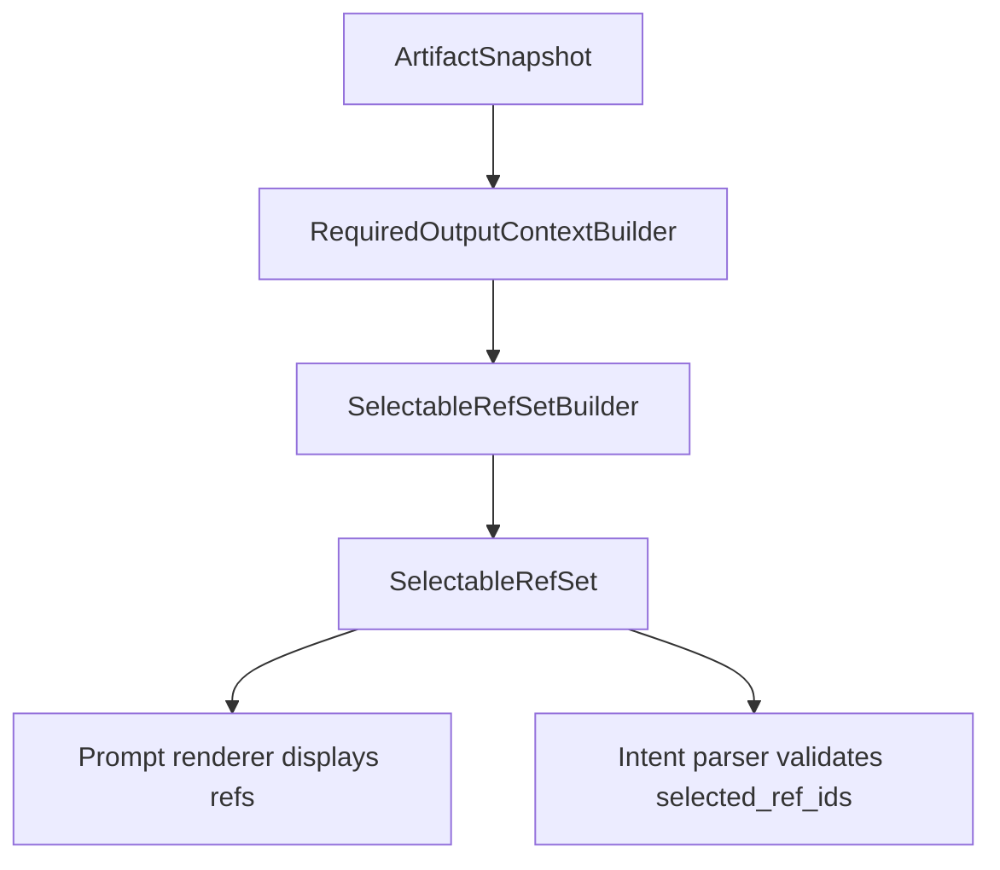
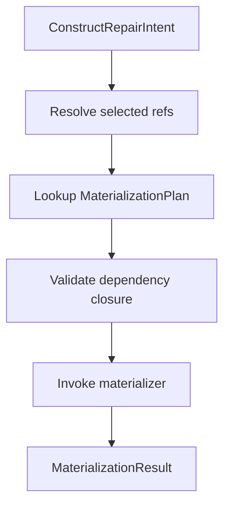
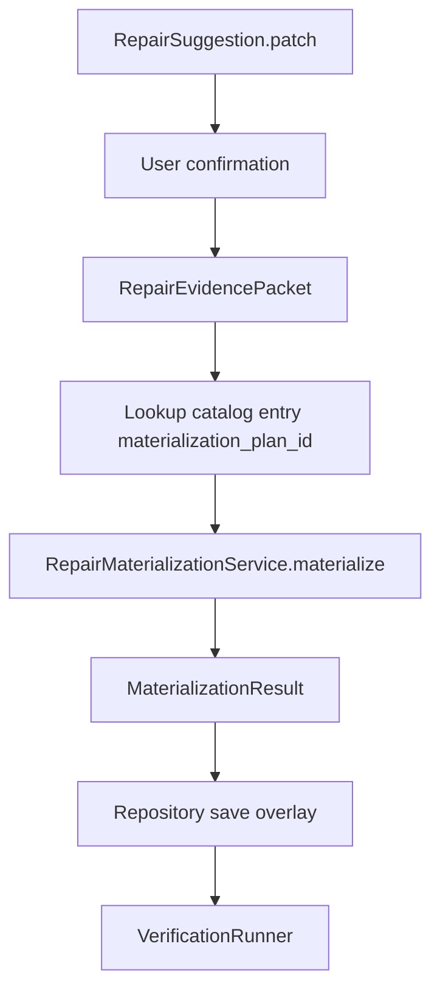
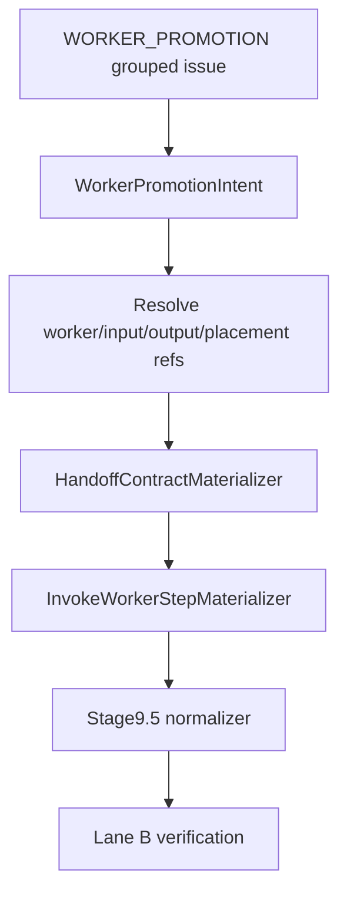

# SPL Editing Construct Repair Materialization 实施计划

基于设计文档：`docs/design/spl_editing_construct_repair_materialization_refactor_plan.md`  
日期：2026-06-25  
状态：Draft implementation baseline  
适用范围：SPL Editing repair suggestion、typed patch、artifact snapshot overlay、IRS repair affordance、LLM repair context、verification、demo CLI

---

## 1. 总体目标

本计划的目标是把当前 SPL Editing repair 路径从：

```text
LLM payload
-> handler builds IR-like patch payload
-> PatchApplier directly mutates stage IR
-> verification catches some failures
```

系统性重构为：

```text
EditableIssue
-> RepairCatalog / RepairAffordanceSpec metadata
-> TargetResolver
-> RepairContextBuilder
-> SelectableRefSet
-> LLM outputs ConstructRepairIntent
-> user confirmation
-> RepairEvidencePacket
-> MaterializationPlan
-> stage-authorized materializer
-> ArtifactSnapshot overlay
-> Verification / IRS / Gate / ProducerIndex / Renderer / Provenance
```

最小可验证主线是：

```text
missing_output_producer
-> InsertProducerStep
-> reject hallucinated ref project_data
-> accept valid selected refs
```

完成定义：

```text
1. LLM 不再输出最终 IR authority fields。
2. PatchApplier 不再直接构造 StepIR / WorkerHandoffIR / WorkerIR。
3. 变量、worker、handoff、step 等引用只能来自 SelectableRefSet。
4. MaterializationPlan 声明 dependency closure、write layer、normalizer requirement 和 verification lane。
5. Stage-authorized materializer 可以构造 IR，但必须消费 ConstructRepairIntent、RepairEvidencePacket、resolved refs、dependency closure 和 ID allocator。
6. Verification 审计 selected refs、materialization authority、evidence lineage、undefined refs 和 diagnostic diff。
```

---

## 2. 全局硬性原则

所有 R0-R11 阶段必须遵守：

1. **IRS 只声明，不执行。** `ConstructIRS` / `SlotSpec` / `RepairAffordanceSpec` 不 import materializer、不调用 LLM、不生成 intent、不修改 artifact。
2. **LLM 只生成 intent。** LLM 不输出 `StepIR.inputs`、`StepIR.outputs`、`StepIR.step_id`、`WorkerHandoffIR.handoff_id` 等最终 IR authority fields。
3. **SelectableRefSet 是反幻觉边界。** LLM 只能选择 `ref_id`；unknown ref 必须在 intent parse 或 materialization 前失败。
4. **ref_kind 与 ref_role 分离。** `required_output` 可以是 `target_output`，但不能作为 `selectable_input`。
5. **PatchApplier 不再是 IR constructor。** PatchApplier 只能提交 confirmed intent 或调用 materialization service。
6. **Materializer 是 declared authority。** 允许 materializer 构造 IR，但必须由 `MaterializationPlan` 声明 authority，并写入 authority/evidence/consumed refs metadata。
7. **ID 由 allocator 分配。** `step_id`、`block_id`、`handoff_id` 不得由 LLM、handler 或 `overlay_version` 字符串拼接决定。
8. **Verification 是验收，不是生成。** 不得通过增加 patch-specific verifier 来掩盖 materialization contract 缺失。
9. **无 report/debug JSON fallback。** 不解析 `feedback_report.md`、`compile_report.txt` 或 `stage*.json` 作为 primary source。
10. **无 rule-based semantic fallback。** 确定性代码只能解析结构化 artifact、ref 和 contract，不能从自然语言猜变量/语义。

---

## 3. 目标模块结构

新增模块：

```text
src/nl2spl/compiler/spl_editing/selectable_refs/
  __init__.py
  model.py
  policy.py
  builder.py
  resolver.py
  audit.py
  errors.py

src/nl2spl/compiler/spl_editing/intent/
  __init__.py
  model.py
  parser.py
  validator.py
  evidence.py
  errors.py

src/nl2spl/compiler/spl_editing/materialization/
  __init__.py
  model.py
  registry.py
  service.py
  dependency_closure.py
  id_allocator.py
  stage_slice_executor.py
  errors.py
  stage7/
    __init__.py
    producer_step.py
    exception_handler_step.py
  worker_handoff/
    __init__.py
    handoff_contract.py

src/nl2spl/compiler/spl_editing/verification/
  selected_ref_verifier.py
  materialization_authority_verifier.py
```

需要逐步修改：

```text
src/nl2spl/compiler/construct_registry.py
src/nl2spl/compiler/spl_editing/core/catalog.py
src/nl2spl/compiler/spl_editing/core/model.py
src/nl2spl/compiler/spl_editing/core/service.py
src/nl2spl/compiler/spl_editing/context/required_output_context.py
src/nl2spl/compiler/spl_editing/handlers/missing_output_producer/
src/nl2spl/compiler/spl_editing/patches/insert_producer_step/
src/nl2spl/compiler/spl_editing/patches/add_exception_handler_step/
src/nl2spl/compiler/spl_editing/patches/create_worker_handoff_contract/
src/nl2spl/compiler/spl_editing/verification/runner.py
examples/output/spl_editing_demo/run_demo.py
```

---

## 4. R0 Contract Freeze / Current Gap Lock

### 4.1 目标

先把当前 direct IR mutation 风险和未来目标行为锁成测试，避免后续重构时用临时 fallback 掩盖问题。

### 4.2 可编辑范围

允许新增：

```text
tests/unit/compiler/spl_editing/materialization/test_r0_current_gap_lock.py
tests/unit/compiler/spl_editing/materialization/fixtures.py
```

允许只读检查：

```text
src/nl2spl/compiler/spl_editing/handlers/missing_output_producer/handler.py
src/nl2spl/compiler/spl_editing/patches/insert_producer_step/applier.py
src/nl2spl/compiler/spl_editing/patches/add_exception_handler_step/applier.py
src/nl2spl/compiler/spl_editing/patches/create_worker_handoff_contract/applier.py
```

### 4.3 禁止改动

R0 不改生产代码，不修 bug，不引入新 runtime 分支。

### 4.4 实施思路

新增 characterization tests，明确当前代码存在的风险：

```text
1. MissingOutputProducerHandler 当前能从 LLM payload 派生 inputs/outputs。
2. InsertProducerStepApplier 当前能把 payload.inputs 写入 StepIR.inputs。
3. AddExceptionHandlerStepApplier 当前直接构造 handler StepIR / BlockIR。
4. CreateWorkerHandoffContractApplier 当前直接构造 WorkerHandoffIR / INVOKE_WORKER StepIR。
5. project_data 不在 SelectableRefSet 时，目标行为应为 rejected before overlay。
```

R0 中第 5 条不得写成默认 CI 会失败的普通测试。当前阶段只能写两类测试：

```text
1. characterization tests：
   描述当前代码实际行为，必须 passing。

2. contract_pending tests：
   描述 R5/R8 后的目标行为，必须使用明确 marker，
   默认不进入 CI blocking 测试集。
```

`contract_pending` marker 必须在 R8 完成时删除，并迁移为普通 passing guardrail test。

### 4.5 测试计划

新增测试覆盖：

```text
test_insert_producer_currently_accepts_payload_inputs_as_gap
test_missing_output_handler_currently_builds_ir_like_payload_as_gap
test_project_data_must_be_rejected_target_contract
test_add_exception_handler_direct_step_construction_gap
test_create_worker_handoff_direct_ir_construction_gap
```

### 4.6 验收标准

```text
1. R0 测试清楚描述当前风险。
2. 不修改生产代码。
3. 没有新增 skip/xfail；目标行为测试只能使用 `contract_pending` marker，且默认不进入 CI blocking 测试集。
4. 后续 R5/R8/R9/R10/R11 能逐步把 gap tests 改为 passing guardrail tests。
5. R8 完成后，`contract_pending` marker 不得再用于 missing_output_producer / InsertProducerStep。
```

---

## 5. R1 SelectableRef Foundation

### 5.1 目标

建立一等 `SelectableRefSet`，让 LLM 只能选择 snapshot 中已有、后端授权的结构化 refs。

### 5.2 可编辑范围

新增：

```text
src/nl2spl/compiler/spl_editing/selectable_refs/model.py
src/nl2spl/compiler/spl_editing/selectable_refs/policy.py
src/nl2spl/compiler/spl_editing/selectable_refs/builder.py
src/nl2spl/compiler/spl_editing/selectable_refs/resolver.py
src/nl2spl/compiler/spl_editing/selectable_refs/audit.py
src/nl2spl/compiler/spl_editing/selectable_refs/errors.py
src/nl2spl/compiler/spl_editing/selectable_refs/__init__.py
tests/unit/compiler/spl_editing/selectable_refs/
```

允许修改：

```text
src/nl2spl/compiler/spl_editing/context/required_output_context.py
```

### 5.3 禁止改动

R1 不改 handler prompt，不改 applier，不改 service apply path。

### 5.4 实施思路

#### 5.4.1 DTO

定义 frozen DTO：

```text
SelectableRef:
  ref_id
  ref_kind
  ref_role
  canonical_name
  display_label
  worker_id
  source_artifact
  source_artifact_ref
  source_artifact_version
  scope_path
  construct_path
  type_hint
  scope
  provenance
  selectable_for
  confidence

SelectableRefSet:
  set_id
  issue_id
  snapshot_id
  worker_scope
  refs
  policy_id
  quality
  missing_required_ref_kinds
```

`ref_id` 生成规则必须稳定且防碰撞。初始可用：

```text
{ref_kind}:{worker_id}:{source_artifact_ref}:{scope_path}:{canonical_name}
required_output:{worker_id}:{source_artifact_ref}:{output_name}
step_output:{worker_id}:{step_id}:{output_name}
resource:{worker_id}:{source_artifact_ref}:{scope_path}:{canonical_name}
```

不得只依赖 `{ref_kind}:{worker_id}:{canonical_name}`。同名 variable、resource、derived output、overlay-added ref 必须通过 `source_artifact_ref`、`source_artifact_version` 或 `scope_path` 区分。

#### 5.4.2 Policy

定义：

```text
SelectableRefPolicy
SelectableRefRoleRequirement
SelectableRefResolutionResult
```

MVP policy：

```text
required_output.producer.selectable_refs.v1
```

规则：

```text
target_output:
  allowed_ref_kinds = required_output
  min_count = 1
  max_count = 1

selectable_input:
  allowed_ref_kinds = worker_input | step_output | variable | resource
  min_count = 0
  worker_scope_required = true
```

#### 5.4.3 Builder

从 `ArtifactSnapshot` 和 `RequiredOutputContext` 收集 refs：

```text
worker inputs
existing step outputs
symbol table variables
resource registry variables
target required output
source spans as source_evidence refs
```

不得从 `CompileDiagnostic.message` 或 report 文本解析变量。

#### 5.4.4 Resolver

提供：

```text
resolve_ref_id(refset, ref_id)
resolve_ref_ids(refset, ref_ids, expected_role)
```

unknown ref 或 role mismatch 必须返回 structured error。

### 5.5 流程图



### 5.6 测试计划

```text
test_ref_id_is_stable
test_same_canonical_name_in_different_scopes_does_not_collide
test_same_ref_in_same_snapshot_is_stable
test_overlay_added_ref_receives_stable_derived_id
test_required_output_ref_has_target_output_role
test_target_output_cannot_resolve_as_selectable_input
test_unknown_ref_id_fails
test_cross_worker_ref_rejected_by_default_policy
test_builder_does_not_read_diagnostic_message
test_refset_contains_worker_inputs_and_step_outputs
test_refset_missing_required_artifact_marks_unavailable
```

### 5.7 验收标准

```text
1. SelectableRefSet 可独立构建和解析。
2. target_output / selectable_input role 边界被测试锁定。
3. unknown ref fail-fast。
4. 没有 handler/applier 依赖 SelectableRefSet 的临时文本版本。
```

---

## 6. R2 ConstructRepairIntent and EvidencePacket

### 6.1 目标

让 LLM suggestion 的结构化结果从 IR-like payload 迁移为 construct-scoped intent。

### 6.2 可编辑范围

新增：

```text
src/nl2spl/compiler/spl_editing/intent/model.py
src/nl2spl/compiler/spl_editing/intent/parser.py
src/nl2spl/compiler/spl_editing/intent/validator.py
src/nl2spl/compiler/spl_editing/intent/evidence.py
src/nl2spl/compiler/spl_editing/intent/errors.py
src/nl2spl/compiler/spl_editing/intent/__init__.py
tests/unit/compiler/spl_editing/intent/
```

允许修改：

```text
src/nl2spl/compiler/spl_editing/core/model.py
```

### 6.3 禁止改动

R2 不改 `MissingOutputProducerHandler.generate_suggestions()` 生产路径，只新增模型和 parser。

### 6.4 实施思路

#### 6.4.1 Intent model

定义：

```text
ConstructRepairIntent:
  intent_id
  issue_id
  patch_type
  affordance_id
  target_construct_type
  target_construct_id
  target_slot_name
  target_ref_id
  selected_ref_ids
  intent_summary
  repair_goal
  materialization_plan_id
  constraints
```

MVP payload：

```text
InsertProducerStepIntentPayload:
  target_output_ref_id
  selected_input_ref_ids
  producer_goal
  placement_hint_ref_id
  notes_for_user
```

#### 6.4.2 Parser

`IntentParser` 输入：

```text
raw_llm_json
expected_patch_type
issue
target
refset
catalog_entry
```

输出：

```text
IntentParseResult(intent | errors)
```

硬规则：

```text
1. 禁止字段 inputs / outputs / command_type / step_id / flow_ref / block_ref。
2. target_output_ref_id 必须 resolve 为 ref_role=target_output。
3. selected_input_ref_ids 必须 resolve 为 ref_role=selectable_input。
4. materialization_plan_id 必须匹配 catalog entry。
5. patch_type 必须在 selected repair option 允许范围内。
6. `producer_goal` / `intent_summary` / `notes_for_user` 中出现的 `<REF>...` 或裸变量名不得被解析为 input ref。
```

#### 6.4.3 Evidence packet

用户确认后构造：

```text
RepairEvidencePacket:
  evidence_packet_id
  evidence_kind = user_confirmed_repair
  confirmed_intent_id
  repair_patch_id
  related_diagnostic_id
  user_text
  confirmed_selected_ref_ids
  confirmed_at
```

### 6.5 测试计划

```text
test_insert_producer_intent_rejects_inputs_outputs_command_type
test_target_output_ref_must_exist
test_selected_input_refs_must_exist
test_selected_input_ref_role_mismatch_rejected
test_materialization_plan_id_must_match_catalog
test_evidence_packet_carries_user_text_and_selected_refs
test_producer_goal_ref_text_is_not_treated_as_input_ref
test_producer_goal_with_unknown_ref_does_not_render_undefined_ref
```

### 6.6 验收标准

```text
1. Intent schema 能表达 InsertProducerStep 目标。
2. LLM raw variable name 不再是合法输入。
3. EvidencePacket 与 RepairPatch / diagnostic / selected refs 可追踪。
```

---

## 7. R3 RepairAffordanceSpec and RepairCatalog Metadata Extension

### 7.1 目标

把 materialization 所需 metadata 纳入 IRS affordance declaration，并由 RepairCatalog 透传给 SPL Editing runtime。

### 7.2 可编辑范围

允许修改：

```text
src/nl2spl/compiler/construct_registry.py
src/nl2spl/compiler/spl_editing/core/catalog.py
tests/unit/compiler/spl_editing/test_repair_catalog.py
tests/unit/compiler/irs/
```

### 7.3 禁止改动

`construct_registry.py` 不得 import：

```text
nl2spl.compiler.spl_editing.materialization
nl2spl.compiler.spl_editing.intent
nl2spl.compiler.spl_editing.selectable_refs
```

### 7.4 实施思路

扩展 `RepairAffordanceSpec`：

```text
materialization_plan_id: str | None
selectable_ref_policy_id: str | None
intent_schema_id: str | None
required_context_facts: tuple[str, ...]
stage_authority: str | None
```

扩展 `RepairCatalogEntry` 同名字段。

为现有 affordance 填入：

```text
required_output.insert_or_bind_producer:
  materialization_plan_id = stage7.step_producer_repair.v1
  selectable_ref_policy_id = required_output.producer.selectable_refs.v1
  intent_schema_id = intent.insert_producer_step.v1
  stage_authority = stage7.worker_step_plan

exception_flow.add_handler_step:
  materialization_plan_id = stage7.exception_handler_step_repair.v1
  selectable_ref_policy_id = exception_flow.handler.selectable_refs.v1
  intent_schema_id = intent.add_exception_handler_step.v1
  stage_authority = stage7.worker_step_plan

worker_promotion.resolve_contract:
  materialization_plan_id = worker_handoff.contract_repair.v1
  selectable_ref_policy_id = worker_promotion.handoff.selectable_refs.v1
  intent_schema_id = intent.worker_promotion_resolution.v1
  stage_authority = stage3_5.worker_boundary + stage7.worker_step_plan
```

worker promotion 的 plan 可标记 post-MVP，但字段必须存在，避免不可见空白。

### 7.5 测试计划

```text
test_repair_affordance_has_materialization_metadata_for_required_output
test_catalog_entry_carries_materialization_metadata
test_construct_registry_does_not_import_runtime_materialization
test_missing_materialization_plan_makes_editable_option_unavailable
test_catalog_builder_does_not_synthesize_default_materialization_plan
```

### 7.6 验收标准

```text
1. RepairCatalog 能从 IRS affordance 读到 plan/policy/schema。
2. IRS 仍是纯 metadata。
3. 没有默认 fallback plan。
```

---

## 8. R4 MaterializationPlan Registry and Service

### 8.1 目标

建立 repair materialization 的统一 runtime 入口。

### 8.2 可编辑范围

新增：

```text
src/nl2spl/compiler/spl_editing/materialization/model.py
src/nl2spl/compiler/spl_editing/materialization/registry.py
src/nl2spl/compiler/spl_editing/materialization/service.py
src/nl2spl/compiler/spl_editing/materialization/dependency_closure.py
src/nl2spl/compiler/spl_editing/materialization/id_allocator.py
src/nl2spl/compiler/spl_editing/materialization/errors.py
tests/unit/compiler/spl_editing/materialization/
```

允许修改：

```text
src/nl2spl/compiler/spl_editing/core/model.py
```

### 8.3 禁止改动

R4 不接入 handler，不替换现有 applier。

### 8.4 实施思路

#### 8.4.1 MaterializationPlan

定义 frozen DTO。该 DTO 必须可序列化为 overlay/audit metadata，不能只作为运行时对象存在。

```text
MaterializationPlan:
  materialization_plan_id
  patch_type
  target_construct_type
  target_slot_name
  stage_authority
  dependency_closure
  editable_artifacts
  output_artifacts
  writes_to
  normalizer_required
  stage10_rebuild_required
  verification_lane
  materializer_id
```

#### 8.4.2 Dependency closure validator

实现：

```text
validate_dependency_closure(plan, snapshot, refset, target)
```

检查：

```text
required artifacts exist
required fields exist
worker scope exists
required ref roles satisfy min/max
required ID allocator available
write layer compatible with verification lane
```

#### 8.4.3 Registry

实现：

```text
MaterializationPlanRegistry.register(plan, materializer)
MaterializationPlanRegistry.get(plan_id)
build_default_materialization_registry()
```

重复 plan id 或 unknown plan id fail-fast。

#### 8.4.4 Service

实现：

```text
RepairMaterializationService.materialize(input) -> MaterializationResult
```

`MaterializationInput` 包含：

```text
snapshot
issue
target
catalog_entry
intent
refset
resolved_refs
evidence_packet
plan
```

### 8.5 流程图



### 8.6 测试计划

```text
test_registry_rejects_duplicate_plan_id
test_unknown_plan_id_fails
test_dependency_closure_rejects_missing_artifact
test_dependency_closure_rejects_missing_ref_role
test_write_layer_lane_mismatch_rejected
test_materialization_service_invokes_registered_materializer
test_materialization_plan_serializes_to_audit_metadata
```

### 8.7 验收标准

```text
1. Materialization service 可独立运行。
2. dependency closure 缺失时不会调用 materializer。
3. 没有默认 fallback materializer。
```

---

## 9. R5 Stage7ProducerRepairMaterializer

### 9.1 目标

用 declared stage-authorized materializer 替代 `InsertProducerStepApplier` 的 direct StepIR construction。

### 9.2 可编辑范围

新增：

```text
src/nl2spl/compiler/spl_editing/materialization/stage7/producer_step.py
tests/unit/compiler/spl_editing/materialization/test_stage7_producer_step_materializer.py
```

允许修改：

```text
src/nl2spl/compiler/spl_editing/handlers/missing_output_producer/handler.py
src/nl2spl/compiler/spl_editing/handlers/missing_output_producer/prompt.py
src/nl2spl/compiler/spl_editing/patches/insert_producer_step/applier.py
tests/unit/compiler/spl_editing/test_b3_repair_handlers.py
tests/unit/compiler/spl_editing/test_b6_handler_contract.py
```

### 9.3 禁止改动

不得通过在 `InsertProducerStepApplier` 中添加更多 validators 来保留 direct mutation。

### 9.4 实施思路

#### 9.4.1 Prompt/schema 改造

`missing_output_producer` prompt 要求 LLM 输出：

```json
{
  "patch_type": "InsertProducerStep",
  "target_output_ref_id": "...",
  "selected_input_ref_ids": ["..."],
  "producer_goal": "...",
  "notes_for_user": "..."
}
```

禁止输出：

```text
inputs
outputs
command_type
step_id
```

#### 9.4.2 Handler 改造

`MissingOutputProducerHandler`：

```text
LLM raw JSON
-> IntentParser
-> ConstructRepairIntent
-> RepairSuggestion.patch.payload = intent
```

不要再调用 `_payload_for()` 生成 IR-like dict。可以保留 legacy helper 到 R11，但默认路径不能调用。

#### 9.4.3 Materialization plan lane contract

`stage7.step_producer_repair.v1` 必须显式声明写入层和 replay lane。默认目标为：

```text
writes_to = worker_step_plan_pre_normalize
normalizer_required = true
stage10_rebuild_required = true
verification_lane = lane_b
```

如果实现选择 Lane A，必须在 R5 设计记录和测试中证明该 materializer 写入的是 Stage 10 assembler 可直接消费的 normalized/post-normalize layer。否则不得用 Lane A 验证 pre-normalize 写入。

#### 9.4.4 Materializer

`Stage7ProducerRepairMaterializer.materialize(input)`：

```text
1. 从 intent.target_output_ref_id resolve target output。
2. 从 intent.selected_input_ref_ids resolve selectable inputs。
3. 使用 RepairIdAllocator.allocate_step_id。
4. 生成 StepIR：
     text = sanitized producer_goal
     command_type = GENERAL_COMMAND 或由 stage policy 决定
     inputs = resolved selected input canonical names
     outputs = target output canonical name
     metadata = {
       origin: user_confirmed_repair,
       repair_patch_id,
       related_diagnostic_id,
       evidence_packet_id,
       materialization_authority,
       materialization_plan_id,
       consumed_selected_ref_ids,
       user_text
     }
5. reject 或 sanitize producer_goal 中未授权的 `<REF>...` 文本，防止 renderer 输出 undefined ref。
6. derive new worker_step_plan snapshot。
7. 返回 MaterializationResult。
```

初始 MVP 可以把 command type 固定为 stage policy 允许的 `GENERAL_COMMAND`，但这个决定必须在 materializer/stage policy 中，而不是 LLM payload 中。

#### 9.4.4 Applier bridge

`InsertProducerStepApplier.apply()` 改为：

```text
assert patch.payload is ConstructRepairIntent
delegate to RepairMaterializationService
return patched snapshot / overlay event
```

最终 R6 会把 service 接线挪到 `SPLEditingService`，R5 可以先通过 applier bridge 降低改动面。

### 9.5 测试计划

```text
test_prompt_schema_does_not_allow_inputs_outputs_command_type
test_handler_returns_construct_repair_intent_payload
test_project_data_unknown_ref_rejected_before_materialization
test_materializer_generates_step_inputs_from_selected_refs_only
test_materializer_forces_target_output
test_materializer_writes_authority_and_evidence_metadata
test_step_id_allocator_used
test_legacy_payload_inputs_not_read_on_default_path
test_stage7_step_producer_plan_declares_lane_b_for_pre_normalize_write
test_producer_goal_unknown_ref_text_is_rejected_or_sanitized
```

### 9.6 验收标准

```text
1. `project_data` 不在 refset 时无法进入 StepIR。
2. InsertProducerStep 默认路径不读取 payload["inputs"]。
3. generated StepIR.inputs 全部可回溯到 selected refs。
4. generated StepIR.outputs 包含 target output。
5. materializer 写入 authority/evidence/consumed refs metadata。
```

---

## 10. R6 Service Integration and Legacy Bridge

### 10.1 目标

让 `SPLEditingService.apply_suggestion()` 默认通过 `RepairMaterializationService` apply confirmed intent。

### 10.2 可编辑范围

允许修改：

```text
src/nl2spl/compiler/spl_editing/core/service.py
src/nl2spl/compiler/spl_editing/patches/registry.py
src/nl2spl/compiler/spl_editing/patches/base.py
examples/output/spl_editing_demo/run_demo.py
```

新增测试：

```text
tests/unit/compiler/spl_editing/test_materialization_service_integration.py
tests/integration/compiler/spl_editing/test_materialized_missing_output_e2e.py
```

### 10.3 禁止改动

不得在 service 中根据 `patch_type` 手写 materialization if/else。必须通过 registry/plan 查找。

### 10.4 实施思路

`SPLEditingService.apply_suggestion()` 新流程：



实现细节：

```text
1. RepairPatch.payload 必须是 ConstructRepairIntent。
2. catalog entry 必须有 materialization_plan_id。
3. service 从 session/context metadata 读取 refset。
4. service 构造 RepairEvidencePacket。
5. service 调用 RepairMaterializationService。
6. service 使用 MaterializationResult 构造 PatchApplyResult。
```

Legacy bridge：

```text
legacy_allowlist = {
  AddExceptionHandlerStep,
  CreateWorkerHandoffContract,
  ConvertDelegationIntentToMainFlowStep,
  ConvertDelegationIntentToRequestInput
}
```

仅 R6-R10 期间允许，并必须：

```text
1. 显式命名。
2. 测试覆盖。
3. 日志/metadata 标记 legacy_direct_mutation。
4. R11 删除。
```

### 10.5 测试计划

```text
test_apply_suggestion_uses_materialization_service_for_insert_producer
test_missing_materialization_plan_rejected_for_non_legacy_issue
test_legacy_allowlist_only_for_declared_patch_types
test_r11_legacy_removal_audit_registered_as_contract_pending
test_confirm_view_contains_selected_refs_and_plan
test_demo_displays_selected_refs_before_confirm
```

### 10.6 验收标准

```text
1. missing_output_producer 默认不走 direct applier。
2. 用户确认页展示 target construct、selected refs、intent summary、plan、verification lane。
3. legacy path 显式隔离。
```

---

## 11. R7 Verification and Audit Hardening

### 11.1 目标

让 verification 不只检查 diagnostic diff，还审计 selected refs、materialization authority、evidence lineage 和 undefined refs。

### 11.2 可编辑范围

新增：

```text
src/nl2spl/compiler/spl_editing/verification/selected_ref_verifier.py
src/nl2spl/compiler/spl_editing/verification/materialization_authority_verifier.py
tests/unit/compiler/spl_editing/verification/test_selected_ref_verifier.py
tests/unit/compiler/spl_editing/verification/test_materialization_authority_verifier.py
```

允许修改：

```text
src/nl2spl/compiler/spl_editing/verification/runner.py
src/nl2spl/compiler/spl_editing/verification/generic_evidence_verifier.py
```

### 11.3 禁止改动

不得把 verification 变成新的 materializer；不得在 verifier 中补 StepIR fields。

### 11.4 实施思路

#### 11.4.1 SelectedRefVerifier

输入：

```text
MaterializationResult
ConstructRepairIntent
SelectableRefSet
patched_snapshot
changed_artifact_refs or changed set diff
```

检查：

```text
1. consumed_selected_ref_ids 是 intent.selected_ref_ids 的子集。
2. changed StepIR.inputs 均来自 consumed selected refs。
3. target output 出现在 changed StepIR.outputs。
4. 不存在 unknown / orphan ref。
5. role mismatch 被拒绝。
6. MaterializationResult 必须明确 `changed_artifact_refs`，或提供可计算 changed set 的 deterministic diff。
```

#### 11.4.2 MaterializationAuthorityVerifier

检查：

```text
1. changed artifacts metadata.materialization_authority == plan.stage_authority。
2. metadata.materialization_plan_id == plan.materialization_plan_id。
3. metadata.evidence_packet_id 存在。
4. metadata.consumed_selected_ref_ids 与 MaterializationResult 对齐。
5. writes_to / verification_lane 与 plan 匹配。
```

#### 11.4.3 Runner 接线

`VerificationRunner` 顺序：

```text
1. GenericEvidenceVerifier
2. SelectedRefVerifier
3. MaterializationAuthorityVerifier
4. DiagnosticDiff
5. patch-specific verifier
```

也可以保留 DiagnosticDiff 先跑，但最终 accepted 必须所有 verifier 均通过。

### 11.5 测试计划

```text
test_unknown_input_ref_rejected
test_changed_step_input_without_selected_ref_rejected
test_missing_materialization_authority_rejected
test_wrong_materialization_plan_id_rejected
test_evidence_packet_id_missing_rejected
test_valid_materialized_insert_producer_passes_all_verifiers
test_materialization_result_without_changed_artifact_refs_rejected
```

### 11.6 验收标准

```text
1. 篡改 StepIR.inputs 为 project_data 会 rejected。
2. 移除 materialization metadata 会 rejected。
3. diagnostic 消失但 refs/authority 不合法仍 rejected。
```

---

## 12. R8 Real E2E for missing_output_producer

### 12.1 目标

用真实 demo/snapshot 验证 `missing_output_producer / InsertProducerStep` 闭环。

### 12.2 可编辑范围

允许新增：

```text
tests/e2e/compiler/spl_editing/test_missing_output_materialization_e2e.py
tests/fixtures/spl_editing/materialization/
```

允许修改：

```text
tests/spl_editing_stub_llm.py
examples/output/spl_editing_demo/run_demo.py
```

### 12.3 禁止改动

不得为 E2E 加特殊 production bypass。

### 12.4 实施思路

构造两个 stub LLM：

```text
HallucinatedRefLLM:
  returns selected_input_ref_ids = ["variable:worker_main:project_data"]

ValidRefsLLM:
  returns selected_input_ref_ids from actual SelectableRefSet
```

失败场景：

```text
load demo snapshot
select assumptions_log missing_output_producer
generate InsertProducerStep suggestion
HallucinatedRefLLM outputs project_data ref
IntentParser rejects
assert no overlay saved
assert no StepIR generated
```

成功场景：

```text
load demo snapshot
select assumptions_log issue
ValidRefsLLM selects source_evidence_set / missing_required_fields if available
apply
verify
render updated SPL
assert assumptions_log has producer
assert no undefined <REF>
assert verification accepted
```

### 12.5 测试计划

```text
test_hallucinated_project_data_ref_rejected_before_overlay
test_valid_selected_refs_insert_producer_accepts
test_updated_spl_has_no_undefined_refs
test_producer_index_sees_assumptions_log_producer
test_confirmation_view_lists_selected_refs_and_plan
```

### 12.6 验收标准

```text
1. R8 证明 project_data 问题已从根上解决。
2. R8 证明合法 selected refs 可以完成修复。
3. R8 后 R0 中 missing_output 相关 gap tests 转为 passing guardrail tests。
```

---

## 13. R9 Migrate missing_handler

### 13.1 目标

把 `AddExceptionHandlerStep` 迁移到同一 intent/materialization 架构。

### 13.2 可编辑范围

新增：

```text
src/nl2spl/compiler/spl_editing/materialization/stage7/exception_handler_step.py
tests/unit/compiler/spl_editing/materialization/test_exception_handler_step_materializer.py
```

允许修改：

```text
src/nl2spl/compiler/spl_editing/handlers/missing_handler/
src/nl2spl/compiler/spl_editing/patches/add_exception_handler_step/
src/nl2spl/compiler/spl_editing/llm_context/providers/exception_flow_handler.py
```

### 13.3 禁止改动

不得把旧 `AddExceptionHandlerStepApplier` 的 direct StepIR construction 原样搬到 materializer。

### 13.4 实施思路

新增 policy：

```text
exception_flow.handler.selectable_refs.v1
```

refs：

```text
target_exception_flow
selectable_input
placement_anchor
source_evidence
```

Intent：

```text
AddExceptionHandlerStepIntentPayload:
  target_exception_flow_ref_id
  selected_input_ref_ids
  handler_goal
  requested_information
  preferred_handler_kind
  placement_hint_ref_id
```

Materializer：

```text
1. resolve target exception flow。
2. resolve placement anchor from flow/block artifacts。
3. use stage policy to decide handler command type。
4. allocate step_id / block_id。
5. write WorkerStepPlanIR / WorkerBlockPlanIR。
6. write authority/evidence/consumed refs metadata。
```

`preferred_handler_kind` 可以作为 hint，但不能是 final authority。materializer 必须按 policy 决定是否允许 `REQUEST_INPUT` / `DISPLAY_MESSAGE` / `GENERAL_COMMAND`。

### 13.5 测试计划

```text
test_missing_handler_llm_outputs_intent_not_step_fields
test_exception_flow_ref_must_exist
test_handler_materializer_uses_allocator
test_handler_materializer_writes_block_and_step_metadata
test_missing_handler_no_direct_stepir_in_applier
test_missing_handler_e2e_resolves_diagnostic
```

### 13.6 验收标准

```text
1. AddExceptionHandlerStepApplier 不再直接 new StepIR / BlockIR。
2. handler repair 经过 SelectableRefSet / Intent / MaterializationPlan。
3. missing_handler E2E accepted。
```

---

## 14. R10 Migrate worker delegation

### 14.1 目标

把 worker promotion / handoff repair 迁移为 stage-authorized materialization。

### 14.2 可编辑范围

新增：

```text
src/nl2spl/compiler/spl_editing/materialization/worker_handoff/handoff_contract.py
src/nl2spl/compiler/spl_editing/materialization/worker_handoff/invoke_worker_step.py
tests/unit/compiler/spl_editing/materialization/test_worker_handoff_materialization.py
tests/integration/compiler/spl_editing/test_worker_delegation_materialization_e2e.py
```

允许修改：

```text
src/nl2spl/compiler/spl_editing/handlers/type_or_contract_ambiguity/
src/nl2spl/compiler/spl_editing/patches/create_worker_handoff_contract/
src/nl2spl/compiler/spl_editing/patches/convert_delegation_to_main_flow_step/
src/nl2spl/compiler/spl_editing/patches/convert_delegation_to_request_input/
```

### 14.3 禁止改动

不得在 applier 中直接 new `WorkerHandoffIR` 或 `INVOKE_WORKER StepIR`。

### 14.4 实施思路

拆成三个 materialization subplans：

```text
worker_handoff.contract_repair.v1
worker_delegation.main_flow_step_repair.v1
worker_delegation.request_input_repair.v1
```

Selectable refs：

```text
target_worker
binding_source
binding_target
placement_anchor
target_exception_flow
selectable_input
```

Flow：



关键要求：

```text
1. input/output bindings 全部来自 selected refs。
2. target child worker 来自 target_worker ref。
3. invocation point 来自 placement_anchor ref。
4. handoff contract 与 invoke step 必须在同一 MaterializationResult 中一致记录。
5. Lane B 为默认验证路径。
```

### 14.5 测试计划

```text
test_create_handoff_intent_does_not_carry_raw_bindings
test_unknown_binding_source_ref_rejected
test_unknown_target_worker_ref_rejected
test_handoff_materializer_writes_contract_authority_metadata
test_invoke_worker_step_consumes_handoff_ref
test_worker_delegation_lane_b_e2e
test_convert_to_main_flow_step_writes_resolution_marker
test_convert_to_request_input_writes_resolution_marker
test_worker_handoff_output_bindings_match_invoke_response_and_parent_outputs
```

### 14.6 验收标准

```text
1. worker delegation 三类 patch 不再 direct IR mutation。
2. handoff 与 invoke step 一致。
3. Lane B replay accepted。
4. R0 worker delegation gap tests 转为 passing guardrails。
```

---

## 15. R11 Legacy Direct Mutation Removal

### 15.1 目标

删除 legacy direct mutation bridge，禁止旧路径回流。

### 15.2 可编辑范围

允许修改：

```text
src/nl2spl/compiler/spl_editing/patches/
src/nl2spl/compiler/spl_editing/core/service.py
tests/unit/compiler/spl_editing/
tests/integration/compiler/spl_editing/
```

### 15.3 禁止改动

不得保留默认 legacy fallback；不得保留“仅测试使用”的 direct mutation helper 被 production import。

### 15.4 实施思路

删除：

```text
legacy_allowlist
legacy_direct_mutation metadata
IR-like payload path
_payload_for helpers that output inputs/outputs/command_type
direct StepIR / WorkerHandoffIR construction in patches/
```

新增 audit tests：

```text
rg "StepIR\\(" src/nl2spl/compiler/spl_editing/patches
rg "WorkerHandoffIR\\(" src/nl2spl/compiler/spl_editing/patches
rg "payload\\.get\\(\"inputs\"" src/nl2spl/compiler/spl_editing
rg "payload\\.get\\(\"outputs\"" src/nl2spl/compiler/spl_editing
```

注意：audit 不应禁止 materialization modules 中的 `StepIR(`。它只禁止 patch/handler/service 默认路径直接构造 IR。

### 15.5 测试计划

```text
test_no_stepir_construction_in_patch_modules
test_no_workerhandoffir_construction_in_patch_modules
test_no_payload_inputs_outputs_in_handlers
test_no_legacy_allowlist_in_service
test_all_mvp_repairs_use_materialization_plan
```

### 15.6 验收标准

```text
1. direct mutation bridge 删除。
2. patch appliers 只作为 intent/materialization invoker 或被简化为 thin facade。
3. missing_output、missing_handler、worker delegation 全部走新架构。
4. 全量测试和 E2E 通过。
```

---

## 16. 端到端验收场景

### 16.1 Hallucinated ref rejected

```text
Input:
  Required output: assumptions_log
  LLM intent selected_input_ref_ids = ["variable:worker_main:project_data"]

Expected:
  Intent parse or ref resolution fails
  No overlay saved
  No StepIR generated
  User sees clear generation/apply failure
```

### 16.2 Valid selected refs accepted

```text
Input:
  Required output: assumptions_log
  LLM selects refs that exist in SelectableRefSet

Expected:
  Stage7ProducerRepairMaterializer creates StepIR
  StepIR.inputs match selected refs
  StepIR.outputs contains assumptions_log
  ProducerIndex recognizes producer
  Rendered SPL has no undefined <REF>
  Verification accepted
```

### 16.3 Missing handler migrated

```text
Input:
  EXCEPTION_FLOW.handler_action missing

Expected:
  LLM outputs handler intent
  exception flow ref resolves
  materializer creates handler step/block
  missing_handler diagnostic resolved
```

### 16.4 Worker delegation migrated

```text
Input:
  WORKER_PROMOTION grouped issue

Expected:
  LLM outputs worker promotion intent
  handoff/input/output/placement refs resolve
  materializer creates handoff + invoke step consistently
  Lane B verification accepted
```

---

## 17. PM 审核清单

每个阶段提交审核时必须检查：

1. 是否对齐 `docs/design/spl_editing_construct_repair_materialization_refactor_plan.md`。
2. 是否新增未确认的 rule-based semantic fallback。
3. 是否让 LLM 输出了最终 IR authority fields。
4. 是否从 diagnostic.message / report / stage debug JSON 解析 primary materialization facts。
5. 是否把 SelectableRefSet 降级成 prompt 文本。
6. 是否区分了 `ref_kind` 与 `ref_role`。
7. 是否由 ID allocator 分配 step/block/handoff id。
8. 是否声明了 `writes_to`、`normalizer_required`、`stage10_rebuild_required`，且 pre-normalize write 不误走 Lane A。
9. 是否让 PatchApplier 继续 direct mutate IR。
10. 是否让 verifier 代替 materializer 生成或补齐 IR。
11. 是否有 legacy bridge，是否标注删除阶段。
12. 是否新增 skip/xfail。
13. 是否新增生产路径但没有 E2E。
14. 是否保留用户确认视图中的 selected refs / plan / lane。
15. 是否有 audit test 防止旧路径回流。
16. `producer_goal` / free text 是否可能被 renderer 当成未经授权的 `<REF>` 输出。
17. R10 转换类 patch 是否写入 resolution marker，并由 verification 检查 grouped issue resolution/suppression。
18. `MaterializationPlan` 是否可进入 overlay/audit metadata。

---

## 18. 推荐执行顺序

```text
R0  Contract Freeze / Current Gap Lock
R1  SelectableRef Foundation
R2  ConstructRepairIntent and EvidencePacket
R3  RepairAffordanceSpec and RepairCatalog Metadata Extension
R4  MaterializationPlan Registry and Service
R5  Stage7ProducerRepairMaterializer
R6  Service Integration and Legacy Bridge
R7  Verification and Audit Hardening
R8  Real E2E for missing_output_producer
R9  Migrate missing_handler
R10 Migrate worker delegation
R11 Legacy Direct Mutation Removal
```

阶段边界：

```text
R0-R8:
  必须完整证明 missing_output_producer / InsertProducerStep 闭环。

R9:
  才能宣称 missing_handler 关闭 direct mutation 风险。

R10:
  才能宣称 worker delegation / handoff 关闭 direct mutation 风险。

R11:
  才能宣称全部 legacy direct mutation 路径被系统性关闭。
```

---

## 19. 最终完成定义

本实施计划完成后，系统应满足：

```text
1. missing_output_producer / InsertProducerStep 不再接受 LLM raw inputs。
2. project_data 这类 hallucinated ref 不可能进入 StepIR。
3. missing_handler 和 worker delegation 都走 intent/materialization 架构。
4. PatchApplier 不再承担 construct materialization authority。
5. Materialization modules 是唯一允许构造 repair IR 的位置。
6. 每个 materialization artifact 都有 authority、evidence、selected refs lineage。
7. Verification 能拒绝 diagnostic 已消失但 refs/authority/evidence 不合法的结果。
8. Demo CLI 展示用户确认的 target construct、selected refs、materialization plan 和 lane。
```

如果 R11 后仍存在：

```text
handler -> payload["inputs"] -> applier -> StepIR.inputs
```

或：

```text
LLM raw variable name -> StepIR / WorkerHandoffIR
```

则重构未达标。
