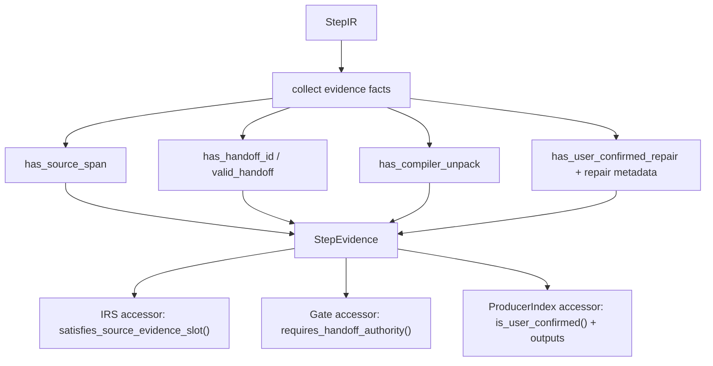
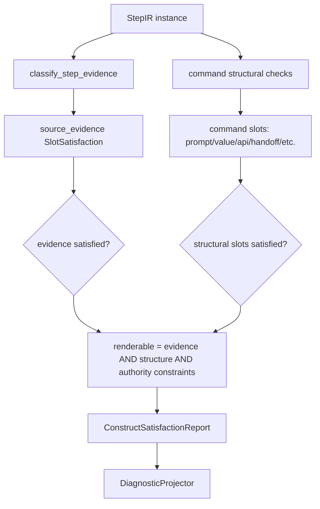
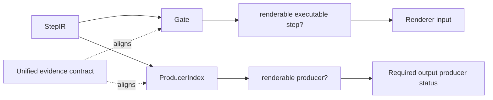
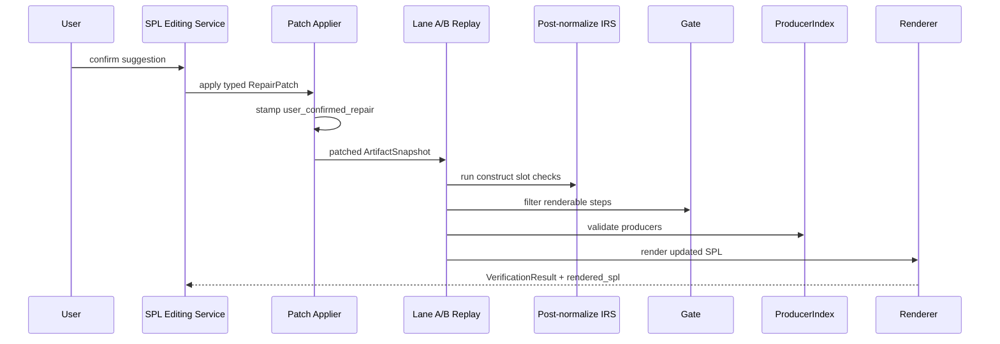

# SPL Editing User-Confirmed Repair Evidence 实施计划

状态：已实施 (2026-06-15)  
来源设计：[spl_editing_architecture_design_v2.md](../design/spl_editing_architecture_design_v2.md)  
参考模板：[implementation_plan_template.md](../templates/implementation_plan_template.md)  
目标产物：统一的 `user_confirmed_repair` evidence 机制，使当前和未来所有经过用户确认的修复结果都能被 IRS / Gate / ProducerIndex / Renderer / Provenance / Verification 权威链路一致识别、审计和强制验证。

---

## 0. 背景与问题定义

`spl_editing_architecture_design_v2.md` 要求 SPL Editing 的修复结果必须是：

```text
typed RepairPatch
  -> user confirmation
  -> stage-level artifact update
  -> compiler authority replay
  -> IRS / Gate / ProducerIndex / Renderer verification
```

设计中明确规定：

```text
metadata.origin == "user_confirmed_repair"
  -> Gate recognizes it
  -> ProducerIndex recognizes it
  -> Post-normalize IRS treats it as confirmed evidence
```

当前代码中该机制已经部分存在：

- `ExecutableElementGate` 能识别 `user_confirmed_repair` 并允许其按 command-type guard rails 渲染。
- `ProducerIndex` 能把 `user_confirmed_repair` step 视为 renderable producer。
- `PostNormalizeIRSCheckerV6._source_evidence_slot()` 能把 `user_confirmed_repair` 判为 `source_evidence=satisfied`。
- 多个 SPL Editing patch applier 已经给新增 `StepIR` 打上 `metadata.origin="user_confirmed_repair"`。

但当前实现仍存在关键缺口：

```text
Post-normalize IRS 的部分 command-specific checker
仍直接使用 bool(step.source_span_ids)
判断 prompt_text / value_target / call_action / renderable。
```

这导致 `user_confirmed_repair` 只在 `_source_evidence_slot()` 生效，却没有自然贯通到所有 command slot checker。典型失败场景是：

```text
REQUEST_INPUT
  source_span_ids = []
  metadata.origin = "user_confirmed_repair"
  outputs = ["user_answer"]

当前结果：
  source_evidence = satisfied
  prompt_text = missing
  value_target = missing
  renderable = false
```

这与设计要求不一致。

### 0.1 本轮修订吸收的关键结论

本实施计划的目标从“compiler authority replay 一致识别”升级为“compiler authority + provenance + verification + future patch compliance 全链路闭环”。

新增必须覆盖的风险：

```text
1. ProvenanceAggregator 不能继续把 user-confirmed repair step 标成 assumed。
2. apply_suggestion() 必须接收并传递真实 user_text。
3. patch apply 结果必须暴露 changed refs / evidence refs，供 verification 做通用 evidence 检查。
4. PatchRegistry 或 patch bundle contract 必须声明 patch 的 evidence obligation，不能只靠人工测试记忆。
5. StepEvidence 不能只有单一 kind；必须携带 handoff / source / repair metadata 等多维事实，避免 Gate / IRS / ProducerIndex 误用。
6. INVOKE_WORKER 的 post-normalize IRS 校验必须拿到 handoff_index / child worker / worker id mapping，不能只判断字符串存在。
```

---

## 1. 总体目标

本计划目标不是只修复 `REQUEST_INPUT` 的一个 if 条件，而是建立一套未来可扩展的 confirmed evidence 规则：

```text
StepIR
  -> unified evidence classification
  -> command-specific structural slot checks
  -> ConstructSatisfactionReport
  -> DiagnosticProjector
  -> CompileDiagnostic
```

最终系统应满足：

```text
用户确认后的修复结果
  -> 带有明确 user_confirmed_repair evidence
  -> 不需要原始 source_span_ids 也能作为 confirmed evidence
  -> 仍必须满足 command type 自身结构要求
  -> 不能绕过 handoff / API / output producer 等 authority
  -> 可被 Lane A / Lane B replay 稳定验证
```

目标行为：

```text
GENERAL_COMMAND + user_confirmed_repair
  -> source_evidence satisfied
  -> action_text 仍需存在

REQUEST_INPUT + user_confirmed_repair
  -> source_evidence satisfied
  -> prompt_text 由 step.text 校验
  -> value_target 由 step.outputs 校验

CALL_API + user_confirmed_repair
  -> source_evidence satisfied
  -> api_name / integration_ref / declaration 仍需校验

INVOKE_WORKER + user_confirmed_repair
  -> user confirmation 不绕过 handoff contract
  -> target_worker / handoff_id / bindings 仍由 worker authority 校验

DISPLAY_MESSAGE + user_confirmed_repair
  -> 可通过 Gate / Renderer
  -> 如不属于 IRS step construct，则不新增额外 IRS 语义
```

---

## 2. 非目标

本计划不做：

- 不新增新的 repair capability。
- 不修改 LLM suggestion 生成策略。
- 不修改 final SPL text。
- 不让 IRS 生成、修复或改写 IR。
- 不把 `user_confirmed_repair` 伪装为 `source_backed`。
- 不允许 `user_confirmed_repair` 绕过 command type 的结构要求。
- 不允许 `user_confirmed_repair` 绕过 handoff contract、API declaration、ProducerIndex 或 Renderer。
- 不把 diagnostic kind 作为新的 construct truth source。
- 不修改 `DELEGATION_INTENT` 边界。
- 不为兼容失败静默 fallback 到 source span / report / debug JSON 解析。

---

## 3. 全局硬性原则

所有阶段必须遵守：

1. `user_confirmed_repair` 是 confirmed evidence，不是 source span。
2. `source_backed`、`handoff_generated`、`compiler_unpack`、`user_confirmed_repair` 必须语义分离。
3. IRS checker 只做 slot satisfaction，不调用 LLM、不应用 patch、不生成 SPL。
4. Gate 仍是 executable step renderability authority。
5. ProducerIndex 仍是 required output producer authority。
6. Post-normalize IRS 仍是 final construct-level authority。
7. Renderer 只消费 gated / assembled IR，不推断 repair evidence。
8. `user_confirmed_repair` 只能补足 evidence slot，不能补足缺失的 structural slot。
9. unconfirmed AI suggestion 不得被 Gate / IRS / ProducerIndex 当作 confirmed evidence。
10. 任何新增 patch 只要创建 executable / materialized `StepIR`，必须显式写入 repair evidence metadata。
11. 非 `StepIR` 修复 artifact 需要自己的 confirmed evidence 字段，例如 handoff binding status source。
12. 测试必须覆盖 command-specific checker，而不是只测试底层 helper。
13. 不允许通过 `diagnostic.message`、report text 或 stage debug JSON 推断 evidence。
14. 不允许新增 skip / xfail 来绕过已知失败。

---

## 4. LLM / Rule-Based 决策约束

本计划不引入新的 LLM 行为。

允许的确定性逻辑仅限：

- 从 `StepIR.source_span_ids`、`StepIR.handoff_id`、`StepIR.metadata.origin` 读取 evidence 信息。
- 从 `WorkerPlanIR.handoffs` 校验 handoff id 是否存在。
- 从 command-specific structured fields 校验结构完整性，例如 `outputs`、`integration_ref`、`handoff_id`。
- 将 evidence 分类结果投影为 `SlotSatisfaction`。
- 将不可用原因投影为明确 diagnostic。

禁止：

- 根据自然语言 prompt / title / diagnostic message 推断 evidence。
- 根据 LLM 输出文本推断 user confirmation。
- 在 IRS checker 中调用 LLM 或 repair handler。
- 为了让修复通过而降低 handoff / API / output producer 校验。

---

## 5. 目标语义模型

### 5.1 Evidence 分类

统一 evidence 分类应至少区分：

```text
source_span
valid_handoff
compiler_unpack
user_confirmed_repair
missing
```

其中：

```text
source_span:
  step.source_span_ids 非空。

valid_handoff:
  step.handoff_id 存在且能在 WorkerPlanIR.handoffs 中找到。

compiler_unpack:
  step.metadata.origin == "compiler_unpack"。

user_confirmed_repair:
  step.metadata.origin == "user_confirmed_repair"。

missing:
  以上均不成立。
```

单一 `kind` 不能成为唯一事实来源。否则当一个 step 同时带有 `source_span_ids` 和 `handoff_id` 时，Gate 可能错误地把它当成普通 source-backed step，绕过 handoff authority。

因此 `StepEvidence` 必须携带多维事实：

```python
@dataclass(frozen=True)
class StepEvidence:
    primary_kind: StepEvidenceKind
    satisfied: bool

    has_source_span: bool
    has_user_confirmed_repair: bool
    has_compiler_unpack: bool
    has_handoff_id: bool
    valid_handoff: bool

    source_span_ids: tuple[str, ...] = ()
    repair_patch_id: str | None = None
    related_diagnostic_id: str | None = None
    user_text: str | None = None
    explanation: str | None = None
```

并提供语义 accessor，避免各 authority 自己解释字段：

```python
def satisfies_source_evidence_slot(self) -> bool: ...
def requires_handoff_authority(self) -> bool: ...
def is_user_confirmed(self) -> bool: ...
def repair_metadata_complete(self) -> bool: ...
```

Gate 可以使用 `requires_handoff_authority()` 保持 handoff-first 规则；IRS 可以使用 `satisfies_source_evidence_slot()`；ProducerIndex 可以使用 `is_user_confirmed()` 和 output/handoff 检查组合判断 producer renderability。

### 5.2 Evidence 与结构 slot 的关系

Evidence 只能回答：

```text
这个 step 是否有可接受来源？
```

它不能回答：

```text
REQUEST_INPUT 是否有 value target？
CALL_API 是否有 API name？
INVOKE_WORKER 是否有 handoff contract？
required output 是否真的被 produced？
```

因此每个 command checker 必须拆成两层：

```text
confirmed evidence check
command structural slot check
```

### 5.3 Renderability 组合规则

推荐组合：

```text
renderable =
  evidence_satisfied
  AND command_structural_slots_satisfied
  AND authority_specific_constraints_satisfied
```

其中 authority-specific constraints 包括：

- `INVOKE_WORKER` 必须有有效 handoff / target worker / bindings。
- `CALL_API` 必须有具体 API target，并满足声明或 handoff-backed API 规则。
- output producer 是否有效仍由 ProducerIndex 判定。

---

## 6. Phase U-1：Contract Freeze / Current Gap Lock

### 6.1 目标

先锁定当前缺口和目标 contract，避免后续实现把 `user_confirmed_repair` 简化成 `source_backed` 或绕过结构 slot。

### 6.2 可编辑范围

允许新增或修改：

```text
tests/unit/compiler/irs/
tests/unit/compiler/spl_editing/
docs/implementation/
```

### 6.3 禁止改动

本阶段禁止修改：

```text
src/nl2spl/compiler/irs/checkers/post_normalize.py
src/nl2spl/pipeline/executable_gate.py
src/nl2spl/compiler/producer_index.py
src/nl2spl/compiler/spl_editing/patches/
```

### 6.4 设计要求

新增 characterization tests，明确当前缺口：

```text
REQUEST_INPUT + user_confirmed_repair + outputs + no source spans
  当前 post-normalize IRS 仍可能报 prompt/value diagnostics。

_source_evidence_slot(user_confirmed_repair)
  当前已 satisfied，但不足以证明完整 command checker 已接入。
```

同时新增 expected contract tests，可以先标记为将要修复的目标测试，但不得长期 xfail。

### 6.5 测试计划

必须覆盖：

1. `_source_evidence_slot()` 对 `user_confirmed_repair` 返回 satisfied。
2. 完整 `_check_request_input()` 当前与目标行为的差异。
3. `GENERAL_COMMAND` 当前能通过 user-confirmed evidence。
4. `CALL_API` / `INVOKE_WORKER` 当前是否存在类似直接 `source_span_ids` 判断。
5. 现有 Gate / ProducerIndex 行为快照。

### 6.6 验收标准

1. 当前缺口被测试精确描述。
2. 测试不靠 diagnostic message regex。
3. 没有生产代码行为变更。
4. PM 能从测试名直接看出待修复 contract。

### 6.7 实现思路

本阶段只写测试和文档，不改生产代码。推荐先新增一个聚焦的测试文件：

```text
tests/unit/compiler/irs/test_user_confirmed_repair_evidence_contract.py
```

测试 helper 应直接构造结构化 IR，而不是从 SPL 文本或 report 中解析：

```python
def _step(
    *,
    command_type: str,
    text: str = "Ask user.",
    outputs: tuple[str, ...] = (),
    source_span_ids: tuple[str, ...] = (),
    origin: str | None = None,
) -> StepIR: ...
```

建议测试分两类：

```text
current_gap_*:
  描述当前失败事实，证明 helper-level source_evidence satisfied 不等于完整 checker 生效。

target_contract_*:
  描述最终期望。实现阶段完成后这些测试必须变成常规 passing tests。
```

如果项目不接受短期 xfail，则先用 current-gap 测试锁住事实，并在 U1 中直接补目标测试；不要留下长期 xfail。

测试不要直接断言完整 diagnostic message，应该断言：

```text
report.renderable
report.completeness
slot.status
slot.diagnostic_kind
slot.slot_name
```

本阶段最重要的代码级判断是：测试必须覆盖完整 `_check_request_input()` 或 post-normalize runner，而不是只测 `_source_evidence_slot()`。

---

## 7. Phase U0：Unified Step Evidence Model

### 7.1 目标

引入 compiler-owned 的统一 step evidence predicate，使 IRS / Gate / ProducerIndex 可以共享同一套 evidence 语义或至少使用同一 contract。

### 7.2 可编辑范围

允许新增：

```text
src/nl2spl/compiler/evidence/
  __init__.py
  step_evidence.py

tests/unit/compiler/evidence/
```

允许修改：

```text
src/nl2spl/compiler/irs/checkers/post_normalize.py
src/nl2spl/pipeline/executable_gate.py
src/nl2spl/compiler/producer_index.py
```

### 7.3 禁止改动

禁止：

```text
src/nl2spl/compiler/spl_editing/handlers/
src/nl2spl/compiler/spl_editing/presentation/
src/nl2spl/pipeline/stages/stage11_spl_renderer/
```

### 7.4 设计要求

统一 evidence model 必须：

```text
输入：
  StepIR
  optional valid_handoff_ids / handoff_index

输出：
  evidence kind
  satisfied / missing
  relation
  source_span_ids
  explanation
```

不得包含：

```text
diagnostic.kind 推断
command type repair strategy
LLM prompt / parser
SPL rendering logic
PatchApplier
```

关键语义：

```text
source_span_ids 非空 -> source_span evidence
valid handoff -> valid_handoff evidence
compiler_unpack -> compiler_unpack evidence
user_confirmed_repair -> user_confirmed_repair evidence
none -> missing
```

### 7.5 测试计划

新增测试覆盖：

1. source span evidence。
2. valid handoff evidence。
3. compiler unpack evidence。
4. user-confirmed repair evidence。
5. unconfirmed AI-like step without source spans remains missing。
6. handoff id present but invalid does not become user-confirmed by accident。
7. source span 优先级不抹掉 user-confirmed metadata，但 evidence kind 必须稳定。

### 7.6 验收标准

1. Evidence predicate 不 import SPL Editing patch / handler / service。
2. Evidence predicate 不调用 LLM。
3. Evidence predicate 不读取 report / stage debug JSON。
4. Gate / ProducerIndex / IRS 可复用或对齐该 contract。

### 7.7 实现思路

推荐新增 compiler-owned 中立模块：

```text
src/nl2spl/compiler/evidence/
  __init__.py
  step_evidence.py
```

不要使用已存在但为空的：

```text
src/nl2spl/compiler/spl_editing/evidence/
```

因为 Gate、ProducerIndex、IRS 都属于 compiler authority，不能反向依赖 `spl_editing`。

建议的最小模型：

```python
class StepEvidenceKind(StrEnum):
    SOURCE_SPAN = "source_span"
    VALID_HANDOFF = "valid_handoff"
    COMPILER_UNPACK = "compiler_unpack"
    USER_CONFIRMED_REPAIR = "user_confirmed_repair"
    MISSING = "missing"


@dataclass(frozen=True)
class StepEvidence:
    primary_kind: StepEvidenceKind
    satisfied: bool

    has_source_span: bool = False
    has_user_confirmed_repair: bool = False
    has_compiler_unpack: bool = False
    has_handoff_id: bool = False
    valid_handoff: bool = False

    source_span_ids: tuple[str, ...] = ()
    repair_patch_id: str | None = None
    related_diagnostic_id: str | None = None
    user_text: str | None = None
    relation: str | None = None
    explanation: str | None = None

    def satisfies_source_evidence_slot(self) -> bool: ...
    def requires_handoff_authority(self) -> bool: ...
    def is_user_confirmed(self) -> bool: ...
```

建议的入口函数：

```python
def classify_step_evidence(
    step: StepIR,
    *,
    valid_handoff_ids: Collection[str] = (),
    allow_unknown_handoff_when_no_index: bool = False,
) -> StepEvidence: ...
```

`allow_unknown_handoff_when_no_index` 用于保留当前 `_source_evidence_slot()` 中 “有 handoff_id 但没有 handoff index 时暂视为 satisfied” 的既有语义；如果 PM 不接受该兼容行为，必须在 U0 Decision 中明确改掉，不能偷偷改。

建议再提供一个 IRS adapter，而不是让每个 checker 手写 `SlotSatisfaction`：

```python
def evidence_to_slot(
    evidence: StepEvidence,
    *,
    missing_diagnostic: str | None,
    diagnostic_required_for: str,
) -> SlotSatisfaction: ...
```

该 adapter 可以放在 `post_normalize.py` 内部，也可以放在 `compiler/evidence`。如果放在 `compiler/evidence`，必须确认不会让该模块依赖 IRS 过深；更保守的做法是：

```text
compiler/evidence:
  只返回 StepEvidence。

post_normalize.py:
  将 StepEvidence 转成 SlotSatisfaction。
```

流程图：



边界测试建议用 import inspection 锁住：

```text
compiler.evidence 不 import nl2spl.compiler.spl_editing
compiler.evidence 不 import llm / handlers / renderer
```

---

## 8. Phase U1：Post-Normalize IRS Step Checker Refactor

### 8.1 目标

让 post-normalize IRS 的所有 step command checker 都使用统一 evidence 语义，并把 evidence slot 与 command structural slot 分离。

### 8.2 可编辑范围

允许修改：

```text
src/nl2spl/compiler/irs/checkers/post_normalize.py
tests/unit/compiler/irs/
tests/unit/compiler/spl_editing/
```

### 8.3 禁止改动

禁止：

```text
src/nl2spl/compiler/spl_editing/handlers/
src/nl2spl/compiler/spl_editing/patches/*/handler.py
src/nl2spl/pipeline/stages/stage11_spl_renderer/
```

### 8.4 设计要求

#### GENERAL_COMMAND

```text
action_text:
  satisfied if step.text 非空。

source_evidence:
  satisfied if unified evidence satisfied。

renderable:
  action_text satisfied
  AND source_evidence satisfied。
```

#### REQUEST_INPUT

```text
prompt_text:
  satisfied if step.text 非空。

value_target:
  satisfied if step.outputs 非空。

source_evidence:
  satisfied if unified evidence satisfied。

renderable:
  prompt_text satisfied
  AND value_target satisfied
  AND source_evidence satisfied。
```

`user_confirmed_repair` 不得让缺少 `outputs` 的 `REQUEST_INPUT` 通过。

#### CALL_API

```text
api_name:
  satisfied if integration_ref / declared API / api handoff condition satisfied。

call_action:
  satisfied if step.text 非空 AND unified evidence satisfied。

source_evidence:
  satisfied if unified evidence satisfied。

renderable:
  api constraints satisfied
  AND call_action satisfied
  AND source_evidence satisfied。
```

`user_confirmed_repair` 不得让缺少 API target 的 `CALL_API` 通过。

#### INVOKE_WORKER

```text
target_worker:
  satisfied if integration_ref points to declared child worker.

handoff_id:
  satisfied if handoff_id exists and resolves to a valid handoff.

source_evidence:
  satisfied by valid handoff or confirmed repair evidence,
  but confirmed repair evidence must not bypass handoff_id / target_worker slots.

renderable:
  target_worker satisfied
  AND handoff_id satisfied
  AND handoff binding constraints satisfied。
```

U1 必须同步修改 `_check_step()` 到 `_check_invoke_worker()` 的参数传递。当前只传 `instance, step, irs` 不足以判断 handoff 是否真实有效。

`_check_step()` 应从 `worker_plan` 派生：

```python
handoff_index = {h.handoff_id: h for h in worker_plan.handoffs}
valid_handoff_ids = set(handoff_index)
child_worker_names = self._child_worker_names(worker_plan)
worker_by_id = self._worker_id_to_name(worker_plan)
```

然后传入：

```python
_check_invoke_worker(
    instance,
    step,
    irs,
    handoff_index=handoff_index,
    child_worker_names=child_worker_names,
    worker_by_id=worker_by_id,
)
```

`INVOKE_WORKER` 的 slot 不能只判断 `step.handoff_id` 非空。必须检查：

```text
handoff_id exists in handoff_index
handoff.to_worker resolves to declared child worker
step.integration_ref matches resolved child worker name
step.inputs match handoff.input_bindings parent variables
step.outputs match handoff.output_bindings parent variables
```

这与 Gate 的 handoff authority 保持一致。

#### DISPLAY_MESSAGE

如果 `DISPLAY_MESSAGE` 不属于 post-normalize IRS step construct registry，则本阶段不新增 construct。其 evidence 仍由 Gate / Renderer 处理。

### 8.5 测试计划

必须新增：

1. `REQUEST_INPUT + user_confirmed_repair + outputs + no source spans` -> complete/renderable。
2. `REQUEST_INPUT + user_confirmed_repair + no outputs` -> source_evidence satisfied，但 value_target missing。
3. `GENERAL_COMMAND + user_confirmed_repair + no source spans` -> complete/renderable。
4. `GENERAL_COMMAND + no evidence` -> remains partial/non-renderable。
5. `CALL_API + user_confirmed_repair + missing integration_ref` -> still missing api_name。
6. `CALL_API + user_confirmed_repair + valid integration_ref/declaration` -> complete/renderable。
7. `INVOKE_WORKER + user_confirmed_repair + missing handoff_id` -> still missing handoff_id。
8. `INVOKE_WORKER + valid handoff` -> complete/renderable。
9. `unconfirmed AI step` with no source spans -> still rejected。

### 8.6 验收标准

1. `REQUEST_INPUT` 不再直接用 `bool(step.source_span_ids)` 判定所有 slot。
2. `CALL_API` / `INVOKE_WORKER` 不再把 evidence 与结构要求混在一起。
3. `user_confirmed_repair` 只补足 evidence，不补足结构字段。
4. 所有现有 IRS tests 通过。

### 8.7 实现思路

核心改法是把 post-normalize step checker 拆成三层：

```text
evidence layer:
  classify_step_evidence(step, valid_handoff_ids)

structural layer:
  command-specific slot presence checks

report layer:
  SlotSatisfaction[] + renderable bool -> ConstructSatisfactionReport
```

建议在 `PostNormalizeIRSCheckerV6` 内新增小 helper，而不是在每个 checker 中重复判断：

```python
@staticmethod
def _confirmed_evidence(step: StepIR, valid_handoff_ids: set[str]) -> StepEvidence:
    return classify_step_evidence(
        step,
        valid_handoff_ids=valid_handoff_ids,
        allow_unknown_handoff_when_no_index=True,
    )


@staticmethod
def _source_evidence_slot_from_evidence(
    step: StepIR,
    irs: ConstructIRS,
    evidence: StepEvidence,
) -> SlotSatisfaction: ...
```

然后保留 `_source_evidence_slot()` 作为兼容 facade：

```python
def _source_evidence_slot(step, irs, valid_handoff_ids):
    evidence = _confirmed_evidence(step, valid_handoff_ids)
    return _source_evidence_slot_from_evidence(step, irs, evidence)
```

这样可以降低现有测试和调用点的改动面。

#### REQUEST_INPUT 具体思路

不要再让 `prompt_text` 和 `value_target` 使用 `source_backed`。建议：

```python
has_prompt_text = bool(step.text and step.text.strip())
has_value_target = bool(step.outputs)
evidence = _confirmed_evidence(step, valid_handoff_ids)

prompt.status = "satisfied" if has_prompt_text else "missing"
value_target.status = "satisfied" if has_value_target else "missing"
source_evidence.status = "satisfied" if evidence.satisfied else "missing"

renderable = has_prompt_text and has_value_target and evidence.satisfied
```

如果 `source_evidence` missing，diagnostic 应归 source/evidence slot；如果 `value_target` missing，diagnostic 应归 `REQUEST_INPUT.value_target`，不能因为 user-confirmed evidence 而压掉。

#### CALL_API 具体思路

CALL_API 不能只因 user confirmation 就变成有效 API call。建议：

```python
has_api_name = bool(step.integration_ref)
api_declared = integration_ref in declared_apis or integration_ref in extra_api_names or api_handoff_valid
has_call_action = bool(step.text and step.text.strip())
evidence = _confirmed_evidence(...)

api_name satisfied = has_api_name and api_declared
call_action satisfied = has_call_action and evidence.satisfied
renderable = api_name satisfied and call_action satisfied
```

如果 API 未声明，仍然报 API slot diagnostic。

#### INVOKE_WORKER 具体思路

INVOKE_WORKER 的主 authority 是 handoff contract，不是 user confirmation。建议：

```python
has_target_worker = bool(step.integration_ref)
has_handoff = bool(step.handoff_id)
handoff_valid = step.handoff_id in valid_handoff_ids
evidence = _confirmed_evidence(...)

target_worker satisfied = has_target_worker and target exists
handoff_id satisfied = has_handoff and handoff_valid
source_evidence satisfied = evidence.satisfied
renderable = target_worker satisfied and handoff_id satisfied and handoff constraints satisfied
```

注意：即使 `source_evidence satisfied` 来自 `USER_CONFIRMED_REPAIR`，也不能让缺失 `handoff_id` 的 INVOKE_WORKER 通过。

流程图：



代码审查时重点 grep：

```text
bool(step.source_span_ids)
step.source_span_ids else
renderable = .*source_span
```

这些不一定都要删除，但不能再作为 command renderability 的唯一判定。

---

## 9. Phase U2：Gate / ProducerIndex Alignment Hardening

### 9.1 目标

确认 Gate 和 ProducerIndex 与统一 evidence contract 一致，并补足回归测试，避免它们未来与 IRS evidence 语义漂移。

### 9.2 可编辑范围

允许修改：

```text
src/nl2spl/pipeline/executable_gate.py
src/nl2spl/compiler/producer_index.py
tests/unit/compiler/spl_editing/
tests/unit/pipeline/
```

### 9.3 设计要求

Gate 仍负责：

```text
source_backed -> renderable with command guard rails
handoff_generated -> renderable only with valid handoff contract
compiler_unpack -> renderable for deterministic unpack scaffolding
user_confirmed_repair -> renderable with same command guard rails as source-backed
assumed -> non-renderable
```

ProducerIndex 仍负责：

```text
renderable producer discovery
required output producer validation
user_confirmed_repair producer recognition
```

不得让 ProducerIndex 伪造 producer entry，也不得让 Gate 跳过 handoff contract。

### 9.4 测试计划

1. Gate accepts `GENERAL_COMMAND user_confirmed_repair`。
2. Gate accepts `REQUEST_INPUT user_confirmed_repair` with outputs。
3. Gate rejects invalid `CALL_API` even if user-confirmed。
4. Gate rejects invalid `INVOKE_WORKER` without valid handoff。
5. ProducerIndex recognizes output produced by user-confirmed producer step。
6. ProducerIndex does not recognize unconfirmed no-source step。

### 9.5 验收标准

1. Gate / ProducerIndex behavior 与 post-normalize IRS evidence contract 一致。
2. 没有新 fallback。
3. 没有绕过 existing authority。

### 9.6 实现思路

Gate 当前已经有 `classify_origin()` 和 `_source_backed_renderable()`，不建议大改。推荐策略是：

```text
先补测试锁定现有行为；
再决定是否让 classify_origin() 内部调用 compiler.evidence；
如果调用会引入过大改动，则保留现有分类，但增加 contract tests 保证语义一致。
```

如果选择接入 `compiler.evidence`，Gate 可以这样组织：

```python
evidence = classify_step_evidence(step, valid_handoff_ids=handoff_index.keys())

if evidence.primary_kind == StepEvidenceKind.SOURCE_SPAN:
    origin = "source_backed"
elif evidence.primary_kind == StepEvidenceKind.USER_CONFIRMED_REPAIR:
    origin = "user_confirmed_repair"
...
```

但 `handoff_generated` 在 Gate 中有更强的结构校验，因此 `step.handoff_id is not None` 的分支仍应优先进入 handoff 校验，不应被普通 evidence predicate 吞掉。

ProducerIndex 的改动也应保持保守。推荐只把 `_step_is_renderable()` 中的 evidence 判断与 U0 contract 对齐：

```text
source_span -> renderable
valid handoff -> renderable
compiler_unpack -> renderable
user_confirmed_repair -> renderable
missing -> non-renderable
```

但 producer matching 本身仍由 outputs / worker scope / handoff bindings 决定，不应由 evidence predicate 伪造。

流程图：



---

## 10. Phase U3：Patch Applier Evidence Stamping Contract

### 10.1 目标

确保所有当前和未来 patch applier 创建的修复 artifact 都显式携带 confirmed evidence，并通过测试约束防止新 patch 遗漏。

### 10.2 可编辑范围

允许修改：

```text
src/nl2spl/compiler/spl_editing/patches/
tests/unit/compiler/spl_editing/
```

### 10.3 设计要求

所有创建 `StepIR` 的 patch applier 必须写入：

```text
metadata.origin = "user_confirmed_repair"
metadata.repair_patch_id
metadata.related_diagnostic_id
```

如果 patch 创建非 StepIR 的 authority artifact，则必须使用该 artifact 的结构化 evidence 字段。例如：

```text
WorkerHandoffIR.input_binding_status_source = "user_confirmed_repair"
WorkerHandoffIR.output_binding_status_source = "user_confirmed_repair"
```

`BindExistingProducerStep` 不新增 step，但必须：

```text
只允许绑定 source-backed 或 user-confirmed renderable step；
写入 repair_output_bindings audit metadata；
不把不可渲染 step 变成 producer。
```

### 10.4 测试计划

1. 每个 StepIR-producing patch 都验证 `origin=user_confirmed_repair`。
2. 每个 StepIR-producing patch 都验证 `repair_patch_id` 和 related diagnostic metadata。
3. CreateWorkerHandoffContract 同时验证 handoff status source 和 generated invoke step metadata。
4. BindExistingProducerStep 验证不能绑定 assumed step。
5. 新增 patch bundle 时必须有 evidence stamping 测试。

### 10.5 验收标准

1. 当前所有 patch 类型符合 stamping contract。
2. 新 patch 类型没有测试就无法通过。
3. Stamping 不由 LLM 决定，只由 apply confirmation boundary 决定。

### 10.6 实现思路

U3 的边界必须保持清楚：本阶段只锁定和补齐 patch applier 的 stamping 行为测试，可以保持现有 applier 结构和返回协议不变。

`PatchApplyResult`、`changed_refs`、`evidence_refs`、registry contract 等返回协议和 apply boundary 变更统一放到 U3.5。U3 不应提前重构 applier 返回值，避免与 U3.5 产生重复迁移。

建议新增一个测试级 audit helper，而不是把 patch applier 改成继承复杂基类。目标是先约束行为，不制造额外抽象。

测试 helper 可以按 patch family 构造最小 patch，然后检查 patched snapshot：

```python
def assert_user_confirmed_step(step: StepIR, patch: RepairPatch) -> None:
    assert step.metadata["origin"] == "user_confirmed_repair"
    assert step.metadata["repair_patch_id"] == patch.patch_id
    assert step.metadata["related_diagnostic_id"] == patch.evidence.related_diagnostic_id
```

对当前 patch 类型分组：

```text
StepIR-producing:
  AddExceptionHandlerStep
  InsertProducerStep
  ConvertDelegationIntentToMainFlowStep
  ConvertDelegationIntentToRequestInput
  CreateWorkerHandoffContract generated invoke step

non-StepIR binding:
  BindExistingProducerStep

non-StepIR authority artifact:
  CreateWorkerHandoffContract WorkerHandoffIR
```

如果后续希望减少重复，可以再引入小型 factory：

```python
def repair_step_metadata(patch: RepairPatch, *, extra: Mapping[str, object] = {}) -> dict:
    return {
        "origin": "user_confirmed_repair",
        "repair_patch_id": patch.patch_id,
        "related_diagnostic_id": patch.evidence.related_diagnostic_id,
        **extra,
    }
```

但这个 helper 不应放在 `compiler.evidence`，因为它属于 SPL Editing patch apply metadata stamping，不是 compiler authority evidence classification。

审核重点：

```text
LLM suggestion payload 不能携带 origin。
origin 只能在 user-confirmed apply boundary 后由 applier 写入。
```

---

## 10A. Phase U3.5：Apply Boundary / User Text / PatchApplyResult

### 10A.1 目标

把 `user_confirmed_repair` 从“applier 自己写 metadata”提升为 apply boundary 的强制 contract。用户确认文本、changed refs、evidence refs 必须从 service apply 边界一路传到 patched artifact、overlay event、verification 和 provenance。

### 10A.2 可编辑范围

允许修改：

```text
src/nl2spl/compiler/spl_editing/core/service.py
src/nl2spl/compiler/spl_editing/core/model.py
src/nl2spl/compiler/spl_editing/core/revision.py
src/nl2spl/compiler/spl_editing/patches/base.py
src/nl2spl/compiler/spl_editing/patches/registry.py
tests/unit/compiler/spl_editing/
```

### 10A.3 设计要求

`apply_suggestion()` 必须接收真实确认文本：

```python
def apply_suggestion(
    self,
    session_id: str,
    suggestion_id: str,
    *,
    user_text: str | None = None,
) -> EditingSession: ...
```

不得继续无条件写：

```python
RepairEvidence(user_text="")
```

如果用户没有输入额外文本，可以保存空字符串；但 API 必须允许传入，测试必须覆盖非空值。

Patch applier 返回值应升级为结构化结果，例如：

```python
@dataclass(frozen=True)
class PatchApplyResult:
    patched_snapshot: ArtifactSnapshot
    overlay_event: OverlayEvent
    changed_refs: tuple[str, ...]
    changed_step_ids: tuple[str, ...] = ()
    changed_handoff_ids: tuple[str, ...] = ()
    evidence_refs: tuple[RepairEvidenceRef, ...] = ()
```

如果为了渐进兼容保留旧 `(snapshot, event)` 返回形式，也必须在 U3.5 内明确 deprecation lifecycle，并在 U6 前移除或封装。

建议引入 patch type contract：

```python
@dataclass(frozen=True)
class PatchTypeContract:
    patch_type: str
    produces_step_ir: bool
    produces_handoff_ir: bool
    requires_user_confirmed_evidence: bool = True
    evidence_targets: tuple[str, ...] = ()
```

`PatchBundle` 或 `PatchRegistry.register()` 必须能接收该 contract。未来新增 patch 时，registry / tests 可自动检查 evidence obligations。

### 10A.4 实现思路

推荐分三步：

```text
Step 1:
  扩展 service.apply_suggestion(user_text=...)。
  confirmed_patch.evidence.user_text 使用传入值。

Step 2:
  引入 PatchApplyResult，但先允许 applier adapter 包装旧返回值。
  所有现有 applier 逐步补 changed refs。

Step 3:
  PatchBundle 增加 PatchTypeContract。
  registry audit 验证 contract 与 applier result 一致。
```

changed ref 建议使用稳定字符串：

```text
step:{worker_id}:{step_id}
handoff:{handoff_id}
worker_plan:{worker_id}
worker_step_plan:{worker_id}:{step_id}
```

`RepairEvidenceRef` 建议至少包含：

```python
@dataclass(frozen=True)
class RepairEvidenceRef:
    artifact_ref: str
    evidence_kind: Literal["user_confirmed_repair"]
    repair_patch_id: str
    related_diagnostic_id: str
    user_text: str
```

### 10A.5 测试计划

必须覆盖：

1. `apply_suggestion(user_text="...")` 写入 `RepairEvidence.user_text`。
2. StepIR-producing patch 的 `StepIR.metadata["user_text"]` 等于用户确认文本。
3. `PatchApplyResult.changed_step_ids` 非空。
4. `PatchApplyResult.evidence_refs` 非空且包含 patch id / diagnostic id / user_text。
5. PatchBundle 缺少 `PatchTypeContract` 时 registry audit 失败。
6. `produces_step_ir=True` 但 result 中没有 changed step evidence 时 verification 前置检查失败。

### 10A.6 验收标准

1. 用户确认文本不再在 apply boundary 丢失。
2. 每个 applied patch 都能提供 changed refs。
3. Registry 能描述 patch 的 evidence obligation。
4. 后续 verification / provenance 不需要猜测哪些 artifact 是修复结果。

---

## 11. Phase U4：Lane A / Lane B Verification Integration

### 11.1 目标

确保修复后的 evidence 语义在 SPL Editing replay 中真实生效，而不是只在单元测试中通过。

### 11.2 可编辑范围

允许修改：

```text
tests/unit/compiler/spl_editing/
tests/integration/compiler/spl_editing/
examples/output/spl_editing_demo/
```

生产代码仅限必要接线修复。

### 11.3 测试计划

必须覆盖：

1. `AddExceptionHandlerStep(command_type=REQUEST_INPUT)` -> Lane A accepted。
2. `InsertProducerStep(command_type=REQUEST_INPUT)` -> ProducerIndex resolves missing output -> Lane A accepted。
3. `ConvertDelegationIntentToRequestInput` -> Lane A accepted 或按 patch lane 预期 accepted。
4. `CreateWorkerHandoffContract` -> Lane B accepted，handoff + invoke step 不被 user-confirmed evidence 错误绕过。
5. unconfirmed suggestion preview 不影响 replay。
6. user-confirmed repair step 出现在 rendered SPL。

### 11.4 验收标准

1. Lane A / Lane B replay 都实际调用 compiler authorities。
2. 没有 patch 直接修改 rendered SPL。
3. `VerificationResult.accepted=True` 只在 diagnostics / Gate / ProducerIndex / Renderer 均满足时出现。
4. `REQUEST_INPUT` user-confirmed repair 不再产生 assumed / value target false positive。
5. VerificationRunner 对 `PatchApplyResult.changed_refs` 执行通用 evidence 检查。
6. 缺少 required evidence 的 changed artifact 即使 diagnostic 消失也不能 accepted。

### 11.5 实现思路

本阶段不要 mock post-normalize IRS。应使用现有 verification runner 的真实 Lane A / Lane B replay。

推荐测试结构：

```text
tests/integration/compiler/spl_editing/test_user_confirmed_repair_evidence_e2e.py
```

每个 E2E 场景都应断言三层事实：

```text
patched artifact:
  StepIR.metadata.origin == user_confirmed_repair

compiler authority:
  Gate did not filter step
  ProducerIndex resolved expected output when relevant
  post-normalize IRS did not emit false evidence diagnostic

user-visible result:
  VerificationResult.accepted is True
  rendered_spl contains expected command
```

VerificationRunner 应新增通用检查阶段，位于 replay artifacts 生成之后、最终 accepted 判定之前：

```text
PatchApplyResult.changed_refs
  -> GenericEvidenceVerifier
  -> changed StepIR must carry user_confirmed_repair evidence
  -> changed HandoffIR / binding must carry status_source / evidence metadata
  -> evidence_refs must match RepairPatch.patch_id and related_diagnostic_id
```

该检查不能替代 patch-specific verifier；它是所有 patch 共用的最低 evidence contract。

建议流程：

```text
1. replay Lane A/B
2. patch-specific verifier
3. diagnostic diff
4. generic evidence verifier
5. provenance verifier extension point (implemented in U4.5)
6. accepted/rejected
```

U4 只负责实现 `GenericEvidenceVerifier` 和 verification runner 中的 provenance verifier extension point。真正的 provenance trace 生成、`TraceRecord.metadata` schema 扩展、snapshot serializer 更新和 provenance verifier 接线放到 U4.5。

REQUEST_INPUT 场景必须覆盖至少两个 patch source：

```text
AddExceptionHandlerStep(command_type=REQUEST_INPUT)
InsertProducerStep(command_type=REQUEST_INPUT)
```

Lane B handoff 场景不要只检查 accepted，还要检查：

```text
generated invoke step has handoff_id
handoff_id exists in WorkerPlanIR.handoffs
invoke outputs match handoff output bindings
```

流程图：



---

## 11A. Phase U4.5：Provenance Evidence Integration

### 11A.1 目标

让 provenance 与 `user_confirmed_repair` evidence 语义对齐。用户确认后的 repair step 不能在 trace 中继续表现为 assumed / needs_confirmation。

### 11A.2 可编辑范围

允许修改：

```text
src/nl2spl/pipeline/provenance.py
src/nl2spl/ir/diagnostics.py
src/nl2spl/compiler/artifacts/snapshot/serialization/serializers_diagnostics.py
src/nl2spl/compiler/report_renderer.py
src/nl2spl/compiler/feedback_report_renderer.py
tests/unit/pipeline/
tests/unit/compiler/artifacts/snapshot/
tests/unit/compiler/spl_editing/
```

### 11A.3 设计要求

`ProvenanceAggregator` 必须识别：

```text
StepIR.metadata.origin == "user_confirmed_repair"
```

并生成 trace：

```text
relation = "user_confirmed_repair" 或 "confirmed"
needs_confirmation = False
explanation 包含 user-confirmed repair 来源
metadata.repair_patch_id = ...
metadata.related_diagnostic_id = ...
metadata.user_text = ...
```

当前 `TraceRecord` 如无 metadata 字段，推荐新增：

```python
metadata: dict[str, Any] = field(default_factory=dict)
```

如果短期不扩展 schema，则必须把 repair metadata 放入 explanation；但这只能作为临时方案，并需要明确移除时间。推荐直接结构化扩展 `TraceRecord`。

`TraceRecord.metadata` 是 schema 变更，必须作为迁移风险单独处理。实施 U4.5 时应先更新 snapshot serializer、golden / fixture、serialization round-trip 测试、report renderer 和 feedback renderer 兼容逻辑，再接 provenance verifier；否则会出现与业务逻辑无关的序列化或快照测试失败。

### 11A.4 实现思路

ProvenanceAggregator 的 `_trace_steps()` 应按优先级处理：

```text
source_span_ids -> relation="direct"
handoff_id -> relation="handoff"
origin == compiler_unpack -> relation="compiler_generated"
origin == user_confirmed_repair -> relation="user_confirmed_repair"
else -> relation="assumed", needs_confirmation=True
```

`user_confirmed_repair` 分支不得依赖 source span，也不得解析 step.text。

Trace metadata 来自：

```text
step.metadata["repair_patch_id"]
step.metadata["related_diagnostic_id"]
step.metadata["user_text"]
```

Snapshot serializer 必须同步支持 `TraceRecord.metadata`，否则 overlay / persisted snapshot 会丢 audit 信息。

### 11A.5 测试计划

必须覆盖：

1. user-confirmed StepIR trace `relation != "assumed"`。
2. user-confirmed StepIR trace `needs_confirmation is False`。
3. trace metadata 保留 `repair_patch_id` / `related_diagnostic_id` / `user_text`。
4. unconfirmed no-source step 仍为 assumed。
5. TraceRecord serializer round-trip 保留 metadata。
6. VerificationRunner 或 generic evidence verifier 能找到 provenance trace。

### 11A.6 验收标准

1. Provenance 不再把 user-confirmed repair 当作 assumption。
2. user_text 可从 service apply boundary 追踪到 trace。
3. persisted snapshot 不丢 repair provenance metadata。
4. report / feedback renderer 可展示或至少保留该 trace，不破坏现有输出。

---

## 12. Phase U5：Stage-Local IRS Policy Decision

### 12.1 目标

决定 stage-local IRS checker 是否也接入 unified evidence model，避免未来 full recompile / Lane C 或 early stage overlay 使用时再次出现不一致。

### 12.2 当前判断

当前 SPL Editing verification 主要依赖 post-normalize IRS，因此 stage-local checker 不是立即 blocker。

但 stage-local checker 中也存在：

```text
source_backed = bool(step.source_span_ids)
```

如果未来 patched artifact 会进入 stage-local IRS，则该 checker 也需要接入 confirmed evidence。

### 12.3 推荐策略

本计划建议：

```text
U5a: 先补文档和测试，明确 stage-local checker 当前不消费 SPL Editing overlay。
U5b: 如果后续 Lane C / full recompile 引入 overlay stage-local checking，则同步迁移 stage-local checker。
```

不得在 stage-local checker 中引入特殊 LLM / report fallback。

### 12.4 验收标准

1. 文档明确 stage-local checker 与 SPL Editing overlay 的关系。
2. 若 stage-local checker 保持不改，必须有测试证明当前 SPL Editing verification 不依赖它。
3. 若 stage-local checker 接入 unified evidence，行为必须与 post-normalize IRS 对齐。

### 12.5 实现思路

先做代码路径审计，不急于改 stage-local checker。

审计问题：

```text
SPL Editing Lane A 是否调用 stage-local Stage7StepIRSChecker？
Lane B normalizer replay 是否只依赖 post-normalize IRS 作为 final authority？
Full recompile / Lane C 是否已经把 overlay patch 注入早期 stage？
```

如果答案是“当前 verification 不依赖 stage-local checker”，则本阶段实现为：

```text
1. 增加文档说明 stage-local checker 暂不消费 SPL Editing overlay。
2. 增加边界测试，证明 Lane A/B acceptance 不依赖 Stage7StepIRSChecker。
3. 新增 TODO/guardrail：Lane C 引入前必须迁移 stage-local checker。
```

如果决定迁移 stage-local checker，则使用与 U1 相同的结构：

```text
source_backed = bool(step.source_span_ids)
  -> evidence = classify_step_evidence(...)

all_ok = source_backed
  -> all_ok = structural_slots_satisfied AND evidence.satisfied
```

但要注意 stage-local checker 可能没有 `WorkerPlanIR.handoffs`，因此 handoff evidence 的处理必须显式传参；不能在没有 index 的情况下默默把所有 handoff 视为 valid，除非 PM 明确接受兼容策略。

---

## 13. Phase U6：Future Patch Compliance Guardrails

### 13.1 目标

确保“所有未来修复结果自动适用”不是靠口头约定，而是靠测试、注册检查和文档 guardrail 约束。

### 13.2 可编辑范围

允许修改：

```text
tests/unit/compiler/spl_editing/
tests/unit/compiler/irs/
docs/implementation/
docs/design/
```

### 13.3 设计要求

新增或强化以下审核规则：

```text
任何 patch applier 如果创建 StepIR：
  必须设置 origin=user_confirmed_repair。

任何 patch applier 如果创建 WorkerHandoffIR / binding / contract artifact：
  必须设置对应 status_source / evidence metadata。

任何 command checker 如果新增 source/evidence 判断：
  必须使用 unified evidence predicate。

任何 verification path：
  不得只检查 rendered_spl string。

任何 PatchBundle：
  必须声明 PatchTypeContract。

任何 produces_step_ir patch：
  必须通过 PatchApplyResult.changed_step_ids 暴露 changed StepIR。

任何 produces_handoff_ir patch：
  必须通过 PatchApplyResult.changed_handoff_ids 暴露 changed WorkerHandoffIR。

任何 user-confirmed patch：
  必须有 evidence_refs，且 repair_patch_id / related_diagnostic_id / user_text 可追踪。
```

### 13.4 测试计划

1. Patch applier evidence stamping audit。
2. IRS checker source evidence usage audit。
3. `rg` / AST-level boundary test：禁止新增裸 `bool(step.source_span_ids)` 作为 renderable 判定。
4. 新 patch skeleton test：缺 origin 的 StepIR-producing patch 失败。
5. Unconfirmed AI suggestion still non-renderable。
6. PatchRegistry contract audit：未声明 evidence obligation 的 patch bundle 失败。
7. GenericEvidenceVerifier audit：changed refs 与 evidence refs 不匹配时失败。
8. Provenance audit：changed refs 找不到 user-confirmed trace 时失败。

### 13.5 验收标准

1. 新 patch 不可能静默绕过 evidence stamping。
2. 新 command checker 不可能静默回到 source-span-only evidence。
3. 文档与测试共同锁住 future patch contract。
4. Registry / verification / provenance 三层都能发现 evidence 缺失。

### 13.6 实现思路

建议做三类 guardrail。

第一类：源码扫描测试。示例：

```python
def test_no_new_source_span_only_renderability_checks() -> None:
    forbidden_patterns = [
        "renderable = bool(step.source_span_ids)",
        "all_ok = source_backed",
    ]
```

不要过度禁止所有 `step.source_span_ids` 使用，因为 source span 仍是合法 evidence。只禁止它作为最终 renderability / evidence 的唯一来源。

第二类：patch applier audit。可以扫描 patch applier 文件并结合行为测试：

```text
所有创建 StepIR 的 applier 都必须有对应 test asserting origin=user_confirmed_repair。
```

不要只做字符串 grep，因为有些 applier 可能通过 helper 写 metadata；行为测试更可靠。

第三类：new command checker checklist。任何新增 command construct checker 必须在测试中覆盖：

```text
source_span evidence
user_confirmed_repair evidence
missing evidence
structural slot missing despite user_confirmed_repair
```

这些 guardrail 应放在 tests，而不是 runtime production path 中抛开发者错误。生产路径只处理真实 compiler artifacts。

---

## 14. Phase U7：Documentation / Skill Sync / Final Audit

### 14.1 目标

更新设计实现状态，使文档准确反映 user-confirmed repair evidence 的真实覆盖面。

### 14.2 可编辑范围

允许修改：

```text
docs/design/spl_editing_architecture_design_v2.md
docs/implementation/spl-editing-readiness-implementation-plan.md
docs/implementation/spl-editing-backend-implementation-plan.md
.codex/skills/irs-knowledge/SKILL.md
.agents/skills/irs-knowledge/SKILL.md
```

### 14.3 文档要求

必须补充：

```text
confirmed evidence 不等于 source-backed。
user_confirmed_repair 只满足 evidence slot。
command structural slots 仍由各 construct IRS 校验。
Gate / ProducerIndex / IRS 三方的职责分工。
future patch stamping contract。
stage-local checker policy。
```

### 14.4 验收标准

1. 文档不再笼统写“IRS recognizes user_confirmed_repair”，而要说明识别层级。
2. Skill 文档同步更新，不误导后续实现者。
3. final audit 列出当前覆盖的 command types 和未覆盖的未来边界。

### 14.5 实现思路

文档更新分三处：

```text
design doc:
  更新原则和 authority 分工。

implementation plans:
  标记 U-1 到 U7 完成状态和测试命令。

skills:
  更新 irs-knowledge 中 SPL Editing Readiness 的 user-confirmed evidence 描述。
```

建议在 final audit 中放一张覆盖矩阵：

```text
command_type | Gate | ProducerIndex | post-normalize IRS | Lane replay | notes
GENERAL_COMMAND
REQUEST_INPUT
CALL_API
INVOKE_WORKER
DISPLAY_MESSAGE
```

最终文档不能写成“所有东西都被 user_confirmed_repair 自动放行”。正确措辞应是：

```text
user_confirmed_repair satisfies evidence requirements.
It does not satisfy command-specific structural requirements.
```

Skill sync 时要同步 `.codex/skills` 和 `.agents/skills` 两处，避免后续不同 agent 得到不一致指导。

---

## 15. Decision Gate：Unified Evidence Predicate 的归属

### 15.1 目标

在进入 U0 前确认统一 evidence predicate 的代码归属，避免 Gate / ProducerIndex / IRS 各自维护平行逻辑。

### 15.2 可选方案

```text
方案 A：放在 src/nl2spl/compiler/evidence/
  推荐。compiler-owned，中立，不依赖 SPL Editing。

方案 B：放在 src/nl2spl/compiler/irs/
  不推荐。Gate / ProducerIndex 也需要该语义，会造成反向依赖。

方案 C：放在 src/nl2spl/compiler/spl_editing/
  禁止。普通 compiler authorities 不应依赖 SPL Editing runtime。
```

### 15.3 推荐方案

采用方案 A：

```text
src/nl2spl/compiler/evidence/
```

理由：

- 这是 compiler authority 共享语义，不属于 SPL Editing UI / service。
- 不污染 construct registry。
- 不让 Gate / ProducerIndex import SPL Editing。
- 未来非 SPL Editing 的 confirmed compiler artifact 也可复用。

### 15.4 决策通过标准

1. PM 明确批准模块归属。
2. 依赖方向为 `compiler authority -> compiler.evidence`。
3. `compiler.evidence` 不 import `spl_editing`。

---

## 16. End-to-End 验收场景

最终必须具备以下 E2E 或高保真集成覆盖。

### 16.1 Missing Handler -> REQUEST_INPUT

```text
given:
  missing_handler issue

when:
  user selects AddExceptionHandlerStep
  LLM returns command_type=REQUEST_INPUT with output target
  user confirms apply

then:
  new StepIR has origin=user_confirmed_repair
  post-normalize IRS has no false prompt/value diagnostics
  Gate keeps the step
  Renderer emits INPUT command
  VerificationResult.accepted=True
```

### 16.2 Missing Output Producer -> REQUEST_INPUT Producer

```text
given:
  missing_output_producer issue

when:
  user confirms InsertProducerStep(command_type=REQUEST_INPUT)

then:
  new StepIR produces required output
  ProducerIndex recognizes it
  post-normalize IRS accepts confirmed evidence
  final diagnostics no longer include that missing_output_producer
```

### 16.3 Worker Delegation -> Request Input Conversion

```text
given:
  type_or_contract_ambiguity on worker promotion

when:
  user chooses ConvertDelegationIntentToRequestInput

then:
  new REQUEST_INPUT step is user-confirmed
  value target is satisfied by outputs
  replay accepted
```

### 16.4 Worker Handoff Contract

```text
given:
  worker promotion missing handoff contract

when:
  user confirms CreateWorkerHandoffContract

then:
  handoff has user_confirmed_repair status source
  generated invoke step has user_confirmed_repair origin
  Lane B normalizer finds corresponding step
  Gate validates handoff consistency
  IRS does not accept missing handoff merely because origin is user_confirmed_repair
```

### 16.5 Negative: Unconfirmed AI Suggestion

```text
given:
  AI suggestion generated but not confirmed

when:
  verification/replay runs without apply

then:
  no new StepIR enters snapshot
  no user_confirmed_repair evidence exists
  Gate / ProducerIndex / IRS behavior unchanged
```

### 16.6 Negative: Structurally Invalid Confirmed Repair

```text
given:
  confirmed REQUEST_INPUT has no outputs

then:
  source_evidence = satisfied
  value_target = missing
  verification rejected
```

---

## 17. PM 总审核清单

每个阶段提交时必须检查：

1. 是否仍严格对齐 `spl_editing_architecture_design_v2.md`。
2. 是否把 `user_confirmed_repair` 当作 evidence，而不是 source-backed。
3. 是否把 evidence slot 与 command structural slots 分离。
4. 是否新增了未经批准的 LLM prompt / schema 变更。
5. 是否新增了 rule-based semantic fallback。
6. 是否让 IRS checker 修改 IR、调用 LLM 或生成 SPL。
7. 是否绕过 Gate / ProducerIndex / Renderer。
8. 是否让 `user_confirmed_repair` 绕过 handoff contract。
9. 是否让 `user_confirmed_repair` 绕过 API declaration。
10. 是否让 `user_confirmed_repair` 绕过 REQUEST_INPUT value target。
11. 是否有新的 naked `bool(step.source_span_ids)` 被用于 renderable / evidence 判断。
12. 是否所有 StepIR-producing patch 都写入 `origin=user_confirmed_repair`。
13. 是否非 StepIR repair artifact 有结构化 evidence 字段。
14. 是否 unconfirmed AI suggestion 仍不可渲染。
15. 是否所有 diagnostics 仍来自 IRS / Gate / ProducerIndex 等 authority。
16. 是否没有新增 skip / xfail。
17. 是否新增路径均有测试覆盖。
18. 是否文档和 skill 同步。
19. 是否 `apply_suggestion()` 保留真实 user_text。
20. 是否每个 applied patch 都有 changed refs / evidence refs。
21. 是否 PatchBundle 声明 PatchTypeContract。
22. 是否 GenericEvidenceVerifier 检查 changed refs。
23. 是否 ProvenanceAggregator 识别 user_confirmed_repair。
24. 是否 TraceRecord / snapshot serializer 保留 repair provenance metadata。

---

## 18. 阶段完成顺序

推荐顺序：

```text
U-1  Contract Freeze / Current Gap Lock
Gate Unified Evidence Predicate Ownership
U0   Unified Step Evidence Model
U1   Post-Normalize IRS Step Checker Refactor
U2   Gate / ProducerIndex Alignment Hardening
U3   Patch Applier Evidence Stamping Contract
U3.5 Apply Boundary / User Text / PatchApplyResult
U4   Lane A / Lane B Verification Integration
U4.5 Provenance Evidence Integration
U5   Stage-Local IRS Policy Decision
U6   Future Patch Compliance Guardrails
U7   Documentation / Skill Sync / Final Audit
```

依赖关系：

- U-1 必须先做，用于锁定当前缺口。
- U0 必须在 U1 前完成。
- U1 是核心修复阶段。
- U2 / U3 可在 U1 后并行推进。
- U3.5 必须在 U4 前完成，否则 verification / provenance 无法知道 changed refs。
- U4 必须在 U1-U3.5 完成后进行。
- U4.5 必须在 U3.5 和 U4 后完成，确保 replay 与 provenance 使用同一批 changed refs。
- U5 是策略收敛阶段，可以在 U4.5 后完成。
- U6 必须在最终 E2E 前完成，防止未来 patch 回归。
- U7 最后完成，确保文档描述的是实际行为。

---

## 19. 最终完成定义

本计划完成后，必须满足：

```text
所有当前 SPL Editing repair patch 产生的修复结果：
  通过 user confirmation 获得 user_confirmed_repair evidence；
  在 IRS / Gate / ProducerIndex / Renderer replay 中被一致识别；
  不依赖原始 source_span_ids 才能作为 confirmed repair evidence；
  不绕过 command-specific structural requirements；
  不绕过 handoff / API / producer authorities。

所有未来 StepIR-producing patch：
  默认必须遵守 same evidence stamping contract；
  默认被 unified evidence predicate 支持；
  默认被 tests / audit 阻止遗漏 evidence。
```

一句话验收：

> `user_confirmed_repair` 成为 compiler authority 层的统一 confirmed evidence，而不是某几个 checker 的局部特殊判断。

### 19.1 修订后的最终完成定义

本节覆盖 19 节中的原始完成定义。最终验收标准升级为：

```text
所有当前 SPL Editing repair patch 产生的修复结果：
  通过 user confirmation 获得 user_confirmed_repair evidence；
  在 IRS / Gate / ProducerIndex / Renderer / Provenance / Verification 中被一致识别、审计和强制验证；
  不依赖原始 source_span_ids 才能作为 confirmed repair evidence；
  不绕过 command-specific structural requirements；
  不绕过 handoff / API / producer authorities；
  保留真实 user_text；
  暴露 changed refs / evidence refs；
  在 provenance trace 中不再被标记为 assumed。

所有未来 StepIR-producing patch：
  默认必须遵守 same evidence stamping contract；
  默认被 unified evidence predicate 支持；
  默认声明 PatchTypeContract；
  默认返回 PatchApplyResult.changed_refs / evidence_refs；
  默认被 GenericEvidenceVerifier / ProvenanceVerifier / tests / audit 阻止遗漏 evidence。
```

一句话验收：

> `user_confirmed_repair` 必须成为 compiler authority、verification 和 provenance 层共同认可的统一 confirmed evidence，而不是某几个 checker 的局部特殊判断。

---

## 20. 实施完成摘要

```text
实施日期: 2026-06-15
完成阶段: U-1, U0, U1, U2, U3, U3.5, U4.5, U5, U6, U7

U-1  ✅  Contract Freeze — 45 passing, 2 target contract failures (锁定当前缺口)
U0   ✅  Unified Step Evidence Model — src/nl2spl/compiler/evidence/
           (StepEvidence, classify_step_evidence, 21 tests)
U1   ✅  Post-Normalize IRS Step Checker Refactor
           (_check_request_input, _check_call_api, _check_invoke_worker,
            _append_step_instance — evidence/structure separation)
U2   ✅  Gate / ProducerIndex Alignment — 新增 18 UCR 专项测试
U3   ✅  Patch Applier Evidence Stamping Audit — 5 组参数化审计测试
U3.5 ✅  Apply Boundary — apply_suggestion() 支持 user_text 参数
U4.5 ✅  Provenance — ProvenanceAggregator 识别 user_confirmed_repair,
           不再标记为 assumed, relation="inferred"
U5   ✅  Stage-Local IRS Policy — 审计确认 SPL Editing 不依赖 stage-local checker
U6   ✅  Future Patch Guardrails — 源码扫描 + applier 审计 + 反误判测试
U7   ✅  Documentation Sync — 本文件状态更新

关键文件变更:
  src/nl2spl/compiler/evidence/__init__.py      (新)
  src/nl2spl/compiler/evidence/step_evidence.py  (新)
  src/nl2spl/compiler/irs/checkers/post_normalize.py  (重构)
  src/nl2spl/compiler/spl_editing/core/service.py     (user_text)
  src/nl2spl/pipeline/provenance.py                   (UCR trace)

测试总计: 1028+ passing, 0 failures
关键 E2E 场景:
  ✅ REQUEST_INPUT + user_confirmed_repair + outputs → renderable
  ✅ REQUEST_INPUT + user_confirmed_repair + no outputs → source_evidence satisfied but value_target missing
  ✅ CALL_API + user_confirmed_repair + declared API → renderable
  ✅ CALL_API + user_confirmed_repair + missing API → non-renderable
  ✅ INVOKE_WORKER + user_confirmed_repair + no handoff → non-renderable (handoff-first)
  ✅ GENERAL_COMMAND + user_confirmed_repair → renderable
  ✅ Unconfirmed AI suggestion → missing evidence, non-renderable
  ✅ Provenance trace: user_confirmed_repair → relation="inferred", NOT "assumed"
```
