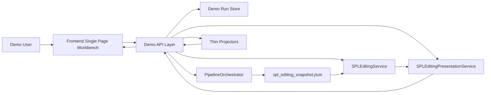
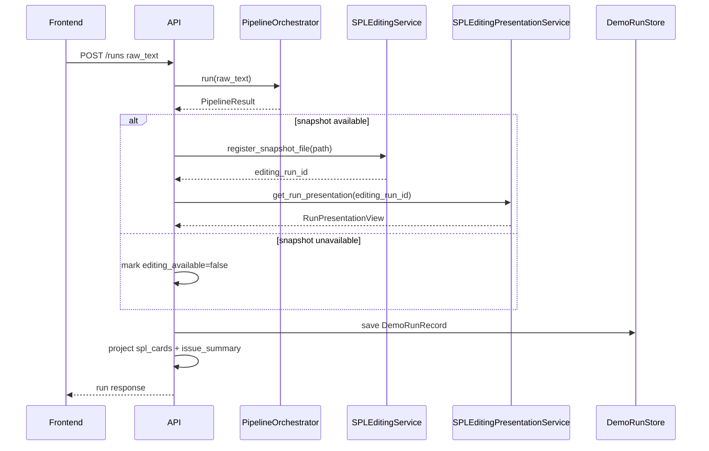

# SPL Web Demo 详细设计文档

> 前端页面、完整 SPL 层级和双页面路由的最新设计见 [SPL Web Demo 前端详细设计](./spl_web_demo_frontend_detailed_design_zh.md)。该文档取代本文第 7 章的旧单页前端设计；后端、API、Contract Probe 和错误处理设计仍以本文为基础。

版本：v0.2
对应需求文档：`docs/interaction-design/spl_web_demo_functional_requirements_zh.md` v0.3
状态：已按 conditional pass 评审修正 service contract 细节
建议目录：`apps/spl-web-demo/`

## 1. 设计目标

本文档基于已冻结的 v0.3 功能需求文档，给出 SPL Web Demo 的详细设计。该设计服务于一个轻量级 **Service contract demo**，目标不是建设完整产品化前后端，而是验证现有 NL2SPL 后端业务逻辑是否适合作为未来网络 API 的 service layer。

本设计必须满足以下约束：

- API 层只做 HTTP DTO 转换、轻量编排、错误映射和展示投影。
- API 层不解析 diagnostic message、不解析 `final_spl.txt`、不解析 `feedback_report.md`。
- API 层不直接修改 IR、snapshot、stage artifact。
- Repair、preview、apply、verification 必须经过现有 SPL Editing service 或 presentation facade。
- Construct Provenance 必须来自 snapshot、`TraceRecord` 和 `SpanIR` 等结构化来源。
- MVP-B 首个 repair 闭环优先选择 worker delegation directive flow。

## 2. 总体架构

### 2.1 运行形态

MVP 使用一个轻量单页前端和一个轻量 API 服务。两者可以放在同一独立目录下，便于从主仓库中隔离 demo 代码。

```text
apps/spl-web-demo/
  backend/
    api/
    services/
    projectors/
    contract_probe/
  frontend/
```

目录名只是实现建议；不得把 demo 目录变成新的业务逻辑层。后端业务 authority 仍然属于 `src/nl2spl` 中已有的 pipeline、SPL Editing core 和 SPL Editing presentation。

### 2.2 架构图



### 2.3 分层职责

| 层级 | 设计职责 | 禁止事项 |
|---|---|---|
| Frontend | 展示卡片、表单、issue、preview、provenance；收集用户输入 | 不解析 internal IR；不绕过 `revision_token` |
| Demo API | 调用 service、转换 DTO、错误映射、薄聚合 | 不做诊断解析、不构造 repair patch、不直接写 snapshot |
| Run Store | 保存 demo run 的最小运行态 | 不作为持久数据库或业务状态 authority |
| Projectors | 从结构化对象投影前端 DTO | 不解析 SPL 文本或报告文本 |
| Pipeline | 编译自然语言需求，产生 `PipelineResult` 和 snapshot | 无新增职责 |
| SPL Editing Core | snapshot 注册、issue inventory、session、preview、apply、verify | 无新增职责 |
| SPL Editing Presentation | issue/detail/interaction/directive/preview/apply facade | 无新增职责 |

## 3. MVP 范围切分

### 3.1 MVP-A：展示链路

MVP-A 实现以下闭环：

```text
raw_text
-> PipelineOrchestrator.run(...)
-> spl_editing_snapshot_path
-> SPLEditingService.register_snapshot_file(path)
-> SPLEditingPresentationService.get_run_presentation(...)
-> SPL cards / issue list / issue detail / provenance / explanation cache
```

MVP-A 的成功标准是：不进入 repair 也能验证 pipeline、snapshot、presentation DTO、construct projector、provenance projector 是否足以支撑 Web API。

### 3.2 MVP-B：worker delegation repair 闭环

MVP-B 实现以下闭环：

```text
get_repair_interaction(...)
-> submit_repair_directive_draft(...)
-> preview_repair_directive(directive_id)
-> apply_repair_preview(directive_id, preview_id)
-> refresh run/spl/issues/provenance
```

MVP-B 只要求一个完整 worker delegation directive repair 闭环。其他 repair option 如果 Contract Probe 不能证明已接入同一 presentation facade，则只展示，不进入 preview/apply。

### 3.3 MVP-C：其他 repair option

`missing_handler`、`missing_output_producer` 等其他 option 只在 Contract Probe 证明它们可以通过相同 directive facade 完成 preview/apply 时进入 MVP-C。否则保持 display-only。

## 4. Contract Probe 设计

### 4.1 目的

Contract Probe 是 API 实现前的硬门槛。它不经过 HTTP，直接调用 service 方法，输出真实字段结构，用来修正 API projector 和前端 DTO 假设。

### 4.2 输入

Contract Probe 至少接受：

- `raw_text`：一段可触发 worker delegation issue 的示例需求。
- `output_dir`：probe 输出目录。
- `language`：默认 `zh-CN`。
- `repair_case`：默认 `worker_delegation`。

### 4.3 输出文件

建议输出到 `apps/spl-web-demo/.probe-output/<timestamp>/`：

```text
pipeline_result.summary.json
run_presentation.dump.json
issue_list.dump.json
issue_detail.dump.json
repair_interaction.dump.json
directive_validation.dump.json
preview_handle.dump.json
apply_verification.dump.json
probe_report.md
```

这些文件是 demo API shape 的校准依据，不是前端运行时依赖。

### 4.4 Probe 步骤

```text
1. 构造 PipelineConfig。
2. 调用 PipelineOrchestrator.run(raw_text)。
3. 记录 spl_editing_snapshot_status / path / error / completeness / diagnostics count。
4. 若 snapshot_status == "available"，调用 SPLEditingService.register_snapshot_file(path)。
5. 调用 SPLEditingPresentationService.get_run_presentation(editing_run_id)。
6. 调用 list_issue_presentations(editing_run_id)。
7. 选择第一个满足 MVP-B 条件的 worker delegation editable issue。
8. 调用 get_issue_detail_presentation(editing_run_id, issue_id)。
9. 调用 get_repair_interaction(editing_run_id, issue_id, option_id, revision_token)。
10. 如果 interaction 只包含 MVP 支持字段，构造 SubmitRepairDirectiveDraftRequest。
11. 调用 submit_repair_directive_draft(...)。
12. 若返回 normalized_directive_id，调用 preview_repair_directive(directive_id)。
13. 调用 apply_repair_preview(directive_id, preview_id)。
14. dump session、verification、overlay_version 和 refreshed issue list。
```

### 4.5 Probe 判定

| 检查点 | 通过条件 | 失败处理 |
|---|---|---|
| Pipeline 编译 | 返回 `PipelineResult`，无未捕获异常 | 记录为 compile blocker |
| Snapshot | `spl_editing_snapshot_status == "available"` 且 path 存在 | MVP-A 可展示 SPL，repair 禁用 |
| Snapshot 注册 | `register_snapshot_file(path)` 返回 run_id | 阻塞 issue/detail/repair |
| Issue DTO | issue list/detail 可被序列化 | 修正 API serializer |
| Interaction | 字段类型属于 MVP 支持范围，或可附加 `demo_availability="unsupported_in_mvp"` | repair display-only |
| Directive | 返回 `input_complete` 和 directive_id | 阻塞 preview/apply |
| Preview | 返回 preview_id 和 rendered/typed preview | 阻塞 apply |
| Apply | 返回 session + verification | 阻塞 repair 闭环 |

### 4.6 Contract Probe 结果回填

本节记录 2026-07-10 首次运行 Contract Probe 后确认的事实。输出目录：

```text
apps/spl-web-demo/.probe-output/20260709T185204Z/
```

本次 probe 使用 existing canonical snapshot：

```text
examples/output/demo/spl_editing_snapshot.json
```

因此本次通过只证明 SPL Editing service contract、presentation DTO、directive preview/apply/verification 链路；不证明 live `PipelineOrchestrator` + LLM compile path 的耗时和稳定性。live compile smoke 可作为后续独立 probe case 增加，不阻塞 Web Demo 的 SPL Editing contract 开发。

已确认主链路：

```text
snapshot registration
-> issue list
-> worker issue selection
-> interaction
-> directive
-> preview
-> apply
-> verification
```

关键事实：

| 字段 | 值 |
|---|---|
| `editing_run_id` | `demo` |
| `snapshot_id` | `snap_b61a1efdd39c` |
| `revision_token` | `demo:snap_b61a1efdd39c:0` |
| `issue_id` | `irs_b07e4440a217` |
| `option_id` | `keep_in_main_flow` |
| `contract_id` | `worker_delegation.keep_in_main_flow.v1` |
| `directive_id` | `directive_e83400868f090e4b1afc` |
| `preview_id` | `prev_00df81ab461aa78a10553f2f85243a79618acf2f6ea392cf17d79314d2a5d2f8` |
| apply 后 `overlay_version` | `1` |
| `verification.accepted` | `true` |
| `verification.lane` | `B` |
| `diagnostic_diff_summary` | `4 resolved, 10 unchanged` |

已确认 MVP-B 首个闭环固定为：

```text
worker_delegation / keep_in_main_flow
```

对应 interaction 字段：

| field_id | input_type | required | MVP 前端控件 |
|---|---|---:|---|
| `task_selection` | `single_choice` | true | 支持 |
| `additional_instruction` | `long_text` | false | 支持 |

因此 MVP-B 第一版不需要实现 `reference_select`、`structured_object` 或 `new_fact_list` 控件。

已确认缺口：

```json
{
  "patched_snapshot": {
    "final_spl_available": false,
    "overlay_version": 1,
    "promotion_resolution_marker_count": 1
  }
}
```

这意味着 apply 后不能返回旧 SPL，也暂时不能声称能展示 patched SPL cards。`GET /runs/{run_id}/spl` 必须按以下规则实现：

```text
overlay_version == 0:
  可以返回 PipelineResult.spl_text + initial cards

overlay_version > 0:
  不得返回 PipelineResult.spl_text
  若没有 patched SPL / patched cards 只读来源:
    返回 projection_unavailable / refresh_unavailable
    同时仍可返回 updated issues + verification
```

该缺口不是前端问题，而是后端 presentation/read-model 缺口。前端只能如实展示“repair 已应用、verification accepted，但 patched SPL projection unavailable”。

## 5. 后端详细设计

### 5.1 后端模块

建议后端模块如下：

```text
backend/
  api/
    app.py
    routes_runs.py
    routes_spl.py
    routes_constructs.py
    routes_issues.py
    routes_repairs.py
    errors.py
    schemas.py
  services/
    compiler_facade.py
    editing_facade.py
    run_store.py
    explanation_facade.py
  projectors/
    card_projector.py
    provenance_projector.py
    issue_projector.py
    repair_projector.py
    preview_projector.py
  contract_probe/
    probe.py
```

该目录是 demo glue code，不允许放入 repair 规则、diagnostic parser 或 patch applier。

### 5.2 Service 组合

API 启动时构造以下对象：

- `PipelineOrchestrator(config)`
- `SPLEditingService(...)`
- `SPLEditingPresentationService(editing_service)`
- `DemoRunStore`

`SPLEditingService` 和 `SPLEditingPresentationService` 应为进程内单例。MVP 不需要数据库；run 状态保存在内存中，snapshot 文件保存在 demo output 目录。

### 5.3 DemoRunStore

`DemoRunStore` 保存 API 层需要的最小运行态。

```text
DemoRunRecord
  api_run_id: str
  editing_run_id: str | None
  raw_text_hash: str
  created_at: str
  status: idle | compiling | run_ready | error
  snapshot_id: str | None
  snapshot_status: str
  snapshot_path: Path | None
  snapshot_error: str | None
  overlay_version: int
  revision_token: str | None
  completeness: str
  pipeline_result: PipelineResult | None
  run_presentation: RunPresentationView | None
  last_error: DemoError | None
```

设计说明：

- `editing_run_id` 是 `SPLEditingService.register_snapshot_file(...)` 返回的 run id，通常等于 compile run id，但 API 不应硬编码这个假设。
- `api_run_id` 是 HTTP 资源 ID。MVP 可以直接使用 `editing_run_id`；若 snapshot 不可用，则生成 `demo_<timestamp>` 作为展示 run id。
- `pipeline_result` 只保存在内存中，便于投影 SPL cards。它不是持久化数据源。
- `snapshot_path` 指向 pipeline 生成的 canonical snapshot 文件。

硬规则：

- 所有 HTTP endpoint 必须先使用 path 中的 `{run_id}` 作为 `api_run_id` 查询 `DemoRunStore`。
- 只有 `record.editing_run_id` 存在时，才能调用 `SPLEditingService` 或 `SPLEditingPresentationService`。
- 传入 SPL Editing service / presentation service 的 run id 必须是 `record.editing_run_id`，不得直接使用 HTTP path 中的 `api_run_id`。
- 如果 `record.editing_run_id is None`，issue detail、repair interaction、directive、preview、apply API 必须返回明确的 editing unavailable 状态或错误。

### 5.4 CompilerFacade

`CompilerFacade` 封装编译入口。

```text
compile_run(raw_text, language, precompute_issue_explanations)
-> CompileRunOutcome
```

职责：

- 调用 `PipelineOrchestrator.run(raw_text)`。
- 对已知编译异常做语义化映射，例如 `compile_failed`、`llm_backend_error` 或 `compile_timeout`。
- 读取 `spl_editing_snapshot_status`、`spl_editing_snapshot_path`、`spl_editing_snapshot_error`。
- 在 snapshot available 时调用 editing facade 注册 snapshot。
- 组装初始 `DemoRunRecord`。
- 未知异常必须映射为 `internal_error`，并保留 server-side log；API 层不得把未知内部 bug 包装成用户输入错误或 LLM 后端错误。

禁止：

- 从 `final_spl.txt` 读取 SPL。
- 从 `compile_report.txt` 或 `feedback_report.md` 提取业务状态。
- 根据 diagnostic message 判断 repairability。

### 5.5 EditingFacade

`EditingFacade` 是 demo API 到 SPL Editing service 的窄适配层。

职责：

- `register_snapshot(path) -> editing_run_id`
- `get_run_presentation(editing_run_id)`
- `list_issues(editing_run_id)`
- `get_issue_detail(editing_run_id, issue_id)`
- `get_repair_interaction(editing_run_id, issue_id, option_id, revision_token)`
- `submit_directive(request)`
- `preview_directive(directive_id)`
- `apply_preview(directive_id, preview_id)`

`apply_preview` 默认调用：

```text
SPLEditingPresentationService.apply_repair_preview(directive_id, preview_id)
```

只有 Contract Probe 证明 presentation facade 不适用于某条 repair flow 时，才允许为该 flow 退回 core service 编排：

```text
SPLEditingService.apply_preview_result(...)
SPLEditingService.verify_session(...)
```

### 5.6 ExplanationFacade

Explanation 读取和触发必须围绕 snapshot presentation cache。

读取流程：

```text
read_explanation_cache(snapshot_path)
-> cache envelope | None

read_cached_issue_explanation(snapshot_path, issue_id)
-> ready explanation dict | None
```

触发流程：

```text
schedule_issue_explanations(snapshot_path, llm, *, language, force)
-> return target issue status
```

ExplanationFacade 负责把底层 cache 结构投影成 API envelope：

| 底层状态 | API status |
|---|---|
| `read_cached_issue_explanation(snapshot_path, issue_id)` 返回 dict | `ready` |
| 完整 cache 中对应 item 的 `status == "pending"` | `pending` |
| 完整 cache 中对应 item 的 `status == "error"` | `error` |
| cache 不存在或 issue item 不存在 | `missing` |

`language` 只用于 `schedule_issue_explanations(...)` 和 cache 顶层字段校验，不是 `read_cached_issue_explanation(...)` 的入参。

MVP 可使用 snapshot-level scheduling 支撑单 issue trigger API，但 HTTP response 只返回目标 issue 状态。不得在 API 层自己调用 LLM 生成 explanation JSON。

### 5.7 Projectors

Projector 是本 demo 唯一允许新增的投影层。

#### CardProjector

输入优先级：

1. `ArtifactSnapshot` 中的 stage/replay artifacts。
2. `PipelineResult.final_ir_package`。
3. `PipelineResult.traces`。

输出：

```text
SplConstructCard
  construct_ref
  construct_type
  title
  status
  payload_summary
  provenance_summary
  source_span_ids
```

设计要求：

- 对每类 construct 使用结构化字段投影摘要。
- 没有稳定结构化对象时，返回 `status="review_only"` 或 `partial`，不要解析 rendered SPL。
- 卡片只包含 UI 展示所需摘要，不返回完整 internal IR。

#### ProvenanceProjector

输入：

- `snapshot.payload.provenance.traces`
- `snapshot.payload.source.spans`
- 必要时回退到 `PipelineResult.traces`

输出：

```text
ConstructProvenanceView
  construct_ref
  target_ref
  traces[]
  spans[]
```

匹配规则：

- `construct_ref` 与 `TraceRecord.target_ref` 精确匹配优先。
- 如 target ref 命名存在别名，别名映射必须来自结构化 ref 字段或 snapshot index，不得从文本猜测。
- 找不到 trace 时返回空 traces，并标记 `provenance_status="missing"`。

#### IssueProjector

输入：

- `IssueListPresentationView`
- `IssueDetailPresentationView`
- cached explanation

输出：

- issue list sections
- issue detail
- explanation envelope

设计要求：

- 保持 `can_fix`、`availability`、`repairability` 来自 presentation DTO。
- 不自行把某个 issue 判定为 editable。

#### RepairProjector

输入：

- `RepairInteractionView`
- `RepairDirectiveValidationResult`

输出：

- interaction response
- directive draft response

MVP 支持字段：

- `short_text`
- `long_text`
- `single_choice`
- `multi_choice`

不支持字段：

- `reference_select`
- `structured_object`
- `new_fact_list`

当出现不支持字段时，API 必须保留后端真实 `availability`，并附加 demo overlay 字段：

```json
{
  "availability": "available",
  "demo_availability": "unsupported_in_mvp",
  "unsupported_fields": ["reference_select"]
}
```

`unsupported_in_mvp` 不得混入后端真实 `availability` enum。

#### PreviewProjector

输入：

- `WorkerDelegationPreviewHandle`
- `PreviewMaterializationResult`
- `EditingSession`
- `VerificationResult`

输出：

- preview id
- session/suggestion id
- rendered preview
- typed preview artifact 摘要
- preview cards
- apply response

设计要求：

- `preview_id`、`session_id`、`suggestion_id` 必须来自真实返回对象。
- 如果 typed artifact 无法稳定投影成 cards，返回 `rendered_preview` 和空 `spl_cards`，不得解析 SPL 文本强行造卡片。

## 6. API 编排设计

### 6.1 `POST /runs`



错误映射：

- 已知编译业务失败：`422 compile_failed`。
- 已知 LLM 或外部后端失败：`502 llm_backend_error`。
- 未知异常：`500 internal_error`，并记录 server-side log。
- 同步超时：`504 compile_timeout`。
- snapshot `failed_best_effort`：HTTP 200，`editing_available=false`。
- snapshot `failed_required` 且 `PipelineResult` 仍包含可展示 SPL：HTTP 200，返回 `snapshot_status="failed_required"`、`editing_available=false` 和阻塞原因。
- snapshot `failed_required` 且 pipeline 未产生可用 result：HTTP 422 `compile_failed`。

### 6.2 `GET /runs/{run_id}`

职责：

- 从 `DemoRunStore` 读取 record。
- 如 editing available，使用 `record.editing_run_id` 刷新 `RunPresentationView`。
- 返回最新 `overlay_version`、`revision_token`、issue summary。

该接口是 apply 后统一刷新 metadata 的入口。

### 6.3 `GET /runs/{run_id}/spl`

职责：

- `overlay_version == 0` 时，可以返回 initial `PipelineResult.spl_text`，或 snapshot replay artifact 中的 initial final SPL。
- `overlay_version > 0` 时，必须从 SPL Editing 当前 session、overlay replay、patched snapshot 或稳定只读 getter 获取 patched SPL / patched cards。
- 返回 `CardProjector` 生成的 cards。
- 不返回完整 snapshot 或完整 IR。

如果当前 service 缺少稳定只读入口，`GET /spl` 必须返回 explicit `refresh_unavailable` / `projection_unavailable` 状态，不得回退到 stale `PipelineResult.spl_text`。该缺口必须在 Contract Probe 中暴露。

### 6.4 Construct APIs

`GET /constructs`：

- 使用 `CardProjector` 返回列表。
- 固定包含 `provenance_summary`。
- 不内联完整 trace/span。

`GET /constructs/{construct_ref}/provenance`：

- 使用 `ProvenanceProjector` 返回 trace/span detail。
- 如果找不到 trace，返回 200 + `provenance_status="missing"`，除非 construct 不存在。

`GET /spans/{span_id}`：

- 从 snapshot source spans index 查询。
- 找不到则返回 `404 span_not_found`。

### 6.5 Issue APIs

`GET /issues`：

- `record = RunStore.get(api_run_id)`。
- 调用 `list_issue_presentations(record.editing_run_id)`。
- 通过 `IssueProjector` 序列化 sections 和 summary。

`GET /issues/{issue_id}`：

- `record = RunStore.get(api_run_id)`。
- 调用 `get_issue_detail_presentation(record.editing_run_id, issue_id)`。
- 调用 explanation cache reader。
- 返回 detail + explanation envelope。

`POST /issues/{issue_id}/explanation`：

- 校验 issue 存在。
- 调用 snapshot-level explanation scheduling。
- 重新读取目标 issue 的 explanation status。
- 返回 `ready | pending | missing | error`。

### 6.6 Repair APIs

`GET /repair-options/{option_id}/interaction`：

```text
record = RunStore.get(api_run_id)
editing_run_id = record.editing_run_id
PS.get_repair_interaction(editing_run_id, issue_id, option_id, revision_token)
-> RepairProjector.project_interaction(...)
```

如果 `revision_token` 不匹配，返回 `409 stale_revision`。

`POST /repair-directives`：

```text
HTTP request
-> SubmitRepairDirectiveDraftRequest
-> PS.submit_repair_directive_draft(...)
-> RepairDirectiveValidationResult
-> directive response
```

规则：

- 不支持字段必须在进入该 endpoint 前由前端拦截；API 仍需二次校验。
- `field_values`、`selected_ref_ids`、`new_fact_declarations` 必须原样投影到 request dataclass，不在 API 层加工成 patch。

`POST /repair-directives/{directive_id}/preview`：

```text
PS.preview_repair_directive(directive_id)
-> WorkerDelegationPreviewHandle
-> PreviewProjector
```

`POST /repair-directives/{directive_id}/previews/{preview_id}/apply`：

```text
require user_confirmation == true
PS.apply_repair_preview(directive_id, preview_id)
-> (EditingSession, VerificationResult)
-> refresh run/spl/issues
```

如果 `verification.accepted == false`，HTTP 仍可返回 200 + `status="verification_failed"`，或返回 `422 repair_failed`。推荐 MVP 返回 200 并展示 verification failure，因为该结果是业务验证结果，不是 HTTP 传输失败。

## 7. 前端详细设计

### 7.1 页面结构

单页工作台包含五个主要区域：

1. 需求输入区。
2. Run 状态栏。
3. SPL Construct Cards。
4. Issue Console + Issue Detail。
5. Provenance / Repair Preview 面板。

```text
App
  RequirementInput
  RunStatusBar
  MainWorkbench
    ConstructPanel
      ConstructCard
      ProvenanceDrawer
    IssuePanel
      IssueList
      IssueDetail
      ExplanationView
      RepairOptionList
      RepairInteractionForm
    PreviewPanel
      SuggestionSummary
      PreviewCards
      VerificationResult
```

### 7.2 前端状态

全局只保留粗粒度状态：

```text
idle
compiling
run_ready
preview_ready
applying
error
```

局部 UI 状态：

- `selectedIssueId`
- `selectedConstructRef`
- `selectedOptionId`
- `interaction`
- `fieldValues`
- `additionalInstruction`
- `directiveId`
- `preview`
- `lastVerification`

局部状态可以保存在单页组件状态或轻量 store 中，不需要引入复杂状态机框架。

### 7.3 数据获取策略

MVP 使用显式请求，不需要复杂缓存库。

推荐交互：

- `Generate` 后调用 `POST /runs`，成功后填充 initial cards/issues。
- 点击 construct 时懒加载 provenance。
- 点击 issue 时懒加载 issue detail 和 explanation。
- 点击 repair option 时懒加载 interaction。
- submit directive 成功后立即请求 preview。
- apply 成功后并行刷新 run、spl、issues。

### 7.4 组件职责

| 组件 | 职责 |
|---|---|
| `RequirementInput` | 输入 `raw_text`，触发 compile |
| `RunStatusBar` | 展示 run id、snapshot status、overlay version、editing availability |
| `ConstructPanel` | 展示 construct cards，提供 provenance 入口 |
| `ConstructCard` | 展示 construct summary，不理解 internal IR |
| `ProvenanceDrawer` | 展示 traces 和 spans |
| `IssueList` | 按 section 展示 issues |
| `IssueDetail` | 展示 what/why/missing/repairs |
| `ExplanationView` | 展示 cached explanation，提供按需生成按钮 |
| `RepairOptionList` | 展示 repair options 和 availability |
| `RepairInteractionForm` | 根据 interaction fields 渲染 MVP 支持控件 |
| `PreviewPanel` | 展示 suggestion、rendered preview、preview cards、apply/cancel |
| `VerificationResult` | 展示 accepted/lane/failure reasons |

### 7.5 Interaction 控件映射

| 后端 input_type | 前端控件 | MVP 支持 |
|---|---|---|
| `short_text` | 单行输入 | 是 |
| `long_text` | 多行输入 | 是 |
| `single_choice` | 单选 | 是 |
| `multi_choice` | 多选 | 是 |
| `reference_select` | 引用选择器 | 否 |
| `structured_object` | 结构化对象编辑器 | 否 |
| `new_fact_list` | 新 fact 列表编辑器 | 否 |

不支持字段出现时：

- repair option 保留后端 `availability`，并显示 demo overlay `demo_availability="unsupported_in_mvp"`。
- submit 按钮禁用。
- UI 展示不支持字段列表。
- 不提交空 `selected_ref_ids` 或空 `new_fact_declarations` 来假装支持。

### 7.6 前端错误展示

| 错误 | 展示方式 |
|---|---|
| `compile_failed` | 输入区下方显示失败原因 |
| `compile_timeout` | 显示同步超时，并提示需要异步 job |
| `stale_revision` | 刷新 run metadata，并提示重新打开 issue |
| `option_unavailable` | 禁用 repair option |
| `input_required` | 表单字段级错误 |
| `input_invalid` | 表单顶部 + 字段级错误 |
| `preview_stale` | 清空 preview，要求重新生成 |
| `repair_failed` | 显示 verification failure |

## 8. 数据与序列化设计

### 8.1 JSON 序列化原则

- dataclass 使用显式 serializer，不直接暴露 `__dict__`。
- enum 输出稳定字符串。
- tuple 输出数组。
- Path 输出相对 demo root 或字符串路径。
- 不返回 Python 对象 repr。

### 8.2 Revision Token

API 中 `revision_token` 使用现有：

```text
revision_token_string(snapshot.revision_token)
```

格式：

```text
<compile_run_id>:<artifact_snapshot_id>:<overlay_version>
```

所有 repair interaction、directive draft 和 apply 前的请求都必须携带当前 revision token 或可关联到当前 revision。MVP 中 preview apply 可通过 preview handle 内部绑定 revision；如果 service 返回 stale，应映射为 `409 preview_stale`。

### 8.3 Explanation Envelope

API 统一返回：

```text
explanation
  status: ready | pending | missing | error
  value: object | null
  error: string | null
```

`value` 必须是 cached explanation JSON，不在 API 层重新组织为另一个业务 schema。前端可做展示层格式化。

### 8.4 Preview Envelope

Preview response 包含：

```text
directive_id
preview_id
session_id
suggestion_id
suggestion
preview.rendered_preview
preview.spl_cards
preview.typed_artifact_summary
```

如果 `typed_artifact` 无法安全序列化，返回 `typed_artifact_summary`，不要返回完整内部对象。

## 9. 错误处理设计

### 9.1 错误响应格式

统一错误格式：

```json
{
  "error": {
    "code": "stale_revision",
    "message": "revision token 已过期",
    "details": {}
  }
}
```

### 9.2 异常映射

| 异常/状态 | HTTP | code |
|---|---:|---|
| 请求 JSON 不合法 | 400 | `invalid_request` |
| run 不存在 | 404 | `run_not_found` |
| issue 不存在 | 404 | `issue_not_found` |
| construct 不存在 | 404 | `construct_not_found` |
| span 不存在 | 404 | `span_not_found` |
| preview 不存在 | 404 | `preview_not_found` |
| revision mismatch | 409 | `stale_revision` |
| preview expired/mismatch | 409 | `preview_stale` |
| option unavailable | 422 | `option_unavailable` |
| input readiness required | 422 | `input_required` |
| input readiness invalid | 422 | `input_invalid` |
| compile business failure | 422 | `compile_failed` |
| repair verification failure | 422 或 200 + failed status | `repair_failed` |
| unhandled exception | 500 | `internal_error` |
| LLM/backend unavailable | 502 | `llm_backend_error` |
| sync compile timeout | 504 | `compile_timeout` |

MVP 推荐：verification 不通过时返回 200 + `status="verification_failed"`，因为这对 demo 来说是需要展示的业务结果。

## 10. 同步与异步策略

MVP 初始实现可以同步 `POST /runs`。

同步模式退出条件：

- Contract Probe 常规输入耗时超过前端或网关可接受范围。
- 本地多次出现 compile timeout。
- 用户无法判断编译是否仍在运行。

触发退出条件后，改为异步 job：

```text
POST /runs -> { run_id, status: "compiling" }
GET /runs/{run_id} -> polling status
```

异步 job 不改变 service contract，只改变 HTTP 编排。

## 11. 安全与运行约束

MVP 是本地 demo，默认不做登录和权限。

仍需满足：

- 不把任意用户输入拼接成 shell 命令。
- snapshot path 只能来自 pipeline result 或 demo run store。
- debug snapshot endpoint 默认只在本地开发启用。
- 错误响应不泄露完整本机绝对路径，除非显式处于 debug 模式。
- LLM key 和配置不写入前端代码。

## 12. 验证计划

### 12.1 Contract Probe 验证

必跑：

```text
python apps/spl-web-demo/backend/contract_probe/probe.py --case worker_delegation
```

验收：

- 输出所有 dump 文件。
- `probe_report.md` 明确标记 MVP-A/B 可用性。
- 若某个字段与需求文档示例不一致，更新 API serializer 或需求 API 示例。

### 12.2 后端测试

建议测试：

- `test_runs_api_compile_success`
- `test_runs_api_snapshot_unavailable_disables_editing`
- `test_routes_resolve_api_run_id_to_editing_run_id`
- `test_unknown_compile_exception_maps_internal_error`
- `test_issue_detail_uses_presentation_service`
- `test_explanation_trigger_returns_target_issue_status`
- `test_explanation_cache_projects_pending_missing_error`
- `test_span_not_found_returns_span_not_found`
- `test_repair_interaction_stale_revision`
- `test_unsupported_interaction_fields_are_blocked`
- `test_submit_directive_maps_validation_errors`
- `test_preview_uses_presentation_facade`
- `test_apply_returns_verification`
- `test_get_spl_after_apply_does_not_return_stale_pipeline_text`
- `test_projectors_do_not_parse_reports`

### 12.3 前端验证

建议用轻量浏览器测试覆盖：

- compile loading 和 success。
- construct cards 渲染。
- provenance drawer 展开。
- issue detail 和 explanation 展示。
- unsupported repair option 禁用。
- supported repair option 填写、preview、apply。
- stale revision 错误提示。

### 12.4 架构验证

用代码搜索或单元测试确认：

- demo API 不读取 `feedback_report.md`。
- demo API 不读取 `final_spl.txt`。
- demo API 不解析 `CompileDiagnostic.message`。
- demo API 不调用 snapshot/IR mutation 方法。
- repair apply route 调用 `SPLEditingPresentationService.apply_repair_preview(...)`。

## 13. 交付顺序

1. Contract Probe。
2. 后端 MVP-A：compile、snapshot register、run store、SPL cards、issues。
3. 后端 provenance/explanation APIs。
4. 前端 MVP-A 工作台。
5. 后端 MVP-B：interaction、directive、preview、apply。
6. 前端 MVP-B：repair form、preview panel、verification result。
7. 端到端验证和文档回填。

每一步完成后都应保留一个可运行状态，不把展示面和 repair 闭环一次性混在一起实现。

## 14. 风险与应对

| 风险 | 影响 | 应对 |
|---|---|---|
| 编译耗时过长 | 同步 `POST /runs` 超时 | Contract Probe 记录耗时，必要时切换异步 job |
| snapshot 生成失败 | repair 链路不可用 | SPL 展示可继续，repair 禁用 |
| presentation DTO 字段与示例不一致 | API serializer 返错字段 | 以 Contract Probe dump 为准修正 |
| worker delegation 需要复杂 interaction 字段 | 前端控件不足 | 附加 `demo_availability="unsupported_in_mvp"`，不假提交空值 |
| preview typed artifact 不稳定 | preview cards 不可靠 | 降级展示 `rendered_preview` |
| apply 后无法刷新 derived snapshot | 前端状态过期 | Contract Probe 暴露缺口，优先修 service/presentation refresh |
| issue explanation 只有批量调度 | 单 issue trigger 语义不纯 | API 只返回目标 issue 状态，后续再加单 issue helper |
| HTTP `api_run_id` 与 SPL Editing `editing_run_id` 混用 | route 在 snapshot unavailable 或 id 不一致时调用错误 run | 所有 endpoint 先查 `DemoRunStore`，service 调用只使用 `record.editing_run_id` |

## 15. 开放问题

以下问题不阻塞详细设计，但必须在 Contract Probe 后定稿：

- `PipelineConfig` 在 demo 中采用哪一套默认配置。
- apply 后获取最新 snapshot 的首选方式：presentation facade 是否足够，还是需要新增只读 getter。
- Preview typed artifact 是否能稳定投影成 SPL cards。
- worker delegation 示例输入应固定为哪一段 raw text，保证本地可重复触发目标 issue。

## 16. 需求映射

| 需求 | 设计章节 |
|---|---|
| Service contract demo 定位 | 1, 2 |
| 系统边界与禁止事项 | 2.3, 5.7, 12.4 |
| MVP-A/B/C 分层 | 3 |
| Contract Probe | 4 |
| 编译与 SPL cards | 5.4, 5.7, 6.1, 6.3 |
| Construct Provenance | 5.7, 6.4 |
| Issue Console / Detail | 5.7, 6.5 |
| Explanation cache | 5.6, 6.5, 8.3 |
| Repair interaction | 5.7, 6.6, 7.5 |
| Preview / Apply / Verification | 5.5, 5.7, 6.6 |
| 前端页面设计 | 7 |
| 错误码 | 9 |
| 验收标准 | 12 |
