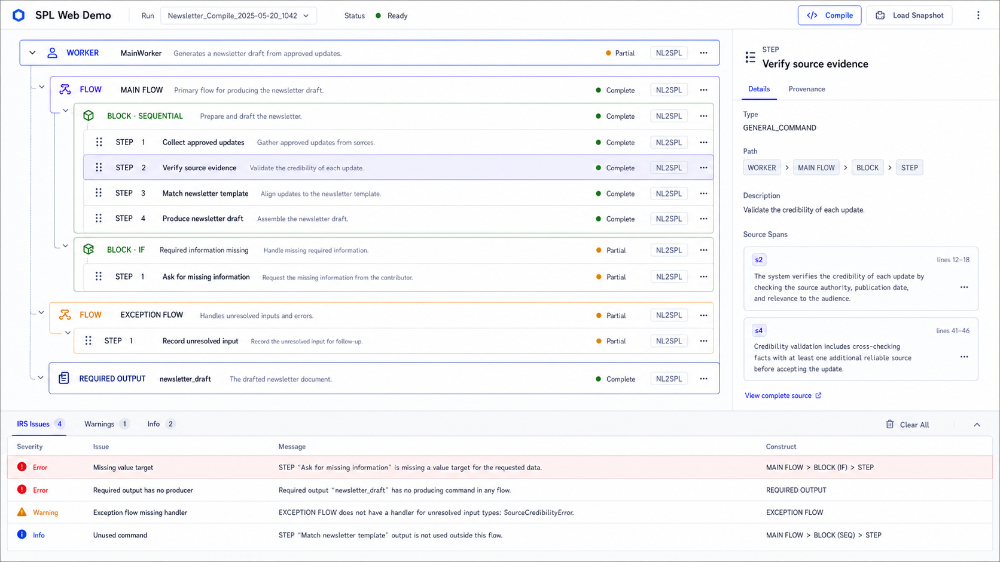
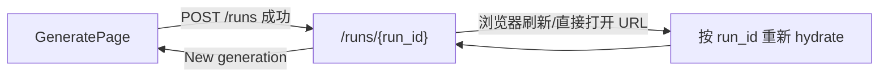
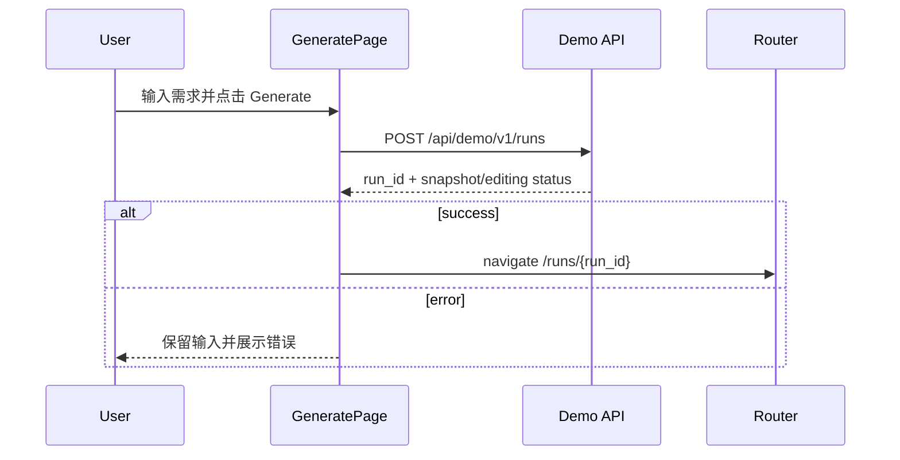
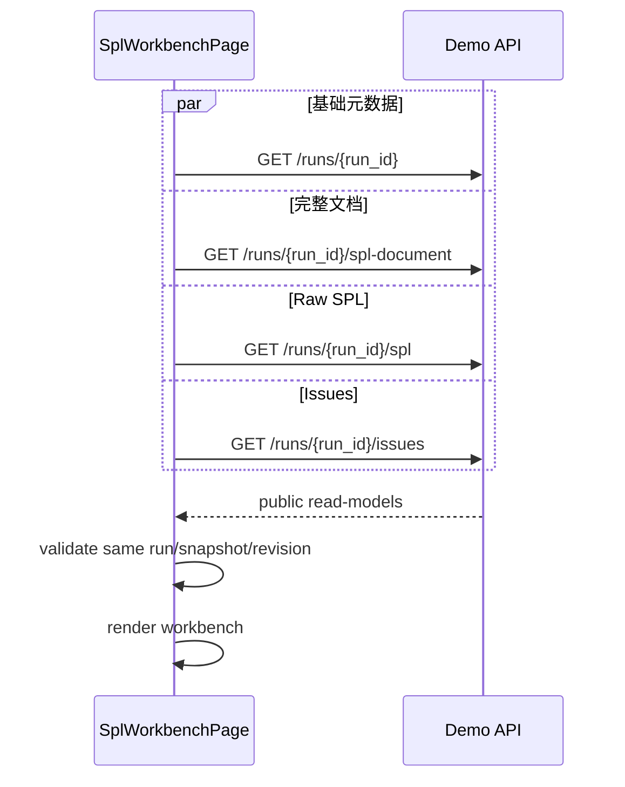

# SPL Web Demo 前端详细设计

版本：v1.0

状态：待评审

适用目录：`apps/spl-web-demo/frontend/`

关联文档：

- `spl_web_demo_functional_requirements_zh.md`
- `spl_web_demo_detailed_design_zh.md`
- `spl_web_demo_implementation_plan_zh.md`
- `spl_web_demo_remaining_tasks_zh.md`

> 本文档重新定义 SPL Web Demo 的前端信息架构和展示模型。本文档取代既有文档中“需求输入与 SPL 工作台位于同一页面”和“Construct 仅以平铺卡片展示”的前端设计，但不改变已经验证的 Service、API、repair、verification 和 fail-closed 边界。

## 1. 设计结论

前端固定为两个页面：

1. **SPL 生成页**：只负责输入自然语言需求、触发编译、展示编译状态和错误。
2. **SPL 工作台页**：编译成功后跳转进入，以类似 IDE/结构编辑器的方式展示完整 SPL 层级、节点详情、Provenance 和底部 IRS Issues。

工作台不保留参考图左侧的 `Explorer / Sources / History / Settings` 导航列。首屏主体固定为：

```text
顶部工具栏
├── 中央：SPL 层级画布
├── 右侧：当前 Construct 或 Issue 的详情/溯源/修复面板
└── 底部：统一 IRS Issues / Problems 面板
```

SPL 展示不只包含 `WORKER → FLOW → BLOCK → COMMAND`，还必须覆盖文档级其他部分，至少包括：

- `PERSONA`
- `AUDIENCE`
- `CONCEPTS`
- `CONSTRAINTS`
- `TYPES`
- `VARIABLES`
- `FILES`
- `APIS`
- `WORKER INPUTS / OUTPUTS`
- Main / Alternative / Exception Flow
- Block 和 Command

所有层级关系和摘要必须来自结构化 snapshot/IR/read-model。前端不得解析 rendered SPL 来生成节点、父子关系、类型标签或状态。

## 2. 原型基准



原型用于固定以下视觉和交互方向：

- 中央区域是可扫描的嵌套 SPL 结构，不是同级卡片墙。
- 不同 Construct 类型使用克制的边框色和类型标签区分。
- 当前选中节点保持明显但不过度的高亮。
- 右侧面板与中央选中项联动。
- Issues 固定在底部统一展示，不拆散到各 Construct 内。
- 页面整体是操作型工作台，不是营销页或仪表盘。

原型不是对具体示例文本、按钮或颜色值的硬编码要求。没有真实后端能力的按钮不得仅为模仿图片而出现。

## 3. 现状与差距

### 3.1 已有能力

当前实现已经具备：

- `POST /api/demo/v1/runs` 的同步 live compile。
- snapshot bootstrap 调试入口。
- run、SPL、Construct、Provenance、Span、Issue、Explanation API。
- worker delegation repair directive、preview、apply 和 verification 闭环。
- `CardProjector` 已输出 `parent_ref` 和 `construct_path`。
- 已覆盖 `WORKER`、`FLOW`、`EXCEPTION_FLOW`、`BLOCK`、`COMMAND`、`REQUIRED_OUTPUT`、`PROFILE`、`CONSTRAINT`。
- `PROFILE.payload_summary` 已包含 persona role、persona aspects、audience aspects 和 concepts。
- apply 后无 patched read-model 时返回 `projection_unavailable`，不会回退 stale SPL/cards。

### 3.2 当前前端差距

| 差距 | 影响 | 本设计处理 |
|---|---|---|
| 需求输入和工作台混在同一组件/页面 | 编译前后信息密度和用户目标混杂 | 拆分为 `/` 与 `/runs/{run_id}` |
| 左侧存在参考图中的导航列 | 占用空间且没有真实业务价值 | 完全移除 |
| `PROFILE` 是一张聚合卡 | PERSONA、AUDIENCE、CONCEPTS 不便逐项查看和溯源 | 增加细粒度 SPL document nodes |
| 当前 projection 未覆盖 Types、Variables、Files、APIs、Inputs | 页面不能表达完整 SPL 文档 | 扩展结构化文档投影 |
| 部分类型徽标由前端根据标题/文本猜测 | 违反前端不推断业务语义的边界 | 后端不提供时不显示，禁止文本启发式 |
| 头部存在没有真实能力支撑的 Run/Validate/Save 控件 | 容易形成虚假交互 | 只保留真实可执行动作 |
| 当前 workbench hydration 发生在生成动作内部 | 页面无法通过 URL 独立刷新/恢复 | 工作台以 URL 中的 `run_id` 自主加载 |

## 4. 设计目标与非目标

### 4.1 设计目标

- 达到参考图中的层级 SPL 编辑器式展示效果。
- 用户从单独的生成页完成编译，并自动进入工作台页。
- 工作台展示完整 SPL 文档结构，而不是只展示 Worker flow。
- 每个可溯源 Construct 都能打开右侧 Provenance，并查看完整 Span 原文。
- IRS Issues 始终位于统一底部面板，并与右侧 Issue Detail/Repair 联动。
- 继续复用现有 API 和 Service contract；只为完整文档展示增加必要的薄 read-model。
- 保持前端轻量，不引入全局状态库、复杂设计系统或编辑器框架。

### 4.2 非目标

- 不提供任意拖拽重排或直接修改 SPL 结构。
- 不实现代码编辑器、语法高亮编辑或自由文本保存。
- 不伪造 `Run`、`Validate`、`Save` 等尚无后端契约的命令。
- 不实现用户系统、权限、项目管理、文件树或 run history 产品能力。
- 不通过解析 rendered SPL 补齐缺失的结构化节点。
- 不在本次设计中解决 apply 后 patched SPL/cards read-model 缺口。
- 不扩大 MVP-C repair 类型范围。

### 4.3 初始需求覆盖结论

本设计可以支撑初始需求的完整用户流程，但必须区分“设计已覆盖”和“当前后端 contract 已验证”两层结论：

| 初始需求 | 设计覆盖 | 当前实现依据 | 判定 |
|---|---|---|---|
| 输入自然语言需求并生成 SPL IR | 独立 `GeneratePage` + `POST /runs` | live compile 已通过真实 probe | 已覆盖 |
| 以卡片形式展示 SPL | `SplDocumentCanvas` 的 section/container/leaf cards | initial typed snapshot projection 已可用 | 已覆盖 |
| 展示完整 SPL，包括 PERSONA 等部分 | 完整 SPL document read-model | PROFILE 已有结构化数据；Resources 仍需扩展 projector | 设计已覆盖，待实现 |
| 底部 Issues Console | `ProblemsDock` | issue list Presentation API 已可用 | 已覆盖 |
| 点击 Issue 查看具体信息 | 右侧 Inspector 的 Issue mode | issue detail API 已可用 | 已覆盖 |
| 展示 cached AI issue explanation | `ExplanationView` | explanation cache reader/trigger 已可用 | 已覆盖 |
| Repair Option 以卡片展示 | `RepairOptionCardList` | Presentation repair options 已可用 | 已覆盖 |
| 用户选择策略并输入补充建议 | `RepairInteractionForm` | 已验证 `task_selection` + `additional_instruction` | 已覆盖首个闭环 |
| 生成 LLM 修复建议 | Preview 的 `SuggestionSummary` | directive/preview facade 已通过 probe | 已覆盖首个闭环 |
| SPL Preview 以卡片展示 | Preview 的 `PreviewDocumentCanvas` | typed preview 可能暂时没有稳定 `spl_cards` | 条件覆盖 |
| 确认应用或取消 | Apply API + client-side Cancel | apply/verification 和零副作用 Cancel 已验证 | 已覆盖首个闭环 |
| 验证 Service/API 职责分离 | thin route + projector boundary | 当前 API/presentation 边界已通过检查 | 已覆盖 |

需要冻结两项诚实边界：

1. 初始示例使用 `missing_handler / add_handler_step`。当前已验证的首个完整 repair flow 是 worker delegation。除非 Contract Probe 证明 `missing_handler` 已接入同一 directive/preview/apply facade，否则该 Issue 只能展示 detail、explanation 和 repair option，不能在前端伪造可用的 Preview/Apply。
2. 初始需求明确要求“以卡片形式展示 SPL Preview”。如果后端只返回 `rendered_preview` 或 typed metadata 而 `spl_cards=[]`，这只能视为降级展示，不能作为该条需求的最终验收通过。最终通过需要稳定的 typed `PreviewCardProjector`，且不得通过解析 `rendered_preview` 造卡片。

初始需求中的“前端拿到 IR”在本设计中解释为“前端拿到由 typed IR 投影出的稳定 Presentation DTO”，而不是把完整 internal IR 原样暴露给浏览器。这样仍然能够验证 IR 是否适合网络 API，同时避免前端与编译器内部 dataclass、stage artifact 和字段演进直接耦合，更符合 Service 层职责分离目标。

## 5. 页面与路由

### 5.1 路由表

| 路径 | 页面 | 职责 |
|---|---|---|
| `/` | `GeneratePage` | 输入需求、触发编译、展示编译状态 |
| `/runs/{run_id}` | `SplWorkbenchPage` | 加载并展示指定 run 的完整工作台 |

MVP 只有两个业务路由，不引入前端路由库。使用一个小型 `useAppRoute()` 封装 `window.location.pathname`、`history.pushState()` 和 `popstate`。部署静态文件时必须配置 SPA fallback 到 `index.html`。

如果后续路由增至四个以上，或出现嵌套路由、权限和 loader 需求，再评估引入路由库；当前不提前增加依赖。

### 5.2 页面跳转



跳转规则：

- `POST /runs` 成功拿到 `run_id` 后立即跳转，不在生成页继续加载 Construct/Issue。
- 工作台页是 run read-model 的唯一加载者。
- 浏览器后退应回到生成页。
- 直接访问 `/runs/{run_id}` 必须可用，不依赖上一个页面内存中的 state。
- `run_not_found` 时展示独立空状态和“返回生成页”，不自动创建新 run。

## 6. SPL 生成页

### 6.1 页面结构

```text
+------------------------------------------------------------------+
| SPL Web Demo                                                     |
+------------------------------------------------------------------+
| Generate SPL                                                     |
|                                                                  |
| Initial requirement                                              |
| +--------------------------------------------------------------+ |
| | 多行自然语言需求                                             | |
| |                                                              | |
| +--------------------------------------------------------------+ |
|                                                                  |
| Language [zh-CN]                           [Generate SPL]         |
|                                                                  |
| 编译状态 / 耗时 / 错误                                            |
|                                                                  |
| > Local debug: load canonical snapshot                           |
+------------------------------------------------------------------+
```

### 6.2 控件

| 控件 | 行为 |
|---|---|
| Initial requirement | 必填多行文本；保留换行；不在前端改写需求 |
| Language | 默认 `zh-CN`；使用轻量 select |
| Generate SPL | 非空且未 compiling 时可用 |
| Local debug | 折叠区域，仅本地开发显示 snapshot path bootstrap |

`precompute_issue_explanations` 仍固定为 `false`，不作为普通用户可见开关。

### 6.3 编译状态

生成页只需要：

```text
idle
compiling
error
```

`compiling` 时：

- 输入框和 Generate 按钮禁用，避免重复提交。
- 显示加载指示和已等待时间。
- 文案明确说明编译可能需要一段时间。
- 当前后端没有 cancellation contract，因此不显示不可用的 Cancel 命令。
- 请求成功后跳转；失败后保留用户输入并展示 API error。

### 6.4 API 流程



## 7. SPL 工作台页

### 7.1 桌面布局

```text
+--------------------------------------------------------------------------------+
| [← New generation]  agent-name.spl  Run metadata             [Refresh] [Raw]  |
+------------------------------------------------------+-------------------------+
|                                                      | Inspector               |
| SPL Document Canvas                                  | Details | Provenance     |
|                                                      |                         |
| PROFILE                                              | selected node/issue     |
|   PERSONA                                            |                         |
|   AUDIENCE                                           | repair flow when needed |
|   CONCEPTS                                           |                         |
| CONSTRAINTS                                          |                         |
| RESOURCES                                            |                         |
| WORKER                                               |                         |
|   FLOW → BLOCK → COMMAND                             |                         |
+------------------------------------------------------+-------------------------+
| Problems 5 | Editable 2 | Review only 3                         [collapse ^]   |
| Severity | Issue | Message | Category | Construct                               |
+--------------------------------------------------------------------------------+
```

页面使用整个视口高度：

- Header：56px。
- 主内容：`minmax(0, 1fr)`。
- Inspector：默认 380px，允许在 340-440px 间响应式变化。
- Problems dock：默认 220px，可折叠到 40px；MVP 不要求拖拽调整高度。
- 中央画布独立滚动；Inspector 和 Problems 各自独立滚动。

### 7.2 顶部工具栏

只保留真实动作：

| 元素 | 说明 |
|---|---|
| New generation | 返回 `/`，开始新的编译 |
| 文件名 | 根据 Agent/Worker 名称生成只读展示名 |
| run metadata | snapshot、overlay、revision、editing/projection status |
| Refresh | 重新读取当前 run 的 public read-model |
| Raw SPL | 打开/关闭只读 rendered SPL drawer |

不显示没有后端契约的 Save、Validate 或执行 SPL 按钮。

### 7.3 中央 SPL Document Canvas

Canvas 采用纵向嵌套结构：

```text
AGENT
├── PROFILE
│   ├── PERSONA
│   │   ├── ROLE
│   │   └── PERSONA ASPECTS
│   ├── AUDIENCE
│   └── CONCEPTS
├── CONSTRAINTS
├── RESOURCES
│   ├── TYPES
│   ├── VARIABLES
│   ├── FILES
│   └── APIS
└── WORKERS
    ├── CHILD WORKER ...
    └── MAIN WORKER
        ├── INPUTS
        ├── OUTPUTS
        ├── MAIN FLOW
        │   └── BLOCK
        │       └── COMMAND
        ├── ALTERNATIVE FLOW
        └── EXCEPTION FLOW
```

视觉层级规则：

- 文档 section 使用轻量标题行和左侧结构线，不做大面积背景卡片。
- Worker、Flow、Block 是有边框的层级容器。
- Command、Variable、Type、Concept 等 leaf 使用紧凑行。
- 每一级缩进固定，不依赖标题长度。
- 父级可折叠；默认展开 PROFILE、主 Worker、Main Flow，其他大 section 按内容数量决定。
- 折叠状态只属于当前页面本地状态，不写回后端。
- selected 节点显示清晰焦点边框；hover 不改变布局尺寸。
- source-backed 节点可显示小型来源标记；无来源时显示 `inferred` 或 `assumed`。

### 7.4 完整 SPL section 展示规则

展示顺序遵循 SPL 文档语义，但数据来自 typed read-model，不从 final SPL 文本提取：

| UI section/node | 结构化来源 | 最小展示字段 |
|---|---|---|
| AGENT | `final_worker` / `root_worker` | name、description |
| PERSONA | `AgentProfileIR.persona` | role、provenance kind |
| PERSONA ASPECT | `PersonaIR.aspects` | name、text |
| AUDIENCE | `AgentProfileIR.audience_aspects` | name、text |
| CONCEPT | `AgentProfileIR.concepts` | term、definition |
| CONSTRAINT | `ArtifactSnapshot.constraints` | kind、text、targets |
| TYPE | `ResourceRegistryIR.types` | type_name、type_kind、definition |
| VARIABLE | `ResourceRegistryIR` / stable declaration view | name、data_type、required、source、description |
| FILE | `ResourceRegistryIR.files` | name、path、data_type、description |
| API | `ResourceRegistryIR.apis` | api_name、auth、status、description |
| API FUNCTION | `APISpec.functions` | name、parameters、return type |
| WORKER | `WorkerIR / ChildWorkerIR` | name、kind、description |
| INPUT / OUTPUT | `WorkerIR.inputs / outputs` | name、type/requiredness when available |
| FLOW | typed flow refs | kind、condition、block count |
| BLOCK | `BlockIR` | subtype、condition |
| COMMAND | `StepIR` projected as SPL command | command_type、text、inputs、outputs |

如果 Renderer 对某一 section 还有额外 renderability gate，Projector 不得复制 private renderer 逻辑或解析 rendered SPL。应优先复用公开、稳定的 normalized declaration/read-model；在该读模型不存在时：

- 返回结构化条目并标记 `projection_fidelity="structured"`；或
- 对无法保证与最终 SPL 一致的 section 标记 `partial`；
- 不声称其与 rendered SPL 逐字符一致。

### 7.5 PROFILE / PERSONA 展示

`PROFILE` 不再只显示一个总数摘要，而是投影为可展开节点：

```text
PROFILE
├── PERSONA
│   ├── ROLE: Internal communications specialist
│   └── StructuredCompletion: Produces a draft...
├── AUDIENCE
│   └── IntendedUsers: Internal communications team
└── CONCEPTS
    ├── InternalNewsletters: ...
    └── ExecutiveBriefs: ...
```

细粒度节点必须拥有独立稳定引用和 provenance 入口。现有聚合 `PROFILE` card 可以在兼容 API 中保留，但新工作台不应只依赖它来展示 profile 内容。

### 7.6 右侧 Inspector

Inspector 有两种上下文：

```text
construct mode
issue mode
```

#### Construct mode

Tabs：

- `Details`：类型、路径、摘要、状态和 typed attributes。
- `Provenance`：trace relation、explanation、confirmation 状态、Span 原文。

规则：

- 点击 Construct 后切换到 Construct mode。
- section-only node 可以展示 section summary，但不伪造 provenance。
- hover tooltip 只显示 source text 或 user-confirmed text，不暴露内部 ref。
- 完整 trace/span 仅在 Provenance tab 展示。

#### Issue mode

点击 Problems 行后切换到 Issue mode，按既有流程展示：

```text
Issue Detail
→ AI Explanation
→ Repair Options
→ Interaction Form
→ Preview
→ Apply / Cancel
→ Verification
```

Repair 过程继续复用当前 public HTTP API。Cancel 仍为前端丢弃 preview，不调用未定义的后端 cancel。

Issue mode 的具体展示结构为：

```text
Issue Header
├── title / issue id / repairability / category
├── problem / impact / missing information
├── AI Explanation
│   ├── headline / source interpretation
│   ├── problem / impact
│   ├── missing information
│   ├── recommendation and reason
│   └── questions / generation warning
├── Repair Option Cards
│   ├── label / description
│   ├── when to choose / tradeoff
│   └── availability / verification lane
├── Repair Interaction Form
│   ├── structured fields
│   └── optional additional instruction
└── Repair Preview
    ├── LLM suggestion / explanation
    ├── expected effect / risks when available
    ├── Preview SPL Cards
    └── Apply / Cancel
```

AI explanation 必须保留并展示后端 cache 中的关键字段，包括：

- `generation_source`
- `generation_warning`
- `headline`
- `impact`
- `missing_information`
- `options`
- `problem`
- `questions`
- `recommendation_reason`
- `recommended_option`
- `source_interpretation`
- `schema_version`

Repair Option 使用独立可选择卡片，不与 AI explanation 中仅用于解释的 `options` 混为同一 authority。真正可提交的 option 必须来自 Issue Presentation/Repair Catalog。

Preview 展示规则：

- LLM suggestion 与 SPL preview 是两个独立区域。
- `preview.spl_cards` 非空时，使用与主 Canvas 相同的只读层级卡片组件展示。
- Preview Cards 必须来自 typed preview artifact 的薄投影。
- `preview.spl_cards=[]` 时可以显示 rendered preview 作为调试降级，但必须标记 `preview_projection_unavailable`。
- rendered preview 不得被前端解析成卡片。
- 严格初始需求验收要求 Preview Cards 非空；降级文本不等价于验收通过。

### 7.7 Problems / IRS Issues Dock

底部 dock 保持统一 issue inventory：

| 列 | 内容 |
|---|---|
| Severity/Status | error、warning、review、deferred 等 presentation 状态 |
| Issue | display id + title |
| Message | impact 或用户可读摘要 |
| Category | editable、review_only、deferred_validation、developer_only |
| Construct | location/construct label；没有则显示 `-` |

交互：

- 点击或键盘 Enter/Space 打开右侧 Issue mode。
- Tabs 仅做前端过滤，不改变后端 issue authority。
- 默认显示 Problems(all)，同时显示各类别数量。
- 没有 issue 时保留 dock header，并显示 `No IRS issues`。
- Dock 可折叠，但不按 Construct 拆成多个面板。

## 8. SPL Document Read-model

### 8.1 为什么需要新增 read-model

现有 `GET /constructs` 足以表达 Worker flow 层级，但不足以稳定表达完整 SPL 文档：

- `PROFILE` 仍是聚合卡。
- Types、Variables、Files、APIs、Inputs 等未形成节点。
- UI section 与真实 construct 没有明确区分。

因此新增一个薄 `SplDocumentProjector`，只负责从 `ArtifactSnapshot` 的 typed fields 投影完整文档节点。它不拥有编译、IRS、repair 或 renderability 决策。

### 8.2 完整前端 API 清单

以下接口共同支撑初始需求。前端详细设计不重新定义其业务语义，只固定页面调用位置和用途：

| Method | Path | 调用页面/区域 | 用途 |
|---|---|---|---|
| `GET` | `/api/demo/v1/health` | 启动/诊断 | 本地服务可用性检查 |
| `POST` | `/api/demo/v1/runs` | GeneratePage | 根据自然语言需求编译并创建 run |
| `POST` | `/api/demo/v1/runs/from-snapshot` | GeneratePage debug section | 本地调试 bootstrap，不作为生产入口 |
| `GET` | `/api/demo/v1/runs/{run_id}` | Workbench | 获取 run、snapshot、revision 和 editing 状态 |
| `GET` | `/api/demo/v1/runs/{run_id}/spl` | Raw SPL drawer | 获取 rendered SPL 和 projection status |
| `GET` | `/api/demo/v1/runs/{run_id}/spl-document` | SPL Canvas | 获取完整结构化 SPL 文档节点；本设计新增 |
| `GET` | `/api/demo/v1/runs/{run_id}/constructs` | 兼容/debug | 获取现有 Construct Cards；迁移期保留 |
| `GET` | `/api/demo/v1/runs/{run_id}/constructs/{construct_ref}/provenance` | Inspector | 获取 Construct traces 和 source spans |
| `GET` | `/api/demo/v1/runs/{run_id}/spans/{span_id}` | Inspector | 获取单个 Span 完整原文 |
| `GET` | `/api/demo/v1/runs/{run_id}/issues` | ProblemsDock | 获取统一 issue inventory |
| `GET` | `/api/demo/v1/runs/{run_id}/issues/{issue_id}` | Issue Inspector | 获取 Issue Detail、Repair Options 和 cached explanation |
| `POST` | `/api/demo/v1/runs/{run_id}/issues/{issue_id}/explanation` | Issue Inspector | 按需触发 explanation scheduling |
| `GET` | `/api/demo/v1/runs/{run_id}/issues/{issue_id}/repair-options/{option_id}/interaction` | Repair Form | 获取真实 interaction schema |
| `POST` | `/api/demo/v1/runs/{run_id}/repair-directives` | Repair Form | 提交 option、结构化字段和用户补充建议 |
| `POST` | `/api/demo/v1/runs/{run_id}/repair-directives/{directive_id}/preview` | Preview | 获取 LLM suggestion 和 typed SPL preview |
| `POST` | `/api/demo/v1/runs/{run_id}/repair-directives/{directive_id}/previews/{preview_id}/apply` | Preview | 用户确认后 apply，并返回 verification |

Cancel 不需要 HTTP endpoint：

```text
Cancel
→ 丢弃 interaction/directive/preview UI state
→ 不调用 apply
→ overlay_version 和 revision_token 不变
```

API 层继续遵守：

- route 只做参数提取、payload 校验、service 编排和错误映射。
- Issue/Repair authority 来自 Presentation Service，不由 route 或前端判断。
- 用户补充建议通过 `additional_instruction` 或 interaction contract 明确字段提交。
- `directive_id`、`preview_id` 必须绑定当前 `api_run_id`。
- stale revision 返回 `409 stale_revision`。
- malformed payload 返回统一 `400 invalid_request` envelope。

### 8.3 新增 SPL Document API

新增：

```http
GET /api/demo/v1/runs/{run_id}/spl-document
```

现有接口保持：

```http
GET /api/demo/v1/runs/{run_id}/spl
GET /api/demo/v1/runs/{run_id}/constructs
GET /api/demo/v1/runs/{run_id}/constructs/{construct_ref}/provenance
GET /api/demo/v1/runs/{run_id}/spans/{span_id}
```

迁移期规则：

- `/spl-document` 是新工作台的主结构接口。
- `/spl` 继续提供 raw rendered SPL 和 projection status。
- `/constructs` 暂时保留，供兼容测试和现有调用使用。
- 新的细粒度 construct ref 必须能继续使用现有 provenance endpoint；若暂时没有 trace，返回明确的 missing/inferred/assumed 状态。

### 8.4 DTO

```text
SplDocumentResponse
  run_id
  snapshot_id
  overlay_version
  revision_token
  projection_status
  projection_fidelity
  nodes[]

SplDocumentNode
  node_ref
  node_kind              section | construct
  node_type
  construct_ref          nullable，仅真实可寻址 Construct 使用
  parent_node_ref        nullable
  order
  title
  summary                nullable
  status                 available | partial | review_only
  attributes             小型 typed 展示摘要
  provenance_summary     nullable
```

`node_type` 第一版枚举：

```text
AGENT
PROFILE
PERSONA
PERSONA_ASPECT
AUDIENCE
AUDIENCE_ASPECT
CONCEPTS
CONCEPT
CONSTRAINTS
CONSTRAINT
RESOURCES
TYPES
TYPE
VARIABLES
VARIABLE
FILES
FILE
APIS
API
API_FUNCTION
WORKERS
WORKER
INPUTS
INPUT
OUTPUTS
OUTPUT
FLOW
EXCEPTION_FLOW
BLOCK
COMMAND
```

其中 `PROFILE`、`CONSTRAINTS`、`RESOURCES`、`TYPES` 等可作为 `node_kind="section"` 的展示容器；section 没有业务 provenance 时 `construct_ref=null`。具体 Persona、Concept、Constraint、Variable、API、Worker、Flow、Block、Command 使用 `node_kind="construct"`。

### 8.5 示例

```json
{
  "run_id": "web_demo_...",
  "snapshot_id": "snap_...",
  "overlay_version": 0,
  "revision_token": "demo:snap_...:0",
  "projection_status": "available",
  "projection_fidelity": "structured",
  "nodes": [
    {
      "node_ref": "section:profile",
      "node_kind": "section",
      "node_type": "PROFILE",
      "construct_ref": null,
      "parent_node_ref": "agent:main",
      "order": 10,
      "title": "Profile",
      "summary": null,
      "status": "available",
      "attributes": {},
      "provenance_summary": null
    },
    {
      "node_ref": "persona_...",
      "node_kind": "construct",
      "node_type": "PERSONA",
      "construct_ref": "persona_...",
      "parent_node_ref": "section:profile",
      "order": 10,
      "title": "Persona",
      "summary": "Internal communications specialist",
      "status": "available",
      "attributes": {
        "role": "Internal communications specialist"
      },
      "provenance_summary": {
        "kind": "source_backed",
        "source_span_count": 1
      }
    }
  ]
}
```

### 8.6 Identity 和顺序

- `node_ref` 对 section 使用固定命名，对 construct 使用结构化业务 identity 的确定性 hash。
- identity 不依赖 rendered text 或当前数组下标。
- `order` 与 identity 分离，只控制同级显示顺序。
- Persona aspect、Audience aspect 和 Concept 优先使用 scope + name/term 形成 identity。
- 如果 typed source 不能提供唯一 identity，Projector 必须 fail closed 或显式 disambiguate，不得静默覆盖。
- duplicate ref 继续视为 projector error。

### 8.7 Projector 权限边界

允许读取：

- `ArtifactSnapshot.agent_profile`
- `ArtifactSnapshot.constraints`
- `ArtifactSnapshot.resources`
- `ArtifactSnapshot.symbol_table` 的稳定只读声明视图
- `ArtifactSnapshot.final_worker`
- `ArtifactSnapshot.traces`
- `ArtifactSnapshot.spans`

禁止：

- 解析 `final_spl.txt` 或 `ArtifactSnapshot.final_spl` 来构造节点。
- 解析 diagnostic message 判断 node 状态。
- 复制 IRS 或 renderer 的业务判断。
- 从 API route 访问 SPL Editing private store。
- 为缺失 section 伪造 Construct。

## 9. 前端组件设计

```text
App
├── AppRoute
├── GeneratePage
│   ├── RequirementForm
│   ├── CompileStatus
│   └── DebugSnapshotLoader
└── SplWorkbenchPage
    ├── WorkbenchHeader
    ├── SplDocumentCanvas
    │   ├── DocumentSection
    │   ├── WorkerNode
    │   ├── FlowNode
    │   ├── BlockNode
    │   └── LeafConstructRow
    ├── InspectorPanel
    │   ├── ConstructDetails
    │   ├── ProvenanceView
    │   ├── IssueDetailView
    │   ├── RepairWorkspace
    │   └── VerificationPanel
    ├── ProblemsDock
    └── RawSplDrawer
```

职责约束：

| 组件 | 允许 | 禁止 |
|---|---|---|
| `GeneratePage` | 提交 compile、跳转 | 加载/解释 Construct |
| `SplWorkbenchPage` | 编排 public API、管理选择状态 | 解析 SPL/diagnostic 文本 |
| `SplDocumentCanvas` | 按 node refs/order 渲染树 | 推断父子关系和业务状态 |
| `InspectorPanel` | 根据明确 selection 切换内容 | 同时混合无关 Construct 和 Issue |
| `ProblemsDock` | 过滤和选择 Presentation issues | 重新判定 repairability |
| `RepairWorkspace` | 提交已验证 interaction | 构造 patch 或猜字段 |

## 10. 状态与数据流

### 10.1 页面级状态

```text
GeneratePageStatus
  idle | compiling | error

WorkbenchStatus
  loading | ready | projection_unavailable | error
```

### 10.2 工作台局部状态

- `selectedNodeRef`
- `selectedConstructRef`
- `selectedIssueId`
- `inspectorMode: construct | issue`
- `inspectorTab: details | provenance`
- `collapsedNodeRefs`
- `problemsFilter`
- `problemsCollapsed`
- 既有 repair interaction/directive/preview/verification 状态

不引入全局状态库。使用页面级 hook 和现有组件局部 state；只有 API client、route parser 和纯 tree helper 独立成模块。

### 10.3 工作台 hydration



响应一致性规则：

- 只有 `run_id`、`snapshot_id`、`overlay_version`、`revision_token` 一致的数据可以合并。
- 迟到响应必须通过 request sequence/revision key 丢弃。
- selection 对应节点在新 revision 不存在时清空 selection。
- Issue 刷新后原 issue 不存在时切回 Problems 默认态。

### 10.4 Apply 后刷新

保持现有 hard boundary：

```text
apply success
→ 展示 verification
→ 刷新 run / spl-document / spl / issues
→ 若 overlay_version > 0 且 patched projection 不可用
   projection_status = projection_unavailable
   nodes = []
   rendered_spl = null
→ 中央画布显示明确 unavailable 状态
→ 不保留 initial tree
```

`projection_unavailable` 是 HTTP 200 业务状态，不是 compile/apply 失败。

## 11. 交互细节

### 11.1 Construct 选择

- 单击或 Enter/Space 选择节点。
- 选择 construct 时打开 Details，并异步加载 provenance。
- 再次点击已选 section 只折叠/展开，不触发不存在的 provenance。
- 点击来源标记直接切换到 Provenance tab。

### 11.2 Hover Provenance

- 只对 `provenance_summary.source_span_count > 0` 或 user-confirmed node 请求 tooltip。
- tooltip 最多展示三段来源文本。
- tooltip 请求缓存 key 为 `run_id + revision_token + construct_ref`。
- tooltip 不显示 span id、target ref 或 private metadata。

### 11.3 Issue 与 Construct 联动

- Issue 行有有效 construct/location ref 时，可提供“定位到 Construct”动作。
- 该动作只使用后端明确返回的 ref；没有 ref 时不做文本匹配。
- 从 Construct 切到 Issue 时保留中央 selected node，但 Inspector 进入 issue mode。
- 关闭 Issue Detail 后恢复上一次 Construct selection。

### 11.4 Raw SPL

- Raw SPL 是只读辅助视图，默认关闭。
- 使用 drawer 或 details 区域展示原文。
- Raw SPL 不参与 tree、badge、issue 或 provenance 计算。
- `rendered_spl=null` 时展示 unavailable，不显示空代码框。

## 12. 视觉规范

### 12.1 基础风格

- 白色/浅灰工作区，深灰正文，不使用渐变或装饰性背景。
- 卡片圆角不超过 6px。
- 主体字号 13-14px，节点标题 13-15px。
- 字距固定为 0，不随 viewport 缩放字体。
- 结构线、边框和 selection 不改变元素尺寸。

### 12.2 类型颜色

颜色仅作辅助，文字标签始终保留：

| 类型 | 建议色 |
|---|---|
| Agent / Worker | 蓝 |
| Persona / Profile | 洋红或紫红 |
| Flow | 靛蓝 |
| Block | 绿 |
| Exception Flow | 琥珀 |
| Resource | 青绿 |
| Output | 蓝灰 |
| Error Issue | 红 |
| Warning/Review | 橙 |

不得让整页被单一紫色、蓝色或灰色主导；颜色只出现在窄边框、标签、状态点和 selection 上。

### 12.3 密度

- Container header 高度约 40-44px。
- Leaf row 高度最小 36px，可因摘要换行自然增高。
- 长文本最多显示两行，完整文本在 Inspector 展示。
- identifier 可省略号截断，但 hover/title 或 Inspector 中可完整查看。
- 所有固定工具按钮使用稳定尺寸，避免 hover 时布局位移。

## 13. 响应式设计

| 宽度 | 布局 |
|---|---|
| `>= 1200px` | 中央 Canvas + 380px Inspector + 底部 Problems |
| `900-1199px` | 中央 Canvas + 340px Inspector；压缩 metadata |
| `640-899px` | Inspector 变为右侧 overlay drawer；Canvas 全宽 |
| `< 640px` | 顶部切换 `Structure / Details / Issues` 三个视图 |

移动端只要求基本可读和可操作，不要求同时显示三块区域。所有断点必须满足：

- 无页面级横向溢出。
- 文本不覆盖按钮或相邻内容。
- Problems 行可转为两行摘要布局。
- Inspector drawer 有明确关闭按钮和焦点管理。

## 14. 可访问性

- 层级容器使用 `role="tree"` / `treeitem` 或语义等价结构。
- 所有鼠标选择操作必须支持 Enter/Space。
- 折叠按钮提供 `aria-expanded`。
- Tabs 使用标准 tab semantics。
- Problems 表格行可聚焦。
- tooltip 不是获取 provenance 的唯一途径。
- 状态不能只用颜色表达。
- Drawer 打开时管理焦点，关闭后返回触发元素。

## 15. 错误与空状态

| 场景 | 页面行为 |
|---|---|
| compile error | 留在生成页，保留输入并显示错误 |
| run not found | 工作台显示 run unavailable，并提供返回生成页 |
| snapshot unavailable | 可展示后端已有 raw SPL；editing/issue repair 禁用 |
| document projection partial | 展示可用 section，并明确 partial |
| document projection unavailable | 清空 tree，不回退 stale nodes |
| provenance missing | Inspector 显示 inferred/assumed/missing |
| issue list empty | Problems dock 显示 No IRS issues |
| detail 请求失败 | 保留主 Canvas，只在 Inspector 显示错误 |
| stale revision | 刷新整个工作台，清空 repair draft/preview |
| post-apply refresh failure | 保留 verification；不恢复 initial tree |

## 16. 测试与验收

### 16.1 Projector/API 测试

- Profile 被拆成 PERSONA、Persona Aspect、Audience、Concept 节点。
- Resources 投影 Type、Variable、File、API 和 API Function。
- Worker Input/Output、Flow、Block、Command 的 parent refs 正确。
- 同一 snapshot 重复投影得到相同 refs/order。
- duplicate identity fail closed。
- projector 不读取 rendered SPL 或 diagnostic message。
- `/spl-document` 在 overlay 0 返回非空 nodes。
- apply 后 patched projection 不可用时返回 HTTP 200 + 空 nodes。
- 新细粒度 construct 可通过 provenance endpoint 查询或返回明确 missing。
- typed preview 可投影时返回非空 `preview.spl_cards`。
- typed preview 不可投影时明确返回 `preview_projection_unavailable`，不解析 rendered preview。
- 未经 Contract Probe 验证的 repair option 不得错误暴露为可 Preview/Apply。

### 16.2 前端单元测试

- 生成成功后导航到 `/runs/{run_id}`。
- 编译失败留在生成页并保留输入。
- 直接打开 workbench URL 可 hydrate。
- hierarchy 只依赖 `parent_node_ref`，不读取 rendered SPL。
- PERSONA、CONCEPT、TYPE、VARIABLE、API、Worker flow 均可显示。
- section 折叠/展开不改变 selection identity。
- Construct selection 打开正确 Inspector。
- Issue selection 打开 Issue mode 并保留中央 selection。
- AI explanation 的 problem、impact、missing information、recommendation 和 questions 可见。
- Repair Option 以卡片展示，用户补充建议进入明确的 instruction 字段。
- Preview 同时展示 LLM suggestion 和非空 SPL Preview Cards；文本降级状态不能伪装为 cards。
- stale response 不覆盖新 revision。
- `projection_unavailable` 清空所有 initial nodes。
- 前端不根据标题/文本猜 output type 或 repairability。

### 16.3 浏览器验收

至少验证：

```text
1440 x 900
1024 x 900
768 x 900
390 x 844
```

核心场景：

1. 生成页输入需求并完成真实 live compile。
2. 自动跳转到独立工作台 URL。
3. 刷新 URL 后工作台可恢复。
4. 展开 PERSONA、CONCEPTS、RESOURCES、WORKER 层级。
5. 选择 Command 查看 Span provenance。
6. 选择底部 Issue，查看 explanation 和 repair option。
7. 完成 Cancel 和 Apply 路径。
8. apply 后 projection unavailable 不显示 stale tree。
9. 四档 viewport 无重叠、无页面横向滚动。
10. 浏览器控制台无未处理错误。

## 17. 实施边界与顺序

本设计建议按以下顺序实施，但不引入新的大型架构：

1. **Document contract**：实现 `SplDocumentProjector` 和 `/spl-document`，先冻结 PERSONA/Resources/Worker 的真实 DTO。
2. **Page split**：拆分 `GeneratePage` 与 `SplWorkbenchPage`，完成 URL 导航和直接刷新。
3. **Hierarchy canvas**：用新 DTO 重做中央完整 SPL tree，移除左侧导航和虚假 toolbar actions。
4. **Inspector integration**：复用现有 Provenance、Span、Issue、Repair、Verification 组件。
5. **Problems dock**：将现有 Issue Console 收口为底部统一面板。
6. **Browser gate**：执行真实 live compile、direct URL reload、repair 和四档响应式验收。

在第 1 步完成前，不应继续用前端对 `PROFILE.payload_summary` 或 rendered SPL 做更多临时推断，否则会把展示缺口固化为前端业务逻辑。

## 18. 冻结决策

以下决策在进入实现前应视为 hard boundary：

- 生成页和工作台是两个独立 URL 页面。
- 工作台不包含左侧 Explorer/Sources/History/Settings 列。
- 中央视图是完整 SPL 文档层级，不是平铺 cards。
- PERSONA、AUDIENCE、CONCEPTS 和资源 section 是一等展示内容。
- 前端只按结构化 node/parent ref 渲染，不解析 SPL 文本。
- 没有后端契约的 toolbar 命令不展示。
- Issues 统一位于底部 Problems dock。
- Construct/Issue 详情和 repair flow 统一进入右侧 Inspector。
- apply 后无 patched projection 时继续 fail closed，不保留 initial tree。
- 新增后端代码只允许是薄 document projector 和 serializer，不新增编译/IRS/repair authority。
