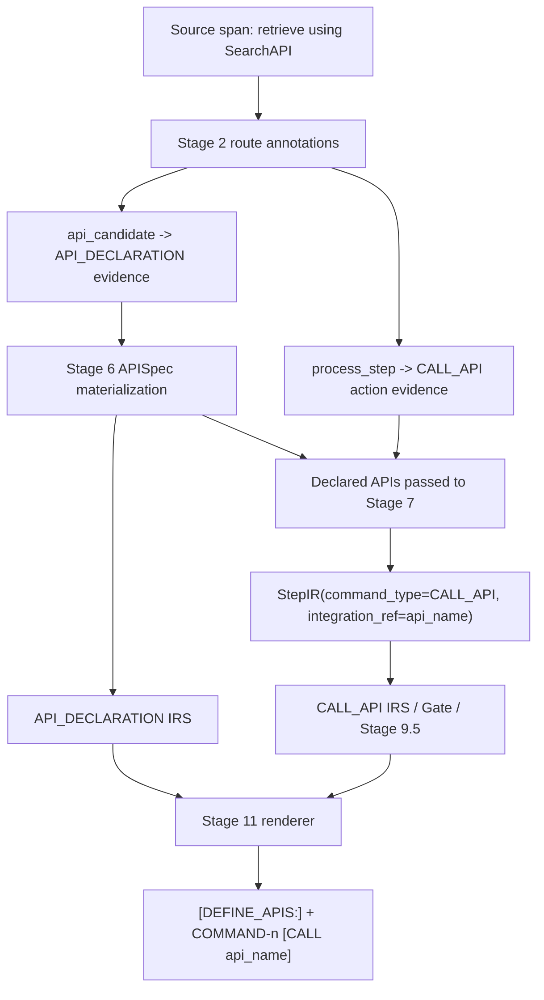

# API Declaration and CALL_API Materialization Design

Date: 2026-06-15
Status: Design plan
Scope: Stage 2 routing, Stage 6 resource/API extraction, IRS construct registry and checkers, Stage 7 StepIR extraction, Stage 9.5 validation, executable gate, Stage 11 rendering, serializers, feedback report, and tests.

---

## 1. Problem Summary

The current pipeline has partial support for `CALL_API` and `[DEFINE_APIS:]`, but the front half of the materialization chain is incomplete.

Current behavior:

```text
API/integration intent span
  -> may be routed as integration evidence
  -> may become compile_as_call_api in Stage 3.5
  -> often does not become APISpec
  -> does not reliably reach Stage 7 as a declared API
  -> does not become CALL_API StepIR
  -> no [DEFINE_APIS:] / COMMAND-n [CALL ...]
```

This is incorrect for SPL grammar. SPL allows both:

```text
APIS := "[DEFINE_APIS:]" {API_DECLARATION} "[END_APIS]"
CALL_API := "[CALL" API_NAME {"," API_NAME}
            ["WITH" ARGUMENT_LIST {"," ARGUMENT_LIST}]
            ["RESPONSE" COMMAND_RESULTS ["SET" | "APPEND"]] "]"
```

Therefore:

```text
API intent with source evidence
  => may render an API declaration skeleton

API intent with an executable action span and a declared API name
  => may render COMMAND-n [CALL api_name]
```

The missing architecture piece is not a new route label. The missing piece is an explicit API declaration materialization lifecycle and an IRS construct for API declarations.

---

## 2. Goals

After implementation, the compiler must support this source:

```text
Retrieve approved sources using approved source recipes.
```

and render a partial API declaration plus a minimal API call when the same span is also an executable action:

```spl
[DEFINE_APIS:]
    "Retrieve approved sources using approved source recipes." api_retrieve_approved_sources <none>
    {}
    {"functions":[]}
[END_APIS]

COMMAND-1 [CALL api_retrieve_approved_sources]
```

The compiler must also support explicit API names:

```text
Retrieve approved sources using SearchAPI.
```

Expected SPL:

```spl
[DEFINE_APIS:]
    "Retrieve approved sources using SearchAPI." SearchAPI <none>
    {}
    {"functions":[]}
[END_APIS]

COMMAND-1 [CALL SearchAPI]
```

Core goals:

1. Treat API declaration as a real SPL construct with its own IRS.
2. Preserve API intent as a partial API declaration skeleton when the source does not provide schema/functions.
3. Pass declared APIs into Stage 7 so step extraction can choose `CALL_API` deterministically.
4. Allow minimal `CALL_API` commands with only `API_NAME`.
5. Keep API declaration renderability separate from API call executable completeness.
6. Avoid dummy fallback: inferred API names must be source-backed, deterministic, and auditable.

---

## 3. Non-Goals

This design does not:

1. Generate fake OpenAPI schemas.
2. Invent function signatures without source evidence or user confirmation.
3. Require `WITH` arguments for every `CALL_API`.
4. Require `RESPONSE` bindings for every `CALL_API`.
5. Treat every integration mention as an executable command.
6. Replace Stage 9.5, executable gate, ProducerIndex, or post-normalize IRS.
7. Add a new semantic role merely to host diagnostics.

---

## 4. Source Semantics

### 4.1 Route Evidence Is Not the Construct

Existing semantic roles are sufficient:

```text
api_candidate
integration_hint
process_step
```

`api_candidate` and `integration_hint` are evidence for API declaration.
They are not by themselves a rendered `CALL_API`.

`process_step` is evidence for executable action.
It can combine with a declared API to produce `CALL_API`.

### 4.2 Same Span May Carry Two Annotations

This is required.

For a span like:

```text
Retrieve approved sources using SearchAPI.
```

the route output should allow two annotations on the same `span_id`:

```text
Annotation A:
  semantic_role = api_candidate
  field = integrations
  construct_target = API_DECLARATION
  slot_target = source_evidence
  executable = false

Annotation B:
  semantic_role = process_step
  field = behavior
  construct_target = CALL_API
  slot_target = call_action
  executable = true
```

This is not duplication. It is the correct split between:

```text
API definition evidence
vs
API call action evidence
```

### 4.3 API Intent Without Explicit API Name

If the source expresses API/tool/integration intent but does not name a concrete API, the compiler may create a deterministic inferred API identifier.

Example:

```text
Retrieve approved sources using approved source recipes.
```

Inferred identifier:

```text
api_retrieve_approved_sources
```

This is allowed only if all of the following are true:

1. The source span is routed as `api_candidate` or `integration_hint`, or Stage 6 returns an API resource candidate.
2. The generated name is deterministic from source text and stable across runs.
3. The APISpec records `name_status = "inferred_from_source"`.
4. The APISpec records `source_span_ids`.
5. The feedback report makes the partial/inferred status visible.

This is not a generic fallback. It is source-backed partial materialization.

---

## 5. IR Model

### 5.1 Extend APISpec

`ResourceRegistryIR.apis` remains the carrier for API declarations, but `APISpec` needs status/provenance fields so IRS and feedback can audit partial declarations.

Recommended fields:

```python
api_name: str
auth: str = "none"
description: str = ""
functions: list[APIFunction] = []

source_span_ids: list[str] = []
source_annotation_ids: list[str] = []
declaration_status: Literal[
    "known_present",
    "partial_skeleton",
    "unknown",
] = "unknown"
name_status: Literal[
    "explicit_source_name",
    "inferred_from_source",
    "user_confirmed",
    "unknown",
] = "unknown"
schema_status: Literal[
    "known_present",
    "known_empty",
    "unknown",
] = "unknown"
functions_status: Literal[
    "known_present",
    "known_empty",
    "unknown",
] = "unknown"
partial_reason: str | None = None
```

Backward compatibility:

```text
old payload missing status fields
  => source_span_ids=[]
  => declaration_status="unknown"
  => name_status="unknown"
  => schema_status="unknown"
  => functions_status="unknown"
```

### 5.2 Minimum Renderable APISpec

A renderable partial API declaration requires:

```text
api_name non-empty
source_span_ids non-empty OR origin=user_confirmed_repair
```

The following are allowed to be empty for partial rendering:

```text
description
openapi_schema
functions
retry/log policy
```

Default auth:

```text
auth = "none"
```

---

## 6. New IRS Construct: API_DECLARATION

### 6.1 Admission

`API_DECLARATION` qualifies as a ConstructIRS because it is directly present in SPL grammar:

```text
API_DECLARATION := ... API_NAME "<" AUTHENTICATION ">" ... OPENAPI_SCHEMA API_IN_SPL
```

It is not a route label, planner record, or diagnostic name.

### 6.2 Construct Identity

Instance ID:

```text
api:{api_name}
```

Construct path:

```text
["resources", "apis", api_name]
```

Source authority:

```text
stage6_resource_extractor
post_normalize_irs
```

### 6.3 Slots

| Slot | Required for render | Required for complete | Renderable without | Evidence |
| --- | --- | --- | --- | --- |
| `api_name` | yes | yes | no | `APISpec.api_name` |
| `source_evidence` | yes | yes | no | `source_span_ids`, user-confirmed repair |
| `authentication` | no | yes | yes | `APISpec.auth`, default `<none>` |
| `openapi_schema` | no | yes | yes | schema text, known-empty status |
| `functions` | no | yes | yes | `APISpec.functions`, known-empty status |

### 6.4 Slot Outcomes

Renderable partial skeleton:

```text
api_name satisfied
source_evidence satisfied
authentication satisfied by default none
openapi_schema missing or known_empty
functions missing or known_empty
```

Complete API declaration:

```text
api_name satisfied
source_evidence satisfied
authentication satisfied
openapi_schema satisfied
functions satisfied
```

Unrenderable:

```text
api_name missing
or source_evidence missing
```

### 6.5 Diagnostics

Missing `api_name`:

```text
kind = type_or_contract_ambiguity
slot = api_name
blocks_rendering = true
blocks_completion = true
```

Missing `source_evidence`:

```text
kind = type_or_contract_ambiguity
slot = source_evidence
blocks_rendering = true
blocks_completion = true
```

Missing schema/functions:

```text
kind = type_or_contract_ambiguity
slot = openapi_schema/functions
blocks_rendering = false
blocks_completion = true
```

---

## 7. Stage Flow

### 7.1 Stage 2: Routing

Stage 2 must preserve multi-label annotations for one span.

For named API action:

```text
s16: Retrieve approved sources using SearchAPI.
```

Expected route state:

```text
routes.integrations contains s16
routes.behavior contains s16

annotations:
  - api_candidate / API_DECLARATION / executable=false
  - process_step / CALL_API / executable=true
```

For policy-only integration mention:

```text
Prefer tool evidence over unnecessary user questioning.
```

Expected route state:

```text
routes.integrations may contain span only if it names or implies a concrete API/tool resource
routes.behavior should not contain span unless it asks the agent to execute an action
```

### 7.2 Stage 6: API Declaration Materialization

Stage 6 consumes:

```text
spans
routes.integrations
RouteAnnotation(api_candidate/integration_hint)
existing ResourceContractDemandIR where resource_kind="api"
```

It emits `APISpec` entries.

Algorithm:

```text
for each integration annotation:
  collect source span text
  extract explicit API name if present
  if explicit API name:
      name_status = explicit_source_name
      api_name = explicit name
  else:
      api_name = deterministic_api_name(source span text)
      name_status = inferred_from_source

  create/update APISpec:
      auth = source auth if present else none
      description = source text
      functions = source-backed functions if present else []
      declaration_status = partial_skeleton unless schema/functions complete
      source_span_ids += span_id
      partial_reason = missing schema/functions if incomplete
```

Name generation:

```text
"Retrieve approved sources using approved source recipes."
  -> api_retrieve_approved_sources
```

Rules:

1. Generated names must be stable.
2. Generated names must be valid SPL `API_NAME`.
3. Collisions use deterministic suffixes, e.g. `_2`.
4. Generated names must not be used if there is no API/integration source evidence.

### 7.3 Stage 3.5: Worker Boundary Planner

Stage 3.5 may still decide:

```text
decision = compile_as_call_api
```

but that decision is not enough by itself.

Materialization rule:

```text
compile_as_call_api + matching declared APISpec
  => may create api_call handoff when the call is part of worker delegation planning

compile_as_call_api without matching declared APISpec
  => diagnostic / unresolved API declaration, not generic command fallback
```

The handoff path is allowed but not required. Direct Stage 7 CALL_API extraction may also produce the command when a behavior span maps to a declared API.

### 7.4 Stage 7: StepIR Extraction

Stage 7 input must include all declared APIs:

```python
ResourceRegistryIR.apis
```

The prompt and deterministic postprocessor must expose:

```text
Declared APIs:
  - SearchAPI: source spans s16
  - api_retrieve_approved_sources: source spans s16
```

CALL_API selection rule:

```text
If a behavior span describes invoking/retrieving/querying/sending through a declared API,
and the API declaration has renderable API_DECLARATION status,
then generate StepIR(command_type="CALL_API", integration_ref=api_name).
```

Minimum valid StepIR:

```python
StepIR(
    step_id="st_call_api_retrieve_approved_sources",
    text="Retrieve approved sources using approved source recipes.",
    source_span_ids=["s16"],
    command_type="CALL_API",
    inputs=[],
    outputs=[],
    integration_ref="api_retrieve_approved_sources",
)
```

Arguments and response binding are optional:

```text
inputs=[] is valid
outputs=[] is valid
```

If source text explicitly says the API response must be saved to an output, then missing outputs should affect completion, not basic CALL_API grammar renderability.

### 7.5 Stage 9.5 / Normalizer

Validation rules:

1. `CALL_API.integration_ref` must be non-empty.
2. `CALL_API.integration_ref` must refer to a declared `APISpec.api_name`.
3. Empty `inputs` are valid unless source demands arguments.
4. Empty `outputs` are valid unless source demands response binding.
5. `api_call` handoff validation still applies when the CALL_API came from a handoff.
6. Direct CALL_API from behavior span must not require a handoff.

### 7.6 Executable Gate

Renderable CALL_API:

```text
command_type == CALL_API
integration_ref in declared APIs
source_span_ids non-empty or user_confirmed_repair
```

Do not require:

```text
inputs
outputs
handoff_id
```

If a handoff exists, enforce:

```text
handoff.mode == api_call
step.integration_ref == handoff.api_ref
```

### 7.7 Stage 11 Renderer

API declaration renderer must allow partial skeleton:

```spl
[DEFINE_APIS:]
    "description" api_name <none>
    {}
    {"functions":[]}
[END_APIS]
```

CALL_API renderer must allow:

```spl
COMMAND-1 [CALL api_name]
```

It should add `WITH` and `RESPONSE` only when StepIR has inputs/outputs.

---

## 8. IRS and Feedback Report Behavior

### 8.1 API_DECLARATION Report

For partial skeleton:

```text
Target: api:api_retrieve_approved_sources
Severity: warning
Blocks rendering: false
Blocks completion: true
Missing slot: functions/openapi_schema
Message: API declaration is renderable as a partial skeleton but missing schema/functions.
```

### 8.2 CALL_API Report

For minimal valid call:

```text
Target: step:st_call_api_retrieve_approved_sources
Blocks rendering: false
Blocks completion: false
```

For undeclared API:

```text
Target: step:st_call_unknown
Blocks rendering: true
Blocks completion: true
Missing slot: api_name / declared_api_ref
Message: CALL_API references undeclared API.
```

### 8.3 Relationship Between Reports

`CALL_API` should link to `API_DECLARATION`:

```text
step:st_call_api_retrieve_approved_sources
  invokes
api:api_retrieve_approved_sources
```

This edge supports feedback grouping and prevents duplicate diagnostics.

---

## 9. Implementation Phases

### Phase A: Bug-Locking Tests

Add expected-failing tests for:

1. API intent span renders `[DEFINE_APIS:]` skeleton.
2. API intent + process action span renders `COMMAND-n [CALL api_name]`.
3. Same span can produce both `api_candidate` and `process_step` annotations.
4. Minimal CALL_API with no inputs/outputs is renderable.
5. Undeclared CALL_API is rejected.
6. API declaration missing schema/functions blocks completion but not rendering.

### Phase B: IR and Serializer Status Fields

Extend `APISpec` and serializers with source/status fields.

Backward compatibility:

```text
old snapshots without fields still load
new snapshots roundtrip all API declaration status/provenance fields
```

### Phase C: API_DECLARATION ConstructIRS

Add registry entry and checker extraction from `ResourceRegistryIR.apis`.

Tests:

```text
registry shape
slot required_for_render / required_for_complete
partial skeleton satisfaction
missing api_name rejection
missing source_evidence rejection
```

### Phase D: Stage 6 API Declaration Materializer

Consume integration annotations and create partial `APISpec`.

Tests:

```text
explicit SearchAPI name -> APISpec(SearchAPI)
implicit source recipes -> APISpec(api_retrieve_approved_sources)
duplicate spans merge provenance
no API evidence -> no APISpec
```

### Phase E: Stage 7 Declared API-Aware Step Extraction

Pass declared APIs into Stage 7 prompt and postprocess.

Tests:

```text
declared API + executable span -> CALL_API StepIR
declared API + non-executable mention -> no CALL_API
undeclared API from LLM -> reject/drop with diagnostic
minimal CALL_API has inputs=[] outputs=[]
```

### Phase F: Gate, Normalizer, ProducerIndex

Relax CALL_API input/output requirements while enforcing declared API reference.

Tests:

```text
CALL_API with declared API and no args passes render gate
CALL_API with undeclared API blocked
CALL_API response demand without output blocks completion
```

### Phase G: Renderer and Feedback

Render partial API declarations and minimal CALL_API commands.

Tests:

```text
DEFINE_APIS skeleton exact text
COMMAND-n [CALL api_name] exact text
feedback shows partial API declaration warning
```

### Phase H: End-to-End

Input:

```text
Retrieve approved sources using approved source recipes.
```

Expected:

```text
[DEFINE_APIS:] present
api_retrieve_approved_sources present
COMMAND-n [CALL api_retrieve_approved_sources] present
no fallback COMMAND for the same API action span
```

---

## 10. Acceptance Matrix

| Source case | API declaration | CALL_API command | Diagnostic |
| --- | --- | --- | --- |
| Explicit API name + executable action | render complete/partial APISpec | render `[CALL Name]` | schema/functions warning if partial |
| Inferred API intent + executable action | render inferred APISpec | render `[CALL inferred_name]` | inferred/partial warning |
| API mention only, non-executable | render APISpec | no CALL_API | no command gap |
| Executable API action but no APISpec | no or blocked APISpec | no CALL_API | missing API declaration |
| CALL_API with undeclared integration_ref | N/A | blocked | undeclared API |
| API declaration missing schema/functions | render skeleton | unaffected | blocks completion only |

---

## 11. Strict Review Rules

Implementation must not:

1. Add a renderer fallback that invents APIs from raw text.
2. Generate `CALL_API` without a declared `APISpec`.
3. Require arguments/response for minimal `CALL_API`.
4. Hide inferred API names as explicit source names.
5. Treat `api_candidate` alone as executable action.
6. Drop the second annotation when one span is both integration evidence and process action.
7. Create diagnostics manually when an IRS slot can own the issue.

Implementation must:

1. Preserve source spans and annotation IDs on APISpec.
2. Make API declaration partial status visible in IRS and feedback.
3. Pass all declared APIs into Stage 7.
4. Keep direct CALL_API and handoff-backed CALL_API both valid.
5. Validate all new fields in parser/serializer roundtrip tests.

---

## 12. Reference Flow



